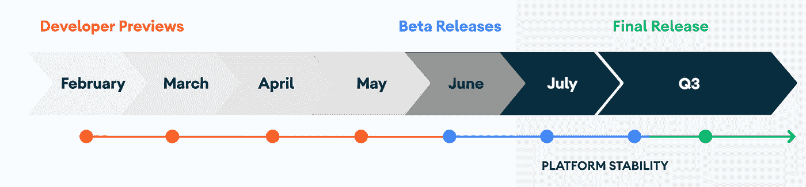
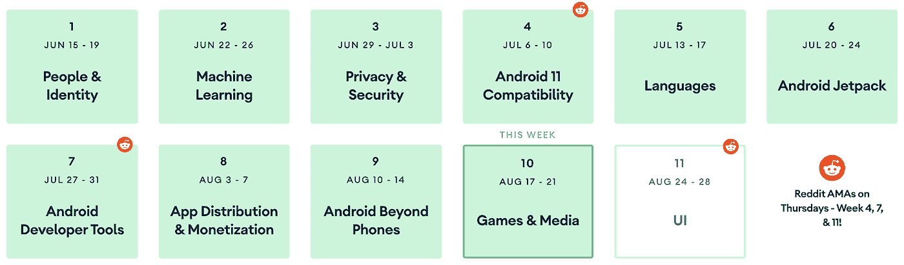
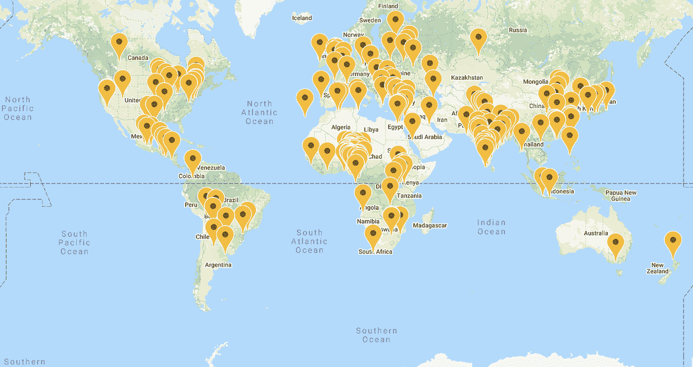

# 现在在 Android #23 中

> 原文：<https://medium.com/androiddevelopers/now-in-android-23-35755f645958?source=collection_archive---------1----------------------->

Illustration by [Virginia Poltrack](https://twitter.com/VPoltrack)

## Android 11 Beta 3、# 11WeeksOfAndroid、Android 11 在线聚会、文章和视频、即将推出的 Reddit AMA 用户界面，以及面向游戏开发者的 ADB 播客

欢迎来到 Android 中的 Now，这是您对 Android 开发世界中新的和值得注意的事物的持续指导。

# 视频和播客形式的 NiA23

这个*现在在 Android* 中也以视频和播客的形式提供。内容是一样的，但是需要的阅读量更少。文章版本(继续阅读！)仍然是链接到所有内容的地方。

# 录像

# 播客

点击下面的链接，或者在你最喜欢的客户端应用程序中订阅播客。

# 安卓 11 Beta 3

[戴夫·伯克](https://twitter.com/davey_burke)在[安卓开发者博客](https://android-developers.googleblog.com/2020/08/android-11-final-beta-update.html)上宣布了 Beta3 的发布。这个版本没有任何新的行为改变的主要特性。这是故意的，因为 Beta2 是平台稳定性的里程碑，在这一点上行为和 API 被设置。相反，Beta3 是 Android 11 的最终测试版和候选版本，随着该版本逐渐走向最终发布，它专注于错误修复和性能优化，最终发布很快就会实现。

在[预览网站](https://developer.android.com/preview)上查看该版本，在那里您可以了解所有新特性并下载系统映像。您也可以[注册在您的 Pixel (2、3、3a 和 4)设备上接收测试版](https://www.google.com/android/beta)。

# 安卓 11 周

Android 11 周的忙碌和内容充实即将结束。自从 Android 版 Now 的最后一集[之后，我们完成了 Android 开发者工具，然后覆盖了应用分发&货币化，然后花了一周时间在 Android 手机之外的地方，现在又花了一周时间在游戏媒体上，之后还有一周时间。以下是了解这些主题的更多信息的方法。](/androiddevelopers/now-in-android-22-637baa57124e)

## 第 7 周:工具

第 7 周重点关注 Android Studio 的各个部分，您应该使用它们来使应用程序开发和调试变得更容易和更好。

该团队在那一周发布了大量内容，包括关于设计工具的视频和文章，关于构建系统的文章，以及提高构建速度和性能分析的方法。此外，新的运动编辑器工具在那一周在 Android 4.0 中变得稳定，所以如果你还没有机会检查它，这可能是一个很好的时间。

你可以在总结博客中找到本周的所有资源链接。还有一个[路径](https://developer.android.com/courses/pathways/android-week7-developer-tools)蜿蜒穿过一些核心内容，还有一个[播放列表](https://www.youtube.com/watch?v=V0xeoYSbUU8&list=PLWz5rJ2EKKc95jeR9iSR8g_IV5TQhkaC2)用于一周内发布的视频。

## 第 8 周:分销

本周出现了一系列关于使用 Play Store 技术来帮助改进应用程序开发和分发的内容。本周的主题包括使用新的 Google Play 控制台的网络研讨会，新的 Play Billing Library 3，以及 Android 应用捆绑包。

最后一项值得单独说明:既然应用捆绑包已经成熟，该团队要求从 2021 年下半年开始，Play Store 发布的所有新应用都需要使用 Android 应用捆绑包(不仅仅是 apk)。你可以在[这篇媒体文章](https://android-developers.googleblog.com/2020/08/recent-android-app-bundle-improvements.html)中读到更多关于这个变化和相关变化的信息，比如 APK 扩展文件(OBB)的废弃。

查看[总结博客](https://android-developers.googleblog.com/2020/08/11-weeks-of-android-app-distribution.html)了解所有细节以及视频和文章的链接。还有这个方便的[路径](https://developer.android.com/courses/pathways/android-week8-app-distribution-monetization)，以及本周所有视频的[播放列表](https://www.youtube.com/playlist?list=PLWz5rJ2EKKc_WqAZ2HEGMAX7wQGIg5T46)。

## 第九周:超越手机的安卓系统

第 9 周重点关注所有非手机的 Android 外形。原来这种事情还有很多。有关于 Wear OS、Android TV、Android Auto 和 ChromeOS 的 Android 开发的文章和视频。

查看[总结博客](https://android-developers.googleblog.com/2020/08/11-weeks-of-android-beyond-phones.html)了解本周内容的细节和链接，以及本周视频的[播放列表](https://www.youtube.com/playlist?list=PLWz5rJ2EKKc9fvWc2PYBQx1ubxUZNn1kf)。

## 第 10 周:游戏和媒体

本周是关于开发游戏和媒体应用的，已经发布了一些文章和视频，本周还会有更多。

首先，@Greg Hartrell 发布了[游戏开发者的新消息](https://android-developers.googleblog.com/2020/08/whats-new-for-android-game-developers.html)。关注[@ Android dev # 11 weeksofadroid](https://twitter.com/search?q=(%2311WeeksOfAndroid)%20(from%3Aandroiddev)&src=typed_query)feed，了解本周发布的新内容。此外，看看[的视频播放列表](https://www.youtube.com/watch?v=k6LHZONYKAg&list=PLWz5rJ2EKKc9hyU9KryXE5AFWiRKLCQY4)，看看那里有什么，并在周末观看总结博客。

下周继续关注 UI，第 11 周。如果你在数的话，这是#11WeeksOfAndroid 的最后一周！！！！！。

# Android 11 Meetups

我上次提到的在线聚会一直在快速发展，世界各地都在举办活动。例如，周一我和[穆拉特·耶纳](https://medium.com/u/e947fef0dfe0?source=post_page-----35755f645958--------------------------------)、[亚辛·雷兹吉](https://medium.com/u/f51b24785c0d?source=post_page-----35755f645958--------------------------------)以及[弗雷德·钟](https://medium.com/u/ac312b7e211e?source=post_page-----35755f645958--------------------------------)一起参加了在内罗毕举行的一场活动(长途飞行！)本周四，我将在孟菲斯的一个活动上再次加入弗雷德。我希望我在这次旅行中积累了足够多的飞行常客里程。

查看 [Android 11 Meetups 网站](https://developer.android.com/android11/meetups)找到一个发生在你附近的网站。

# 文章

## 重构

[Ian Lake](https://medium.com/u/51a4f24f5367?source=post_page-----35755f645958--------------------------------) 发布了一篇[关于最近片段改进的深度文章](/androiddevelopers/fragments-rebuilding-the-internals-61913f8bf48e)。AndroidX 片段库有一个新的 alpha 版本，但是这篇文章讨论了片段 API 的历史和当前状态。*(注:如果你还在用平台的碎片 API……停！该 API 已被弃用，您应该改用* [*AndroidX 片段*](https://developer.android.com/jetpack/androidx/releases/fragment)*；它是最新的，所有的功能和修复都适用于许多 Android 版本。)*

这个版本的主要变化是对`FragmentManager`内部工作方式的近乎完整的重构，这使得片段可以避免一些困扰 API 多年的状态相关问题。这种重组还使得大量长期存在的问题得以修复。

这项工作是未来改进的基础，包括支持多个后台堆栈和简化片段生命周期。

查看[文章](/androiddevelopers/fragments-rebuilding-the-internals-61913f8bf48e)了解所有细节，并下载最新的[片段](https://developer.android.com/jetpack/androidx/releases/fragment) 1.3.0 版本(alpha08 或更高版本)来尝试新的东西。

 [## 片段:重建内部

### 介绍:新的状态管理器

medium.com](/androiddevelopers/fragments-rebuilding-the-internals-61913f8bf48e) 

# Kotlin 1.4 发布

Wojtek Kaliciński 发表了一篇关于 kot Lin1.4 版本的[博客。这个版本中的一些新特性包括 Kotlin 接口的 SAM 转换(不仅仅是以前的 Java 编程语言接口)，显式 API 模式，以及编译器性能和功能的改进。此外，还有一个新的 Kotlin/JVM IR 后端的 alpha 版本。这个新的后端是 Jetpack Compose 所必需的，但在其他情况下是可选的。您可以在 gradle 构建脚本中使用`kotlinOptions.useIR = true`来启用它——请尝试一下，如果您有任何问题，请告诉我们。](https://android-developers.googleblog.com/2020/08/new-language-features-and-more-in.html)

 [## Kotlin 1.4 中的新语言特性和更多特性

### 当我们在 Android 上采用 Kotlin 作为支持语言，然后转向 Kotlin 优先的方法时，一个主要的…

android-developers.googleblog.com](https://android-developers.googleblog.com/2020/08/new-language-features-and-more-in.html) 

# Reddit AMA: UI

作为#11WeeksOfAndroid 系列的一部分，我们一直在主持 Reddit AMAs。第一次是与 Android 11 的平台团队，然后我们与 Android Studio 团队的人进行了一次关于工具的会议。下周，8 月 27 日，我们将举办我们的[决赛(目前是)AMA](https://goo.gle/jetpack-ama) 作为 UI 周的一部分，在那里我们将回答关于 Android Jetpack、Jetpack Compose 和任何其他你能想到的问题，我们可以在 UI 的一般领域(或包含单词“Jetpack”)回答。

关于这个 AMA 最好的部分是，我给你更多的提前通知(最后两个发生在 Android 视频和播客发布的时候，所以它实际上更像是“这发生了！”通知比“请加入我们！”项)。所以…请加入我们吧！

# ADB 播客片段

自从上一期《现在》在安卓发布后，又有一集安卓开发者在后台发布。请点击下面的链接，或在您最喜欢的播客客户端查看:

## 亚行 146:游戏规则改变者

这一次， [Romain Guy](https://medium.com/u/c967b7e51f8b?source=post_page-----35755f645958--------------------------------) 独自主持了与[Play/Android 游戏产品经理 Greg Hartrell](https://medium.com/u/2b1fc0219a96?source=post_page-----35755f645958--------------------------------) 和[Android 游戏开发者代言人 Daniel Galpin](https://medium.com/u/2e0fc9a4a8c2?source=post_page-----35755f645958--------------------------------) 关于游戏技术的对话。他们谈到了游戏开发人员的最新发展和产品，包括面向 Visual Studio 的 Android 开发插件、面向游戏开发人员的其他专用工具，以及团队的新产品，如 Android Asset Delivery 和 Android App Bundle for distribution。

 [## 第 146 集:游戏改变者

### 这一次，Romain 独自主持了与 Greg Hartrell，product…

androidbackstage.blogspot.com](https://androidbackstage.blogspot.com/2020/08/episode-146-game-changer.html) 

# 那么现在…

这次到此为止。所以去看看 [Android 11 Beta 3](https://developer.android.com/preview) ！观看并阅读来自[# 11 weeksofadroid](https://developer.android.com/11weeksofandroid)的所有新内容！加入众多在线 [Android 11 Meetup](https://developer.android.com/android11/meetups) 活动之一！阅读关于[片段](/@ianhlake/61913f8bf48e)和 [Kotlin 1.4](https://android-developers.googleblog.com/2020/08/new-language-features-and-more-in.html) 的文章！添加一些问题，并加入讨论，为下一个机器人用户界面的 Reddit AMA！收听最新的[亚行游戏播客](https://androidbackstage.blogspot.com/2020/08/episode-146-game-changer.html)！请尽快回到这里，收听 Android 开发者世界的下一次更新。