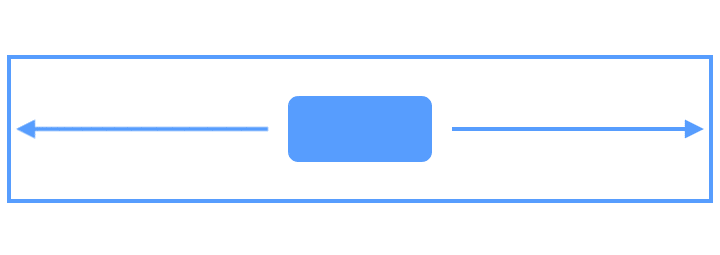
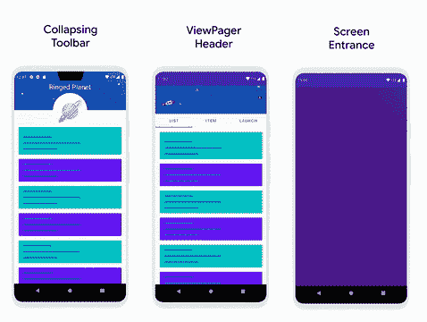
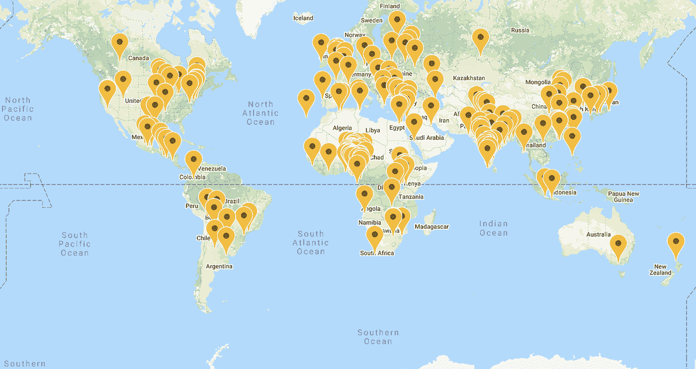

# 现在在 Android #24 中

> 原文：<https://medium.com/androiddevelopers/now-in-android-24-5f5421f85da3?source=collection_archive---------0----------------------->

Illustration by [Virginia Poltrack](https://twitter.com/VPoltrack)

## Jetpack Compose Alpha、ConstraintLayout 2.0、#11WeeksOfAndroid、Android 11 meetups、AndroidX 发布、一篇文章、一个视频系列和一个播客

欢迎来到 Android 中的 Now，这是您对 Android 开发世界中新的和值得注意的事物的持续指导。

# 视频和播客形式的 NiA24

这个*现在在 Android* 中也以视频和播客的形式提供。内容是一样的，但是需要的阅读量更少。文章版本(继续阅读！)仍然是链接到所有内容的地方。

# 录像

# 播客

点击下面的链接，或者在你最喜欢的客户端应用程序中订阅播客。

# 喷气背包撰写:阿尔法发布！

这个 UI 主题值得单独标注，因为 Jetpack Compose **是 ANDROID** 的未来 UI 工具包。相当大，伙计们。它已经存在一段时间了。但是如果你是那些喜欢在事情稍微稳定下来之前犹豫不决的开发者之一，那么这可能是你收听、查看和[给我们反馈](http://goo.gle/compose-feedback)的好时机。

这是一个 Alpha 版本，所以随着团队不断完善 Beta 版本的细节，预计 API 仍会不断变化。但是，API 和编程模型的许多基础现在应该已经非常成熟和稳固了，而且还有许多内容可以学习，所以请尝试一下，让我们知道它是如何为您工作的。

开始或继续您的撰写之旅的一些事情包括 Jetpack Compose 的[学习途径(包括文章、视频和 code labs)](https://developer.android.com/courses/pathways/compose)[Leland Richardson](https://medium.com/u/41a8b1601c59?source=post_page-----5f5421f85da3--------------------------------)的[撰写思维](https://youtu.be/SMOhl9RK0BA)视频、几个新的[代码示例](https://github.com/android/compose-samples)，以及带有更多资源的各种链接的[撰写网站](https://developer.android.com/jetpack/compose)。

如果你想知道更多 Compose 的背景故事和内部细节，请查看我们上周发布的 [ADB 播客](http://androidbackstage.blogspot.com/2020/08/episode-147-jetpack-compose-alpha.html)。

# ConstraintLayout 2.0

这个库已经以 alpha 和 beta 的形式使用了一段时间，但现在终于是它成长为我们社会中一个稳定的成年成员的时候了。

[肖恩·麦克奎蓝](https://medium.com/u/83518fe480be?source=post_page-----5f5421f85da3--------------------------------)在[上发布了一篇关于该版本的文章](/androiddevelopers/introducing-constraint-layout-2-0-9daa3e99995b)，其中提供了各种值得一试的功能，包括:

**Flow** 虚拟布局，这有助于将几个项目链接在一起，当运行时容器中没有足够的空间时，它们可以流到下一行。

**层**，一个帮助器，它可以很容易地一次将变换应用到几个视图。

**MotionLayout** ，ConstraintLayout 的子集，支持丰富的 UI 过渡动画。Android Studio 现在提供了 Motion Editor，这是一个 MotionLayout 的设计工具，简化了创建这些强大体验的过程。查看 Scott Swarthout 的[文章](https://android-developers.googleblog.com/2020/07/introducing-motion-editor.html)关于 Studio 中的新运动编辑器工具和 [Sean](https://medium.com/u/83518fe480be?source=post_page-----5f5421f85da3--------------------------------) 的[新样本](https://github.com/android/views-widgets-samples/tree/master/ConstraintLayoutExamples/motionlayoutintegrations)开始吧。

# 11 周的安卓…搞定！

上周，我们结束了为期 11 周的 Android，发布了大量关于用户界面的内容。以下是如何找到更多关于 Android 版 Now 上一集以来所涉及的游戏和 UI 主题的信息:

## 第 10 周:游戏、媒体和 5G

本周在[媒体控制](https://android-developers.googleblog.com/2020/08/playing-nicely-with-media-controls.html)中涵盖了广泛的内容，使用了新的 [5G 功能](https://developer.android.com/training/connectivity/enhance-with-5g)，以及一堆关于[游戏开发的信息](http://d.android.com/games)。要了解发生了什么，从总结博客和学习途径[开始。此外，查看](https://developer.android.com/courses/pathways/android-week10-games-and-media)[视频播放列表](https://www.youtube.com/watch?v=k6LHZONYKAg&list=PLWz5rJ2EKKc9hyU9KryXE5AFWiRKLCQY4)以查看发布的视频，并收听[丹尼尔·高尔平](https://medium.com/u/2e0fc9a4a8c2?source=post_page-----5f5421f85da3--------------------------------)的 [Android 游戏开发秀](https://www.youtube.com/watch?v=ykU1-mkwjJI&list=PLWz5rJ2EKKc9UA3vUgdf-TUj5IRr3YWV9)以了解 Android 游戏技术的最新视频。

## 第 11 周:UI

UI 是这 11 周系列的最后一个主题，非常精彩。有很多很棒的内容，涵盖了从[键盘动画](https://youtu.be/acC7SR1EXsI)到[材料设计组件](/androiddevelopers/we-recommend-material-design-components-81e6d165c2dd)的所有内容，最终在 Jetpack Compose alpha 的发布中达到高潮(参见上面的第一项)。阅读[总结博客](https://android-developers.googleblog.com/2020/08/11-weeks-of-android-ui-and-compose.html)了解所有细节和链接，跟随[现代 UI 途径](https://developer.android.com/courses/pathways/android-week11-modern-ui)浏览一些精彩的文章、视频和代码实验室，查看本周的[视频播放列表](https://www.youtube.com/playlist?list=PLWz5rJ2EKKc-GZBw-Z4f7i9dBVUbF2vad)，并查看以上关于 Jetpack Compose 的更多细节。

**下周**:没事！我们完了。我想每个人都在停下来喘口气。

# Android 11 Meetups…搞定！

这是一个完成事情的时间(这在软件开发中并不常见):首先，我们上周完成了#11WeeksOfAndroid，现在我们结束了夏季的在线活动系列，Android 11 Meetups。

这是一个充满乐趣的国际系列赛，至少在全球 57 个不同的地方发生了各种事件。如果你没有机会参加任何现场直播，许多录音会发布在 [Android 11 Meetups 网站](https://developer.android.com/android11/meetups)上。

感谢每一个参与的人，从社区组织者到发表演讲并留下来参加现场问答的演讲者，还有成千上万参加演讲并了解 Android 开发世界正在发生的事情的人。

# AndroidX 释放

像往常一样，最近有[几个安卓库发布了各种版本的](https://developer.android.com/jetpack/androidx/versions/all-channel)。其中大多数是处于不同发展阶段的阿尔法和贝塔。值得一提的几个版本包括:

*   [Concurrent 1.1.0](https://developer.android.com/jetpack/androidx/releases/concurrent#1.1.0) :这个库简化了从 ListenableFuture 到 Kotlin 协程的转换。
*   [Webkit 1.3.0](https://developer.android.com/jetpack/androidx/releases/webkit#1.3.0) :这个新版本启用了 ForceDarkStrategy，WebMessageListener API，并检查 WebView 是否在多进程模式下运行。
*   ConstraintLayout 2.0.0 :这个版本有很多令人兴奋的新特性，比如 MotionLayout，我在上面已经谈到过了。
*   [Security-Identity-Credential 1 . 0 . 0-alpha 01](https://developer.android.com/jetpack/androidx/releases/security#security-identity-credential-1.0.0-alpha01):这个新的库提供了对 Android 11 中新的凭证 API 的访问，并为 API 24 的旧版本提供了密钥库支持的实现。

# 文章和视频

## 结构类重定义

[Alex Light](https://medium.com/u/dcba37f44a67?source=post_page-----5f5421f85da3--------------------------------) 写了一篇[有趣的文章](/androiddevelopers/structural-class-redefinition-6fc0cbab9161)关于 ART 团队如何给 [JVM TI](https://en.wikipedia.org/wiki/Java_Virtual_Machine_Tools_Interface) (Java 虚拟机工具接口)添加能够在运行时改变一个类的结构的能力，包括添加方法和字段。这一改变使得 Android Studio 的[应用更改](https://developer.android.com/studio/run#:~:text=building%20your%20app.-,Apply%20Changes,without%20restarting%20the%20current%20activity.)功能(构建和安装应用程序的更快方式…取决于您所做的代码和资源更改)可以在更多情况下使用。

 [## 结构类重定义

### 允许工具(如 Apply Changes)修改类结构本身，向现有的类添加新的字段。

medium.com](/androiddevelopers/structural-class-redefinition-6fc0cbab9161) 

## 运动标签…视频系列

Android Studio 团队开始了一个名为 Motion Tags 的新系列视频，详细介绍了使用 MotionLayout 创建丰富布局动画的标签。到目前为止，他们已经发布了四集[；查看](https://www.youtube.com/playlist?list=PLWz5rJ2EKKc-bcyUTIFAr97ZtRkwM7S4y)[播放列表](https://www.youtube.com/playlist?list=PLWz5rJ2EKKc-bcyUTIFAr97ZtRkwM7S4y)并继续关注更多。

# ADB 播客片段

自从上一期《现在》发布以来，又有一集 Android 开发者在后台发布。点击下面的链接，或者在你最喜欢的播客客户端查看。

## ADB 147: Jetpack 合成 Alpha

[Romain Guy](https://medium.com/u/c967b7e51f8b?source=post_page-----5f5421f85da3--------------------------------) 我和工具包团队的 Clara Bayarri、Matvei Malkov 和 Anna-Chiara Bellini 聊了聊，讨论了 Compose 的由来、团队如何进行 API 设计、构建新的 UI 工具包的挑战，甚至术语“alpha”对团队意味着什么。

 [## 第 147 集:喷气背包组合阿尔法

### 本周，在一系列开发者预览之后，我们庆祝 Jetpack Compose alpha 的发布。在这个…

androidbackstage.blogspot.com](http://androidbackstage.blogspot.com/2020/08/episode-147-jetpack-compose-alpha.html) 

# 那么现在…

这次到此为止。所以去看看 [Jetpack Compose Alpha](https://developer.android.com/jetpack/compose) 和 [ConstraintLayout 2.0](/androiddevelopers/introducing-constraint-layout-2-0-9daa3e99995b) 发布吧！消费掉[# 11 weeksofadroid](https://developer.android.com/11weeksofandroid)最后两周的所有内容！观看来自全球众多 [Android 11 聚会](https://developer.android.com/android11/meetups)的一些视频！下载最新 [AndroidX 发布](https://developer.android.com/jetpack/androidx/versions/all-channel)！在 Jetpack Compose 上收听新的 [ADB 播客片段](http://androidbackstage.blogspot.com/2020/08/episode-147-jetpack-compose-alpha.html)！请尽快回到这里，收听 Android 开发者世界的下一次更新。