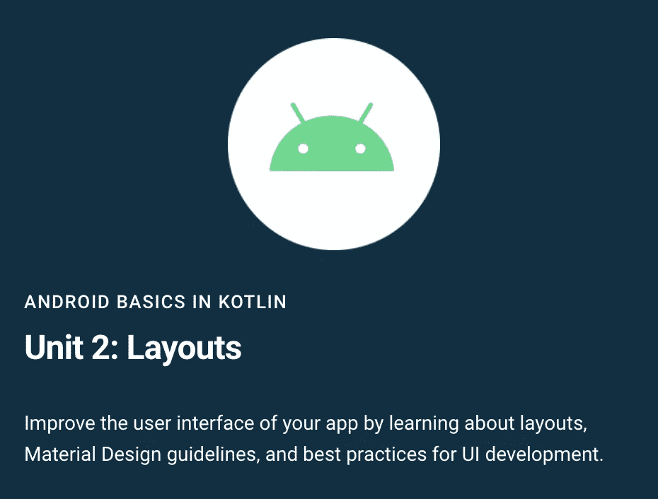

# 现在在 Android #26 中

> 原文：<https://medium.com/androiddevelopers/now-in-android-26-a736107af0ed?source=collection_archive---------0----------------------->

Illustration by [Virginia Poltrack](https://twitter.com/VPoltrack)

## 目标 API 要求、AndroidX、Android 基础课程第 2 单元、Play Store+计费文章、游戏开发人员的纹理映射、RecyclerView、性能和身份验证

欢迎来到 Android 中的 Now，这是您对 Android 开发世界中新的和值得注意的事物的持续指导。

# 视频和播客形式的 NiA26

这个*现在在 Android* 中也以视频和播客的形式提供。内容是一样的，但是需要的阅读量更少。文章版本(继续阅读！)仍然是链接到所有内容的地方。

# 录像

# 播客

点击下面的链接，或者在你最喜欢的客户端应用程序中订阅播客。

# 应用程序更新需要目标 API 29+

到 11 月 2 日，**所有应用更新**都需要针对 **API 等级 29 或以上**。大多数应用程序已经更新了，但如果你的应用程序还没有更新，现在是更新的最佳时机。因为 11 月 3 日太晚了。

如需了解更多信息，请查看关于满足 Google Play 目标 SDK 需求的指南。

# AndroidX 释放

[AndroidX](https://developer.android.com/jetpack/androidx/versions/all-channel) 对各种中间版本的 [Alpha](https://developer.android.com/jetpack/androidx/versions/alpha-channel) 、 [Beta](https://developer.android.com/jetpack/androidx/versions/beta-channel) 和 [RC](https://developer.android.com/jetpack/androidx/versions/rc-channel) 版本进行了常规更新，但也有几个库发布了[稳定](https://developer.android.com/jetpack/androidx/versions/stable-channel)版本:

*   [Media 1.2.0](https://developer.android.com/jetpack/androidx/releases/media#media-1.2.0) :此版本改进了 AudioAttributesCompat 支持，支持使用 [Mediarouter](https://developer.android.com/jetpack/androidx/releases/mediarouter) 时的音量控制，并修复了与 [Media2](https://developer.android.com/jetpack/androidx/releases/media2) 的互操作。
*   Exif 1.3.0 :这个版本有一些重要的错误修复(比如导致内存不足的情况)以及为 WebP 文件编写 Exif 元数据的能力。

# 课程:科特林的 Android 基础

[科特林](https://developer.android.com/courses/android-basics-kotlin/unit-2)课程中[安卓基础的第二单元](https://developer.android.com/courses/android-basics-kotlin/course)现已推出。这个课程可以让没有开发经验的人学习软件开发，Android，和 Kotlin，都在同一个课程里。

单元 1:kot Lin Android 基础知识涵盖了类、对象和条件等基础知识，以及如何在 Android 应用程序中使用图像和文本。

[Unit 2: Layouts](https://developer.android.com/courses/android-basics-kotlin/unit-2) 介绍 UI 概念，包括 XML 布局、材料设计、获取用户输入和使用 RecyclerView。学生将利用这些功能和更多功能构建两个不同的应用程序。

哦，我不应该忘记提到成本:免费！免费是我最喜欢的价格！

# 游戏时间

Google Play 上最近有一些文章，开发者可能想看看。

## 播放商店和播放帐单

Sameer Samat 发表了一篇文章，阐明了使用 Play Store 的应用程序的一些要求和政策。例如，它谈到了托管在 Play Store…以及其他应用程序商店，并谈到了使用 Play Billing 在应用程序内购买数字商品的要求。

 [## 听取开发者反馈以改进 Google Play

### 开发人员是我们的合作伙伴，通过将他们的创造力和创新与我们的平台和工具相结合，我们一起…

android-developers.googleblog.com](https://android-developers.googleblog.com/2020/09/listening-to-developer-feedback-to.html) 

为了帮助理解上一篇文章中的一些细节，Mrinalini Loew 还发布了一个带有问题(和答案)的常见问题解答[！)围绕这些和其他 Play Store 政策。](https://android-developers.googleblog.com/2020/09/commerce-update-faqs.html)

 [## 回答您关于 Google Play 计费的常见问题

### 我们致力于提供强大的工具和服务来帮助开发者建立和发展他们的业务，同时…

android-developers.googleblog.com](https://android-developers.googleblog.com/2020/09/commerce-update-faqs.html) 

此外，如果您想了解更多关于如何使用游戏计费的信息，请查看 [Caren Chang](https://medium.com/u/b6f9dc502595?source=post_page-----a736107af0ed--------------------------------) 的系列:

 [## 使用 Google Play 计费—第 1 部分

### 对于许多 Android 应用程序来说，主要收入来源是通过应用程序销售数字内容。这可以在…

medium.com](/androiddevelopers/working-with-google-play-billing-part-1-83fa255fe3f2)  [## 使用 Google Play 计费—第 2 部分

### 这是关注将 Google Play 的计费系统集成到您的 Android 应用程序的系列文章中的第二篇。如果你…

medium.com](/androiddevelopers/working-with-google-play-billing-part-2-b859b55426d2) 

## 游戏控制台

如果你使用 Play 游戏机，希望你有机会体验一下这款游戏机的新版本，它从 6 月份起就已经进入测试阶段。正如测试版产品通常会发生的那样(至少在理想情况下)，Play Console 将于一个月后，即 11 月 2 日从测试版中*出来*，并推出稳定版。旧的游戏机将消失，每个人都将使用新版本。

这个新版本提供了各种功能，包括大幅改进的 UI 和体验(这是一个完整的重新设计工作)。

如果你想在新电影上映前看看，去 play.google.com/console 的。或者只是在痛苦的悬念中等待，并在 11 月 2 日新的控制台成为唯一的*控制台时开始使用它。*

 [## 所有开发者将在 2020 年 11 月 2 日获得新的 Google Play 主机

### 我们希望你喜欢新的 Google Play 游戏机。现在有超过 350，000 人将它作为默认体验…

android-developers.googleblog.com](https://android-developers.googleblog.com/2020/09/all-developers-will-get-new-google-play.html) 

# 嘿，游戏开发者们！

我们最近发布了专门针对为 Android 编写游戏的开发人员的内容:

## 纹理压缩格式目标

纹理压缩对于游戏来说是一项有用的技术；通过使用不同的格式，开发人员可以实现更小的下载和运行时占用空间以及更好的运行时性能。但并非所有设备都支持所有可能的纹理格式。那么开发者该怎么做呢？

[播放资产交付](https://developer.android.com/guide/app-bundle/asset-delivery)现在允许您在应用捆绑包中使用多种不同的纹理格式，它将根据用户设备的功能下载合适的版本。对于纹理压缩的快速概述，以及如何利用这一新的游戏分发功能的细节，请查看来自 [Daniel Galpin](https://medium.com/u/2e0fc9a4a8c2?source=post_page-----a736107af0ed--------------------------------) 的[这篇文章](https://android-developers.googleblog.com/2020/09/improve-your-game-with-texture.html)。

 [## 使用纹理压缩格式目标改进您的游戏

### Google Play 资产交付允许您将包含您的所有资源的 Android 应用捆绑包发布到 Google Play…

android-developers.googleblog.com](https://android-developers.googleblog.com/2020/09/improve-your-game-with-texture.html) 

或者，如果你更喜欢视频形式的内容，这里有相同的信息，来自[丹尼尔](https://medium.com/u/2e0fc9a4a8c2?source=post_page-----a736107af0ed--------------------------------)的[游戏开发展](https://www.youtube.com/playlist?list=PLWz5rJ2EKKc9UA3vUgdf-TUj5IRr3YWV9):

## GPU 检查器中的纹理计数器

谈到纹理和游戏开发，Francesco Carucci 在[游戏开发展](https://www.youtube.com/playlist?list=PLWz5rJ2EKKc9UA3vUgdf-TUj5IRr3YWV9)上发布了一个视频，展示了如何使用新的 Android GPU Inspector 工具中的一个功能来跟踪与纹理使用相关的性能问题。

纹理是游戏渲染图形的核心，因此也是性能问题的核心。该视频提供了一个使用 GPU Inspector 的很好的示例，同时讨论了一些关于带宽、缓存和过滤的问题，以及这些问题如何在该工具中出现。

# 其他文章和视频

## RecyclerView:基础知识

Meghan Mehta 在 RecyclerView 上发布了有望继续的系列文章中的第一篇。

在 RecyclerView 上已经有大量的资源，包括一个 [RecyclerView 指南](https://developer.android.com/guide/topics/ui/layout/recyclerview)，Kotlin 和 Java[中的示例](https://github.com/android/views-widgets-samples/tree/master/RecyclerView)，当然还有[参考文档](https://developer.android.com/reference/kotlin/androidx/recyclerview/widget/RecyclerView)本身。但是如果您只想创建一个基本的 RecyclerView 来显示，比如说，一些文本项，或者如果您想要一个简单的概述，那么这篇文章可能正好适合您，如果您想要它的底层示例代码，您也可以查看一下 GitHub 项目。

 [## 了解 RecyclerView

### RecyclerView 是一个强大的 UI 小部件，允许您以灵活的方式显示数据列表。当我…

medium.com](/androiddevelopers/getting-to-know-recyclerview-ea14f8514e6) 

## 打破性能神话

Calin Juravle 发表了一篇文章，讨论(并打破)了关于如何提高 Android 应用程序性能的几个神话，如 Kotlin-v-Java 应用程序大小/启动、fields-v-getter/setter、lambdas-v-inner 类以及对象池的使用。查看[的文章](/androiddevelopers/busting-android-performance-myths-d85ae1d87f22)了解细节，但是我将提供一个最重要的剧透:剖析你的应用程序(非调试版本！)再决定花什么时间优化。因为你可能只是在浪费时间，而不是节省用户的时间。

 [## 打破 Android 性能神话

### 了解 Android 性能神话如何经得起考验

medium.com](/androiddevelopers/busting-android-performance-myths-d85ae1d87f22) 

## 安全性和身份验证

Android 安全团队发布了一篇文章，解释了不同的身份验证层，并详细介绍了 Android P、Android 10 和 Android 11 中引入的生物识别 API。

 [## Android 11 中锁屏和认证的改进

### 随着手机变得越来越快越来越智能，它们在我们的生活中扮演着越来越重要的角色，充当着我们的延伸…

android-developers.googleblog.com](https://android-developers.googleblog.com/2020/09/lockscreen-and-authentication.html) 

# 那么现在…

这次到此为止。现在去把你的应用更新到 [targetSdk 29](https://developer.android.com/distribute/best-practices/develop/target-sdk) ！看看新的 [AndroidX 稳定版本](https://developer.android.com/jetpack/androidx/versions/stable-channel)！参加科特林课程中[安卓基础的](https://developer.android.com/courses/android-basics-kotlin/course)[第二单元](https://developer.android.com/courses/android-basics-kotlin/unit-2)！仔细阅读 [Play Store 政策](https://android-developers.googleblog.com/2020/09/listening-to-developer-feedback-to.html)和新的 [Play 控制台](https://android-developers.googleblog.com/2020/09/all-developers-will-get-new-google-play.html)！围绕纹理贴图学习一些很酷的[游戏开发技术](https://www.youtube.com/watch?v=zXPpQPiPV9U&list=PLWz5rJ2EKKc9UA3vUgdf-TUj5IRr3YWV9)！阅读关于[回收查看](/androiddevelopers/getting-to-know-recyclerview-ea14f8514e6)、[性能](/androiddevelopers/busting-android-performance-myths-d85ae1d87f22)和[安全](https://android-developers.googleblog.com/2020/09/lockscreen-and-authentication.html)的文章！请尽快回到这里，收听 Android 开发者世界的下一次更新。