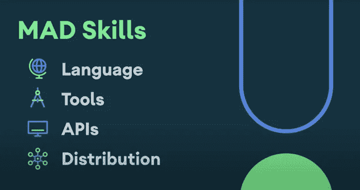

# 现在在 Android #27 中

> 原文：<https://medium.com/androiddevelopers/now-in-android-27-cae8da7c1991?source=collection_archive---------1----------------------->

Illustration by [Virginia Poltrack](https://twitter.com/VPoltrack)

## Android Studio 4.1，MAD Skills 系列，更多 Kotlin 词汇，Play 计费订阅，生物认证，MotionLayout 标签和资源上的一个播客资源

欢迎来到 Android 中的 Now，这是您对 Android 开发世界中新的和值得注意的事物的持续指导。

# 视频和播客形式的 NiA27

这个*现在在 Android* 中也以视频和播客的形式提供。内容是一样的，但是需要的阅读量更少。文章版本(继续阅读！)仍然是链接到所有内容的地方。

# 录像

# 播客

点击下面的链接，或者在你最喜欢的客户端应用程序中订阅播客。

Android Studio 4.1:现在稳定了！

Android Studio 4.1 最近发布了其[稳定版](https://developer.android.com/studio)。我在之前的几集中已经讨论过这个版本，因为它是通过预稳定版本发展起来的，但这里也只是几个亮点:

*   **数据库检查器**:您可以在 IDE 中查看设备上数据库的状态并对其进行更改(使用 Jetpack Room 或 raw SQLite 查询)。
*   **新项目模板**已更新，可使用材料设计组件。
*   **集成仿真器窗口**:您现在可以直接在 IDE 中运行仿真器，而不是在它自己的单独窗口中运行。没有“集成”，你就不能拼写集成开发环境。
*   **匕首/刀柄代码导航**:点击新的装订线动作，在你的代码中找到更多关于匕首和刀柄类型的信息。
*   **ML 模型绑定** : Studio 可以为导入的 TensorFlow Lite 模型生成代码，这使得从您的应用程序代码与该模型进行交互变得更加容易。

你可以在 [Yacine Rezgui](https://medium.com/u/f51b24785c0d?source=post_page-----cae8da7c1991--------------------------------) 的视频以及 Scott Swarthout 的[博客](https://android-developers.googleblog.com/2020/10/android-studio-41.html)和 [Android Studio 发行说明](https://developer.android.com/studio/releases)中了解更多关于这个版本的信息。或者见鬼，就[下载那个东西](https://developer.android.com/studio)自己看看。

 [## Android Studio 4.1

### 今天，我们很高兴发布 Android Studio 4.1 的稳定版本，它具有一系列解决常见问题的功能…

android-developers.googleblog.com](https://android-developers.googleblog.com/2020/10/android-studio-41.html) 

# 疯狂技能:系列

我们推出了一个新的系列，是关于一种叫做“疯狂技能”的新发展，它是关于 M、T2、T4 的。该系列将以视频和文章的形式提供关于 MAD 各个部分的内容，包括语言(Kotlin)、工具(Android Studio)、API(Jetpack 的子集)和分发(Android 应用捆绑包)。每隔几周，我们就会开始一个特定主题的新迷你剧。

本周，我们开始了一系列关于导航组件的讨论。在第一集中，我给出了 API 和工具的概述。第二集展示了如何[导航到对话目的地](https://youtu.be/OfEOYxWVRTM)。下周我们将发布关于安全和深层链接的剧集。

查看我们到目前为止发布的 [MAD Skills 播放列表](https://www.youtube.com/playlist?list=PLWz5rJ2EKKc91i2QT8qfrfKgLNlJiG1z7)，并查看我们每周继续发布的新剧集，直到……嗯，我们还没有计划结束。但是我们有很多技术内容要讲，所以需要一段时间。

对于那些喜欢你的文章形式的内容的人来说，无论何时发布的视频包含了文章中尚未描述的内容，我们都会在 Medium 上的 [Android 开发者出版物](https://medium.com/androiddevelopers)中发布一篇附带的文章，所以请留意未来的 MAD 文章。

> 记住:不要报复——要生气！

# 科特林词汇

正在进行的科特林词汇系列有几个新的插曲。

## 默认参数

[弗洛里纳·蒙特内斯库](https://medium.com/u/d5885adb1ddf?source=post_page-----cae8da7c1991--------------------------------)发布了一篇[文章](/androiddevelopers/dont-argue-with-default-arguments-2245b2c752c)和[视频](https://youtu.be/Y3LNWBKWZeI)讲授科特林的*默认论点*如何工作。默认参数是 Kotlin 的一个强大的语言特性，它允许减少重载函数的数量(想象一下另一个现实，View.java 可以只用一个构造函数而不是四个！)以及更简单的调用代码(在常见情况下可以依赖合理的默认值)。

 [## 不要争论默认的论点

### 科特林词汇

medium.com](/androiddevelopers/dont-argue-with-default-arguments-2245b2c752c) 

## 由:科特林代表

[Murat Yener](https://medium.com/u/e947fef0dfe0?source=post_page-----cae8da7c1991--------------------------------) 也贴出了关于 Kotlin 的*代表*特性的[文章](/androiddevelopers/delegating-delegates-to-kotlin-ee0a0b21c52b)和[视频](https://youtu.be/I56uHKcuAaw)。委托可用于将工作移交给其他代码。本文展示了*类委托*(其中一个类可以完全委托给另一个类)和*属性委托*(其中代码可以委托给另一个对象来为属性提供底层的 get/set 函数)。

Kotlin 不仅提供了基础设施和语言关键字(我指的是`by`)，还提供了几个内置的委托(比如`by lazy`)，尽管本文停留在“它是如何工作的？”stage 和，呃， *delegates* 对未来文章内置委托的解释。

 [## 将代表委派给 Kotlin

### 科特林词汇:代表

medium.com](/androiddevelopers/delegating-delegates-to-kotlin-ee0a0b21c52b) 

# 播放付费订阅

[Caren Chang](https://medium.com/u/b6f9dc502595?source=post_page-----cae8da7c1991--------------------------------) 发表了一篇文章，帮助您了解如何支持新的 Play 计费功能以及与用户获取和保留相关的要求。这些**变化将于 11 月 1 日**生效，因此，如果你的应用销售订阅产品，你可能想尽快了解该做什么。

 [## 为您的应用程序准备 Google Play 计费系统的最新功能

### 作为 Android 11 发布的一部分，Google Play 团队宣布了新功能，以帮助您获取和保留…

medium.com](/androiddevelopers/preparing-your-apps-for-the-latest-features-in-google-plays-billing-system-210ed5e50eaa) 

# 生物认证

Isai Damier 发布了一个由两部分组成的系列文章:Android 上的生物认证。

第 1 部分讨论了为什么应该考虑加入生物认证。例如，如果您的应用程序要求用户频繁登录，那么提供生物特征认证可以让他们更轻松、更快速地获得所需的体验。或者，如果您的应用程序只需要在安装后登录一次(可能是因为使用密码登录很繁琐)，那么生物认证可能会为您提供一种方法，为用户提供更高的安全性，同时使用比传统密码登录更方便的登录机制。

本文还介绍了使用 BiometricPrompt API(在 [AndroidX 生物特征库](https://developer.android.com/jetpack/androidx/releases/biometric)中)来处理认证。

 [## Android 上的生物认证—第 1 部分

### 为什么您的应用需要它

medium.com](/androiddevelopers/biometric-authentication-on-android-part-1-264523bce85d) 

第 2 部分介绍了使用 API 的一些细节，以及认证用户的推荐设计流程。

 [## Android 上的生物认证—第 2 部分

### 关键用户旅程和用户界面

medium.com](/androiddevelopers/biometric-authentication-on-android-part-2-bc4d0dae9863) 

# 运动标签:关键点位置

运动标签秀贴出了另一集讨论关键位置。KeyPosition 标签指定 MotionLayout 动画期间的布局信息。通过查看[运动标签播放列表](https://www.youtube.com/playlist?list=PLWz5rJ2EKKc-bcyUTIFAr97ZtRkwM7S4y)，你可以看到该系列迄今为止的其余剧集。

# 播客剧集

自从上一集《T4》在安卓发布以来，又有一集《T2》安卓开发者后台发布。请点击下面的链接，或在您最喜欢的播客客户端查看:

# 亚行 150:名副其实

这一次， [Tor Norbye](https://medium.com/u/8251a5f98c9d?source=post_page-----cae8da7c1991--------------------------------) ， [Romain Guy](https://medium.com/u/c967b7e51f8b?source=post_page-----cae8da7c1991--------------------------------) ，我和来自框架团队的 Ryan Mitchell 讨论了资源，包括 aapt2 工具如何工作。

 [## 第 150 集:一个恰当的名字

### 在这一集中，Chet、Romain 和 Tor 与 Android 框架团队的 Ryan Mitchell 进行了对话。我们报道机器人…

androidbackstage.blogspot.com](http://androidbackstage.blogspot.com/2020/10/episode-150-aaptly-named.html) 

# 那么现在…

这次到此为止。去下载最新的 [Android Studio 稳定版](https://developer.android.com/studio)！看看[疯狂技能系列](https://www.youtube.com/playlist?list=PLWz5rJ2EKKc91i2QT8qfrfKgLNlJiG1z7)！了解 Kotlin 语言的特性，如[默认参数](https://youtu.be/Y3LNWBKWZeI)和[委托](/androiddevelopers/delegating-delegates-to-kotlin-ee0a0b21c52b)！了解如何为[客户订阅](/androiddevelopers/preparing-your-apps-for-the-latest-features-in-google-plays-billing-system-210ed5e50eaa)支持新的 Google Play 功能和要求！阅读如何以及为何在您的应用中使用[生物认证](/androiddevelopers/biometric-authentication-on-android-part-1-264523bce85d)！观看最新的[运动标签视频](https://youtu.be/3HQMCyAkWTE)了解关键位置！听最新的[亚行播客](http://androidbackstage.blogspot.com/)集！请尽快回到这里，收听 Android 开发者世界的下一次更新。