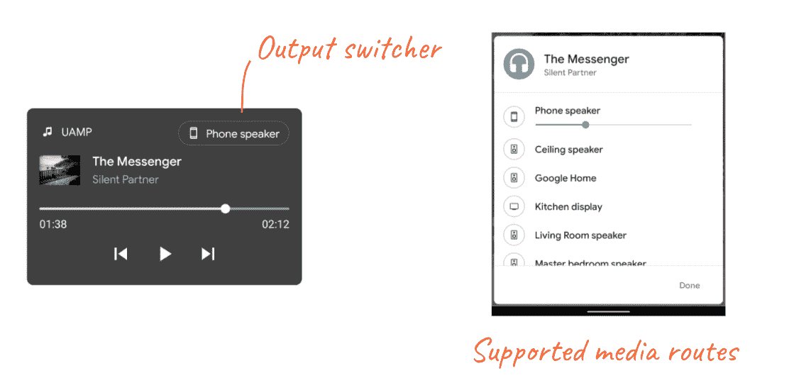

# 现在在 Android #28 中

> 原文：<https://medium.com/androiddevelopers/now-in-android-28-7c7c28008bfb?source=collection_archive---------0----------------------->


Illustration by [Virginia Poltrack](https://twitter.com/VPoltrack)

## MAD 技能导航、AndroidX 库、Kotlin 词汇、文章和视频、Android Kotlin 开发的纳米学位，以及关于分页的播客

欢迎来到 Android 中的 Now，这是您对 Android 开发世界中新的和值得注意的事物的持续指导。

# 视频和播客形式的 NiA28

这个*现在在 Android* 中也以视频和播客的形式提供。内容是一样的，但是需要的阅读量更少。文章版本(继续阅读！)仍然是链接到所有内容的地方。

# 录像

# 播客

点击下面的链接，或者在你最喜欢的客户端应用程序中订阅播客。

# 疯狂技能:导航


[MAD Skills](https://developer.android.com/series/mad-skills) 是一个新的内容系列，教导开发者如何使用**M**odern**A**n droid**D**开发的技术来更容易地创建更好的应用程序。当我在 Android 上发布最后一个 Now 时，这个系列刚刚推出。快进几周，第一部关于导航组件的[迷你剧已经完成。嗯…差不多完成了。我们还剩下一集导航:](https://www.youtube.com/watch?v=RC5bwJ4u9T8&list=PLWz5rJ2EKKc91i2QT8qfrfKgLNlJiG1z7) [a 直播 Q & A](https://www.youtube.com/watch?v=RC5bwJ4u9T8) 。

我们想用 MAD Skills 做的事情之一，不仅仅是教授如何使用现代 Android 开发的各种功能，还包括倾听您的问题，以便我们能够提供帮助。在每部迷你剧的结尾，我们都会在 YouTube 上主持一个现场问答。

在此之前，我们会在 Twitter 上向您提问。此外，我们还将尝试在 Twitter 和 YouTube 上现场回答问题。然后，我们将与该产品的一些专家进行对话，听听他们的建议。

对于导航，我将在太平洋标准时间本周四上午 10 点与伊恩·莱克主持一场现场问答比赛。在这个 Twitter 帖子上提出任何问题(或者用#AskAndroid 发布推文)，如果可以的话，请加入我们的讨论。我们会在完成后发布视频，所以你仍然可以看到直播节目…当它不再直播的时候。

如果您错过了导航剧集，您可以通过视频和文章的形式观看:

*   第一集:概述([视频](https://youtu.be/xITkfPIaStU)，[文章](/androiddevelopers/navigation-component-an-overview-4697a208c2b5)
*   第二集:对话目的地([视频](https://youtu.be/OfEOYxWVRTM)，[文章](/androiddevelopers/navigation-component-dialog-destinations-bfeb8b022759))
*   第三集:SafeArgs ( [视频](https://youtu.be/8I8Xykqn4hk)，[文章](/androiddevelopers/navigating-with-safeargs-bf26c17b1269))
*   第四集:深度链接([视频](https://youtu.be/XJgPIeolJu8)，[文章](/androiddevelopers/navigating-with-deep-links-910a4a6588c))

对于正在进行的内容，一定要查看 YouTube 上的 [MAD 技能播放列表](https://www.youtube.com/playlist?list=PLWz5rJ2EKKc91i2QT8qfrfKgLNlJiG1z7)，Medium 上的[文章](https://medium.com/androiddevelopers/tagged/mad-skills)，或者[这个指向所有内容的便捷登陆页面](https://developer.android.com/series/mad-skills)。并敬请期待更多 MAD 内容；下个系列下周开始！

# 安卓克斯

## GitHub 上的 AndroidX 库

首先，AndroidX 通过 GitHub 让更多的库可供[投稿。](https://github.com/androidx/androidx)

我们知道许多开发者更喜欢熟悉的 GitHub 贡献流，而不是 Android 传统上使用的 AOSP+Gerrit 系统，并且很高兴看到我们更多地使用 GitHub。

这是个好主意！但是……很难做到(考虑到我们所依赖的基础设施)。但是我们听到了你的声音，并且已经开始探索这个问题，在 GitHub 上提供了一些正在开发中的库，几个月前从分页、房间和工作管理器开始。最近，我们还添加了活动、片段和导航库。所以，检查一下它们，如果你想投稿，请看[投稿文档](https://github.com/androidx/androidx/blob/androidx-master-dev/CONTRIBUTING.md)中的细节以获得更多信息。

## 稳定版本

通常会有过多的 alpha、beta、RC 和次要稳定版本，包括这个著名的[稳定](https://developer.android.com/jetpack/androidx/versions/stable-channel)版本:

[MediaRouter 1.2.0](https://developer.android.com/jetpack/androidx/releases/mediarouter#1.2.0) :这个版本很有趣，因为它增加了与 Android 11 中一些新媒体功能同步的功能。


Android 11 为媒体播放器增加了一系列 UI 细节，将[媒体控件](https://developer.android.com/guide/topics/media/media-controls)发送到通知面板中一个新的专用空间，从而更容易从一个地方控制媒体，而不是与其他通知交错。这不是关于新的开发人员功能，而是你可能已经创建的通知的不同表示；您可以继续使用自从 Lollipop 发布以来已经可用的`MediaSession`和`MediaStyle`API。

但 Android 11 中增加了一些新功能，用于“无缝媒体传输”，允许用户通过输出切换器改变播放设备(如下所示)。MediaRouter 的这一新版本允许您与这一新的平台功能进行交互。



This new release of MediaRouter allows you to control which playback devices show up in the output switcher so your users can seamlessly move their audio around.

如果你想看看 Android 11 中的媒体变化，请查看[唐·特纳](https://medium.com/u/7f5a2cb6598e?source=post_page-----7c7c28008bfb--------------------------------)的[媒体视频](https://youtu.be/fhii2K9o6ts)中的新内容。

## **现在在阿尔法**

我还想推出几个有趣的 alpha 版本。我通常不会纠结于 alpha，因为，好吧，他们是 alpha，因此随着团队对他们的持续打击，他们会受到变化和迭代的影响。但是有分页和导航的新版本(就在今天！)就他们对未来发展的看法而言是很有趣的。

随着 [Jetpack Compose](https://developer.android.com/jetpack/compose) 开始其 alpha 之旅，我们最近收到的一个问题是“在 Jetpack Compose 世界中，[在此插入最喜欢的 Jetpack 库]的前景如何？”

这是一个…非常好的问题！答案是，许多架构组件并不是专门关于视图或现有的 UI 工具包的，因此它们在 Jetpack Compose 的新世界中同样是必要和有帮助的。不仅如此，我们正在构建集成，以使不同的组件能够轻松地协同工作。Compose 已经提供了与[viewmodel](https://developer.android.com/jetpack/compose/interop#viewmodel)和 [LiveData](https://developer.android.com/jetpack/compose/interop#streams) 的集成，今天标志着对 Jetpack Compose 的[分页](https://developer.android.com/jetpack/androidx/releases/paging#compose-1.0.0-alpha01)和[导航](https://developer.android.com/jetpack/androidx/releases/navigation#compose-1.0.0-alpha01)支持的首次发布。

# 科特林词汇

最近有三篇关于 Kotlin 语言特性的帖子，你可能想看看。

## 解构

弗洛里纳·蒙特内斯库发布了一篇关于科特林解构主义的新文章和视频。析构允许一种便捷的方式将多个变量赋给对象中不同字段的值。例如，您可能有以下数据类:

```
data class Donut(
    dough: String,
    topping: String
)
```

并使用以下命令将变量快速分配给`Donut`实例的字段:

```
val (dough, topping) = someDonut
```

数据类的析构是自动进行的，但是您也可以在其他类中提供函数来赋予它们析构能力。

[](/androiddevelopers/breaking-down-destructuring-declarations-e21334ac1e9) [## 分解析构声明

### 科特林词汇——解构

medium.com](/androiddevelopers/breaking-down-destructuring-declarations-e21334ac1e9) 

## 扩展ˌ扩张

Meghan Mehta 发布了一篇关于 Kotlin 语言扩展特性的新文章。扩展允许你在现有的类中添加新的方法或属性……算是吧。扩展实际上并没有插入到现有的类中，但是对于这些方法的调用者来说，它们看起来是这样的。(剧透:它们在内部实现为静态方法，接收该类的一个实例。)

这可能是我最喜欢的 Kotlin 特性:作为一名 API 开发人员，我喜欢未来能够通过添加 API 来改进 API 的想法，这些 API 可以存在于核心平台或库之外，但看起来就像在您的代码中使用它们一样。例如，我可以在字符串类`String.isAGoodDonutName()`上创建一个扩展方法。然后，使用我的扩展方法的调用者可以直接在字符串上调用该方法，比如`“Sprinkle”.isAGoodDonutName()`，而不是像`Utils.StringMethods.isAGoodDonutName(“Sprinkle”)`那样通过其他包/类调用它。没那么好，即使是关于甜甜圈的。

[](/androiddevelopers/extend-your-code-readability-with-kotlin-extensions-542bf702aa36) [## 使用 Kotlin 扩展扩展您的代码可读性

### 科特林词汇表:扩展函数和属性

medium.com](/androiddevelopers/extend-your-code-readability-with-kotlin-extensions-542bf702aa36) 

## 协同程序

最后， [Manuel Vivo](https://medium.com/u/3b5622dd813c?source=post_page-----7c7c28008bfb--------------------------------) 发布了一个关于“协程的基础知识”的新视频，他在视频中解释了`CoroutineScope`、`CoroutineContext`、`Dispatchers`和`Jobs`等主题。所以可能更像 cdj 而不是协程的 ABC。

# 文章和视频

## 常见的游戏策略违规

发布应用程序的一个棘手问题是确保这些应用程序遵守商店的指导方针，这些指导方针旨在为用户创造一个良好的应用程序生态系统。但是有时很难准确地说出如何正确地做到这一点。因此，Play Store 发布了这篇文章，以帮助您了解一些可能导致问题的常见违规行为，以及如何避免它们。

其中一些领域包括链接到 Play Store 的应用程序用户界面，更侧重于搜索词而不是应用程序的清晰摘要的描述，以及只是网站内容的 WebView 包装器的应用程序。

[](https://android-developers.googleblog.com/2020/10/developer-tips-and-guides-common-policy.html) [## 开发人员提示和指南:常见的策略违规以及如何避免它们

### Google Play 应用安全产品经理 Andrew Ahn 表示，我们希望打造一个安全的生态系统…

android-developers.googleblog.com](https://android-developers.googleblog.com/2020/10/developer-tips-and-guides-common-policy.html) 

## 会议演示

Droidcon 在这个仅限在线的会议季节采取了有趣的方法，将许多年度活动合并成更大的时区范围的活动。这个会议的 EMEA 版本发生在 10 月，所有这些视频(由我们团队中的一些人以及更广泛的社区中的许多许多开发人员制作)现在都可以在网上获得:

[](https://www.droidcon.com/videos?path=droidcon%20EMEA) [## 录像

### 为 Android 开发开源的可访问性库

www.droidcon.com](https://www.droidcon.com/videos?path=droidcon%20EMEA) 

(请继续关注接下来几周即将推出的美洲和 APAC 版本。)

## 运动标签

自上次以来，MotionTags 系列视频又发布了两集。

**第 7 集**涵盖了`<KeyAttribute>`，它是包含视图属性的标签，比如它的变换和 alpha 值。

**第八集**涵盖`<KeyCycle>`。这个标签有许多与`KeyAttribute`相同的属性，但也提供了定义用于动画的波形的属性，这可以导致真正有趣的复杂运动行为。请注意，有一个独立的 [CycleEditor 工具](https://github.com/androidx/constraintlayout/tree/main/desktop/CycleEditor)使创建和编辑`KeyCycles`更容易。

您可以在 MotionTags 播放列表中看到这些剧集以及该系列的其余部分:

# 培养

新的 [Udacity Android Kotlin 开发者 Nanodegree](https://blog.udacity.com/2020/10/learn-to-develop-better-android-apps-with-udacitys-new-android-kotlin-developer-nanodegree-program.html) 最近推出。本课程面向那些希望学习如何按照最佳实践在 Kotlin 中构建 Android 应用的人。有关先决条件和更多详细信息，请查看[计划概述](https://www.udacity.com/course/android-kotlin-developer-nanodegree--nd940)。

请注意，nanodegree 是一个付费项目，包括来自 Udacity 的反馈项目、技术导师支持和职业服务。然而，谷歌与 Udacity 合作开发的基础课程内容对任何人都是免费的。你可以在[使用 Kotlin 开发 Android 应用](https://www.udacity.com/course/developing-android-apps-with-kotlin--ud9012)和[使用 Kotlin 开发高级 Android](https://www.udacity.com/course/advanced-android-with-kotlin--ud940)查看相关内容。

# 播客剧集


自从 Android 上一期 Now 发布以来，又有一集 Android 开发者后台[发布。请点击下面的链接，或在您最喜欢的播客客户端查看:](http://androidbackstage.blogspot.com/)

# 亚行 151:第 3 页

[罗曼·盖伊](https://medium.com/u/c967b7e51f8b?source=post_page-----7c7c28008bfb--------------------------------)和我与 Android Toolkit 团队的达斯汀·林(Dustin Lam)和克里斯·克赖克(Chris Craik)聊了聊[分页](https://developer.android.com/jetpack/androidx/releases/paging)库的新 [3.0 版本](https://developer.android.com/jetpack/androidx/releases/paging#version_300_2)(Paging 3)。这个版本(目前是 alpha 版本)是用 Kotlin 完全重写的，使用了协程和`Flow`，原因我们在播客中会讲到。请查看以了解更多信息。

[](http://androidbackstage.blogspot.com/2020/10/episode-151-paging3.html) [## 第 151 集:分页 3

### Romain 和 Chet 与工具包团队的 Dustin Lam 和 Chris Craik 讨论了分页 3。分页 3(目前在…

androidbackstage.blogspot.com](http://androidbackstage.blogspot.com/2020/10/episode-151-paging3.html) 

# 那么现在…

这次到此为止。去看看[狂技能系列](https://developer.android.com/series/mad-skills)！下载最新的 [AndroidX 库](https://developer.android.com/jetpack/androidx/versions)！了解一下 [Kotlin 语言特性](https://www.youtube.com/redirect?v=VIrIl03kn44&redir_token=QUFFLUhqbi1POXo3TTY0S0oydjhPSTJ2OTh2Z3F4OFZ3UXxBQ3Jtc0tuY2wyNHhrRHBhT3lUMVZvRWUxeEtHbGlkRjlEOW9uRFVDd0cwRzd0aDdfSmJJcWczc3R6bVBJNWs5bU9IQWZXZmRUS0FwWldHUTE2bUhhenFfel9tTlhPY2JvUWlQWHZoNl8zanFIbWhUb0FjYXIyYw%3D%3D&event=video_description&q=https%3A%2F%2Fgoo.gle%2F2wHr94N)！查看最新开发者文章和[视频](https://www.youtube.com/user/androiddevelopers)！获得一个[纳米学位](https://blog.udacity.com/2020/10/learn-to-develop-better-android-apps-with-udacitys-new-android-kotlin-developer-nanodegree-program.html)！听最新的[亚行播客](http://androidbackstage.blogspot.com/)集！请尽快回到这里，收听 Android 开发者世界的下一次更新。