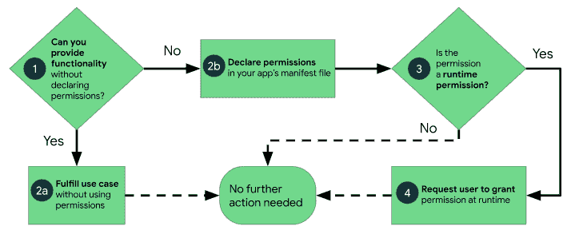

# 现在在 Android #31 中

> 原文：<https://medium.com/androiddevelopers/now-in-android-31-dfd9eb3111d3?source=collection_archive---------2----------------------->

Illustration by [Virginia Poltrack](https://twitter.com/VPoltrack)

## 现代 Android 开发内容、文档增强、AndroidX 发布、文章和播客

欢迎来到 Android 中的 Now，这是您对 Android 开发世界中新的和值得注意的事物的持续指导。

# 视频和播客形式的 NiA31

这个*现在在 Android* 中也以视频和播客的形式提供。内容是一样的，但是需要的阅读量更少。文章版本(继续阅读！)仍然是链接到所有内容的地方。

# 录像

# 播客

点击下面的链接，或者在你最喜欢的客户端应用程序中订阅播客。

# 现代 Android 开发

## 获得#MADScore

在疯狂技能系列中，我们想找点乐子，给你一个机会来回答这个迫切的问题:你有多疯狂？要找到答案，请在 Android Studio 中安装并运行 MAD 记分卡插件。它为你创建了一张卡片，显示你的应用在现代 Android 开发的四大支柱中的得分，然后你可以用 [#MADscore](https://twitter.com/search?q=%23MADscore) 标签分享到 Twitter。

去 [MAD Score 网站](https://developer.android.com/modern-android-development/scorecard)了解详情，或者在 [Christopher Katsaros](https://medium.com/u/a9077809d441?source=post_page-----dfd9eb3111d3--------------------------------) 的博客上查看更多信息:

 [## 你的疯狂分数是多少？

### 我们最近通过 MAD 技能系列与您谈论了很多关于现代 Android 开发(MAD)的内容。现在…

android-developers.googleblog.com](https://android-developers.googleblog.com/2020/12/whats-your-mad-score.html) 

## MAD 技能:材料设计组件

与此同时， [MAD Skills](https://developer.android.com/series/mad-skills) 系列继续滚动，其中包含关于现代 Android 开发的技术内容。上周，材料设计组件系列完成了。自从上次在 Android 上发布以来，团队又发布了 3 集:

**#4:材料运动** 在 MDC 第四集中， [Nick Rout](https://medium.com/u/37290b859aca?source=post_page-----dfd9eb3111d3--------------------------------) 讲述了材料的四种运动模式，以及如何在应用中实现它们。他浏览了[回复](https://material.io/design/material-studies/reply.html)示例应用程序，以及基于该应用程序的[代码实验室](https://www.youtube.com/redirect?q=https%3A%2F%2Fgoo.gle%2F3o5eD5s&redir_token=QUFFLUhqa1BfNXdSbksyS1R1ZTQwd0pfUGFkcElTNmZNZ3xBQ3Jtc0trTjRybnRJbm90MFpzS0dQa2FDQjhER3FiNnFlc1ZUUXl4dFgtME8tOC1za0RHSkNkNWIwLWh3aUFjNVh6M0VBVmZSNU4xZXVpcURCWVZUajFzbm9RTmdma0E3WDhWa0pyWGdHczJRWHU2eFFVQXBmVQ%3D%3D&event=video_description&v=xiNtXsWRD3g)，以展示它在实践中是如何工作的。

**#5 社区提示来自**[**Zarah Dominguez**](https://medium.com/u/19d8ca156951?source=post_page-----dfd9eb3111d3--------------------------------)第五集来自 [Zarah Dominguez](https://medium.com/u/19d8ca156951?source=post_page-----dfd9eb3111d3--------------------------------) ，她是一位 Google 开发专家，讲述了她的团队如何使用 Material catalog 应用程序，既想看看实际情况如何，又想看看源代码是如何实现的。

最后一集 MDC，就像之前关于应用捆绑包和导航的系列一样，是一场与 MDC 开发者关系和材料工程团队专家的现场问答。在问答环节中，我们在 Twitter 上和 YouTube 上收到了很多来自你的问题。我们没有时间回答所有的问题，但我们取得了……实质性的进展。

如果您错过了 MDC 系列中的任何内容， [Nick Rout](https://medium.com/u/37290b859aca?source=post_page-----dfd9eb3111d3--------------------------------) 在这篇总结文章中写下了该系列的摘要，并提供了所有相关视频和文章的链接，以及相关的示例、文档、代码实验室等。

 [## MAD 技能材料设计组件:总结

### 我们希望你喜欢我们的材料

medium.com](/androiddevelopers/mad-skills-material-design-components-wrap-up-d22a2df069c8) 

## 疯狂技能:科特林和喷气背包

本周，Kotlin 和 Jetpack 上有一个新的 MAD 技能系列。具体来说，它是关于如何将 Kotlin 与许多 Jetpack APIs 结合使用。弗洛里纳·蒙特内斯库是这样介绍的:

**#1:使用 KTX** 本系列的第一集是关于使用 KTX，我们提供的 Kotlin 扩展，它为各种平台和 Jetpack 库提供了改进的、更简单的方法。[弗洛里纳](https://medium.com/u/d5885adb1ddf?source=post_page-----dfd9eb3111d3--------------------------------)从总体上讨论了 KTX，并以平台和 Jetpack APIs 为例，展示了她在使用 LiveData 和 ViewModel 时是如何使用它们的。

或者以文章形式:

 [## 使用 KTX 库

### 在 Kotlin 中使用 Android Java APIs 时，您会很快意识到您错过了 Kotlin 的一些特性…

medium.com](/androiddevelopers/using-ktx-libraries-da1dc81c6ecf) 

**#2:用协程** 简化 API 在这第二集中， [Manuel Vivo](https://medium.com/u/3b5622dd813c?source=post_page-----dfd9eb3111d3--------------------------------) 解释了如何使用 Kotlin 协程来改善 Kotlin 开发者使用现有 API 的体验。例如，您可以创建适配器，用协程简化嵌套回调的复杂性。他通过一个为 Fused Location Provider 创建一个更简单的 API 的例子来展示如何在实践中做到这一点。

或者以文章形式:

 [## 用协程和流程简化 API

### 使用协程和流程简化 API，以及如何使用 suspendencelable 协程和…

medium.com](/androiddevelopers/simplifying-apis-with-coroutines-and-flow-a6fb65338765) 

在接下来的几周里，期待更多的 Kotlin/Jetpack 剧集，它们将出现在 [YouTube 播放列表](https://www.youtube.com/playlist?list=PLWz5rJ2EKKc98e0f5ZbsgB63MdjZTFgsy)以及 [Android 开发者出版物](https://medium.com/androiddevelopers/tagged/mad-skills)的文章中。

对于正在进行的内容，一定要查看 YouTube 上的 [MAD 技能播放列表](https://www.youtube.com/playlist?list=PLWz5rJ2EKKc91i2QT8qfrfKgLNlJiG1z7)，Medium 上的[文章](https://medium.com/androiddevelopers/tagged/mad-skills)，或者指向所有内容的[这个方便的登陆页面](https://developer.android.com/series/mad-skills)。

# 证明文件

## 许可

*The high-level workflow for using permissions on Android*

在最近几个版本中，权限有了一些变化，因为我们继续关注用户控制和用户数据的透明性。有时这需要开发人员的工作来跟上最新的更新和行为变化，所以我们一直致力于我们的文档来帮助这个过程。

作为这项工作的一部分，我们最近对 Android 指南上的[权限进行了几项重大改进。该网站现在提供了关于权限工作方式的更加简化的指导，以及在应用程序中使用权限的最佳实践。特别是你要评估你是否真的*需要*来声明权限，这对于很多常见用例来说是不必要的。](https://developer.android.com/guide/topics/permissions/overview)

## 房间之道

为了阐明如何使用 API 的某些方面，修改了几个房间库指南:

[通过 Room](https://developer.android.com/training/data-storage/room/accessing-data) 使用数据访问对象(DAO)提供了使用 DAO 接口的概述，包括使用内置查询方法以及使用`@Query`注释的定制方法。

[编写异步 DAO 查询](https://developer.android.com/training/data-storage/room/async-queries)涵盖了更多关于如何编写发生在 UI 线程之外的查询的细节，这是数据库交互所必需的。根据您的语言和异步 API 偏好，本指南介绍了您可以使用的几种替代方法。

# 安卓克斯

在各种 AndroidX 库的众多最新 alpha、beta 和 RC 版本中，有以下稳定版本:

*   浏览器 1.3.0 :这个最新版本引入了通过可信的 Web 活动 API 传递自由格式命令的能力，以及其他特性，比如对自定义选项卡上颜色设置的改进。
*   [Media2 1.1.0](https://developer.android.com/jetpack/androidx/releases/media2#1.1.0) :该版本修复了大量错误，并增加了用于处理媒体轨道和与 AndroidX 媒体库互操作的 API。
*   [wear input 1 . 0 . 0](https://developer.android.com/jetpack/androidx/releases/wear#wear-input_100_2):wear input 的第一个版本为 AndroidX 库带来了对[可穿戴按钮](https://developer.android.com/reference/android/support/wearable/input/WearableButtons)的支持。

也有一些稳定的 bug 修正版本，包括 [Exifinterface 1.3.2](https://developer.android.com/jetpack/androidx/releases/exifinterface#1.3.2) 、 [Media 1.2.1](https://developer.android.com/jetpack/androidx/releases/exifinterface#1.3.2) 和[导航 2.3.2](https://developer.android.com/jetpack/androidx/releases/navigation#2.3.2) 。

# 安卓工作室

贾马尔·伊森(Jamal Eason)发布了一篇文章，宣布了 Android Studio 的下一个版本:北极狐现在在金丝雀频道，准备试玩。关于这个版本，您注意到的第一件事是一个新的命名和版本控制方案，本文将对此进行详细讨论。除此之外，该版本中的一些东西包括用于与设备配对的 UI，用于 [wifi 调试](https://developer.android.com/studio/command-line/adb#wireless-adb-android-11)(目前仅适用于 MacOS)，布局验证工具，以及对 Jetpack Compose 开发的持续支持。(请注意，您必须始终使用 Studio 的 canary 版本来处理当前处于非常早期状态的 Compose。)

 [## 宣布 Android Studio 北极狐(2020.3.1)和 Android Gradle 插件 7.0

### 今天标志着 Android Studio 北极狐(2020.3.1)的第一个版本在金丝雀频道发布，一起…

android-developers.googleblog.com](https://android-developers.googleblog.com/2020/12/announcing-android-studio-arctic-fox.html) 

Murat Yener 在他关于 Android Gradle 插件 7.0.0-alpha01 的文章中也发布了关于 Android Studio 的新内容。请注意，AGP 也经历了版本命名的变化。AGP 现在将跟踪 Gradle 发布版本，而不是与 Android Studio 版本结合。这解释了为什么这个版本看起来跳过或忘记了当前 4.2 版本之后的几个版本。本文还讨论了 AGP 4.2 中最近的一些 API 变化。

 [## AGP 7.0:Android Gradle 插件的下一个主要版本

### 今天标志着 Android Studio 北极狐(2020.3.1)第一个金丝雀版本的发布，连同 Android…

android-developers.googleblog.com](https://android-developers.googleblog.com/2020/12/announcing-android-gradle-plugin.html) 

# 文章和视频

## 列表适配器

Meghan Mehta 在 RecyclerView 上发表了她系列的另一篇文章。尽管 RecyclerView 并不新鲜(大多数 Android 开发人员可能已经在他们的应用程序中使用它)，但我们发现一些基础知识的文档和示例有点难找到(至少在我们的文档和文章中)，所以她一直在解释如何使用一些基础知识，并通过[示例代码](https://github.com/android/views-widgets-samples/tree/main/RecyclerViewKotlin)展示如何在实践中做到这一点。

在这篇最新的文章中，Meghan 特别谈到了使用 [ListAdapter](https://developer.android.com/reference/androidx/recyclerview/widget/ListAdapter) ，它提供了一种简单的方法来为你的 RecyclerView 获得一些伟大的功能，包括更好的性能和自动项目动画。ListAdapter 使用 [DiffUtil](https://developer.android.com/reference/androidx/recyclerview/widget/DiffUtil) 来确定发生的具体变化，RecyclerView 需要这些变化来获得最佳性能和动画效果。

 [## 适应 ListAdapter

### 这是涵盖创建和使用 RecyclerView 基础的系列文章的第二篇。如果你…

medium.com](/androiddevelopers/adapting-to-listadapter-341da4218f5b) 

## 表演

我继续探索启动性能，撰写了关于[应用启动](https://developer.android.com/topic/libraries/app-startup)的两部分系列文章，这是一个最近[达到 1.0](https://developer.android.com/jetpack/androidx/releases/startup#1.0.0) 的 AndroidX 库。[第一部分](/androiddevelopers/app-startup-part-1-34f57b65cacd)介绍了内容提供者如何经常被用来实例化库，以及这如何对应用程序启动时间造成潜在影响。

 [## 应用程序启动，第 1 部分

### 内容提供商和自动初始化

medium.com](/androiddevelopers/app-startup-part-1-34f57b65cacd) 

[第 2 部分](/androiddevelopers/app-startup-part-2-c431e80d0df)研究了如何使用应用启动库来删除那些隐藏的内容提供者和池请求，以延迟初始化库。

 [## 应用程序启动，第 2 部分

### 惰性初始化

medium.com](/androiddevelopers/app-startup-part-2-c431e80d0df) 

## 位置，位置，[更好的 GPS]位置

Android 开发者博客上有一篇文章，详细介绍了我们对定位系统和 API 进行的改进，以使在城市中获得更准确的位置信息成为可能。本文讨论了在城市中推导 GPS 位置的问题，其中使用视线的 GPS 技术的默认假设被信号如何从高层建筑反弹所欺骗。( [Tor](https://medium.com/u/8251a5f98c9d?source=post_page-----dfd9eb3111d3--------------------------------) 我和外景团队的 Marc Stogaitis 早在 2014 年就在[亚行播客中讨论过这个问题:这种现象被称为“城市峡谷”)。](https://androidbackstage.blogspot.com/2014/11/episode-15-location-location-location.html)

该团队整合了主要城市的 3D 建筑模型，以获得更加精确的定位结果。这项技术的第二版现在可以在一些像素设备上使用。一个更早的版本已经在更广泛的生态系统中可用，这个最新的版本将在明年年初类似地可用。

当然，这一切都是用户功能，现在在 Android 是给开发者的。但我想在这里提出来，因为(a)我发现这篇文章和技术很有趣，以及(b)这里有一个开发人员的呼吁，即使用[融合位置提供商](https://developers.google.com/location-context/fused-location-provider) (FLP)来访问这个增强的位置数据。

此外，FLP 有一个新的 API，允许你更容易地获得当前位置信息，只需询问当前位置并获得结果，而不是订阅正在进行的位置更改，然后在获得第一个结果后取消订阅。查看 FLP 的 [getCurrentLocation() API](https://developers.google.com/android/reference/com/google/android/gms/location/FusedLocationProviderClient#getCurrentLocation(int,%20com.google.android.gms.tasks.CancellationToken)) ，新的 [CurrentLocationKotlin 示例](https://github.com/android/location-samples/tree/main/CurrentLocationKotlin)的文档，以及文章以获得更多信息。

 [## 提高应用程序的城市 GPS 精度

### 在 Android，我们希望让开发者尽可能容易地为他们的用户创建最有帮助的应用程序…

android-developers.googleblog.com](https://android-developers.googleblog.com/2020/12/improving-urban-gps-accuracy-for-your.html) 

## Jetpack 撰写迁移

[克里斯·贝恩斯](https://medium.com/u/9303277cb6db?source=post_page-----dfd9eb3111d3--------------------------------)一直在将他的应用程序 [Tivi](https://github.com/chrisbanes/tivi/) 从使用当前 UI 工具包的应用程序迁移到使用 Jetpack Compose 的应用程序。他完成了迁移的主要部分，现在整个 UI 都是用 Compose 编写的，并且重新露面报告了一些关于 APK 大小的有趣结果(小得多！)，方法计数(更小！)，以及构建时长(稍微小一点！).

 [## Jetpack 撰写-之前和之后

### 将 Tivi 示例应用程序迁移到 Jetpack Compose 后，构建速度、APK 大小和源代码行数是如何变化的

medium.com](/androiddevelopers/jetpack-compose-before-and-after-8b43ba0b7d4f) 

## CameraX 中的 CameraController

CameraX 中的 CameraView API 做了太多工作，处理 UI 和控制器逻辑。因此，逻辑已经被重构为 PreviewView 和新的`[CameraController](https://developer.android.com/reference/androidx/camera/view/CameraController)`类。这篇文章描述了如何使用`CameraController`，以及该功能与您之前在`CameraView`中可能使用的功能相比如何。

 [## CameraX:学习如何使用 CameraController

### CameraController 简介+从 CameraView 迁移

medium.com](/androiddevelopers/camerax-learn-how-to-use-cameracontroller-e3ed10fffecf) 

# 播客剧集

自从上一期《现在》在安卓发布以来，又有一集[安卓开发者后台](http://androidbackstage.blogspot.com/)发布。请点击下面的链接，或在您最喜欢的播客客户端查看:

## 亚行 153:好，好，好

Romain Guy、Tor Norbye 和我与来自 Square 的 Jesse Wilson 讨论了他开发的一些流行的开源库，包括 OkHttp、Okio 和[Ok]Moshi。我们讨论了这些库和其他库，以及 Android、库、框架和 Kotlin 开发。有些工程师有一个令人讨厌的习惯，就是把一个功能请求或小麻烦变成一个创建新的开源库的项目。

 [## 第 153 集:好，好，好

### 罗曼、托尔和切特与来自广场的杰西·威尔逊交谈。Jesse 已经开发了几个流行的开源库…

androidbackstage.blogspot.com](http://androidbackstage.blogspot.com/2020/12/episode-153-ok-ok-ok.html) 

# 那么现在…

这次到此为止。所以去拿你的疯狂记分卡吧！前往 [MAD](https://www.youtube.com/c/AndroidDevelopers/playlists?view=50&sort=dd&shelf_id=1) 了解更多 [MDC](https://www.youtube.com/playlist?list=PLWz5rJ2EKKc8SmtMNw34wvYkqj45rV1d3) 和 [Kotlin/Jetpack 内容](https://www.youtube.com/playlist?list=PLWz5rJ2EKKc98e0f5ZbsgB63MdjZTFgsy)！阅读最新的[权限](https://developer.android.com/guide/topics/permissions/overview)和[房间](https://developer.android.com/training/data-storage/room/accessing-data)文档！下载最新 [AndroidX 稳定版](https://developer.android.com/jetpack/androidx/versions/stable-channel)！阅读关于 [ListAdapter](/androiddevelopers/adapting-to-listadapter-341da4218f5b) 、[启动性能](/androiddevelopers/app-startup-part-1-34f57b65cacd)、[改进 GPS 定位](https://android-developers.googleblog.com/2020/12/improving-urban-gps-accuracy-for-your.html)、 [Jetpack 合成迁移](/androiddevelopers/jetpack-compose-before-and-after-8b43ba0b7d4f)和 [CameraController](/androiddevelopers/camerax-learn-how-to-use-cameracontroller-e3ed10fffecf) 的新文章！收听最新的 [ADB 播客](http://androidbackstage.blogspot.com/)，并尽快回到这里收听来自 Android 开发者世界的下一次更新。