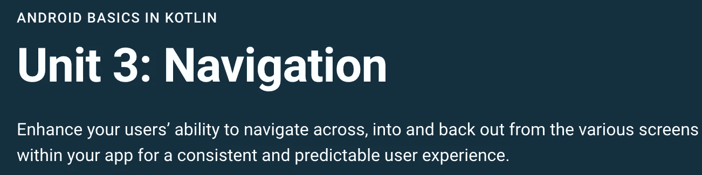

# 现在在 Android #32 中

> 原文：<https://medium.com/androiddevelopers/now-in-android-32-3e3eb4270a1f?source=collection_archive---------5----------------------->

Illustration by [Virginia Poltrack](https://twitter.com/VPoltrack)

## Kotlin & Jetpack APIs，一个关于导航的新课程，几篇文章，和一个播客片段

欢迎来到 Android 中的 Now，这是您对 Android 开发世界中新的和值得注意的事物的持续指导。

Android 中的[previous Now](/androiddevelopers/now-in-android-31-dfd9eb3111d3)在假期前上线已经有几周了——让我们看看这段时间 Android 世界发生了什么。

# 视频和播客形式的 NiA32

现在安卓系统中的《T2》也以视频和播客的形式提供。内容是一样的，但是需要的阅读量更少。文章版本(继续阅读！)仍然是链接到所有内容的地方。

# 录像

# 播客

点击下面的链接，或者在你最喜欢的客户端应用程序中订阅播客。

# 现代 Android 开发:Kotlin 和 Jetpack

[疯狂技能](https://developer.android.com/series/mad-skills)系列继续滚动，关于现代 Android 开发的技术内容。

关于将 Kotlin 与 Jetpack APIs 结合使用的系列文章[一直在稳步前进。自从上次的第一集以来，我们又有了三块土地。这几集提供了关于使用 Room 和 WorkManager 库的一般信息，但也提供了关于使用 Kotlin 特性(如协程)来简化事情的具体指导。](https://www.youtube.com/playlist?list=PLWz5rJ2EKKc98e0f5ZbsgB63MdjZTFgsy)

## **使用 Room kot Lin API**

在这一集里，[弗洛里纳·蒙特内斯库](https://medium.com/u/d5885adb1ddf?source=post_page-----3e3eb4270a1f--------------------------------)展示了如何使用和测试 Room Kotlin APIs 来满足您的本地数据库存储需求。

或者以文章形式:

 [## 使用和测试 Room Kotlin APIs

### Room 是 SQLite 的一个包装器，它使得在 Android 上使用数据库变得更加容易，也是我最喜欢的……

medium.com](/androiddevelopers/using-and-testing-room-kotlin-apis-4d69438f9334) 

**使用工作管理器 kot Lin API** 这一次，[弗洛里纳](https://medium.com/u/d5885adb1ddf?source=post_page-----3e3eb4270a1f--------------------------------)展示了如何使用工作管理器来调度异步工作，要么立即进行，要么可以推迟:

或者以文章形式:

 [## 工作管理器—kot Lin API

### WorkManager 提供了一组 API，可以轻松地为即时或延迟任务调度异步任务…

medium.com](/androiddevelopers/workmanager-kotlin-apis-a0fb9dfbfeb6) 

**社区提示:Kotlin 提高开发速度和质量** [Magda Miu](https://medium.com/u/3056258d1643?source=post_page-----3e3eb4270a1f--------------------------------) ，谷歌 Android 开发专家(GDE)解释了她的团队如何使用 Kotlin 为 CameraX 供应商扩展编写更简单、更易维护的代码。

最后，本周晚些时候，我们还有另一个[直播 Q & A](https://www.youtube.com/watch?v=d-GkmHE8G80&list=PLWz5rJ2EKKc98e0f5ZbsgB63MdjZTFgsy&index=6) 来完成科特林&喷气背包系列，于太平洋时间周四上午 10 点播出。当你读这篇文章的时候，它可能已经发生了，但是你可以随时观看录音来听对话，并捕捉人们所提问题的答案。

请务必在下周收听，届时我们将开始一个全新的 MAD 技能系列。对于正在进行的内容，一定要查看 YouTube 上的 [MAD 技能播放列表](https://www.youtube.com/playlist?list=PLWz5rJ2EKKc91i2QT8qfrfKgLNlJiG1z7)，Medium 上的[文章](https://medium.com/androiddevelopers/tagged/mad-skills)，或者指向所有内容的[这个方便的登陆页面](https://developer.android.com/series/mad-skills)。

# Android 培训

Kotlin 课程中的 [Android 基础现在有了一个新单元！](https://developer.android.com/courses/android-basics-kotlin/course)

[**单元 3:导航**](https://developer.android.com/courses/android-basics-kotlin/unit-3)该单元提供了关于[导航组件](https://developer.android.com/guide/navigation)的教程和示例，以及 [Android 架构组件](https://developer.android.com/topic/libraries/architecture)库中的其他 API。

# 文章

## 密码学和生物认证

Isai Damier 发表了一篇关于加密、认证和安全的新文章。他讲述了许多有趣的密码学背景知识，并解释了为什么一个包含密码学的安全解决方案通常也应该包含生物认证。

 [## 从消息验证到用户状态，提高应用的加密能力

### 在一个完美的世界里，没有人需要密码。每个人都把自己的手、眼睛和耳朵留给自己；每个包裹都是…

medium.com](/androiddevelopers/improve-your-apps-cryptography-from-message-authentication-to-user-presence-869277f50d34) 

## 科特林生产率

弗洛里纳·芒特内斯库发表了一篇关于使用科特林提高生产力的文章。如果您已经编写了大量 Kotlin 代码，您可能知道这一点。但是，如果您想知道是否开始在工作中使用 Kotlin，或者希望在您的项目中帮助说服其他人，本文提供了一些具体的细节，可能有助于您对此进行论证。

 [## 使用 Kotlin 提高生产力

### Kotlin 以简洁著称，这在实践中转化为更高的生产率。更有甚者，67%的…

medium.com](/androiddevelopers/more-productivity-with-kotlin-8ce7b7718f39) 

## 在 RecyclerView 中处理 onClick()

[梅根·梅塔](https://medium.com/u/401951cd4c3e?source=post_page-----3e3eb4270a1f--------------------------------)在 RecyclerView 上发布了她正在进行的系列文章中的第三篇。RecyclerView 最常见的需求之一是处理用户点击。我的意思是，点击列表中的一个项目通常应该做…一些事情，对吗？在本文中，Meghan 展示了一种处理这种功能的推荐方法。

 [## 在 RecyclerView 中处理单击事件

### 对于我的下一个技巧，我将写关于 onClick()

medium.com](/androiddevelopers/for-my-next-trick-i-will-write-about-onclick-45e0a6881c8a) 

# 播客剧集

自从上一期《现在》在安卓发布以来，又有一集[安卓开发者后台](http://androidbackstage.blogspot.com/)发布。请点击下面的链接，或在您最喜欢的播客客户端查看:

# 亚行 154:一言为定！

来结束这一年(还有哦！多好的一年啊！)、 [Tor Norbye](https://medium.com/u/8251a5f98c9d?source=post_page-----3e3eb4270a1f--------------------------------) 、 [Romain Guy](https://medium.com/u/c967b7e51f8b?source=post_page-----3e3eb4270a1f--------------------------------) 和我录了一个 hostful(无猜？)这一集，我们讨论了过去一年中发生的一些事情，因为我们都找到了不同的工作方式，以及 Android 工具和平台领域的一些最新发展。

 [## 第 154 集:结束了！

### 这一集献给我们亲爱的朋友和同事卡尔·奎因。我们今年的最后一集…

androidbackstage.blogspot.com](http://androidbackstage.blogspot.com/2020/12/episode-154-its-wrap.html) 

# 那么现在…

这次到此为止。所以去 [MAD](https://www.youtube.com/c/AndroidDevelopers/playlists?view=50&sort=dd&shelf_id=1) 了解更多 [Kotlin/Jetpack 内容](https://www.youtube.com/playlist?list=PLWz5rJ2EKKc98e0f5ZbsgB63MdjZTFgsy)！参加[航海课程](https://developer.android.com/courses/android-basics-kotlin/unit-3)！看一些关于[安全](/androiddevelopers/improve-your-apps-cryptography-from-message-authentication-to-user-presence-869277f50d34)、 [Kotlin 生产力](/androiddevelopers/more-productivity-with-kotlin-8ce7b7718f39)和 [RecyclerView](/androiddevelopers/for-my-next-trick-i-will-write-about-onclick-45e0a6881c8a) 的文章！听最新的[亚行播客](http://androidbackstage.blogspot.com/)！请尽快回到这里，收听 Android 开发者世界的下一次更新。