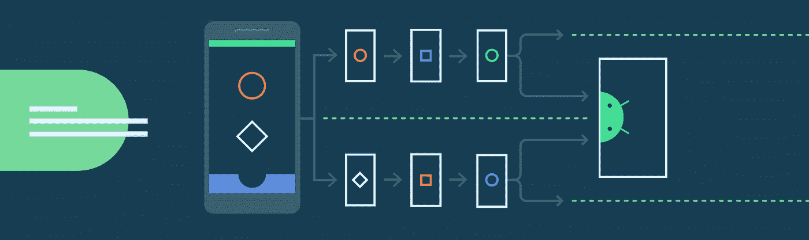

# 现在在 Android #33 中

> 原文：<https://medium.com/androiddevelopers/now-in-android-33-fc8ef716ccc4?source=collection_archive---------6----------------------->

Illustration by [Virginia Poltrack](https://twitter.com/VPoltrack)

## MAD Skills Kotlin+Jetpack 和 MotionLayout，AndroidX，Hilt 和 WorkManager 文章，MotionTags 截屏，以及 WindowManager 上的 ADB 播客

欢迎来到 Android 中的 Now，这是您对 Android 开发世界中新的和值得注意的事物的持续指导。

# 视频和播客形式的 NiA33

这个*现在在安卓*上也以视频和播客的形式提供。内容是一样的，但是需要的阅读量更少。文章版本(继续阅读！)仍然是链接到所有内容的地方。

# 录像

# 播客

点击下面的链接，或者在你最喜欢的客户端应用程序中订阅播客。疯狂的技能

 [## 现在在 Android 中:33 - Motion 布局，AndroidX，Hilt，WorkManager，等等！

### 欢迎回到 Android 中的现在，这是您对 Android 开发世界中新的和值得注意的事物的持续指导。在…

nowinandroid.googledevelopers.libsynpro.com](http://nowinandroid.googledevelopers.libsynpro.com/-33-motion-layout-androidx-hilt-workmanager-and-more) 

[MAD Skills](https://developer.android.com/series/mad-skills) 系列继续滚动，关于现代 Android 开发的技术内容。

## 科特林和喷气背包

关于使用 Kotlin 和 Jetpack APIs 的[系列从之前的 Android Now 开始结束，以一个](https://www.youtube.com/playlist?list=PLWz5rJ2EKKc98e0f5ZbsgB63MdjZTFgsy) [livestream Q & A](https://www.youtube.com/watch?v=d-GkmHE8G80&list=PLWz5rJ2EKKc98e0f5ZbsgB63MdjZTFgsy&index=6) 结束。感谢所有的问题(太多的问题让我们无法回答，即使我们跑了很长时间！)，并查看录音，看看发生了什么。

像往常一样，这个系列有一个总结博客，上面有该集视频和文章的所有链接，还有相关技术的链接:

 [## 疯狂技能科特林和喷气背包:总结

### 我们刚刚结束了另一系列疯狂技能视频和文章——这次是在 Kotlin 和 Jetpack 上。我们讨论了…

android-developers.googleblog.com](https://android-developers.googleblog.com/2021/01/mad-skills-kotlin-and-jetpack-wrap-up.html) 

## 运动布局

MADSkills 继续推出来自肖恩·麦克奎蓝[的](https://medium.com/u/83518fe480be?source=post_page-----fc8ef716ccc4--------------------------------)[新系列](https://www.youtube.com/playlist?list=PLWz5rJ2EKKc_PEOEHNBEyy6tPX1EgtUw2)的`MotionLayout` API 和运动编辑器工具，用于创建丰富的 UI 动画。`MotionLayout`提供了与 Android 的`Transition`API 相似的功能，但具有更大的灵活性和能力，支持更丰富的自定义动画。此外，还有一个令人惊叹的可视化编辑器，这使得创建复杂的动画更加容易。

**ConstraintSet 动画** 这个视频探索了如何使用`ConstraintSet`来定义 UI 在不同状态之间动画。同时， [Sean](https://medium.com/u/83518fe480be?source=post_page-----fc8ef716ccc4--------------------------------) 展示了如何在 Android Studio 中使用运动编辑器来创建和编辑这些过渡。

**关键帧
例如，您可以使用关键帧来更改对象在开始和结束之间的路径，而不是遵循默认的线性路径。**

**多重约束集** 在第三集中， [Sean](https://medium.com/u/83518fe480be?source=post_page-----fc8ef716ccc4--------------------------------) 展示了除了默认的两个(开始+结束)之外，如何添加`ConstraintSet`来创建更复杂的动画或在开始和结束之间流经多个状态的过渡。

《T4》系列还会有更多的剧集。请务必查看[播放列表](https://www.youtube.com/playlist?list=PLWz5rJ2EKKc_PEOEHNBEyy6tPX1EgtUw2)以了解全部内容。还可以查看一下[的运动标签播放列表](https://www.youtube.com/watch?v=o8c1RO3WgBA&list=PLWz5rJ2EKKc-bcyUTIFAr97ZtRkwM7S4y)(更多信息请见下文！)获取关于`MotionLayout` API 特定区域的截屏。

## 但是等等，还有呢！

对于正在进行的内容，一定要查看 YouTube 上的 [MAD 技能播放列表](https://www.youtube.com/playlist?list=PLWz5rJ2EKKc91i2QT8qfrfKgLNlJiG1z7)，Medium 上的[文章](https://medium.com/androiddevelopers/tagged/mad-skills)，或者指向所有内容的[这个方便的登陆页面](https://developer.android.com/series/mad-skills)。

# 安卓克斯

在各种 AndroidX 库的许多最新增量版本中，有以下重要的稳定版本:

自动填充 1.1.0 :这个版本引入了 API，支持 Android 11 中引入的一些新的内嵌建议功能。

[生物识别 1.1.0](https://developer.android.com/jetpack/androidx/releases/biometric#1.1.0) :该版本增加了支持 Android 11 生物识别认证能力的能力和 API。这个版本是一个实质性的重写，显著减少了库的应用大小，同时提供了各种其他改进和修复。

[Transition 1.4.0](https://developer.android.com/jetpack/androidx/releases/transition#1.4.0) :该版本为 AndroidX 过渡增加了 KTX(Android kot Lin 扩展库)API。

[WorkManager 2.5.0](https://developer.android.com/jetpack/androidx/releases/work#2.5.0) :这个版本为使用多个进程的应用添加了新的功能和新的`work-multiprocess`工件，同时支持最新版 Android Studio(北极狐)中的新 WorkManager 工具。要了解关于这个版本的更多信息，请查看下一节中链接的 WorkManager 文章。

# 文章和视频

## 手柄的视图模型组件

Manuel Vivo 的这篇新文章讨论了 Hilt 等级中的新`ViewModelComponent`。`ViewModelComponent`允许将类型的作用域限定在特定的`ViewModel`上，这与`ActivityRetainedComponent`相反，后者的作用域类型由所有的`ViewModel`共享

 [## 使用 Hilt 的视图模型组件

### ViewModelComponent 是 Hilt 的组件层次结构中的一个组件，它遵循 ViewModel 的生命周期，并且…

medium.com](/androiddevelopers/using-hilts-viewmodelcomponent-53b46515c4f4) 

## 工作管理器 2.5.0

[Ben Weiss](https://medium.com/u/65fe4f480b1c?source=post_page-----fc8ef716ccc4--------------------------------) 发表了一篇关于最近发布的 WorkManager 库 2.5.0 版本的文章。此版本支持在多进程应用程序中更轻松地使用 WorkManager，并提供了错误修复和一般性改进。

 [## 工作管理器 2.5.0 稳定版发布

### 新增功能以及您应该升级的原因

medium.com](/androiddevelopers/workmanager-2-5-0-stable-released-701b668cd064) 

## 运动标签

MotionTags 是一组[截屏视频](https://www.youtube.com/watch?v=o8c1RO3WgBA&list=PLWz5rJ2EKKc-bcyUTIFAr97ZtRkwM7S4y)，深入到`MotionLayout` API 的特定领域。该系列的最后两集最近发布了:

这一集基于早期的 KeyCycles 视频，展示了如何创建复杂的动画。

**KeyTrigger** 本系列的最后一集讲述了`KeyTrigger`，它可以用来帮助应用程序通过动画中的状态引起的回调来控制动画(“触发器”)。

# 播客剧集

自从上一期《现在》在安卓发布以来，又有一集[安卓开发者后台](http://androidbackstage.blogspot.com/)发布。点击下面的链接，或者在你最喜欢的播客客户端查看。

## ADB 155:窗口管理器管理器

为了让 Android 开发者在后台开始新的一年，我们采访了来自 WindowManager 团队的 Wale Ogunwale 和 Rob Carr。我们谈到了一些历史(和复杂性！)以及它最近的一些发展和特性。

 [## 第 155 集:WindowManagerManagers

### 在这一集里，我们和 Android 框架团队的 Wale Ogunwale 和 Rob Carr 聊聊窗口管理器。调谐…

androidbackstage.blogspot.com](http://androidbackstage.blogspot.com/2021/02/episode-155-windowmanagermanagers.html) 

# 那么现在…

这次到此为止。所以去 [MAD](https://www.youtube.com/c/AndroidDevelopers/playlists?view=50&sort=dd&shelf_id=1) 看更多 [Kotlin/Jetpack](https://www.youtube.com/playlist?list=PLWz5rJ2EKKc98e0f5ZbsgB63MdjZTFgsy) 和 [MotionLayout](https://www.youtube.com/playlist?list=PLWz5rJ2EKKc_PEOEHNBEyy6tPX1EgtUw2) 集吧！查看最新的 [AndroidX 稳定版本](https://developer.android.com/jetpack/androidx/versions/stable-channel)！阅读关于[手柄](/androiddevelopers/using-hilts-viewmodelcomponent-53b46515c4f4)和[工作管理器](/androiddevelopers/workmanager-2-5-0-stable-released-701b668cd064)的新文章，观看最新的[运动标签](https://www.youtube.com/watch?v=o8c1RO3WgBA&list=PLWz5rJ2EKKc-bcyUTIFAr97ZtRkwM7S4y)视频！收听最新的[亚行播客](http://androidbackstage.blogspot.com/)，并尽快回到这里收听来自 Android 开发者世界的下一次更新。