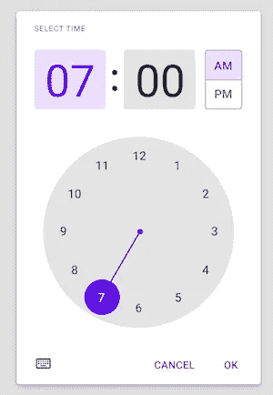

# 现在在 Android #34 中

> 原文：<https://medium.com/androiddevelopers/now-in-android-34-c8d2a017a119?source=collection_archive---------7----------------------->

Illustration by [Virginia Poltrack](https://twitter.com/VPoltrack)

## MAD Skills MotionLayout、Material Components、KSP、AndroidX、协程和意图文章、应用安全讨论以及应用质量和教育公告

欢迎来到 Android 中的 Now，这是您对 Android 开发世界中新的和值得注意的事物的持续指导。

# 视频和播客形式的 NiA34

这个*现在在 Android* 中也以视频和播客的形式提供。内容是一样的，但是需要的阅读量更少。文章版本(继续阅读！)仍然是链接到所有内容的地方。

## 录像

## 播客

点击下面的链接，或者在你最喜欢的客户端应用程序中订阅播客。

 [## 现在在 Android 中:34 材质组件，Kotlin 符号处理，AndroidX 更新，等等！

### 欢迎回到 Android 中的现在，这是您对 Android 开发世界中新的和值得注意的事物的持续指导。在…

nowinandroid.googledevelopers.libsynpro.com](http://nowinandroid.googledevelopers.libsynpro.com/34-material-components-kotlin-symbol-processing-androidx-updates-and-more) 

# 疯狂技能:动作布局

MotionLayout 上的[系列即将结束。在第四集，](https://youtube.com/playlist?list=PLWz5rJ2EKKc_PEOEHNBEyy6tPX1EgtUw2)[肖恩·麦克奎蓝](https://medium.com/u/83518fe480be?source=post_page-----c8d2a017a119--------------------------------)解释了如何使用 Motion Layout 构建一个可折叠的工具栏，这是这个 API 大放异彩的一个常见地方。在此过程中，您将学习如何使用 MotionLayout 制作自定义属性的动画。

最后一集，毫无疑问，是开发者关系和工程团队的运动布局专家的现场问答。如果你正在阅读这篇文章，请在它发生之前收听并提问。

如果你错过了之前的任何一集，一定要看看 [MotionLayout MAD Skills 系列播放列表](https://www.youtube.com/playlist?list=PLWz5rJ2EKKc_PEOEHNBEyy6tPX1EgtUw2)。

> *Psst…剧透预警，下一个 MAD 技能系列是关于 WorkManager 的！不要告诉任何人🤐*

# 库版本

## 材料设计组件

New MaterialTimePicker in material-components-android 1.3.0

`material-components-android`库在 stable 发布了 1.3.0 版本！它带有新的材料组件，如`[MaterialTimePicker](https://material.io/components/time-pickers/android#using-time-pickers)`和`[ProgressIndicator](https://material.io/components/progress-indicators/android#using-progress-indicators)`。其他更新包括国际化和本地化一些组件中的字符串，如[对话框](https://github.com/material-components/material-components-android/commit/cf3c091c7a9bac003650ad12c419682b1e9f0f9e)，以及公开 [BadgeUtils](https://github.com/material-components/material-components-android/blob/master/lib/java/com/google/android/material/badge/BadgeUtils.java) 类。

查看[发行说明](https://github.com/material-components/material-components-android/releases)中的所有变更。

## 科特林符号处理

Kotlin Symbol Processing (KSP)是一个用 Kotlin 构建轻量级编译器插件的工具，现在已经发布了 alpha 版本。如果你熟悉注释处理器，KSP 提供了与 KAPT 类似的功能，但它的速度快了两倍，而且是在考虑 Kotlin 多平台的情况下开发的。

如果您是使用注释处理的库的作者，请参阅博客文章，了解如何使您的库与 KSP 兼容。

 [## 宣布科特林符号处理(KSP)阿尔法

### 今天我们很兴奋地宣布科特林符号处理(KSP)的阿尔法，一个全新的工具，用于构建轻量级…

android-developers.googleblog.com](https://android-developers.googleblog.com/2021/02/announcing-kotlin-symbol-processing-ksp.html) 

## 安卓 X

在各种 AndroidX 库的许多最新增量版本中，有以下稳定版本:

[**Activity 1 . 2 . 0**](https://developer.android.com/jetpack/androidx/releases/activity#1.2.0):该版本标志着 Activity Result APIs 的首次稳定发布，为`startActivityForResult`和`requestPermissions`流程带来了类型安全和更简单的测试。此外，`ComponentActivity`实现了`ContextAware` API，在`super.onCreate`被调用之前给你一个钩子。

[**片段 1.3.0**](https://developer.android.com/jetpack/androidx/releases/fragment#1.3.0) :本版本改动很多！值得注意的是，它带来了一个新的状态管理器，这涉及到对`FragmentManager`的内部的重大[重写。它还增加了对 Activity 1.2.0 的支持，增加了新的片段结果 API，并从`fragment-testing`工件中显著改进了`FragmentScenario`。](/androiddevelopers/fragments-rebuilding-the-internals-61913f8bf48e)

[**生命周期 2.3.0**](https://developer.android.com/jetpack/androidx/releases/lifecycle#2.3.0) :这个版本增加了`SavedStateHandle`对不可打包类的支持，生命周期`State`和`Event`助手，以及其他细节，如`withStateAtLeast`暂停函数，当生命周期改变到给定的`State`时，这些函数执行一段代码。

除了稳定版之外， [**分页 3**](https://developer.android.com/jetpack/androidx/releases/paging#version_300_2) 达到了它的第一个测试版，这值得大声喊出来！在 Kotlin 中，分页 3 是一个巨大的重写，在基础层面上包含了协程。这些 API 已经达到 API 稳定性 [beta01](https://developer.android.com/jetpack/androidx/releases/paging#version_300_2) 。

# 文章和谈话

## 弥合协程、线程和并发问题之间的差距

我写这篇文章是为了揭开协程在 Android 运行时实际上是如何执行的。因为 Android 中的协同程序使用 Java 编程语言定义的线程模型，所以您需要注意代码中的并发问题。

 [## 弥合协程、JVM 线程和并发问题之间的差距

### 了解协程在 JVM 中实际上是如何执行的，它们与线程的关系，以及并发性问题…

medium.com](/androiddevelopers/bridging-the-gap-between-coroutines-jvm-threads-and-concurrency-problems-864e563bd7c) 

## 针对 Android 11 隐私变化调整您的应用

隐私仍然是 Android 的优先事项，因为保护用户的私人数据以及应用程序使用这些数据的透明度越来越重要。 [Fred Chung](https://medium.com/u/ac312b7e211e?source=post_page-----c8d2a017a119--------------------------------) 的演讲涵盖了一些面向用户的变化，但主要集中在开发人员身上:新的 API、行为变化和测试。它包括对权限的更改，如一次性权限选项、存储、包可见性、帮助识别私有数据访问的工具等。

## Android 嵌套意图

[妮可·博雷利](https://medium.com/u/2bbf49fa59bf?source=post_page-----c8d2a017a119--------------------------------)解释了为什么你的应用应该使用`PendingIntents`而不是`Intents`来实现应用间回调。剧透:不这样做可能会让你的应用程序易受攻击。

 [## Android 嵌套意图

### 你的应用程序是否提供了一个服务，当某个动作发生时，这个服务会以回调的形式启动另一个应用程序的活动？比如说…

medium.com](/androiddevelopers/android-nesting-intents-e472fafc1933) 

# 应用质量

应用程序质量对每个人都很重要。我们开发人员网站中的[新应用质量页面](https://developer.android.com/quality)帮助您了解应用质量的关键方面，并提供如何实现和保持高质量的相关资源。[核心应用质量清单](https://developer.android.com/docs/quality-guidelines/core-app-quality)将帮助您从视觉体验、功能、性能&稳定性、隐私&安全性和 Google Play 方面评估您的应用。一些开发人员发现与他们的设计和 QA 团队分享这一点有助于调整预期。

今后，我们将定期更新该列表，使其保持最新，并将其扩展到其他外形，如平板电脑和 WearOS。

 [## 符合用户期望的质量

### 自 10 多年前推出 Android 以来，平台和用户的期望都在增长。有…

android-developers.googleblog.com](https://android-developers.googleblog.com/2021/02/quality-to-match-with-your-users.html) 

# 教育

我们希望让更多的人可以使用 Android 开发！教育工作者可以在教室环境中教授 Android，这是一门用 Kotlin 开发 Android 的新课程。它包括许多材料，为您提供所需的一切，从讲座幻灯片到动手代码实验室。

对于喜欢在同龄人群体中学习的人来说， [Android Study Jams 程序](http://d.android.com/teach#for-facilitators-leading-a-community-group)现在对所有开发者开放。这些内容可以让一群人聚在一起，通过在线课程按照自己的进度学习 Android。

 [## 教育工作者教授 Android 应用程序开发的新课程

### 我们努力让所有人都可以访问 Android 开发内容，这样任何人都可以成为 Android 开发者。结束…

android-developers.googleblog.com](https://android-developers.googleblog.com/2021/02/new-curriculum-for-educators-to-teach-android-app-development.html) 

# 那么现在…

这次到此为止。所以去 [MAD](https://www.youtube.com/c/AndroidDevelopers/playlists?view=50&sort=dd&shelf_id=1) 了解更多 [MotionLayout 内容](https://youtube.com/playlist?list=PLWz5rJ2EKKc_PEOEHNBEyy6tPX1EgtUw2)！查看最新的 [KSP alpha](https://android-developers.googleblog.com/2021/02/announcing-kotlin-symbol-processing-ksp.html) 版本，以及[材料组件](https://github.com/material-components/material-components-android/releases)和 [AndroidX](https://developer.android.com/jetpack/androidx/versions/stable-channel) 稳定版本！阅读关于[协程](/androiddevelopers/bridging-the-gap-between-coroutines-jvm-threads-and-concurrency-problems-864e563bd7c)和[嵌套意图](/androiddevelopers/android-nesting-intents-e472fafc1933)的新文章，观看最新 [Android 11 隐私变化视频](https://youtu.be/vaD-DPI6sgU)。在 [App Quality](https://android-developers.googleblog.com/2021/02/quality-to-match-with-your-users.html) 、 [Education](https://android-developers.googleblog.com/2021/02/new-curriculum-for-educators-to-teach-android-app-development.html) 上查看新的资源，并很快回到这里关注 Android 开发者世界的下一次更新。