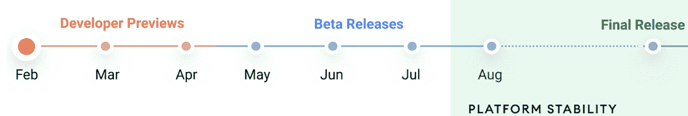
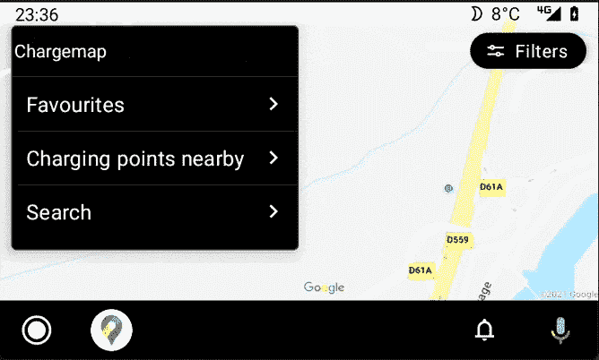

# 现在在 Android #35 中

> 原文：<https://medium.com/androiddevelopers/now-in-android-35-9f048dc4000a?source=collection_archive---------6----------------------->

Illustration by [Virginia Poltrack](https://twitter.com/VPoltrack)

## Jetpack Compose beta、#AndroidDevChallenge、Android 12、WorkManager、Android for Cars library、RecyclerView、Coroutines 和一个播客

欢迎来到 Android 中的 Now，这是您对 Android 开发世界中新的和值得注意的事物的持续指导。

# 视频和播客形式的 NiA35

这个*现在在 Android* 中也以视频和播客的形式提供。内容是一样的，但是需要的阅读量更少。文章版本(继续阅读！)仍然是链接到所有内容的地方。

# 录像

# 播客

点击下面的链接，或者在你最喜欢的客户端应用程序中订阅播客。

# Jetpack 撰写测试版

它在这里！终于来了！Jetpack Compose 的测试版！为了庆祝，我们制作了这个节目，包括概述、一些问答和演示，展示了我们为什么期待这个新世界:

Jetpack Compose 是 Android 的未来 UI 工具包，旨在更快更容易地构建原生 Android 应用程序。自从我们[在 2019 年](https://youtu.be/LoLqSbV1ELU?t=777)的 Google I/O 上宣布 Compose 以来，我们已经在开源库上工作了一段时间。就在去年八月，我们达到了 [alpha 里程碑，上周我们达到了 beta。](https://android-developers.googleblog.com/2020/08/announcing-jetpack-compose-alpha.html)

由于 beta 是一项重大成就(表明随着我们继续巩固产品，API 是稳定的)，我们发布了大量关于 Compose 的信息，以帮助您学习如何使用它，并准备在今年晚些时候我们推出 1.0 时在您的应用程序中采用它。

首先，看看这个博客，它有关于 Jetpack Compose 的各种信息的链接，以及关于学习更多信息的资源:

 [## 宣布 Jetpack 撰写测试版！

### 今天，我们发布了 Jetpack Compose 的测试版，这是我们新的 UI 工具包，旨在使它更快更容易地…

android-developers.googleblog.com](https://android-developers.googleblog.com/2021/02/announcing-jetpack-compose-beta.html) 

接下来，有一个完整的[系列视频和截屏](https://www.youtube.com/playlist?list=PLWz5rJ2EKKc98J4VE1glWGt5b90VfXZ1e)展示了如何使用 Jetpack Compose 的不同方面:

当然，你会想得到一些代码，所以一定要查看更新的[样本](https://github.com/android/compose-samples)以及新[学习途径](http://goo.gle/compose-pathway)中的 codelabs。

最后，前往我们的开发者网站[阅读最新更新的文档](https://developer.android.com/jetpack/compose/documentation)，其中包含关于如何开始使用 Jetpack Compose 的各种其他信息的链接。

# # Android dev challenge:Jetpack Compose

早在 2007 年，也就是 1.0 发布的前一年，Android [开始了它的开发者挑战](https://android-developers.googleblog.com/2007/11/posted-by-jason-chen-android-advocate.html)。因此，当 Android 开发世界中有新的、很酷的东西可以玩的时候，我们考虑其他挑战也就不足为奇了。

随着 Jetpack Compose 上周进入测试阶段(见上文！就在前面那部分！)，我们以为又到了挑战的时候了。这一次，每周有 4 次挑战，总共有 1000 个奖品，包括一个 Pixel 5。

第一个挑战，一个小狗领养 app，刚刚结束(抱歉！)，但第二个挑战才刚刚开始。这一次，[的任务是制造一个倒计时器](https://developer.android.com/dev-challenge#the-latest-challenge)。但是快点:时间不多了！

更多信息请参见[动员会博客](https://android-developers.googleblog.com/2021/02/android-dev-challenge-lift-off-with.html)、关于第二次挑战的[博客](https://android-developers.googleblog.com/2021/03/android-dev-challenge-2.html)和 [#AndroidDevChallenge 网站](https://developer.android.com/dev-challenge)。去写些代码吧！

# Android 12:开发者预览版 1

又到了一年中的这个时候——樱花已经开放，天气变得稍微暖和了一些，加州的雨水已经干涸，直到 11 月份，下一版本 Android 的第一个预览版本是 [**现在可用**](http://o) **！**

阅读[博客](https://android-developers.googleblog.com/2021/02/android-12-dp1.html)了解该版本的概述，从隐私和安全改进，到媒体代码转换和 AVIF 图像支持等图形功能。

此外，查看 [Android 12 预览网站](https://developer.android.com/about/versions/12)了解关于[行为变化](https://developer.android.com/about/versions/12/behavior-changes-all)、[新功能和 API](https://developer.android.com/about/versions/12/features)等更多细节。最重要的是:在新版本中试用你的应用程序，并向我们发送[反馈](https://developer.android.com/about/versions/12/feedback)你的任何问题；这就是提前发布这些预览的全部意义所在，这样我们就可以在发布最终产品的时候完善这些东西。

当然，这个版本只是我们迈向最终版本的第一步。期待更多的发布，包括越来越多的特性、修复和功能。

Watch for these upcoming releases as we worktoward the final release of Android 12

# 疯狂技能:工作管理器

[MAD Skills](https://developer.android.com/series/mad-skills) 系列继续滚动，关于现代 Android 开发的技术内容。

《疯狂技能》的[下一集也是最新一集](https://www.youtube.com/playlist?list=PLWz5rJ2EKKc_J88-h0PhCO_aV0HIAs9Qk)本周刚刚开播，本·韦斯[为大家介绍该系列:](https://medium.com/u/65fe4f480b1c?source=post_page-----9f048dc4000a--------------------------------)

[Ben Weiss](https://medium.com/u/65fe4f480b1c?source=post_page-----9f048dc4000a--------------------------------) introduces the series with a preview of upcoming WorkManager topics

**工作管理器基础知识** : [Caren Chang](https://medium.com/u/b6f9dc502595?source=post_page-----9f048dc4000a--------------------------------) 以这一集的工作管理器基础知识开始了技术内容。她演示了一个使用 WorkManager 模糊图像的示例。检查[工作管理器代码实验室](http://goo.gle/37UrVve%E2%80%8B)以查看代码。

[Caren Chang](https://medium.com/u/b6f9dc502595?source=post_page-----9f048dc4000a--------------------------------) starts off the series with this introduction to the basics of using WorkManager

## 但是等等，还有呢！

对于正在进行的内容，一定要查看 YouTube 上的[疯狂技能播放列表](https://www.youtube.com/playlist?list=PLWz5rJ2EKKc91i2QT8qfrfKgLNlJiG1z7)、Medium 上的[文章](https://medium.com/androiddevelopers/tagged/mad-skills)或指向所有内容的[这个方便的登陆页面](https://developer.android.com/series/mad-skills)。

# 用于汽车的 Android(X)

一个新的 API 刚刚出现: [Android for Cars 应用程序库](https://developer.android.com/jetpack/androidx/releases/car-app#1.0.0-beta01)。这个测试版库建立在早期闭源版本`com.google.android.libraries.car.app`的功能之上，但是现在它是开源的，可以在 AndroidX 中获得。

该 API 允许您开发在 Android Auto 上运行的导航、停车和充电应用程序，通过提供符合驾驶员注意力分散标准的模板和处理不同屏幕形状因素和输入差异等细节来简化开发。

阅读[博客](https://android-developers.googleblog.com/2021/03/android-auto-apps-powered-by-jetpack.html)，查看[指南](https://developer.android.com/training/cars/navigation)，使用[库](https://developer.android.com/jetpack/androidx/releases/car-app#1.0.0-beta01)，驱动全新的应用体验。

# 文章和文档

## RecyclerView 标题

在她的`RecyclerView`系列的最后一集中，[梅根·梅塔](https://medium.com/u/401951cd4c3e?source=post_page-----9f048dc4000a--------------------------------)展示了如何使用`ConcatAdapter`为你的`RecyclerView`实现标题。

 [## 在 RecyclerView 中使用标题

### 这是涵盖使用 RecyclerView 基础的系列文章的第四篇。如果你已经有了…

medium.com](/androiddevelopers/get-ahead-using-headers-in-recyclerview-2909a69b19) 

## 协程引导

多线程编程可能会很棘手，但重要的是要做好。对于 Kotlin 开发人员，我们推荐使用协程作为编写并发代码的一种更简单的方式。但是如果您是协程的新手，或者正在寻找如何正确有效地使用协程的建议，那么可以看看一个新的文档。

在[新指南](https://developer.android.com/kotlin/coroutines/coroutines-best-practices)中，我们收集了关于如何使用 Kotlin 协程进行开发的最佳实践。

# 播客剧集

自从上一期*Android*发布以来，又有几集 [Android 开发者后台](http://androidbackstage.blogspot.com/)发布。点击下面的链接，或者在你最喜欢的播客客户端查看它们。

## ADB 156: Android 运行时经典版(Dalvik)

我喜欢我们在亚洲开发银行的历史节目，在那里我们可以发现关于事情是如何以及为什么以这种方式完成的深刻、黑暗的秘密。这一次， [Tor](https://medium.com/u/8251a5f98c9d?source=post_page-----9f048dc4000a--------------------------------) ， [Romain](https://medium.com/u/c967b7e51f8b?source=post_page-----9f048dc4000a--------------------------------) ，我和丹·博恩施泰因进行了交谈，他是早在 1.0 之前 Android 团队的早期工程师之一。Dan 创建了 Dalvik 运行时，也就是今天的 Android 运行时(ART)的前身。我们讨论了 Dalvik 中的一些设计决策，以及涉及运行时、垃圾收集器和性能的各种技术。

 [## 第 156 集:安卓运行时经典(达尔维克)

### 历史时刻到了！甚至【前】艺术史时间！这一次，托尔，罗曼和切特加入了丹博恩施泰因，一…

androidbackstage.blogspot.com](http://androidbackstage.blogspot.com/2021/02/episode-156-android-runtime-classic.html) 

## ADB 157:音频反馈

我们想听听你的意见！这一次 [Tor Norbye](https://medium.com/u/8251a5f98c9d?source=post_page-----9f048dc4000a--------------------------------) ， [Romain Guy](https://medium.com/u/c967b7e51f8b?source=post_page-----9f048dc4000a--------------------------------) 和我谈论我们可以做什么——或者不做什么——来改善 Android 开发者的后台。

 [## 第 157 集:音频反馈

### 我们想听听你的意见！在这一集里，Tor、Romain 和 Chet 谈论了他们可以做或不做什么来改善…

androidbackstage.blogspot.com](http://androidbackstage.blogspot.com/2021/03/episode-157-audio-feedback.html) 

请务必填写[调查](https://docs.google.com/forms/d/e/1FAIpQLSe11_h563j07Mbuto15YOar2JAmHdst1Iyb5v8y7bZ8Ty0vRg/viewform)，让我们知道您的想法！

# 那么现在…

这次到此为止。所以去看一下 [Jetpack Compose Beta show](https://youtu.be/vRjJAWh6JPE) 和[阅读一下](https://android-developers.googleblog.com/2021/02/announcing-jetpack-compose-beta.html)我们分享的所有新内容和代码吧！在 [#AndroidDevChallenge](https://android-developers.googleblog.com/2021/02/android-dev-challenge-lift-off-with.html) 中挑战自己！[阅读关于](https://android-developers.googleblog.com/2021/02/android-12-dp1.html)的内容，玩玩 Android 12 的第一个[开发者预览版！上一期](https://developer.android.com/about/versions/12) [MAD 技能系列](https://www.youtube.com/playlist?list=PLWz5rJ2EKKc_J88-h0PhCO_aV0HIAs9Qk)中关于 WorkManager 的信息去 MAD。查看新的 [Android for Cars](https://android-developers.googleblog.com/2021/03/android-auto-apps-powered-by-jetpack.html) 应用程序库！阅读 recycle view 容器中的[头文件和协程的](/androiddevelopers/get-ahead-using-headers-in-recyclerview-2909a69b19)[最佳实践](https://developer.android.com/kotlin/coroutines/coroutines-best-practices)！请收听最新的 [ADB 播客](http://androidbackstage.blogspot.com/)，并尽快回到这里收听来自 Android 开发者世界的下一次更新。

The End.