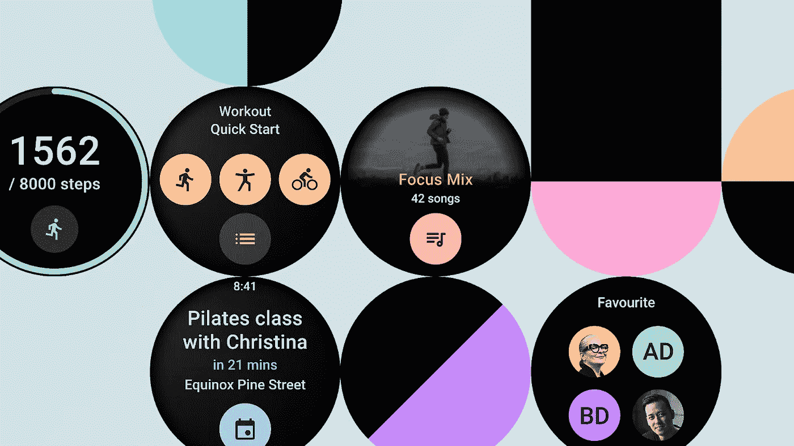
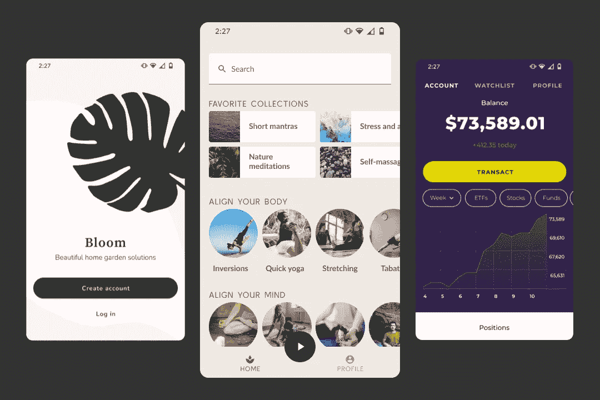

# 现在在 Android #36 中

> 原文：<https://medium.com/androiddevelopers/now-in-android-36-a9d511d2770f?source=collection_archive---------5----------------------->

Illustration by [Virginia Poltrack](https://twitter.com/VPoltrack)

## MAD Skills WorkManager、AndroidX、Audio、UX、Wear OS Tiles、Jetpack Compose、协程、#AndroidDevChallenge 和一个播客

欢迎来到 Android 中的 Now，这是您对 Android 开发世界中新的和值得注意的事物的持续指导。

# 视频和播客形式的 NiA36

这个*现在在 Android* 中也以视频和播客的形式提供。内容是一样的，但是需要的阅读量更少。文章版本(继续阅读！)仍然是链接到所有内容的地方。

# 播客

点击下面的链接，或者在你最喜欢的客户端应用程序中订阅播客。

 [## 现在在 Android 中:36 - MAD 技能 WorkManager，AndroidX，#AndroidDevChallenge，等等！

### 欢迎回到 Android 中的现在，这是您对 Android 开发世界中新的和值得注意的事物的持续指导。在…

nowinandroid.googledevelopers.libsynpro.com](http://nowinandroid.googledevelopers.libsynpro.com/36-mad-skills-workmanager-androidx-androiddevchallenge-and-more) 

# 疯狂技能:工作管理器

关于工作管理器的[系列继续播出两集！](https://www.youtube.com/playlist?list=PLWz5rJ2EKKc_J88-h0PhCO_aV0HIAs9Qk)

**在后台工作**:如果在 Android 应用中有什么事情是你不应该做的，那就是阻塞 UI 线程。在这一集里， [Ben Weiss](https://medium.com/u/65fe4f480b1c?source=post_page-----a9d511d2770f--------------------------------) 讲述了如何使用 WorkManager 执行后台工作，涵盖了不同的可能方法。您在 WorkManager 中使用的 API 取决于您是使用 Executors、coroutines 还是 RxJava。这一集还讲述了当工作完成时如何返回一个结果。此外，本表演了迄今为止我在 MAD 视频中看到的最好的“*让我们开始*”演绎。

[Ben Weiss](https://medium.com/u/65fe4f480b1c?source=post_page-----a9d511d2770f--------------------------------) talks about the different WorkManager APIs to perform background work

**高级配置&测试**:Ben 还解释了如何定制 WorkManager 的初始化，支持跨多个进程的应用，测试工人，并分享了一些有用的调试技术。

[Ben Weiss](https://medium.com/u/65fe4f480b1c?source=post_page-----a9d511d2770f--------------------------------) explains how to customize the initialization of WorkManager, and test Worker instances

# AndroidX 释放

这次大多数 AndroidX 版本都是关于错误修复的！这是个好消息！你发现我们图书馆的问题，我们会解决。赢了赢了。

你知道我，我在剑柄上工作…我不能移动到另一个部分而不提及 [**剑柄**](https://developer.android.com/training/dependency-injection/hilt-android) **被** [**提升为 Beta**](https://github.com/google/dagger/releases/tag/dagger-2.33) ！所有支持视图模型、工作管理器和导航的 Hilt APIs 和 AndroidX 特定 API 都是稳定的。你可能已经知道了，但是 Hilt 是 Jetpack 推荐的 Android 中依赖注入的解决方案。作为其中的一部分，我们发布了一个[备忘单](https://developer.android.com/training/dependency-injection/hilt-cheatsheet)来快速查看*不同的刀柄和匕首注释做什么以及*如何使用它们。**

与此同时，如果您开始使用 Jetpack Compose 和导航组件，该团队刚刚发布了一个名为`[hilt-navigation-compose](https://developer.android.com/jetpack/compose/libraries#hilt-navigation)`的新库，用于检索 Hilt 提供的视图模型，这些视图模型的范围是使用 Navigation Compose 创建的导航图的目的地。在文档中阅读关于此[的更多信息。](https://developer.android.com/jetpack/compose/libraries#hilt-navigation)

# 文章、文档和视频

## Android 音频延迟的更新

[Don Turner](https://medium.com/u/7f5a2cb6598e?source=post_page-----a9d511d2770f--------------------------------) 报道了 Android 音频延迟的改进，以及这对实时音频应用的影响。这篇文章着眼于生态系统中的变化，未来的计划以及如何开始使用[双簧管库](https://github.com/google/oboe/blob/master/docs/GettingStarted.md)构建低延迟音频应用。

 [## Android 音频延迟的更新

### 本文介绍了 Android 生态系统中音频开发人员最近的变化，音频延迟…

android-developers.googleblog.com](https://android-developers.googleblog.com/2021/03/an-update-on-androids-audio-latency.html) 

## 作曲预告 UX 之旅

Jetpack Compose 的开发始终以用户为中心。主要用户是你，我们敬爱的开发者朋友。Preethi Srinivas 和 [Paris Hsu](https://medium.com/u/8fd06789585?source=post_page-----a9d511d2770f--------------------------------) 介绍了 Android Studio 中的撰写预览功能是如何设计的，以及不同的 UX 研究如何影响其设计和功能。

 [## 作曲预告 UX 之旅

### 以下帖子由 Preethi Srinivas (UX 研究员)和 Paris Hsu(交互设计师)在 Android 平台上撰写

medium.com](/androiddevelopers/a-ux-journey-of-compose-preview-3c95e1f0a8bf) 

## 宣布磨损操作系统瓷砖阿尔法

穿戴操作系统磁贴正在被彻底改造！还有一个新的 [Jetpack 磁贴库](https://developer.android.com/training/articles/wear-tiles)，仍然在 alpha 中，允许你创建自定义磁贴——无需打开应用程序就可以轻松访问 Wear OS 中的信息和操作。这些将在未来的 Wear 操作系统平台更新中提供给用户。使用这个库允许您现在就开始原型制作。

 [## 使用 Jetpack Tiles 库在 Wear OS 上创建自定义 Tiles

### 我们在 2019 年推出了磁贴，从那时起，磁贴已经成为 Wear OS 上最有帮助和有用的功能之一

android-developers.googleblog.com](https://android-developers.googleblog.com/2021/03/creating-custom-tiles-on-wear-os-by-google-with-jetpack-tiles.html) 

## 用于 Jetpack 编写的 API 指南

Jetpack Compose 团队刚刚发布了 API 指南。编写习惯性 Jetpack Compose APIs 的模式、最佳实践和风格指南。如果您只是想了解更多关于 Compose APIs 背后的想法，请查看本指南，以帮助您编写习惯性的 Compose 代码。

## Android 代码:协程

Caren Chang 和我一起参加了一个现场会议，解释如何在 Android 上使用协程。我们浏览了[协程文档](https://developer.android.com/kotlin/coroutines)和[基础代码实验室](https://developer.android.com/codelabs/kotlin-coroutines#0)，同时回答了来自实时聊天的问题。

如果你想学习协程，打开 Android Studio，和我们一起在这个视频中编码吧！

# Android 开发挑战

随着 Jetpack Compose 在几周前进行测试，我们开始了一项开发者挑战，在第一周用小狗收养应用程序淹没了互联网，并在第二周倒计时！现在，在第三周，是时候为最快的手指进行[挑战了！](https://android-developers.googleblog.com/2021/03/android-dev-challenge-3.html)

考虑到不同的时区，Android 开发人员面临的挑战是尽快实现模拟设计，以赢得 Pixel 5！

Design mocks for the 3rd week of the Compose Android Dev Challenge

如果您没有时间参加，不要担心。你仍然可以利用这些挑战来尝试按照自己的节奏作曲。但是如果你需要额外的动力，3 月 17 日 [#AndroidDevChallenge](https://developer.android.com/dev-challenge) 大结局就要开始了。不要错过！

# 播客剧集

自从上一集*在 Android* 发布以来，又有一集 [Android 开发者后台](http://androidbackstage.blogspot.com/)发布。点击下面的链接，或者在你最喜欢的播客客户端查看。

## ADB 158: Jetpack Compose…这是 bêta！

[切特·哈斯](https://medium.com/u/cb2c4874d3e9?source=post_page-----a9d511d2770f--------------------------------)、[罗曼·盖伊](https://medium.com/u/c967b7e51f8b?source=post_page-----a9d511d2770f--------------------------------)和[托尔·诺布耶](https://medium.com/u/8251a5f98c9d?source=post_page-----a9d511d2770f--------------------------------)会见 4！Jetpack Compose 团队的成员: [Nick Butcher](https://medium.com/u/22c02a30ae04?source=post_page-----a9d511d2770f--------------------------------) 、 [Clara Bayarri](https://medium.com/u/7beec7f7997b?source=post_page-----a9d511d2770f--------------------------------) 、 [Leland Richardson](https://medium.com/u/41a8b1601c59?source=post_page-----a9d511d2770f--------------------------------) 和 [Adam Powell](https://medium.com/u/c2c230ec8638?source=post_page-----a9d511d2770f--------------------------------) 讨论“Compose is in Beta”的含义，以及 Jetpack 提供的一些功能，如协同程序、材质设计实现和 ConstraintLayout。

 [## 第 158 集:喷气背包作曲...太棒了！

### 这一次，Tor、Romain 和 Chet 与 Jetpack Compose 团队的几个人聊了聊...Jetpack 撰写…

androidbackstage.blogspot.com](http://androidbackstage.blogspot.com/2021/03/episode-158-jetpack-compose-beta.html) 

# 安卓开发者关系正在招聘

在 Android 开发者关系团队中，我们的使命是帮助人们构建优秀的应用。你想加入我们的团队吗？我们在世界各地有一些你可能感兴趣的空缺职位。如果你不确定我们的团队是做什么的，请阅读 [Jacob Lehrbaum](https://medium.com/u/88221b3b3cc1?source=post_page-----a9d511d2770f--------------------------------) 的博客文章，了解更多相关信息和我们空缺职位的描述。

 [## 安卓开发者关系正在招聘

### 帮助我们培养下一代开发人员

medium.com](/androiddevelopers/android-developer-relations-is-hiring-28eaa41e902a) 

# 那么现在…

这次到此为止。疯狂寻找上一期[疯狂技能系列](https://www.youtube.com/playlist?list=PLWz5rJ2EKKc_J88-h0PhCO_aV0HIAs9Qk)中关于 WorkManager 的信息！阅读关于[音频延迟](https://android-developers.googleblog.com/2021/03/an-update-on-androids-audio-latency.html)、 [Compose 预览 UX 之旅](/androiddevelopers/a-ux-journey-of-compose-preview-3c95e1f0a8bf)、[我们的团队雇佣](/androiddevelopers/android-developer-relations-is-hiring-28eaa41e902a)、新 [Wear OS Tiles 库](https://android-developers.googleblog.com/2021/03/creating-custom-tiles-on-wear-os-by-google-with-jetpack-tiles.html)以及 Jetpack Compose 的 [API 指南](https://github.com/androidx/androidx/blob/androidx-main/compose/docs/compose-api-guidelines.md)的文章！观看关于协程程序的 [Android 代码演示集](https://youtu.be/FWxeDqM_WIU)！用 [#AndroidDevChallenge](https://android-developers.googleblog.com/2021/03/android-dev-challenge-3.html) 编写一些代码！听最新的[亚行播客](http://androidbackstage.blogspot.com/)！加入我们的开发团队！请尽快回到这里，收听 Android 开发者世界的下一次更新。

The End.