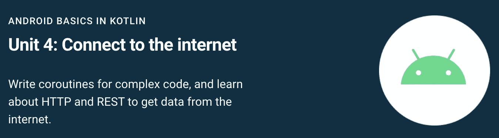
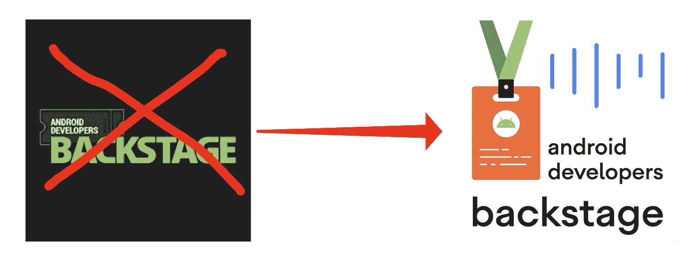

# 现在在 Android #37 中

> 原文：<https://medium.com/androiddevelopers/now-in-android-37-ea1a435b4967?source=collection_archive---------7----------------------->

Illustration by [Virginia Poltrack](https://twitter.com/VPoltrack)

## Android 12、MAD Skills WorkManager、AndroidX、文章、培训和 ADB 播客

欢迎来到 Android 中的 Now，这是您对 Android 开发世界中新的和值得注意的事物的持续指导。

# 视频和播客形式的 NiA37

这个*现在在 Android* 中也以视频和播客的形式提供。内容是一样的，但是需要的阅读量更少。文章版本(继续阅读！)仍然是链接到所有内容的地方。

# 播客

点击下面的链接，或者在你最喜欢的客户端应用程序中订阅播客。

# Android 12:开发者预览版 2

Android 12 的第二个开发者预览版[现已推出](https://android-developers.googleblog.com/2021/03/android-12-developer-preview-2.html)。

阅读[博客](https://android-developers.googleblog.com/2021/03/android-12-developer-preview-2.html)了解开发者版本的概述，从画中画的改进，到新的 [RenderEffect API](https://developer.android.com/reference/android/graphics/RenderEffect) 实现简单而强大的图形效果，如模糊和颜色过滤器。

与此同时，我们在几个方面改进了这些预览版的开发人员文档:

*   **摘要**:为了帮助识别与你的应用最相关的特性和变化，我们添加了一个[摘要表格](https://developer.android.com/about/versions/12/summary)。您可以根据类别进行过滤，如媒体或隐私，以及更改是影响所有应用程序还是仅影响具有特定目标 API 级别的应用程序。
*   **前台服务**:前台服务启动限制是 Android 12 中的行为变化之一。除了少数例外，它会影响从后台启动前台服务的应用程序(目标 API 级别> = S)。作为对您反馈的回应，我们添加了[额外的细节说明和指南](https://developer.android.com/about/versions/12/foreground-services)，例如电池优化和例外情况。

查看 [Android 12 预览网站](https://developer.android.com/about/versions/12)，了解关于[行为变化](https://developer.android.com/about/versions/12/behavior-changes-all)、[新功能和 API](https://developer.android.com/about/versions/12/features)等更多信息。最重要的是:在新版本中试用你的应用程序，并向我们发送[反馈](https://developer.android.com/about/versions/12/feedback)你的任何问题；这就是提前发布这些预览的全部意义所在，这样我们就可以在发布最终产品的时候完善这些东西。

随着我们继续向最终版本迈进，更多的特性、修复和功能将会增加，敬请关注更多的版本。毫无疑问。

# 疯狂技能:工作管理器

[MAD Skills](https://developer.android.com/series/mad-skills) 系列继续滚动，关于现代 Android 开发的技术内容。MAD Skills 中的[工作管理器系列](https://www.youtube.com/playlist?list=PLWz5rJ2EKKc_J88-h0PhCO_aV0HIAs9Qk)本周即将结束，但首先还有更多内容要查看:

**Firebase job dispatcher 和 GCMNetworkManager** :
你还是 Firebase `JobDispatcher`还是`GCMNetworkManager`API？如果是这样，那么你应该…不，因为这两个都被否决了，是时候继续前进了。工作经理来帮忙了！

在这一集里， [Caren Chang](https://medium.com/u/b6f9dc502595?source=post_page-----ea1a435b4967--------------------------------) 展示了如何迁移你的代码来使用 WorkManager。除了下面的视频，请务必查看从 [Firebase JobDispatcher](https://developer.android.com/topic/libraries/architecture/workmanager/migrating-fb) 和 [GCMNetworkManager](https://developer.android.com/topic/libraries/architecture/workmanager/migrating-gcm) 迁移的指南。

**社区提示** :
他还分享了他们在一些设备上发现的问题如何导致他们提交了一个 bug，该 bug 现已在最新版本的 WorkManager 中得到修复(反馈很有帮助！)

工作管理器系列的最后一集，我们将再次与工作管理器专家进行现场直播。周四上午(太平洋时间)，和我(提问)，以及[Ben Weiss](https://medium.com/u/65fe4f480b1c?source=post_page-----ea1a435b4967--------------------------------)&[Caren Chang](https://medium.com/u/b6f9dc502595?source=post_page-----ea1a435b4967--------------------------------)(本系列的主持人)和[Sumir Kataria](https://twitter.com/SumirKodes)&[Rahul Ravikumar](https://medium.com/u/d16f91f488af?source=post_page-----ea1a435b4967--------------------------------)(工作经理背后的工程师)一起，我们将尝试回答您关于这个 API 的所有问题。

我知道你很有可能正在读这篇文章，因为问题已经发生了。不要担心:你仍然可以通过下面的链接查看录音，看看发生了什么。

## 但是等等，还有呢！

对于正在进行的内容，一定要查看 YouTube 上的[疯狂技能播放列表](https://www.youtube.com/playlist?list=PLWz5rJ2EKKc91i2QT8qfrfKgLNlJiG1z7)、Medium 上的[文章](https://medium.com/androiddevelopers/tagged/mad-skills)或指向所有内容的[这个方便的登陆页面](https://developer.android.com/series/mad-skills)。

# 安卓克斯

我们最近发布了几个[稳定的](https://developer.android.com/jetpack/androidx/versions/stable-channel) AndroidX bugfix 版本，包括[片段 1.3.2](https://developer.android.com/jetpack/androidx/releases/fragment#1.3.2) 、[活动 1.2.2](https://developer.android.com/jetpack/androidx/releases/activity#1.2.2) 和[生命周期 2.3.1](https://developer.android.com/jetpack/androidx/releases/lifecycle#2.3.1) 。

还有几个有趣的新库刚刚发布了他们的第一个 [alpha](https://developer.android.com/jetpack/androidx/versions/alpha-channel) 版本，包括:

*   [sliding panel layout 1 . 2 . 0-alpha 01](https://developer.android.com/jetpack/androidx/releases/slidingpanelayout#1.2.0-alpha01):该版本提供可折叠设备支持，自动调整两个窗格的大小，使其位于设备折叠的任意一侧。还发布了关于[创建双窗格布局](https://developer.android.com/guide/topics/ui/layout/twopane)的新文档，介绍了将`SlidingPaneLayout`集成到您的应用程序所需的步骤。
*   [App 启动库](https://developer.android.com/jetpack/androidx/releases/startup)现在被[工作管理器 2.6.0](https://developer.android.com/jetpack/androidx/releases/work#2.6.0-alpha01) 和[生命周期 2.4.0](https://developer.android.com/jetpack/androidx/releases/lifecycle#2.4.0-alpha01) 使用。去年 12 月，我在两篇文章([第一部分](/androiddevelopers/app-startup-part-1-34f57b65cacd)、[第二部分](/androiddevelopers/app-startup-part-2-c431e80d0df))中讨论了应用启动库。使用应用程序启动而不是经典的`ContentProvider`方法来预加载库的优点是，库可以被延迟加载，只在必要时而不是每次应用程序启动时产生初始化成本。此外，应用程序启动允许您只使用一个`ContentProvider`(加载应用程序启动本身)来加载多个库，跳过为每个单独的库提供单独的提供者的开销。
*   生命周期 2.4.0-alpha01 :说到生命周期，这个版本为 lifecycle-runtime-ktx 工件添加了新的 API，用于从您的 UI 收集 Kotlin 协同程序流。 [Manuel Vivo](https://medium.com/u/3b5622dd813c?source=post_page-----ea1a435b4967--------------------------------) 在他的[新博客](/androiddevelopers/a-safer-way-to-collect-flows-from-android-uis-23080b1f8bda)中详细介绍了一种更安全的收集流量的方法。

# 文章

## 忠告

Oboe 是一个本地库，用于在 Android 版本和设备上实现高性能、低延迟的音频。我们[去年四月在 ADB 播客上与双簧管工程师](http://adbackstage.libsyn.com/episode-135-audio-podcast)交谈过，现在双簧管已经被整合到[游戏 SDK](https://developer.android.com/games/sdk#download) 中。 [Daniel Galpin](https://medium.com/u/2e0fc9a4a8c2?source=post_page-----ea1a435b4967--------------------------------) 在 Android 开发者博客上发表了一篇文章，详细介绍了如何将它添加到您的项目中，并开始在您的代码中使用它。

 [## 带双簧管的高性能游戏音频

### 我们已经在 Android 游戏 SDK 中添加了 Oboe C++音频库。Oboe 对高性能、低延迟音频的支持…

android-developers.googleblog.com](https://android-developers.googleblog.com/2021/03/high-performance-game-audio-with-oboe.html) 

## 跟上潮流

[Manuel Vivo](https://medium.com/u/3b5622dd813c?source=post_page-----ea1a435b4967--------------------------------) 写了一篇文章介绍了 [Lifecycle 2.4.0-alpha01](https://developer.android.com/jetpack/androidx/releases/lifecycle#2.4.0-alpha01) 中的新 API，这些 API 允许从 UI 层进行更安全的 [Kotlin 流](https://developer.android.com/kotlin/flow)收集。

 [## 从 Android 用户界面收集流量的更安全方式

### 了解 addRepeatingJob API 如何防止您浪费资源，以及为什么它是流收集的一个很好的默认设置…

medium.com](/androiddevelopers/a-safer-way-to-collect-flows-from-android-uis-23080b1f8bda) 

## 关于待定意向的所有信息

[妮可·博雷利](https://medium.com/u/2bbf49fa59bf?source=post_page-----ea1a435b4967--------------------------------)发表了一篇关于如何以及何时正确使用`PendingIntent` s 的文章。这个主题很及时，下一个版本中安全驱动的变化要求针对 Android 12 的应用程序声明`PendingIntent` s 的可变性

 [## 关于未决事件的一切

### 待定内容是 Android 框架的重要组成部分，但大多数可用的开发人员资源都集中在…

medium.com](/androiddevelopers/all-about-pendingintents-748c8eb8619) 

# 培养

Come for Unit 4\. Stay for the whole course!

[Kotlin](https://developer.android.com/courses/android-basics-kotlin/course)中的 Android 基础知识，这是一门为希望学习 Android 开发基础知识同时也学习 kot Lin 编程的人开设的课程，刚刚发布了[Unit 4:Connect to the Internet](https://developer.android.com/courses/android-basics-kotlin/unit-4)。这个新内容将让你用 Kotlin 协同程序编码，并学习如何使用重要的库，如 Retrofit 和 Coil 来处理网络数据。

# 播客角

*ADB is dead. [on Blogger]
Long live ADB! [on Libsyn]*

Android 开发者后台现在有了一个新的站点，一个新的 feed，和一个漂亮的新 logo！

这一变化不应影响目前的亚行订户；订阅源会重定向，因此您不必重新订阅。但是如果你在寻找未来剧集的笔记，可以在 adbackstage.libsyn.com 的 Libsyn 上查看。

## ADB 159:克里斯·莱西访谈

发布到新网站和 feed 的第一集是我们对长期独立 Android 应用程序开发人员克里斯·莱西的采访。 [Romain](https://medium.com/u/c967b7e51f8b?source=post_page-----ea1a435b4967--------------------------------) 我和 Chris 谈论了他如何实现他的一些应用，以及他在这个过程中学到的一些关于 Android 编程和 API 的东西。

# 那么现在…

这次到此为止。所以去了解一下 [Android 12 DP2](https://android-developers.googleblog.com/2021/03/android-12-developer-preview-2.html) 的最新功能吧！观看 [WorkManager MADSkills 系列](https://www.youtube.com/playlist?list=PLWz5rJ2EKKc_J88-h0PhCO_aV0HIAs9Qk)的最新剧集！玩最新的 [AndroidX 库发布](https://developer.android.com/jetpack/androidx/versions/all-channel)！阅读关于[双簧管](https://android-developers.googleblog.com/2021/03/high-performance-game-audio-with-oboe.html)、[科特林流](/androiddevelopers/a-safer-way-to-collect-flows-from-android-uis-23080b1f8bda)和[待定意向](/androiddevelopers/all-about-pendingintents-748c8eb8619)的文章！参加 Kotlin 课程中 [Android 基础知识的最新单元！请收听最新的](https://developer.android.com/courses/android-basics-kotlin/course) [ADB 播客](http://adbackstage.libsyn.com/)，并尽快回到这里收听来自 Android 开发者世界的下一次更新。