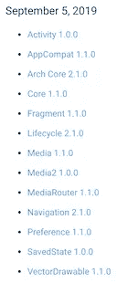
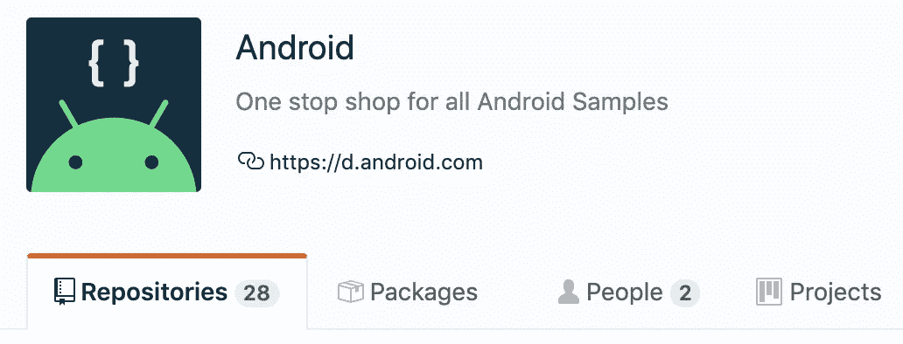
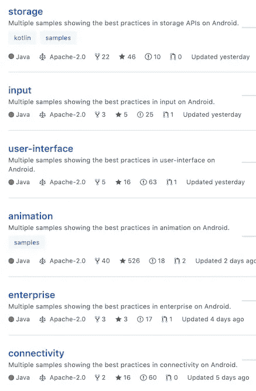

# 现在在 Android #4 中

> 原文：<https://medium.com/androiddevelopers/now-in-android-4-23b0d6cdea40?source=collection_archive---------1----------------------->


Exciting new, shiny Now in Android series illustration by [Virginia Poltrack](https://twitter.com/VPoltrack)

## Android 10，AndroidX 稳定库，codelabs 和样例，视图绑定。这几周很忙。

# 安卓把它调到 10


一方面，发布预览版很棒，因为我们可以获得关于 API 和特性的重要反馈，并且可以在发布最终版本之前改进事情。

另一方面，预览版让操作系统的实际发布变得不那么令人兴奋，因为每个人都已经知道里面有什么了。这就像在你面前打开别人包好的礼物；没有太多惊喜。

但有一种满足感，知道事情已经完成，我们可以真正依赖所有的 API，并根据它构建我们的应用程序，还有一个额外的优势是可以获得源代码。当然，现在用户将开始获得并使用这个版本。

Android 10 上周发布了——[开源](https://source.android.com/)、[开发者下载](https://developer.android.com/about/versions/10/get)等等——我们一直在努力的所有功能的最终版本:手势导航、隐私功能、直播字幕、通知中的智能回复、黑暗主题、艺术优化等等！查看 [Android 开发者博客文章](https://android-developers.googleblog.com/2019/09/welcoming-android-10.html)中的概述，或者直接进入[开发者网站](https://developer.android.com/about/versions/10/)获取扩展文档和下载。

# 充满马厩的马厩



New AndroidX stable versions. Lots of

大量的 AndroidX 库刚刚稳定下来，包括许多基础模块以及一些架构组件和媒体库。看看左边⬅︎.的那个长长的列表

# 安卓版本，分类！


我最喜欢的 AndroidX 版本页面最近变得更有用了。对于那些只关心稳定版本的人(或者那些只想知道最新版本的人)，顶部有一些链接可以为你过滤信息。例如，如果你想知道上面提到的过多的稳定库，只需点击页面右上角的[稳定](https://developer.android.com/jetpack/androidx/versions/stable-channel)链接，你就会看到一个列表，就像上一篇关于稳定版本的文章中的列表一样。

# 大样本迁移



O 组织代码有点像组织一个家庭:开始时一切都有一个合理的位置，几年后黄油碟在车库的架子上，订书机在糖碗旁边，节日装饰品全年都在，因为它们不再有地方住了。

我们的 Android 样本有点像那个家庭；当我们开始的时候，组织不是很重要，但是在几百个项目之后，事情变得有点混乱。



Jeremy Walker 对我们的 Android 样本进行了大规模清理。现在你应该能在一个地方找到它们，github.com/android。更好的是，他们现在被组织成 17 个团体回购，以便更容易找到相关领域的样本。此外，新系统允许我们接受 pull 请求，如果您想要贡献修复(旧系统，由于历史原因和不太有趣的原因，不接受修复，因为外部版本是内部版本的下游)。

迁移项目还没有完全完成，但是到目前为止我们已经迁移了 136 个中的 127 个；其余的将在未来几周内着陆。

详情请看杰里米的文章。

# Java 友好的 Kotlin 代码实验室

Kotlin 如此受 Android 开发人员欢迎的原因之一(除了它是一种很好的语言这一部分)是它与 Java 编程语言的良好互操作性。毕竟，大多数 Android 开发人员都有现成的代码库，Android SDK 是一组 Java APIs，所以语言之间的平滑集成非常重要。

但是在添加 Kotlin 代码时需要注意一些事情，这会使将来使用 Java 代码更加容易。这就是为什么[妮可·博雷利](https://medium.com/u/2bbf49fa59bf?source=post_page-----23b0d6cdea40--------------------------------)最近发布了[代码实验室](https://codelabs.developers.google.com/codelabs/java-friendly-kotlin)来帮助想要确保与 Java 代码流畅交互的 Kotlin 开发者。

# 视图绑定

程序员讨厌样板代码。在我们的一生中，我们只能键入有限数量的字符；为什么要把点击浪费在不必要的语法和表达式上呢？

Android 开发中困扰开发者的样板代码库之一是`findViewById()`。每当您想要引用层次结构中的视图时，您必须使用正确的视图 ID 并重复类型信息。

你最终会写出这样的东西:

```
**var** b: Button = findViewById(R.id.*button23*)
// or
**var** b = findViewById<Button>(R.id.*button23*)
// or even
**var** b = findViewById(R.id.*button23*) **as** Button
```

…这不是一大堆*代码，但是当你必须在任何地方对每个视图都这样做的时候，这就增加了。*

在库 [ButterKnife](https://jakewharton.github.io/butterknife/) 中可以找到一个解决这种冗长的流行方法，它允许您像这样注释变量:

```
[@BindView](http://twitter.com/BindView)(R.id.button23)
lateinit var button: Button
```

人们还使用数据绑定来[实现类似的效果](/androiddevelopers/no-more-findviewbyid-457457644885)，本质上是在与布局文件相关联的绑定对象中为视图创建一个变量。

回到谷歌 I/O 2019，我们谈到了杰克·沃顿正在研究的一种新机制，称为[视图绑定](https://developer.android.com/topic/libraries/view-binding)。视图绑定更接近于数据绑定，避免了 ButterKnife 的注释处理方法。用 Jake 的话说，“这是 findViewById 和完全数据绑定之间的中间地带。”

要使用视图绑定，首先需要在您的 gradle build 中启用它:

```
android {
    viewBinding.enabled = true
}
```

然后，在您的代码中，您可以获得一个对绑定对象的引用，并将视图作为该绑定对象上的字段来引用。这与数据绑定的工作方式类似，但是不需要专门的数据资源文件；您只需使用普通的 XML 布局文件。

自[Android Studio 3.6 Canary 11](https://androidstudio.googleblog.com/2019/09/android-studio-36-canary-11-available.html)起，视图绑定现已可用。你也可以在这里阅读更多关于视图绑定[的内容。](https://developer.android.com/topic/libraries/view-binding)

# 那么现在…

这次是为了什么。去下载 [Android 10](https://developer.android.com/about/versions/10/get) 的最终版本吧！玩最新的[稳定版](https://developer.android.com/jetpack/androidx/versions/stable-channel) AndroidX 库！查看 Github 上的[示例](https://github.com/android)并提交一个 pull 请求！乱搞[视图绑定](https://developer.android.com/topic/libraries/view-binding)和 [Android Studio 3.6 金丝雀](https://developer.android.com/studio/preview)构建！请尽快回到这里，收听 Android 开发者世界的下一次更新。