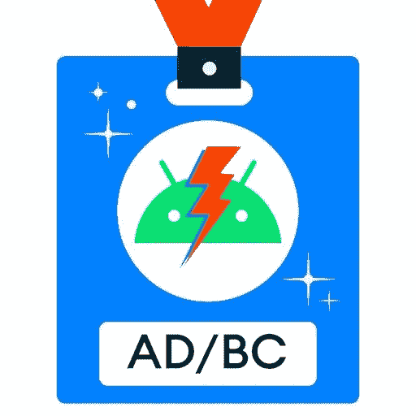

# 现在在 Android #40 中——特别谷歌输入/输出版

> 原文：<https://medium.com/androiddevelopers/now-in-android-40-special-google-i-o-edition-8dbbd3561b2b?source=collection_archive---------6----------------------->

Illustration by [Virginia Poltrack](https://twitter.com/VPoltrack)

## Jetpack、Android 12 和隐私、工具、Kotlin、大屏幕、Wear OS、Android TV、设备上的机器学习、测试、游戏开发和 Google Play！

欢迎来到 Android 中的 Now，这是您对 Android 开发世界中新的和值得注意的事物的持续指导。这一集由曼努埃尔·维沃和丹尼尔·高平为您带来。

如果你还没有看过，一定要看看[谷歌主题演讲](https://www.youtube.com/watch?v=XFFrahd05OM)、[开发者主题演讲](https://www.youtube.com/watch?v=a553D0s7HeE)和“[Android](https://www.youtube.com/watch?v=D2cU_itNDAI)新功能”演讲；您将了解到所有关于 [Android 12 Beta 1 更新](https://android-developers.googleblog.com/2021/05/whats-new-in-android-12-beta.html)及其闪亮的涟漪效应和延伸的 overscroll、 [Jetpack Compose 在 7 月推出 1.0 稳定版](https://android-developers.googleblog.com/2021/05/whats-new-for-android-developers-at.html)、发布 [Material You](https://material.io/blog/announcing-material-you) 、 [Android Studio 北极狐达到 Beta 版](https://android-developers.googleblog.com/2021/05/android-studio-arctic-fox-beta.html)、Kotlin 作为专业 Android 开发人员使用最多的语言(前 1000 个应用程序中有 80%使用 Kotlin)或前 10，000 个应用程序中有超过 84%使用 Kotlin 的事实

如果你还没看过，现在就看。我们会等你的。

好吧！我们又来了。令人兴奋的东西，嗯？除此之外，这里还有一些您在其他 I/O 讨论中可能错过的消息。

# 喷气背包！🚀

TL；DR；的"[**Jetpack 中的新功能**](https://www.youtube.com/watch?v=xeQ9faYJktM) " **talk** 和[**博文**](https://android-developers.googleblog.com/2021/05/whats-new-in-jetpack.html) : CameraX、Hilt、Paging 3、ConstraintLayout、MotionLayout、Security crypto、片段库被提升为稳定！数据存储和撰写处于测试阶段。我们欢迎 Jetpack 家族加入新的库:

*   [**AppSearch**](https://developer.android.com/guide/topics/search/appsearch) 这是一个新的设备上搜索库，提供了高性能和功能丰富的全文搜索功能。
*   [**macro benchmark**](https://developer.android.com/studio/profile/macrobenchmark-intro)将 Jetpack 的基准测试覆盖范围扩展到应用启动和滚动性能等集成行为。使用这个 API，您可以根据编译模式(如最坏或最好的情况)和启动模式(如热、温或冷)来检查指标。欲了解更多信息，请查看“[用宏基准](https://www.youtube.com/watch?v=0adLO2VRJtc)测量邱建和启动”讲座。

此外，2.7 版本的**新版本**[**work manager**](https://developer.android.com/topic/libraries/architecture/workmanager)，现在在 alpha 中，针对 Android S SDK，并为平台的新前台限制提供额外支持。详见“[Android 上有效的后台任务](https://www.youtube.com/watch?v=IqnCqHyu1E4)”讲座。

啊，我差点忘了这件事！如果你使用的是[导航](https://developer.android.com/guide/navigation)库，请务必查看最新 alpha 版本中的**多重回溯支持**！

## Jetpack 撰写

随着 **Jetpack Compose 在 7 月**达到 1.0 稳定版本，每个人都很兴奋。但你知道吗，在采用 Compose 时，如果你不想改变你的应用程序架构，你不必改变它。如果您对此感兴趣，请查看 Compose 讲座中的“[使用 Jetpack 库”。Compose 集成了最流行的库，包括 Navigation、Kotlin flows、Hilt 等等！](https://www.youtube.com/watch?v=0z_dwBGQQWQ&t=64s)

Compose 还提供了材质设计的实现。要利用它所提供的优势，请查看“[用 Jetpack Compose](https://www.youtube.com/watch?v=zEeMu_odTa8) 构建漂亮的材料设计应用”讲座。

该团队还发布了 2 个新的代码实验室:[合成导航](https://t.co/A9NGMNaRou?amp=1)和[合成测试](https://t.co/ryzsFflryB?amp=1)。如果你对学习作曲感兴趣，请查看我们策划的学习路径。但是还有一个[研讨会](https://www.youtube.com/watch?v=qvDo0SKR8-k)会带你通过视频格式的 Compose 构建你的第一个应用程序。

# Android 12 Beta 1📱

**Android 12 的第一个测试版**包含了自我们在 Android 5.0 中引入材料设计以来最大的设计变化。这包括对[应用小部件](https://developer.android.com/about/versions/12/features/widgets)工作和外观方式的重大[更新](https://www.youtube.com/watch?v=cHv84zXZf6E&list=PLWz5rJ2EKKc8dQ8oYOANI4qto-0jj9CQ_&index=15)，包括[动态颜色](https://developer.android.com/about/versions/12/features/widgets#dynamic-colors)，你可以通过使用系统的主题将其应用到你的小部件上。查看[刷新窗口小部件](https://events.google.com/io/session/5e921142-b67b-4b0f-86d2-20aae9040a9e?lng=en)对话了解更多信息。你还会想看看你的应用程序如何使用新的系统范围的拉伸过度滚动效果，因为它只适用于单个滚动容器。

**在 Android 12 中扫描蓝牙**设备的应用程序不再需要持有位置权限，如果它们拥有带有`neverForLocation`属性的新`BLUETOOTH_SCAN`权限。这既能减少应用摩擦，也能减少需要`LOCATION`权限的应用数量。

说到位置，用户现在可以选择给你的应用一个大概的位置，即使你请求了`FINE_LOCATION`权限。

我们预先宣布了一系列将在 Beta 2 中推出的新**隐私功能**，包括用户可见的隐私仪表盘、新的麦克风和摄像头指示器和开关，以及剪贴板阅读通知。关于 Android 12 中所有隐私相关变化的更多信息，请查看“[隐私方面的新变化](https://www.youtube.com/watch?v=gTUt9mwfPS8)”讨论。

测试版还引入了[性能等级](https://developer.android.com/about/versions/12/features/performance-class)，这是一组针对设备的功能，可以支持更苛刻的用例以及更高质量的内容，目前主要集中在媒体功能上。

你可以在模拟器中，在 Pixel 3+设备上，以及在来自各种设备合作伙伴的选择设备[上测试 Android 12 beta。](https://developer.android.com/about/versions/12/devices)

# ❄️安卓工作室的工具🦊

Android Studio 北极狐附带了许多新东西，现在的 [**测试频道**](https://developer.android.com/studio/preview) **中有**可用！它附带了撰写支持、加速撰写开发的强大工具、撰写的布局检查器支持以及内置的可访问性扫描器！此外，受支持的设备列表也有所增加，包括可折叠模拟器、Android TV 遥控器、Wear OS 配对向导等等。Android Studio 还希望提高您的工作效率，这就是为什么该团队添加了后台任务检查器、Kotlin 协同程序调试器和 Kotlin 符号处理支持。****

在“[Android 开发工具的新特性](https://www.youtube.com/watch?v=WRNWzhrl6-s)”讲座中，您可以看到所有这些以及更多的内容。

有关 ConstraintLayout 和 MotionLayout 改进以及 Android Studio 中可用的**合成工具的更多深入信息，请查看“[设计工具](https://www.youtube.com/watch?v=B1u7JZ1rLyE)中的新功能”讲座。**

# 科特林🌐

Android devs 社区对 Kotlin 的采用非常出色。我们爱科特林，你们爱科特林，…人人都爱科特林！Kotlin 演讲的“[状态”中值得一提的一些新东西是 Kotlin 符号处理，以及从 UI 层收集流的新生命周期 API。](https://www.youtube.com/watch?v=etLUpHvhNZw)

**Kotlin 符号处理(**[**KSP**](https://github.com/google/ksp)**)**旨在加快构建速度，使符号处理成为 Kotlin 生态系统中的一流功能。不再需要通过 KAPT 生成 Java 存根和相关的长构建时间。KSP 集成了 Kotlin 编译器，并提供对所有 Kotlin 符号的访问。最棒的是。 **KSP 现在已经达到 Beta 状态**，这意味着它的 API surface 已经完成。我们邀请目前使用 KAPT 的插件作者开始迁移到 KSP。我们自己的 Jetpack 房间图书馆在测试版中支持 KSP，我们看到 KSP 的处理速度比 KAPT 快 2 倍。KSP 最近在亚洲开发银行播客上出现，所以如果你想了解更多，一定要听一听。

最新版本的`[lifecycle-runtime-ktx](https://developer.android.com/jetpack/androidx/releases/lifecycle)`库包括能够感知生命周期的`**repeatOnLifecycle**`**API**。当生命周期达到或低于某个状态时，API 负责取消和重新启动代码块。这与`launchWhenStarted` API 的工作方式不同，后者在视图处于后台时暂停执行并保持上游流活动。新的 API 通过在某些情况下不浪费资源来帮助你的应用更高效。

有了这些 API，我们就有了在应用程序的所有层使用 Android 中的流的完整故事。如果您计划迁移到流，请查看[从 LiveData 迁移到 Kotlin 流](/androiddevelopers/migrating-from-livedata-to-kotlins-flow-379292f419fb)博客文章。

 [## 从 LiveData 迁移到 Kotlin 流

### 在这篇文章中，您将学习如何向视图展示流，如何收集它们，以及如何对其进行微调以适应特定的…

medium.com](/androiddevelopers/migrating-from-livedata-to-kotlins-flow-379292f419fb) 

# 大屏幕！穿 OS！安卓电视！🖥⌚️

我们宣布了一系列东西，以便更容易瞄准**大屏幕设备**，如平板电脑、Chrome OS 设备和可折叠设备，包括一个更新的折叠感知`[SlidingPaneLayout](https://developer.android.com/reference/kotlin/androidx/slidingpanelayout/widget/SlidingPaneLayout)`，它简化了列表/细节视图的实现，一个新的横向大屏幕垂直导航轨道组件，按钮、文本字段和工作表等常见过度拉伸材料组件的最大宽度值，以及新的[指南](https://developer.android.com/training/multiscreen/screensizes)。查看[这篇演讲](https://www.youtube.com/watch?v=Qkiz3QIPJzk&list=PLWz5rJ2EKKc8dQ8oYOANI4qto-0jj9CQ_&index=10)了解更多信息。

**Wear 的下一个版本即将到来**，因此我们有了新的工具，包括一个预览仿真器系统映像，一个配对助手，用于简化 Android Studio 内的 Wear 仿真器与其他设备的配对，以及一个虚拟心率传感器。正在进行的活动 API 和 Tiles 为用户提供了更多与你的应用程序交互的方式，与三星合作创建的新健康服务平台正在 alpha 中供你集成，我们还有其他新的 Jetpack APIs，如弯曲文本、手表表面、复杂功能和远程交互，以简化佩戴的构建。“[最新流行服饰](https://youtu.be/kYIb9g1r4lw)”讲座解释了所有这些以及更多内容。

**在 Android TV** 上， [Cast Connect](https://developers.google.com/cast/docs/android_tv_receiver/core_features) 现在有了流传输和扩展，我们有了运行 Android 11 的新仿真器，ADT-3 设备上也有 Android 12 Beta 1。查看“[Android TV 和 Google TV 的新功能](https://youtu.be/8rMPZlwvb5c)”讨论，了解关于 8000 多万活跃电视设备上的 Android 的更多信息。

# 设备上的机器学习🤖

我们宣布 Android 将获得一个可更新的、完全集成的 ML 推理栈。[tensor flow Lite for Android](https://developer.android.com/ml/early-access/tensorflowlite)(TF Lite)和[神经网络 API](https://developer.android.com/ndk/guides/neuralnetworks) (NNAPI)现在将使用 Google Play 服务交付，因此您的应用程序可以减少其 APK 大小，并利用更新、更高性能的版本，而不必发布新的 APK。

TFLite、NNAPI 和相关的芯片组驱动程序将独立于平台版本进行更新，因此在整个 Android 生态系统中应该有更多一致的驱动程序和 API。TFLite 2.3 还添加了一个兼容性列表，以帮助它了解在 GPU 或加速器上运行可能会给你的模型带来性能提升的地方。

我们宣布了自动加速，它使用该列表以及您的模型提供的元数据来确定是否在 CPU、GPU 或其他加速后端上运行它。要了解更多关于 Android 上的设备上人工智能的新内容，请前往“[Android 机器学习的新内容](https://www.youtube.com/watch?v=uTCQ8rAdPGE)”讲座。

# 测试🧪

在过去，你可能已经看到测试在你的 CI 服务器上通过，但是在 Android Studio 本地失败，反之亦然。这些情况会导致对测试失去信心，并明显影响生产率。其中一个原因是因为 Android Studio 和 Android Gradle 插件实现了不同版本的 Android 测试运行器！在 Android Studio 北极狐**中，来自 Android Studio 的所有测试都将通过 Android Gradle 插件**运行，因此你会看到一致的行为。

氮气？氮项目怎么样了？我数不清我们被问过多少次了。氮气不再是一个东西，欢迎使用**统一测试平台(UTP)** ，这是一个可扩展的测试执行器，用于从 Android Studio 和 Android Gradle 插件大规模运行 Android 测试。

UTP 启用的一个这样的功能是 Gradle 管理的虚拟设备，它允许你使用 Gradle DSL 定义设备。另一个特性是跨多个设备并行运行测试，以帮助提高测试执行的可伸缩性。最后，您可以获得测试失败的模拟器快照，以便您可以在以后恢复其状态，并查看哪里出错了。

在“[Android 测试工具的新特性](https://www.youtube.com/watch?v=juEkViDyzF8)讲座中了解更多关于测试的信息。

# 游戏开发🎮

I/O 大会上没有多少游戏开发者，这主要是因为即将于 7 月 12 日至 13 日举行的在线[谷歌游戏开发者峰会](https://developersonair.withgoogle.com/events/game-dev-summit-2021)。你可以免费注册，了解我们在 I/O 上没有谈到的所有很酷的游戏开发的东西。

# Google Play🏪

这些年来，我们收到了很多关于政策、政策变化以及如何处理违反政策的问题，现在在 Play Console 中有一个**新的政策和程序部分，它将政策和执行信息集中在一个地方。**

Google Play 中还有一个**新的 SDK 控制台，允许 SDK 提供商报告不兼容或过时的 SDK 版本等问题。如果你使用 AppBundle 发布，Android Gradle Plugin 4.0+可以自动报告你的应用程序依赖哪些 SDK，这使得 Play 可以在推荐 SDK 更新时通知你。今年晚些时候，Play 将推出一个新网站，帮助您为自己的应用选择合适的 SDK。**

**Play Billing 4.0 library**版本支持多数量购买和多行订阅等新功能，将多种产品捆绑为单个订阅的一部分。自今年 11 月 1 日起，对现有付费应用的更新将至少需要以前的 Play Billing 3.0 库，而新应用需要在 8 月 2 日前迁移到 Play Billing 3.0+。

# ADB 播客片段🎧

自从上一期《现在》发布以来，已经有几集 Android 开发人员在后台发布了。

ADB 发布了 [**第 163 集**](http://adbackstage.libsyn.com/episode-163-novel-graphics) ，在那里，整个 ADB 团队与来自 **Android 图形团队**的 Nat 杜卡和 Sumir Kataria 聊天，话题包括着色器、GPU、Vulkan、OpenGL、角度、驱动程序、模糊、像素，当然，还有 Chet 最喜欢的话题:颜色。

[**第 164 集**](http://adbackstage.libsyn.com/episode-164-jetpack-compose-compilation) 是 Jetpack Compose 上的新迷你系列“ **AD/BC”的第一集，该系列深入探讨了 Android 未来 UI 工具包中的不同主题。这一次，Nick 和 Chet 与 Adam Powell 和 Leland Richardson 讨论了 **Compose 编译器**，运行时，数据流，以及 Compose 根据数据状态的变化知道何时调用 Compose 的漂亮特性。**

# 那么现在…👋

这次到此为止。我们希望你喜欢今年的 Google I/O！大量关于 Jetpack、Android 12 和隐私、工具、Kotlin、大屏幕、Wear OS、Android TV、设备上的机器学习、测试、游戏开发和 Google Play 的重要更新。听听图片，写写播客，请尽快回到这里，收听来自 Android 开发者世界的下一次更新！