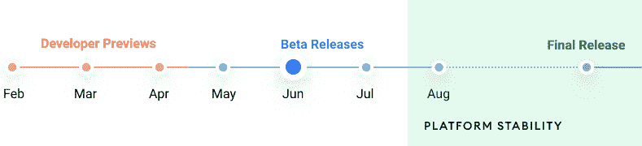

# 现在在 Android #41 中

> 原文：<https://medium.com/androiddevelopers/now-in-android-41-a999eda38d98?source=collection_archive---------9----------------------->

Illustration by [Virginia Poltrack](https://twitter.com/VPoltrack)

## Android 12 Beta 2，具有多个后堆栈和功能模块的导航，AppSearch，独立游戏，等等！

欢迎来到 Android 中的 Now，这是您对 Android 开发世界中新的和值得注意的事物的持续指导。

# 安卓 12: Beta 2🤖

Android 12 的第二个测试版[现已发布](https://android-developers.googleblog.com/2021/06/android-12-beta-2-update.html)！

Timeline for Android 12 Releases

阅读[博客](https://android-developers.googleblog.com/2021/06/android-12-beta-2-update.html)了解更多新细节，包括[隐私仪表板](https://developer.android.com/about/versions/12/features#privacy-dashboard)和[新方法，让你的应用程序给出权限使用的理由](https://developer.android.com/reference/android/content/Intent?hl=id#ACTION_VIEW_PERMISSION_USAGE_FOR_PERIOD)，麦克风和摄像头指示器以及关闭麦克风和摄像头馈送的简单方法，以及剪贴板读取通知——换句话说，就是我们在 I/O 上谈论的[隐私功能，现在已经准备好供你测试。](https://android-developers.googleblog.com/2021/05/android-security-and-privacy-recap.html)

 [## Android 12 Beta 2 更新

### 就在几周前，在谷歌 I/O 大会上，我们发布了 Android 12 的第一个测试版，重点是适应你的新用户界面…

android-developers.googleblog.com](https://android-developers.googleblog.com/2021/06/android-12-beta-2-update.html) 

一如既往，请访问 [Android 12 测试版网站](https://developer.android.com/about/versions/12)，了解关于[行为变化](https://developer.android.com/about/versions/12/behavior-changes-all)、[新特性/API](https://developer.android.com/about/versions/12/features)等更多信息。最重要的是:在新版本中试用你的应用程序，并向我们发送[反馈](https://developer.android.com/about/versions/12/feedback)你的任何问题。我们正处于测试过程的中途，因此没有多少时间来体验使用预发布 Android 12 的乐趣了。

# 独立游戏加速器和节日🎊

 [## 在 Google Play 的帮助下发展您的独立游戏

### 在 Google Play，我们致力于帮助所有开发者茁壮成长，无论他们是大型跨国公司还是…

developers.googleblog.com](https://developers.googleblog.com/2021/06/grow-your-indie-game-with-help-from-google-play.html) 

我们宣布 Google Play 的[独立游戏加速器和独立游戏节现已开放提交。加速器为独立游戏工作室最近或即将推出的游戏提供指导，而电影节是提交最近推出的游戏以竞争特色、促销和其他奖项的地方。你可以在 7 月 1 日之前申请任何一个项目。](https://developers.googleblog.com/2021/06/grow-your-indie-game-with-help-from-google-play.html)

# 疯狂技能:导航🧭

在短暂的 I/O 暂停之后， [MAD Skills](https://developer.android.com/series/mad-skills) 系列继续讲述关于现代 Android 开发的更多技术内容。来自 [Murat Yener](https://medium.com/u/e947fef0dfe0?source=post_page-----a999eda38d98--------------------------------) 的[更多导航系列](https://www.youtube.com/playlist?list=PLWz5rJ2EKKc-vin7SvgoaR6wu24sAw-sE)增加了一个被高度要求的主题:[多后台导航](/androiddevelopers/navigation-multiple-back-stacks-6c67ba41952f)。这是为底部导航推荐的材料模式的一部分，但是，直到最近，还没有简单的方法来实现它

A video demonstration of MAD navigational skills with multiple back stacks

[Murat](https://medium.com/u/e24fabe6f37c?source=post_page-----a999eda38d98--------------------------------) 还涵盖了功能模块中的[导航，包括与 Play 功能交付一起交付的功能模块。由于这些模块不会在安装时下载，而是仅在应用程序请求时下载，因此您可以使用动态功能导航库来包含功能模块中的图表。](/androiddevelopers/navigation-in-feature-modules-322ac3d79334)

The MAD Skills required to navigate between destinations in dynamically-loaded feature modules

此外，我们为来自 I/O 的所有 MAD 技能内容做了一篇[博文](https://android-developers.googleblog.com/2021/05/mad-spotlight.html)和一个[短视频更新](https://youtu.be/_5jVGROIVB0)，所以你不必梳理我们所有的会话来了解什么是 MAD。

# 但是等等，还有更疯狂的内容！

对于正在进行的内容，一定要查看 YouTube 上的[疯狂技能播放列表](https://www.youtube.com/playlist?list=PLWz5rJ2EKKc91i2QT8qfrfKgLNlJiG1z7)，Medium 上的[文章，或者指向所有内容的](https://medium.com/androiddevelopers/tagged/mad-skills)[这个方便的登陆页面](https://developer.android.com/series/mad-skills)。

# I/O 前三名

我们已经在 90 秒的视频片段中结合博客文章概括了 I/O 的亮点。除了前面提到的 [MAD 技能](https://youtu.be/_5jVGROIVB0)，我们还涵盖了 [Android 12](https://www.youtube.com/watch?v=tvf1wmD5H0M) ，以及我们已经完成的[外形的工作，包括穿戴、汽车、平板电脑、可折叠和电视](https://www.youtube.com/watch?v=O5oRiIUk_F4)。

# 文章

说到对多后台栈的支持， [Ian Lake](https://medium.com/u/51a4f24f5367?source=post_page-----a999eda38d98--------------------------------) 在我们的 Medium 博客上向我们深入介绍了[多后台栈](/androiddevelopers/multiple-back-stacks-b714d974f134)以及为实现这一特性所做的一些工作。

 [## 多个后堆栈

### 深入探究片段和 Jetpack 导航的实际功能

medium.com](/androiddevelopers/multiple-back-stacks-b714d974f134) 

我们[在博客中介绍了新的 Jetpack AppSearch 库](https://android-developers.googleblog.com/2021/06/sophisticated-search-with-appsearch-in-jetpack.html)，用于在设备上进行高性能的全文搜索。

 [## 使用 AppSearch 构建复杂的搜索功能

### 在 Jetpack 中引入 AppSearch，现在在 Alpha 中可用。AppSearch 是一个设备上的搜索库，提供高…

android-developers.googleblog.com](https://android-developers.googleblog.com/2021/06/sophisticated-search-with-appsearch-in-jetpack.html) 

[Meghan](https://medium.com/u/401951cd4c3e?source=post_page-----a999eda38d98--------------------------------) 讲述了 [Android 12 如何阻止触摸事件被传递](/androiddevelopers/untrusted-touch-events-2c0e0b9c374c)如果这些触摸首先通过不同应用程序的窗口。这是一种行为变化，因此无论 targetSdkVersion 如何，它都会发生。它有助于确保用户能够看到他们正在交互的内容。请继续阅读，了解替代方案，看看您的应用程序是否会受到影响，以及如何测试您的应用程序是否会受到影响。

 [## Android 中的不可信触摸事件

### 在 Android 12 中，我们正在进行更改以增强应用和平台的安全性，从而为我们的用户提供更安全的体验…

medium.com](/androiddevelopers/untrusted-touch-events-2c0e0b9c374c) 

[Manuel](https://medium.com/u/3b5622dd813c?source=post_page-----a999eda38d98--------------------------------) 讲述了使用 Hilt 注入一个[应用范围的协程作用域，允许你启动遵循应用生命周期的新协程，或者让某些工作超出调用者的作用域。](/androiddevelopers/create-an-application-coroutinescope-using-hilt-dd444e721528)

 [## 使用 Hilt 创建一个应用程序协同作用域

### 按照协程的最佳实践，您可能需要在某些类中注入一个应用程序范围的协程作用域，以…

medium.com](/androiddevelopers/create-an-application-coroutinescope-using-hilt-dd444e721528) 

# Android 开发者后台

自从上一集《现在》在安卓发布以来，已经有三集新的安卓开发者后台发布了。

ADB 发布了 [**第 165 集**](http://adbackstage.libsyn.com/episode-165-material-witnesses) ，其中 [Chet](https://medium.com/u/cb2c4874d3e9?source=post_page-----a999eda38d98--------------------------------) 和 [Romain](https://medium.com/u/c967b7e51f8b?source=post_page-----a999eda38d98--------------------------------) 与 Material Design 团队的 Hunter 和 Nick 聊了聊最近对 Material Design 组件库的添加和改进:过渡、运动主题化、合成、大屏幕支持和指导等。

[**第 166 集**](http://adbackstage.libsyn.com/episode-166-security-deposit) 有 Android 安全团队的 Chad 和 Jeff 加入 [Tor](https://medium.com/u/8251a5f98c9d?source=post_page-----a999eda38d98--------------------------------) 和 [Romain](https://medium.com/u/c967b7e51f8b?source=post_page-----a999eda38d98--------------------------------) 谈论…安全问题。他们解释了平台在帮助保持用户信任和设备完整性方面做了什么，为什么它有时意味着限制现有的 API，并触及了应用程序可以做什么或应该担心什么。

[**第 167 集**](http://adbackstage.libsyn.com/episode-167-jetpack-compose-layout) 是我们在 Jetpack Compose (AD/BC)上的迷你系列的第二集，其中[尼克](https://medium.com/u/22c02a30ae04?source=post_page-----a999eda38d98--------------------------------)和[罗曼](https://medium.com/u/c967b7e51f8b?source=post_page-----a999eda38d98--------------------------------)与安娜斯塔西娅·索博列娃、乔治·芒特和米哈伊·波帕一起谈论 Compose 的布局系统。它们解释了组合布局模型的工作原理及其优点，介绍了常见的布局组件，讨论了如何编写自己的布局远比视图简单，以及如何制作布局动画。

# 那么现在…👋

这一次是新的 [Android 12 Beta](https://developer.android.com/about/versions/12) ，一些高级的[导航指南](https://www.youtube.com/playlist?list=PLWz5rJ2EKKc-vin7SvgoaR6wu24sAw-sE)，为[独立游戏开发者](https://developers.googleblog.com/2021/06/grow-your-indie-game-with-help-from-google-play.html)、 [AppSearch](https://developer.android.com/jetpack/androidx/releases/appsearch) 和更多的酷东西。收听[设计](http://adbackstage.libsyn.com/episode-165-material-witnesses)、[安全](http://adbackstage.libsyn.com/episode-166-security-deposit)和[撰写](http://adbackstage.libsyn.com/episode-167-jetpack-compose-layout)播客，请尽快回到这里收听来自 Android 开发者世界的下一次更新！