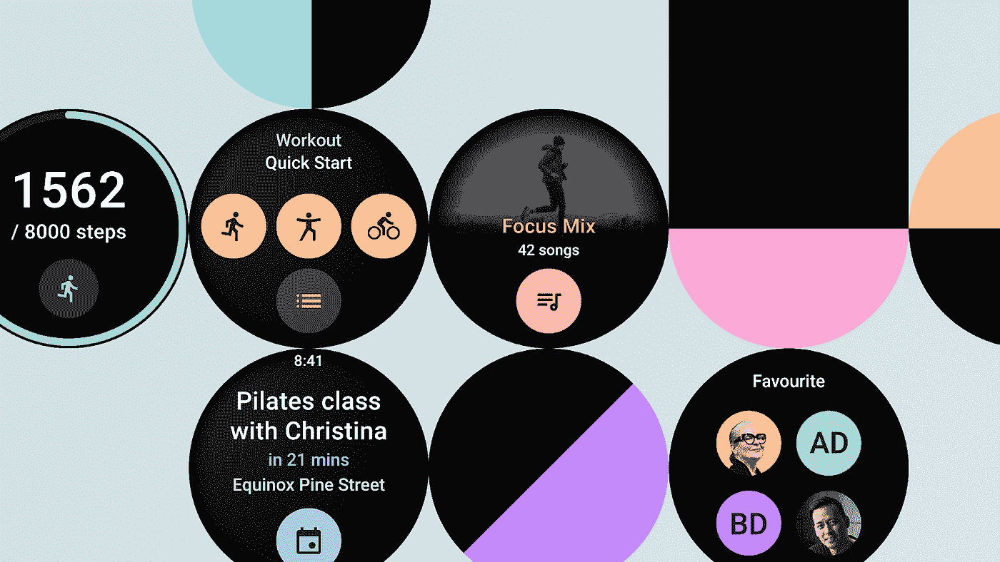

# 现在在 Android #45 中

> 原文：<https://medium.com/androiddevelopers/now-in-android-45-71b393b8a7b?source=collection_archive---------1----------------------->

Illustration by [Virginia Poltrack](https://twitter.com/VPoltrack)

## [Android 12 Beta 4](https://android-developers.googleblog.com/2021/08/android-12-beta-4-and-platform-stability.html) 、[大屏 UI](/androiddevelopers/large-screen-ui-in-the-google-i-o-app-c4d3ddd98bd0) 、 [WearOS tiles](https://android-developers.googleblog.com/2021/08/sharing-tiles-with-your-smartwatch-users.html) 、 [Android Study Jams](https://android-developers.googleblog.com/2021/08/join-north-america-android-study-jams-to-learn-more-about-developing-quality-Android-apps.html) 、 [MAD Performance 系列](https://www.youtube.com/playlist?list=PLWz5rJ2EKKc-xjSI-rWn9SViXivBhQUnp)、 [AndroidX 发布](https://developer.android.com/jetpack/androidx/versions/all-channel)、 [Android 12 隐私](http://adbackstage.libsyn.com/episode-172-privacy-features-in-android-12)。

欢迎来到 Android 中的 Now，这是您对 Android 开发世界中新的和值得注意的事物的持续指导。

# 视频和播客形式的 NiA45

这个*现在在 Android* 中也以视频和播客的形式提供。内容是一样的，但是需要的阅读量更少。文章版本(继续阅读！)仍然是链接到所有内容的地方。

# 播客

点击下面的链接，或者在你最喜欢的客户端应用程序中订阅播客。

# 安卓 12 Beta 4🤖

我们发布了 [Android 12](https://developer.android.com/about/versions/12) 的[第四个 Beta](https://android-developers.googleblog.com/2021/08/android-12-beta-4-and-platform-stability.html) ，带我们去看[平台稳定性](https://developer.android.com/preview/overview#timeline)；Android 12 的 API 和所有面向应用的行为都已最终确定，如果你还没有开始，是时候为今年晚些时候的正式发布及时准备必要的应用更新了。你可以在你的 Pixel 设备和合作伙伴的精选设备上试用 Beta 4，如[华硕](https://www.asus.com/Content/Android-12-Beta/)、[一加](https://www.oneplus.com/os/developer-preview/android12)、 [Oppo](https://developers.oppomobile.com/wiki/doc/index#id=91) 、 [Realme](https://www.realmebbs.com/post-details/1393156430865309696) 、[夏普](https://k-tai.sharp.co.jp/support/developers/android12_betaprogram/)、[小米](https://www.mi.com/global/service/support/androidsbeta.html)和[中兴](https://ztedevices.com/en-gl/developer/android-12)。Beta 4 也可用于带有 [ADT-3 开发套件](https://developer.android.com/tv/preview)的[安卓电视](https://developer.android.com/training/tv)。[帖子](https://android-developers.googleblog.com/2021/08/android-12-beta-4-and-platform-stability.html)有更多关于如何[获得测试版](https://www.google.com/android/beta)和测试你的应用程序的[兼容性](https://developer.android.com/about/versions/12/behavior-changes-all)的信息。

 [## Android 12 Beta 4 和平台稳定性

### 今天，我们将为您带来 Android 12 的第四个测试版，并进入发布的最后阶段。我们已经建立了…

android-developers.googleblog.com](https://android-developers.googleblog.com/2021/08/android-12-beta-4-and-platform-stability.html) 

# 分享我们的⌚瓷砖

[磁贴](https://developer.android.com/training/articles/wear-tiles)是你的 [WearOS 应用](https://developer.android.com/wear)的一部分，用户只需在手表主屏幕上滑动一下，就可以快速访问信息和操作。不久前，我们发布了 [Jetpack Tiles API Alpha](https://developer.android.com/jetpack/androidx/releases/wear-tiles#1.0.0-alpha09) ，让你可以在你的应用程序中构建并预览 Tiles——但现在你可以通过将你的应用程序发布到 Google Play 来让用户使用它们。您还可以在 Google Play 控制台中将您的磁贴截图上传到您的 Play Store 预览资产；确保让你的用户知道他们可以尝试新的体验。

 [## 与您的智能手表用户共享磁贴:

### 只需在 watch face 主屏幕上轻轻一扫，磁贴就能快速访问信息和操作。这给了…

android-developers.googleblog.com](https://android-developers.googleblog.com/2021/08/sharing-tiles-with-your-smartwatch-users.html) 

# 谷歌输入/输出应用中的大屏幕用户界面🦊

虽然今年的谷歌 I/O 没有包括谷歌 I/O 应用程序的新版本，但我们更新了代码库，以展示现代 Android 开发中的一些新功能和趋势。我们关注的一个领域是改善大屏幕上的应用体验:平板电脑、可折叠设备和 ChromeOS /台式机。在过去的一年中，大屏幕设备的受欢迎程度和使用量都有所增长，目前已超过 2.5 亿台活跃设备，应用程序必须适应并明智地使用额外的屏幕空间。以下是我们用来让 Google I/O 应用在大屏幕上表现更好的一些技巧:

*   **响应式导航**我们在宽景视图中使用了一个[导航条](https://material.io/components/navigation-rail)，将导航按钮放在侧面而不是底部。
*   **一个窗格或两个窗格:**我们使用了一个[sliding panel layout](https://developer.android.com/reference/kotlin/androidx/slidingpanelayout/widget/SlidingPaneLayout)来显示一个或两个窗格，这取决于屏幕的大小和方向，包括平板电脑上窄纵向视图中的单个内容窗格。
*   **变换空间:**我们使用了 [ConstraintLayout](https://developer.android.com/reference/androidx/constraintlayout/widget/ConstraintLayout) 来防止 UI 元素变得太长、太远或者太密集。
*   **转换内容:**我们使用了[替代布局](https://github.com/google/iosched/blob/main/mobile/src/main/res/layout-w840dp/item_codelab.xml)来利用额外的屏幕空间。在狭窄的屏幕上，你会看到一个项目列表，点击时可以展开和折叠。在更宽的屏幕上，这变成了一个卡片网格，可以立即显示所有商品的详细信息。

关于我们如何增强大屏幕 I/O 应用程序的更多信息，[查看帖子！](/androiddevelopers/large-screen-ui-in-the-google-i-o-app-c4d3ddd98bd0)

 [## 谷歌输入/输出应用中的大屏幕用户界面

### 5 月 18 日至 20 日，谷歌完全在线举办了我们的年度 I/O 开发者大会，共有 112 场会议，151 个代码实验室，79 个…

medium.com](/androiddevelopers/large-screen-ui-in-the-google-i-o-app-c4d3ddd98bd0) 

# 加入安卓学习堵塞📝

安卓开发和朋友一起更好玩！加入社区中的开发伙伴，通过参加 Android 学习 Jam 来提高您的技能！活动目前正在北美各地举行并迎合从初学者到高级的所有水平！

Android Study Jams 是开发者聚集在一起学习、创造和合作的社区活动。参与者将遵循旨在提高其开发技能的指导代码实验室，所有这些都额外关注于提高应用程序的质量。

如果你想加入一个 Android 学习 Jam，认识其他开发者，和新老朋友一起学习，那么就点击这个链接[找活动](https://events.withgoogle.com/android-study-jams-2021/)！

 [## 加入北美 Android Study Jams，了解更多关于开发高质量 Android 应用的信息

### 学习 Android 开发并不意味着要自学。加入您社区中的开发伙伴…

android-developers.googleblog.com](https://android-developers.googleblog.com/2021/08/join-north-america-android-study-jams-to-learn-more-about-developing-quality-Android-apps.html) 

# 疯狂技能:性能⏲️

[MAD Skills](https://developer.android.com/series/mad-skills) 系列继续提供更多关于现代 Android 开发的技术内容。

本周继续表演系列，还有两集。

在[第一集](https://www.youtube.com/watch?v=phhLFicMacY)中，Carmen 介绍了 [Perfetto trace viewer](https://ui.perfetto.dev/#!/) ，这是 Android Studio profiler 的替代工具，用于查看系统痕迹。Android Studio 专注于应用环境中的系统性能，并与开发工作流紧密集成，而 Perfetto 则具有检查多个进程之间交互的附加功能，例如获取绑定事务另一端谁在运行代码的详细信息。[收听这一集](https://www.youtube.com/watch?v=phhLFicMacY)了解更多！

在第二集的[中，来自 Square](https://youtu.be/QxKerZ8y1S4) 的 [Pierre 教你一个聪明的技巧，围绕从代码开始和停止采样分析器来捕获激光聚焦的痕迹，尤其是围绕 UI 事件。](https://twitter.com/piwai)

但是等等，还有更多**疯狂的内容！**

对于正在进行的内容，一定要查看 YouTube 上的 [MAD 技能播放列表](https://www.youtube.com/playlist?list=PLWz5rJ2EKKc91i2QT8qfrfKgLNlJiG1z7)，Medium 上的[文章](https://medium.com/androiddevelopers/tagged/mad-skills)，或者指向所有内容的[这个方便的登陆页面](https://developer.android.com/series/mad-skills)。

# 🧪代码实验室

Isai 编写了两个新的 codelabs 来帮助你了解附近的 API。

第一个代码实验室覆盖了附近的消息 API，它支持基于物理接近度的用户交互。这个 API 的一个用例可以是当朋友们离得很近时，让他们很容易地发现彼此，自发的午餐计划有人知道吗？🍔

第二个 codelab 涵盖了 Nearby Connections API，它让用户可以在没有数据限制和没有互联网连接的情况下相互通信。您将构建一个多人游戏“石头剪子布”,只要用户之间的距离不超过 100 米，该游戏就可以在没有互联网的情况下运行。

# AndroidX 释放📚

AndroidX 库有许多更新:

*   与 Jetpack Compose 相关的更新集中在更新 Kotlin 版本，同时添加一个可选的 FilterQuality 参数，以帮助增强缩放像素艺术的外观。
*   [游戏-活动](https://developer.android.com/jetpack/androidx/releases/games#games-activity-1.0.0)、[游戏-控制器](https://developer.android.com/jetpack/androidx/releases/games#games-controller-1.0.0)、[游戏-文字-输入](https://developer.android.com/jetpack/androidx/releases/games#games-text-input-1.0.0)均已发布稳定。
*   发布了新版本的[启动](https://developer.android.com/jetpack/androidx/releases/startup#1.1.0)，支持多进程自动初始化。
*   [Datastore](https://developer.android.com/jetpack/androidx/releases/datastore#1.0.0) 发布，提供了一个数据存储解决方案，允许你用协议缓冲区存储键值对或类型化对象。
*   [Core-Google-Shortcuts](https://developer.android.com/jetpack/androidx/releases/core#core-google-shortcuts-1.1.0-alpha01) 处于 alpha 版本，为 Google apps 显示的快捷方式中基于 URI 的图标提供索引支持。

# ADB 播客片段🎧

自从上一期《现在》在 Android 上发布以来，又有了新一集的 [Android 开发者后台](http://adbackstage.libsyn.com/)。

ADB 发布[第 172 集](http://adbackstage.libsyn.com/episode-172-privacy-features-in-android-12)涉及隐私。在这一集里，[切特](https://medium.com/u/cb2c4874d3e9?source=post_page-----71b393b8a7b--------------------------------)、[罗曼](https://medium.com/u/c967b7e51f8b?source=post_page-----71b393b8a7b--------------------------------)和[托尔](https://medium.com/u/8251a5f98c9d?source=post_page-----71b393b8a7b--------------------------------)与[萨拉·N-马兰迪](https://medium.com/u/255355c2c439?source=post_page-----71b393b8a7b--------------------------------)、[弗雷德·钟](https://medium.com/u/ac312b7e211e?source=post_page-----71b393b8a7b--------------------------------)和埃里克·沃尔斯海默谈论 Android 12 中的新隐私功能，比如隐私仪表盘、摄像头和麦克风使用指示器。

# 那么现在…👋

这一次就这样了，随着 [Android 12 Beta 4 和平台稳定性](https://android-developers.googleblog.com/2021/08/android-12-beta-4-and-platform-stability.html)、谷歌 I/O 应用中的[大屏幕 UI](/androiddevelopers/large-screen-ui-in-the-google-i-o-app-c4d3ddd98bd0)、[与你的智能手表用户共享磁贴](https://android-developers.googleblog.com/2021/08/sharing-tiles-with-your-smartwatch-users.html)、 [Android 学习堵塞](https://android-developers.googleblog.com/2021/08/join-north-america-android-study-jams-to-learn-more-about-developing-quality-Android-apps.html)、来自 [MAD Performance 系列的新剧集](https://www.youtube.com/playlist?list=PLWz5rJ2EKKc-xjSI-rWn9SViXivBhQUnp)、 [AndroidX 发布](https://developer.android.com/jetpack/androidx/versions/all-channel)和 [Android 12 隐私](http://adbackstage.libsyn.com/episode-172-privacy-features-in-android-12)。请尽快回到这里，等待 Android 开发者世界的下一次更新。