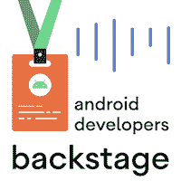

# 现在在 Android #49 中

> 原文：<https://medium.com/androiddevelopers/now-in-android-49-cf0f9d52bf78?source=collection_archive---------6----------------------->

Illustration by [Virginia Poltrack](https://twitter.com/VPoltrack)

## [安卓开发者峰会](https://developer.android.com/dev-summit)，[安卓基础](https://android-developers.googleblog.com/2020/07/learn-android-and-kotlin-with-no-experience.html)，[为 Wear OS 作曲](https://android-developers.googleblog.com/2021/10/compose-for-wear-os-now-in-developer.html)，[分页](https://www.youtube.com/watch?v=Pw-jhS-ucYA&list=PLWz5rJ2EKKc9L-fmWJLhyXrdPi1YKmvqS)， [CameraX](https://developer.android.com/training/camerax) ，[无障碍](https://www.youtube.com/watch?v=rtyjbUxUmG8&list=PLWz5rJ2EKKc8OENfLdh3zM5T6IRdlVYKj)， [AGP](https://developer.android.com/studio/build/extend-agp) ， [Widgets](https://developer.android.com/guide/topics/appwidgets/overview) 等等！

欢迎来到 Android 中的 Now，这是您对 Android 开发世界中新的和值得注意的事物的持续指导。

# 视频和播客形式的 NiA49

这个*现在在 Android* 中也以视频和播客的形式提供。内容是一样的，但是需要的阅读量更少。文章版本(继续阅读！)仍然是链接到所有内容的地方。

# Android 开发峰会，2021 年 10 月 27-28 日！📆

记得在 10 月 27-28 日参加我们的 [Android Dev Summit 2021](https://developer.android.com/dev-summit) ！该节目将于太平洋时间 10 月 27 日上午 10 点以安卓秀拉开帷幕。在那里，我们有超过 30 场关于一系列技术 Android 开发主题的会议，我们将现场回答您的#AskAndroid 问题。

# 疯狂技能:分页📑

关于[分页](https://developer.android.com/topic/libraries/architecture/paging/v3-overview)的系列文章将继续提供更多内容！在第二集中， [TJ](https://tunjid.medium.com/) 展示了如何获取数据并将`PagingData`绑定到 UI，包括页眉和页脚。

在第三集中，TJ 添加了一个本地缓存，只在必要时才进行提取和刷新，利用了[空间](https://developer.android.com/training/data-storage/room)。本地缓存充当分页数据的唯一来源。

## 更多疯狂的内容

但是等等，还有更疯狂的内容！

对于正在进行的内容，一定要查看 YouTube 上的[疯狂技能播放列表](https://www.youtube.com/playlist?list=PLWz5rJ2EKKc91i2QT8qfrfKgLNlJiG1z7)，Medium 上的[文章](https://medium.com/androiddevelopers/tagged/mad-skills)，或者[这个指向所有内容的便捷登陆页面](https://developer.android.com/series/mad-skills)。

# 游戏控制台中的数据安全🔒

Google Play 正在 Google Play 控制台中推出**数据安全表单**。通过新的数据安全部分，开发者现在可以在用户安装应用程序之前，以透明的方式向用户展示他们是否以及如何收集、共享和保护用户数据。

阅读这篇博客文章，了解有关如何在 Play Console 中提交应用信息、如何做好准备以及用户将在 2 月份开始的应用商店列表中看到的内容的更多信息。

 [## 在游戏控制台中启动数据安全:提升用户的隐私和安全性

### 我们知道，在网上感到安全的很大一部分是控制你的数据。这就是为什么我们每天都致力于…

android-developers.googleblog.com](https://android-developers.googleblog.com/2021/10/launching-data-safety-in-play-console.html) 

# 🧑‍kot Lin 课程中的 Android 基础💻

Kotlin 中的 Android 基础教没有编程经验的人如何构建简单的 Android 应用程序。自 2020 年发布第一批学习单元以来，已有超过 100，000 名初学者完成了学习！今天，我们很兴奋地分享最终单元已经发布，**kot Lin 课程中完整的** [**Android 基础知识**](https://developer.android.com/courses/android-basics-kotlin/course) **现已推出**。

 [## 在 Kotlin 课程中宣布 Android 基础知识

### 我们一直在寻找让所有人都能学习 Android 开发的方法。2020 年，我们宣布…

android-developers.googleblog.com](https://android-developers.googleblog.com/2021/10/announcing-android-basics-in-kotlin.html) 

# AndroidX 释放🚀

作为这次最出色的发布，WorkManager 2.7 被提升为稳定版。这个新版本引入了一个新的`[setExpedited](https://developer.android.com/reference/android/app/job/JobInfo.Builder#setExpedited(boolean))` API 来帮助解决 Android 12 中的前台服务限制。

## 在开发者预览版⌚中为 Wear OS 编写

Wear OS 继续发布！两周前我们告诉过你许多 [Wear OS Jetpack 库](https://android-developers.googleblog.com/2021/09/wear-os-jetpack-libraries-now-in-stable.html)现在已经稳定。为了跟进这一点，我们还将最好的 Compose 带到了 Wear OS，内置了对 Material You 的支持，以帮助您用更少的代码创建漂亮的应用程序。

请阅读下面的文章来回顾我们为 Wear OS 构建的主要组件，并为您指出开始使用它们的资源。

 [## 现在在开发者预览版中为 Wear OS 编写！

### 在今年的 Google I/O 上，我们宣布将最好的 Jetpack Compose 带到 Wear OS 上。嗯，今天，作曲…

android-developers.googleblog.com](https://android-developers.googleblog.com/2021/10/compose-for-wear-os-now-in-developer.html) 

# 文章📚

你是否曾想在应用程序拍照时应用 HDR 或夜间模式等特效？CameraX 是来帮助你的！在由[carbon Chen](/@charcoalchen)撰写的这篇文章中，学习如何使用[camera-extensions](https://developer.android.com/jetpack/androidx/releases/camera)Jetpack 库中新的 [ExtensionsManager](https://developer.android.com/reference/androidx/camera/extensions/ExtensionsManager) 来实现这一点。

 [## 使用 CameraX 扩展 API 对图像应用特殊效果

### Android CameraX 旨在使相机开发更容易。随着 CameraX 的发展，相机的应用…

medium.com](/androiddevelopers/apply-special-effects-to-images-with-the-camerax-extensions-api-d1a169b803d3) 

同样关于 CameraX，Wenhung Teng 的另一篇博文讲述了如何使用 CameraX 曝光补偿，使快速拍摄高质量图像变得更加简单。

 [## 使用 CameraX 曝光补偿 API

### 相机设备在推动移动设备创新方面至关重要，相机曝光是获得…

medium.com](/androiddevelopers/using-camerax-exposure-compensation-api-11fd75785bf) 

[Yigit Boyar](/@yigit) 写了关于 [Room](https://developer.android.com/training/data-storage/room) 如何增加对 [Kotlin 符号处理](https://github.com/google/ksp) (KSP)的支持的故事。剧透:这不容易，但绝对值得。

 [## 房间和科特林符号处理

### 这是一个关于“房间”如何增加对 KSP 支持的故事。

medium.com](/androiddevelopers/room-kotlin-symbol-processing-24808528a28e) 

# 无障碍系列🌐

[可访问性系列](https://www.youtube.com/watch?v=rtyjbUxUmG8&list=PLWz5rJ2EKKc8OENfLdh3zM5T6IRdlVYKj)继续介绍如何遵循基本的可访问性原则，以确保你的应用能被尽可能多的用户使用。

一般来说，你应该确保交互元素的宽度和高度至少为`48dp`！在*触摸目标*这一集中，你将了解到实现这一目标的几种方法。

想要更多的可访问性吗？你很幸运，看看这个全新的[学习途径](https://developer.android.com/courses/pathways/make-your-android-app-accessible)，旨在教你如何让你的应用程序更易访问。

# 文档和 Codelabs 更新🏫

**Widgets** 可以对用户的主屏幕产生巨大的影响！我们用最新操作系统版本中的最新变化更新了[应用小部件](https://developer.android.com/guide/topics/appwidgets/overview)文档。关于如何创建一个[简单小部件](https://developer.android.com/guide/topics/appwidgets)、[一个高级小部件](https://developer.android.com/guide/topics/appwidgets/advanced)，以及如何[提供灵活的小部件布局](https://developer.android.com/guide/topics/appwidgets/layouts)的新页面。

[**Android Gradle 插件**](https://developer.android.com/studio/build)**【AGP】**包含插件的扩展点，用于控制构建输入和扩展其功能。从 7.0 版本开始，AGP 有了一套你可以依赖的官方的、稳定的 API。我们也有一个[新的文档页面](https://developer.android.com/studio/build/extend-agp)，带你浏览这个页面，并解释如何创建你自己的插件。

如果你打算开始学习 [Jetpack Compose](https://developer.android.com/jetpack/compose) ，这是我们构建原生 Android UI 的现代工具包，那是你的幸运日！我们刚刚修改了[**Basics Jetpack Compose codelab**](https://developer.android.com/codelabs/jetpack-compose-basics)来帮助你学习 Compose 的核心概念，只有这样，你才会看到它对构建 Android UIs 有多大的改进。完成之后，不要忘记查看包含更多资源的 [Compose pathway](http://goo.gle/compose-pathway) 以充分利用 Compose。

谈到 Compose，我们扩展了 [Compose 和其他库](https://developer.android.com/jetpack/compose/libraries)页面，以涵盖如何为 result 启动活动、请求运行时权限以及直接从组件中处理系统返回按钮。此外，我们添加了一个新的 [**材质组件和布局**](https://developer.android.com/jetpack/compose/layouts/material) **页面**，该页面在构图中查看了不同的材质组件，如背景、应用程序栏、模态抽屉等。！甚至更多！Compose 文档集中的 [**主题现在包含关于如何**](https://developer.android.com/jetpack/compose/themes)**[实现定制设计系统](https://developer.android.com/jetpack/compose/themes/custom)的新页面，以及[主题剖析](https://developer.android.com/jetpack/compose/themes/anatomy)。**

# 亚行播客 Episodes🎙

自从 Android 上一期 Now 发布以来，已经有一集 [Android 开发者后台](https://adbackstage.libsyn.com/)发布了。请点击下面的链接，或在您最喜欢的播客客户端查看:

尊重每一个光子。在这一集里，Chet、Roman 和 Tor 与来自谷歌研究团队的 Bart Wronski 进行了一次聊天，讨论了驱动 Pixel 手机的摄像头管道。相机如何捕捉图像，负责 Pixel 美丽图像的算法，HDR+或夜视模式的工作原理，等等！

# 那么现在…👋

这一次到此为止，随着 [Android Dev Summit 2021](https://developer.android.com/dev-summit) 、[寻呼狂技能系列](https://www.youtube.com/watch?v=Pw-jhS-ucYA&list=PLWz5rJ2EKKc9L-fmWJLhyXrdPi1YKmvqS)、Kotlin 课程中的 [Android 基础知识终于完成、](https://android-developers.googleblog.com/2020/07/learn-android-and-kotlin-with-no-experience.html)[为 Wear OS 撰写](https://android-developers.googleblog.com/2021/10/compose-for-wear-os-now-in-developer.html)、 [CameraX](https://developer.android.com/training/camerax) 和 [KSP](https://github.com/google/ksp) 文章、[触摸目标无障碍](https://www.youtube.com/watch?v=Dqqbe8IFBA4)视频、 [Widgets](https://developer.android.com/guide/topics/appwidgets/overview) doc 更新、[扩展 AGP](https://developer.android.com/studio/build/extend-agp) 和[撰写请尽快回到这里，等待 Android 开发者世界的下一次更新。](https://developer.android.com/jetpack/compose)