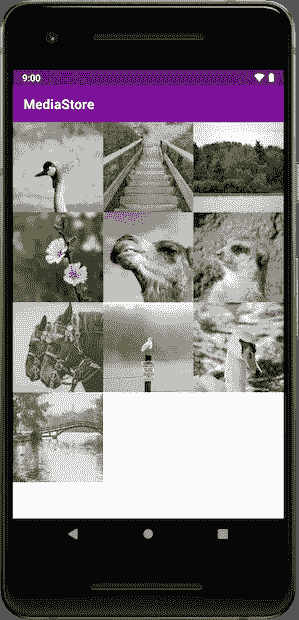

# 现在在 Android #5 中

> 原文：<https://medium.com/androiddevelopers/now-in-android-5-12ddd1f5e3bd?source=collection_archive---------4----------------------->

Illustration by [Virginia Poltrack](https://twitter.com/VPoltrack)

## 范围存储示例代码、Kotlin codelabs 和 Android 开发峰会直播

欢迎来到 Android 中的 Now，这是您对 Android 开发世界中新的和值得注意的事物的持续指导。

# 限定范围的存储示例

Using the right permissions and the MediaStore APIs allows your Android 10 app to browse content created by other apps.

Android 10 的一个重要变化是[范围的外部存储](https://developer.android.com/training/data-storage/files/external-scoped)。这是最近版本中所做的更改之一，通过限制应用程序对非他们创建的文件的访问量来帮助保护用户数据。

简而言之:一个应用程序总是可以在没有权限的情况下访问自己的文件。但如果它想访问其他应用程序创建的照片/视频/音频文件，它必须使用 READ_EXTERNAL_STORAGE 权限。对于其他文件类型，它必须使用存储访问框架让用户参与选择文件。

[文档](https://developer.android.com/training/data-storage/files/external-scoped)涵盖了可用于处理外部存储文件的 API 和方法。但是解释…不一定是显而易见的，尤其是对于存储开发新手来说。我们正在努力解决这个问题，但与此同时，[妮可·博雷利](https://medium.com/u/2bbf49fa59bf?source=post_page-----12ddd1f5e3bd--------------------------------)在 Github 的[存储示例](https://github.com/android/storage-samples)项目中创建了一个 [MediaStore 示例](https://github.com/android/storage-samples/tree/master/MediaStore)来提供帮助。

该示例将引导您使用正确的权限来请求访问文件，然后使用适当的 MediaStore APIs 来实际加载它们。

# 科特林代码实验室

你听说过这个 *Kotlin* 的东西，但是你一直想知道如何开始。我有一些代码实验室给你…

我们已经在 Udacity 上提供了学习 Kotlin 和 Android 开发的课程。但也许你更喜欢自定进度的学习。或者你只是不看视频。好吧，今天是你的幸运科特林日:我们已经从那些课程中提取了核心内容，并制作了一些 codelab 课程。

面向程序员的 Kotlin Bootcamp 是一门课程(一系列代码实验室),带你了解这门语言的大部分基础知识。它假设您已经熟悉面向对象编程，并向您介绍了 Kotlin 概念，如函数、类和 lambdas。

[Android Kotlin 基础](https://developer.android.com/courses/kotlin-android-fundamentals/overview)是另一门课程(codelabs 系列)，使用 Kotlin 教授 Android 开发中的许多重要概念。这包括 Android 的一些基础知识，如布局和生命周期，但也包括所有 Android 开发人员都应该学习和使用的现代实践，如 RecyclerView 和架构组件。本课程没有明确教授科特林语，所以如果你还没有使用过这种语言，你可能想从[科特林训练营](https://developer.android.com/courses/kotlin-bootcamp/overview)课程开始。

# Android 开发峰会:直播流

在过去几年里，谷歌开发者大会的一个伟大之处在于，你不必亲临现场就能欣赏到内容。如果你不能参加活动，你仍然可以在线观看所有的会议。

例如，即将于 10 月 23 日至 24 日举行的 [Android 开发峰会](https://developer.android.com/dev-summit)将在 YouTube 和 Twitter 上直播所有会议。因此，你不仅可以在自己舒适的沙发办公室里观看会议，还可以和世界各地的其他人同时观看，同时学习和享受会议内容。

您可以在 [Android Dev Summit](https://developer.android.com/dev-summit) 网站和[网站上了解关于该活动和直播的更多信息，并注册该活动的电子邮件更新](https://docs.google.com/forms/d/e/1FAIpQLSdgYq8FgW9eGyaUqIF7VFkPpvRPTcvjg4meeBOMAe_cGYPywA/viewform)。

# 那么现在…

这次到此为止。去玩 Android 10 的[外部作用域存储](https://github.com/android/storage-samples/tree/master/MediaStore)！学习[科特林](https://developer.android.com/courses/kotlin-bootcamp/overview)和[安卓](https://developer.android.com/courses/kotlin-android-fundamentals/overview)基础知识！计划观看 [Android 开发峰会](https://developer.android.com/dev-summit)直播！请尽快回到这里，收听 Android 开发者世界的下一次更新。