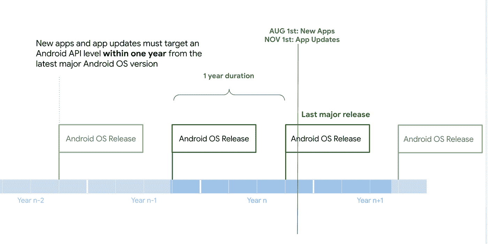
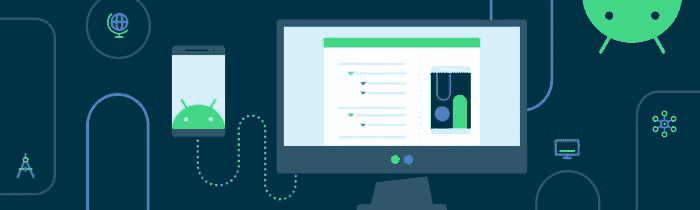

# 现在在 Android #59 中

> 原文：<https://medium.com/androiddevelopers/now-in-android-59-f36300ae1e94?source=collection_archive---------3----------------------->

Illustration by [Virginia Poltrack](https://twitter.com/VPoltrack)

## [玩转目标 SDK](https://android-developers.googleblog.com/2022/04/expanding-plays-target-level-api-requirements-to-strengthen-user-security.html) ，[安卓认证](https://android-developers.googleblog.com/2022/03/upgrading-android-attestation-remote.html)，[架构](https://www.youtube.com/playlist?list=PLWz5rJ2EKKc8GZWCbUm3tBXKeqIi3rcVX)，[电视](https://www.youtube.com/playlist?list=PLWz5rJ2EKKc9Ev7YfhQs3mlGh-tWKib_4)，[汽车](https://developer.android.com/training/cars/media#metadata-indicators)，[玩转学院](https://play.google.com/academy/)，[图形](https://adbackstage.libsyn.com/episode-184-skia-and-agsl-shaders-of-things-to-come)，[游戏开发](https://www.youtube.com/watch?v=C9MZNEW20B4)等等。

欢迎来到 Android 中的 Now，这是您对 Android 开发世界中新的和值得注意的事物的持续指导。

# [扩展游戏的目标级 API 需求](https://android-developers.googleblog.com/2022/04/expanding-plays-target-level-api-requirements-to-strengthen-user-security.html)🎯

从 2022 年 11 月 1 日开始，在最新主要 Android 发布版本的两年内不以 API 级别为目标的应用程序将无法在 Google Play 上向使用比您的应用程序的目标 API 级别更新的 Android OS 版本的设备的新用户提供。例如，截至今年 11 月，现有应用程序需要至少针对 API 级别 30，Android 11，才能在 Android 12 和 13 设备上提供给新用户。

先前从 Google Play 安装了您的应用程序的用户将继续能够发现、重新安装和使用您的应用程序，即使他们移动到新的 Android 设备。应用程序更新仍然需要在最新的主要 Android 发布版本的一年内达到 API 水平。扩展我们的目标级 API 要求将保护用户不安装旧的应用程序，旧的应用程序可能没有新的 Android 版本提供的隐私和安全保护。我们有一篇[博客文章](https://android-developers.googleblog.com/2022/04/expanding-plays-target-level-api-requirements-to-strengthen-user-security.html)和[视频](https://www.youtube.com/watch?v=O0UwUF2DgQc)，提供了关于新要求以及如何迁移你的应用的更多细节。

 [## 扩展 Play 的目标级 API 要求以加强用户安全性

### Google Play 帮助我们的开发人员社区向数十亿人分发世界上最具创新性和最值得信赖的应用程序…

android-developers.googleblog.com](https://android-developers.googleblog.com/2022/04/expanding-plays-target-level-api-requirements-to-strengthen-user-security.html) 

# [升级 Android 认证:远程供应](https://android-developers.googleblog.com/2022/03/upgrading-android-attestation-remote.html)🔐

自 Android 8.0 以来，设备完整性认证已被强制执行，并在安全网等各种服务中使用。Android 12 为设备制造商增加了远程密钥供应的选项，并将在 Android 13 中强制执行。如果您在应用中利用证明，请注意更长的证书链结构、新的信任根、RSA 证明的弃用以及短期证书/证明密钥。这篇博客文章详细介绍了这一切是如何运作的。

# [狂技能:建筑](https://www.youtube.com/playlist?list=PLWz5rJ2EKKc8GZWCbUm3tBXKeqIi3rcVX)📐

架构 [MAD Skills](https://www.youtube.com/watch?v=TPWmfJq16rA&list=PLWz5rJ2EKKc8GZWCbUm3tBXKeqIi3rcVX) 系列有三集新内容，涵盖了我们构建应用的最佳实践。

在第一集中，Manuel 介绍了不同类型的 UI 事件以及处理它们的最佳实践等等。

在第二集中，Don 介绍了领域层(位于 UI 和数据层之间的可选层)，解释了它如何简化您的应用程序架构，使其更易于理解和测试。

然后，来自优步的 Emily Kager 分享了一个在大型项目中组织模块的技巧，因为没有什么比组织良好的代码更令人兴奋的了。

我们还制作了一个新的 [App Excellence: Android 架构](https://www.youtube.com/watch?v=fodD6UHjLmw)视频来帮助介绍我们最新的架构指南。

对于正在进行的内容，请务必查看 YouTube 上的 [MAD 技能播放列表](https://www.youtube.com/playlist?list=PLWz5rJ2EKKc91i2QT8qfrfKgLNlJiG1z7)、Medium 上的[文章](https://medium.com/androiddevelopers/tagged/mad-skills)或指向所有内容的[这个方便的登录页面](https://developer.android.com/series/mad-skills)。

# [集成安卓电视和谷歌电视](https://www.youtube.com/playlist?list=PLWz5rJ2EKKc9Ev7YfhQs3mlGh-tWKib_4)📺

我们已经继续了我们的系列，在新的两集中集成了 Android TV 和 Google TV。

在第一集中，Ian 涵盖了关于可访问性的主题，如让您的应用程序为对讲做好准备，对比度和文本大小的最佳实践，以及如何处理自定义视图等复杂场景。

在第二集中，Thomas 讨论了如何使用 Google Play 付费功能将 Android 电视应用货币化。它概述了 Billing commerce 堆栈，如何在 Play 控制台中创建应用内产品和订阅，如何使用 Billing 客户端启动购买流程，等等。

# 汽车用安卓系统🚗

[Android for cars](https://developer.android.com/cars) 引入了由 Google Assistant 支持的[媒体推荐，一个用于长格式内容的](https://developer.android.com/reference/android/service/media/MediaBrowserService.BrowserRoot#EXTRA_SUGGESTED)[进度条](https://developer.android.com/training/cars/media#metadata-indicators)，和[每个项目的内容样式](https://developer.android.com/training/cars/media#per-item-styles)，允许可浏览/可播放的项目被单独分配到一个列表或网格。前往[开发者文档](https://developer.android.com/cars)了解所有这些变化。

# [Google Play 学院](https://play.google.com/academy/)🎓

Google Play 学院发布了三门新课程。前两个，[走向全球:日本](https://www.youtube.com/watch?v=hY1HH-9efkg)和[走向全球:东南亚](https://www.youtube.com/watch?v=j9VRzvDhTO0)涵盖了如何让你的应用更具吸引力，如何营销和发展你的业务，以及如何在这些地区赚钱。

第三个课程，[面向所有用户的设计](https://www.youtube.com/watch?v=07NUULjEJ5A)，涵盖了如何设计用户友好的应用程序，创建引人注目的首次用户体验，以及提高应用程序的质量，同时提高可访问性。

# [游戏开发](https://developer.android.com/games)🎮

我们介绍了如何在 Google Play 控制台上使用 [Android vitals 来帮助您监控游戏的稳定性，如何在斋月](https://www.youtube.com/watch?v=C9MZNEW20B4)期间最佳地优化您的游戏以提高您的客户参与度[，并宣布来自 Google Play](https://www.youtube.com/watch?v=L8K46aqeTEo) 的[独立游戏加速器&独立游戏节 2022 即将到来，提供了一种在提交开放时获得通知的方式。](https://www.youtube.com/watch?v=m2gTnT2kCRQ)

# 文章📚

Manuel 写了我们如何以及为什么将我们的[架构蓝图](https://github.com/android/architecture-samples)迁移到 [Jetpack Compose](https://developer.android.com/jetpack/compose) ，以及我们在这样做时面临的一些问题。

 [## 将架构蓝图迁移到 Jetpack Compose

### 团队如何计划和实施蓝图迁移到 Compose，包括我们面临的挑战！

medium.com](/androiddevelopers/migrating-architecture-blueprints-to-jetpack-compose-8ffa6615ede3) 

Pietro 写了如何使用 Android 7.0[FLAG _ ACTIVITY _ LAUNCH _ ADJACENT](https://developer.android.com/reference/android/content/Intent#FLAG_ACTIVITY_LAUNCH_ADJACENT)FLAG 来启用分屏用例，以便在 Android 12L 上的一个新的相邻窗口中打开您的活动。(以及部分支持 Android 11+的设备)

 [## FLAG_ACTIVITY_LAUNCH_ADJACENT 的奇特案例

### 现在我们有了大屏幕，让用户充分利用它们。

medium.com](/androiddevelopers/the-curious-case-of-flag-activity-launch-adjacent-f1212f37a8e0) 

# AndroidX 释放🚀

让我们来看看自 Android 版《Now》最后一集以来，AndroidX 版本[和](https://developer.android.com/jetpack/androidx/versions/all-channel)都发生了什么。

[app compat app compat-Resources 版本 1.5.0-alpha01](https://developer.android.com/jetpack/androidx/releases/appcompat#1.5.0-alpha01) 包含了大量的错误修复，以及更新的可空性以匹配 Android 13 DP2 和一些小的兼容性功能，涉及 [TextView](https://developer.android.com/reference/androidx/core/widget/TextViewCompat) 、 [AppCompatDialog](https://developer.android.com/reference/androidx/appcompat/app/AppCompatDialog) 、 [SearchView](https://developer.android.com/reference/android/widget/SearchView) 和 [SwitchCompat](https://developer.android.com/reference/androidx/appcompat/widget/SwitchCompat) 。

[导航版本 2.4.2](https://developer.android.com/jetpack/androidx/releases/navigation#2.4.2) 已经发布，所有新的错误修复都是从 2.5 alpha 版本移植过来的。

# [亚行播客剧集](https://adbackstage.libsyn.com/) 🎙

自从 Android 上一期 Now 发布以来，已经有一集 [Android 开发者后台](https://adbackstage.libsyn.com/)发布了。

在这一集中，Tor、Chet 和 Romain 与来自 [Skia](https://skia.org/) 团队的 Derek 和 Brian 谈论 Skia(支持 Android[Canvas](https://developer.android.com/reference/android/graphics/Canvas)API 的图形层)、像素着色器和新的[“AGSL”API](https://developer.android.com/partners/google-apps/android-13/changes?hl=en#shaders)，后者允许您为高级图形效果提供像素着色器，这是最近作为 Android T 预览版的一部分添加的。如果你对图形技术感兴趣，这一集适合你。

# 那么现在…

这一次就到此为止了[扩展播放目标 SDK 需求](https://android-developers.googleblog.com/2022/04/expanding-plays-target-level-api-requirements-to-strengthen-user-security.html)、 [Android 认证和远程提供](https://android-developers.googleblog.com/2022/03/upgrading-android-attestation-remote.html)，更多 [MAD 技能:架构](https://www.youtube.com/playlist?list=PLWz5rJ2EKKc8GZWCbUm3tBXKeqIi3rcVX)、[电视](https://www.youtube.com/playlist?list=PLWz5rJ2EKKc9Ev7YfhQs3mlGh-tWKib_4)和[大屏](/androiddevelopers/the-curious-case-of-flag-activity-launch-adjacent-f1212f37a8e0)、[汽车](https://developer.android.com/training/cars/media#per-item-styles)、 [Google Play 学院](https://play.google.com/academy/)、[图形](https://adbackstage.libsyn.com/episode-184-skia-and-agsl-shaders-of-things-to-come)、[游戏开发](https://www.youtube.com/watch?v=C9MZNEW20B4)、 [AndroidX 发布](https://developer.android.com/jetpack/androidx/versions/all-channel)。请尽快回到这里，等待 Android 开发者世界的下一次更新。