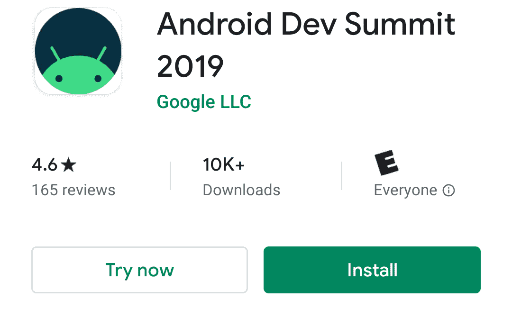

# 现在在 Android #6 中

> 原文：<https://medium.com/androiddevelopers/now-in-android-6-dd7d1aca1361?source=collection_archive---------6----------------------->

Illustration by [Virginia Poltrack](https://twitter.com/VPoltrack)

## 稳定的 AndroidX 库、Droidcon NY 视频、广告事件、手势导航和可访问性文档增强

欢迎来到 Android 中的 Now，这是您对 Android 开发世界中新的和值得注意的事物的持续指导。

# AndroidX:新的稳定版和测试版

几个 AndroidX 库最近变得稳定了。如果你是“在他们做完之前不要和我说话！”这是一个检查这些的好时机。

[房间 2.2.0](https://developer.android.com/jetpack/androidx/releases/room#2.2.0) 这个版本有一些开发者一直要求的东西:

*   预打包的数据库。现在，您可以在 apk 资源中发布一个预填充的数据库，或者从文件中加载一个数据库。[弗洛里纳·蒙特内斯库](https://medium.com/u/d5885adb1ddf?source=post_page-----dd7d1aca1361--------------------------------)几周前在[的一篇文章](/androiddevelopers/packing-the-room-pre-populate-your-database-with-this-one-method-333ae190e680)中讨论了这个特性。
*   更好的关系:SQLite 可以处理多对多关系，但是空间呢？没有那么多…直到现在。
*   [Flow](https://kotlinlang.org/docs/reference/coroutines/flow.html) :为了完成以前版本中开始的协程的使用，Room 增加了对 Flow < T >作为 DAO 返回类型的支持。
*   更快的构建(哦，这是你想要的吗？):Room 现在可以利用注释处理器的增量构建。默认情况下它还没有被启用，但是你可以在你的构建中按照这些指令来启用它，以加快速度，直到它成为默认。

[过渡 1.2.0](https://developer.android.com/jetpack/androidx/releases/transition#1.2.0)
如果你的目标是 API 级别 29，这是一个重要的更新。Android 10 中针对[非 SDK 接口](https://developer.android.com/distribute/best-practices/develop/restrictions-non-sdk-interfaces)所做的一些改变(限制非公共 API 的使用)影响了过渡库正在反思的一些方法。该库已更新为使用新的、经批准的公共方法，因此如果/当您需要时，请更新到此版本。

同样达到稳定的还有 [Loader 1.1.0](https://developer.android.com/jetpack/androidx/releases/loader#1.1.0) 、 [Media2 1.0.1](https://developer.android.com/jetpack/androidx/releases/media2#1.0.1) 、[并发期货 1.0.0](https://developer.android.com/jetpack/androidx/releases/concurrent#1.0.0) 。

几个库最近也打了 [beta](https://developer.android.com/jetpack/androidx/versions/beta-channel) 。如果您避免发布 alpha 版本(而 API 仍在不断变化)，但希望在事情完成并稳定之前进行检查，这可能是调整到这些[活动 1.1.0](https://developer.android.com/jetpack/androidx/releases/activity#1.1.0-beta01) 、[基准 1.0.0](https://developer.android.com/jetpack/androidx/releases/benchmark#1.0.0-beta01) 、[核心 1.2.0](https://developer.android.com/jetpack/androidx/releases/core#1.2.0-beta01) 、[片段 1.2.0](https://developer.android.com/jetpack/androidx/releases/fragment#1.2.0-beta01) 、[生命周期 2.2.0](https://developer.android.com/jetpack/androidx/releases/lifecycle#2.2.0-beta01) 、[生命周期视图模型-保存状态 1.1 的好时机](https://developer.android.com/jetpack/androidx/releases/lifecycle#viewmodel-savedstate-1.0.0-beta01)

# 纽约 Droidcon:视频！

在会议上发言的最大好处之一就是会见所有的开发者，听听他们为 Android 开发的经历。但是对于那些我们不太会说话的人来说…

在会议上发言的另一个好处是将内容传达给开发者。创建演讲材料需要花费大量时间，弄清楚如何仅使用幻灯片、文字和演示来解释复杂的技术事物，因此能够与房间中的人联系来展示内容是非常棒的。但是对于那些不能在房间里或者不能参加会议的人来说…

在会议上发言的另一个好处是可以录音，这样所有的内容都可以和大家分享。

来自纽约 Droidcon】的[视频是最近发布的。现在，无论您身在何处，您都可以舒适地观看所有演示。这几乎就像在会议上一样；就假装你旁边的人在他们的笔记本电脑上打字，你前面的人在他们的手机上，检查 Twitter，然后电子邮件，然后 Slack，然后 Twitter，然后电子邮件，然后 Slack…](https://www.droidcon.com/videos?path=NewYork%20City)

# 面向所有人的 Android 开发峰会！

对于那些不能看广告的人来说，仍然有很多方法可以收看这个活动。

## #阿斯坎德罗

您可以在推特上向我们提问，以便在直播过程中得到解答。下面由[林珈安·藤原](https://medium.com/u/fdba971ca390?source=post_page-----dd7d1aca1361--------------------------------)为你讲述更多。

## 直播

所有的 [Android 开发峰会](https://developer.android.com/dev-summit)会议都将被录制下来，并在活动结束后发布到 YouTube 上。许多会议也将进行现场直播。所以，拿一些爆米花或你选择的谷物/盐/糖/脂肪/口味小吃，坐下来，看着内容在你面前展开。还会有专门为直播创建的其他内容(因为当活动在会议之间休息时，直播也是如此，这难道不是一种拖累吗？)，比如 [#AskAndroid](https://www.youtube.com/watch?v=c_g-hof5N2I) (见上)。

前往 [Android 开发者 YouTube 频道](https://www.youtube.com/user/androiddevelopers)观看活动期间的直播。稍后回到那里观看发布的录音。然后再回到那里去抓住你前两次错过的东西。

## 获取应用程序

如果你想追踪活动的内容，一定要在 Play Store 上安装[Android Dev Summit 2019 app](https://play.google.com/store/apps/details?id=com.google.samples.apps.adssched)。

除了完全安装的 app，还可以尝试 Google Play 即时版，可以获得(快！)在手机上导航至[d.android.com/dev-summit](http://developer.android.com/dev-summit)或 [Play Store](https://play.google.com/store/apps/details?id=com.google.samples.apps.adssched) 并点击“立即尝试”按钮。

# 善意的姿态

克里斯·贝恩斯又发表了两篇文章( [III](/androiddevelopers/gesture-navigation-handling-gesture-conflicts-8ee9c2665c69) 和 [IV](/androiddevelopers/gesture-navigation-immersive-modes-43f2d37a925d) )来帮助解释如何应对 Android 10 的一些变化。

[手势导航:处理手势冲突(III)](/androiddevelopers/gesture-navigation-handling-gesture-conflicts-8ee9c2665c69) 涵盖了应用程序在屏幕边缘附近具有交互式 UI 元素的情况。这篇文章解释了如何知道你的应用程序是否会有问题需要修复，以及如何修复它们。

[手势导航:沉浸式模式(IV)](/androiddevelopers/gesture-navigation-immersive-modes-43f2d37a925d) 涵盖了当应用程序需要进入粘性或非粘性沉浸式(全屏)模式时该做什么，隐藏状态栏和导航栏。

# 可访问性文档改进

docs 团队最近改进了我们的一些可访问性文档。特别是，请查看[让应用程序更易访问](https://developer.android.com/guide/topics/ui/accessibility/apps)和[提高应用程序可访问性的原则](https://developer.android.com/guide/topics/ui/accessibility/principles)(尤其是标签部分，它通过大量示例得到了显著增强)。

# 那么现在…

这次到此为止。去看看 [stable](https://developer.android.com/jetpack/androidx/versions/stable-channel) 和 [beta](https://developer.android.com/jetpack/androidx/versions/beta-channel) AndroidX 库吧！观看纽约市的[展览](https://www.droidcon.com/videos?path=NewYork%20City)！查看[广告网站](https://developer.android.com/dev-summit)、 [#AskAndroid](https://www.youtube.com/watch?v=c_g-hof5N2I) 和[广告应用](https://play.google.com/store/apps/details?id=com.google.samples.apps.adssched)！了解如何在 Android 10 上处理[手势](/androiddevelopers/gesture-navigation-handling-gesture-conflicts-8ee9c2665c69) [导航](/androiddevelopers/gesture-navigation-immersive-modes-43f2d37a925d)问题！阅读[在您的应用中实现更好的可访问性](https://developer.android.com/guide/topics/ui/accessibility/apps)！请尽快回到这里，收听 Android 开发者世界的下一次更新。