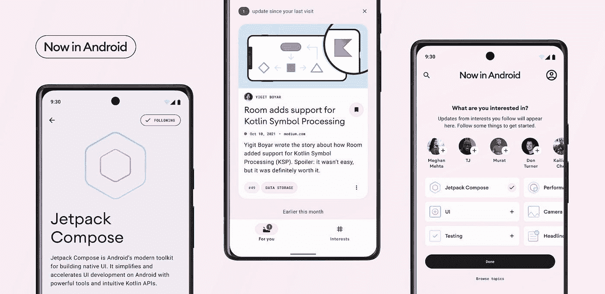

# 现在在 Android # 61 特别谷歌输入/输出 2022 版

> 原文：<https://medium.com/androiddevelopers/now-in-android-61-special-google-i-o-2022-edition-18b953084650?source=collection_archive---------2----------------------->

Illustration by [Virginia Poltrack](https://twitter.com/VPoltrack)

## [Google I/O 2022](https://io.google/2022/) 、[现居安卓](https://android-developers.googleblog.com/2022/05/now-in-android-sample-app-alpha.html)、[安卓 Jetpack](https://developer.android.com/jetpack) + [作曲](https://developer.android.com/jetpack/compose)、[安卓工作室](https://developer.android.com/studio)、[安卓 13](https://developer.android.com/about/versions/13) 、 [Google Play](https://play.google.com/console/about/) 、[大屏幕](https://developer.android.com/jetpack/compose/nav-adaptive)、[电视](https://developer.android.com/tv)、[汽车](https://developer.android.com/cars)、[穿 OS](https://developer.android.com/wear)[Google I/O 2020](https://io.google/2022/)

欢迎来到 Android 中的 Now，这是您对 Android 开发世界中新的和值得注意的事物的持续指导。

Now in Android 61 video within Now in Android blog

# 谷歌输入/输出 2022 概述📛

上周是谷歌输入输出日，这意味着我们有一大堆事情要做；这篇文章可以作为你浏览所有内容的向导。

首先，我们举行了谷歌主题演讲，其中有大量关于 Android 和 Pixel 发展方向的声明。然后，[开发者主题演讲](https://youtu.be/qBkyU1TJKDg?t=345)涵盖了顶级 Android 开发公告，如 [Compose for Wear OS Beta](https://android-developers.googleblog.com/2022/05/announcing-compose-for-wear-os-beta.html) 、 [Compose 1.2 beta](https://android-developers.googleblog.com/2022/05/whats-new-in-jetpack-compose.html) 、 [Health Connect API](https://android-developers.googleblog.com/2022/05/introducing-health-connect.html) ，以及大屏幕更新，包括 [12L](https://developer.android.com/about/versions/12/12L) 和 [13](https://developer.android.com/about/versions/13) 功能以及大屏幕优化谷歌 Play 商店。

Google Keynote — Starting from the Android Section

Developer Keynote — Starting from the Android Section

我们有两个快速视频— [快速浏览新功能](https://www.youtube.com/watch?v=xjnFYBw68WQ)和[# TheAndroidShow:Android 开发人员在 I/O 方面的新功能，在 60 秒内](https://www.youtube.com/watch?v=l0iBPh7k_HQ)带您快速浏览一些顶级材料。关于 I/O 22 以视频形式向 Android 开发者提供了什么的更完整的调查，请查看[Android 中的新功能](https://www.youtube.com/watch?v=Z6iFhczA3NY)演讲。

What’s new in Android — Starting from the beginning

终于，[安卓炉边聊天](https://www.youtube.com/watch?v=wq3Et-D9P5Y)回来了；安卓领导在台上回答你的问题。

#TheAndroidShow: Fireside Q&A @ Google I/O

 [## 谷歌 I/O 的 Android 开发者要知道的 13 件事！

### 没有多少平台可以让你建立一些东西，并立即接触到全球数十亿人，而不是…

android-developers.googleblog.com](https://android-developers.googleblog.com/2022/05/13-things-to-know-for-android-developers-at-google-io.html) 

# 现在在安卓系统中，应用程序⏱️

在这个[博客](https://medium.com/androiddevelopers/tagged/now-in-android)、我们的 [YouTube](https://www.youtube.com/playlist?list=PLWz5rJ2EKKc9AtgKMBBdphI-mrx8XzW56) 系列和一个[播客](https://nowinandroid.libsyn.com/)上可用之后，从今天开始，你可以在 GitHub 上的 Android 应用中查看[的 alpha 版本，该版本在](https://github.com/android/nowinandroid) [Google I/O 2022 开发者主题演讲](https://youtu.be/qBkyU1TJKDg?t=345)中有所介绍🎉

该应用程序展示了最佳实践、有见解的设计以及复杂现实问题的解决方案。它通过一个真实世界应用程序的开源实现来实现这一点，这是一个计划在 Play Store 上发布的工作应用程序，将帮助您及时了解您感兴趣的 Android 开发领域。它仍在大量开发中，功能还没有完成，所以请继续关注这里的更新。

 [## 现在在 Android 中——一个新的、开源的、真实世界的示例应用程序

### 由 Paris Hsu 发布，产品和设计，Android 和 Don Turner，开发人员关系工程师，Android 两年，…

android-developers.googleblog.com](https://android-developers.googleblog.com/2022/05/now-in-android-sample-app-alpha.html) 

# Jetpack、合成和工具🚀

[Jetpack 中的新特性](https://www.youtube.com/watch?v=jTd82lcuHTU)涵盖了对我们创建的 120 多个库的添加和更新，以解决常见问题并简化开发。亮点包括对[房间](https://developer.android.com/jetpack/androidx/releases/room#version_250_2)、[导航](https://developer.android.com/jetpack/androidx/releases/navigation#2.5.0-rc01)、新 [JankStats 库](https://developer.android.com/topic/performance/jankstats)以及 Jetpack Compose1.2 beta 的更新。Compose 1.2 包括改进的嵌套滚动互操作、对可下载字体的支持、对[懒惰布局](https://www.youtube.com/watch?v=1ANt65eoNhQ)的改进支持等等。

 [## Jetpack Compose 的新功能

### Jetpack Compose 1.0 发布已经快一年了，在这段时间里，我们看到社区采用了它…

android-developers.googleblog.com](https://android-developers.googleblog.com/2022/05/whats-new-in-jetpack-compose.html) 

这方面的其他演讲包括:[撰写中的懒惰布局](https://www.youtube.com/watch?v=1ANt65eoNhQ)、[片段:好的(不赞成使用的)部分](https://www.youtube.com/watch?v=OE-tDh3d1F4)和【Jetpack 撰写的性能最佳实践。

Lazy layouts in Compose

Fragments: The good (non-deprecated) parts

Performance best practices for Jetpack Compose

我们也有两个工作室:[撰写](https://www.youtube.com/watch?v=kyH01Lg4G1E)中的基本布局和[使用 Jetpack 撰写](https://www.youtube.com/watch?v=PMMY23F0CFg)中的状态。还有一个相关的 Android 开发者故事，关于 Airbnb 如何使用 Jetpack Compose。

Workshop: Basic layouts in Compose

Workshop: State in Jetpack Compose

Android Developer Story: Airbnb uses Jetpack Compose to empower devs to do their best work

 [## Airbnb 使用 Jetpack Compose 使开发人员能够做最好的工作

### 自 2007 年以来，Airbnb 已经发展到在全球连接超过 400 万主机和超过 10 亿客人。一…

android-developers.googleblog.com](https://android-developers.googleblog.com/2022/05/airbnb-uses-jetpack-compose.html) 

广受欢迎的[Android 开发工具中的新特性](https://www.youtube.com/watch?v=RFv8GkLd5OY)讲座介绍了 Android Studio 和工具路线图，展示了一些新特性，并涵盖了关键的产品更新。 [Android Studio Dolphin Beta](https://androidstudio.googleblog.com/2022/05/android-studio-dolphin-beta-1-now.html) 包括 [Logcat v2](https://developer.android.com/studio/preview/features/#gmd) 、 [WearOS](https://developer.android.com/studio/preview/features/#wear-emulator-toolbar) 和 [Compose enhancements](https://developer.android.com/studio/preview/features/#compose_animation_coordination) 以及[gradled managed virtual devices](https://developer.android.com/studio/preview/features/#gmd)，而 [Electric Eel Canary](https://developer.android.com/studio/preview/features/#2022.1.1) 增加了 [SDK Insights](https://developer.android.com/studio/preview/features/#sdk-insights) 、 [Live Edit](https://developer.android.com/studio/preview/features/#live_edit) 、 [Visual Lint](https://developer.android.com/studio/preview/features/#visual-linting) 以及[多预览 Jetpack Compose](https://developer.android.com/studio/preview/features/#compose_multipreview_annotations) 、[设备](https://developer.android.com/studio/preview/features/#device-mirroring)

What’s new in Android development tools

# 大屏幕💻

Android 在 I/O 领域大放异彩，通过四场讲座和一个研讨会，带您从设计到实现大屏幕。[为大屏幕设计应用](https://www.youtube.com/watch?v=pvdqeIM6mh0)讲述了如何有目的地扩展和重组你的 UI，涵盖了我们大屏幕的三个规范布局起点。

Designing apps for large screens

[了解如何为更大的屏幕更新您的应用](https://www.youtube.com/watch?v=1ZOQ_-XPSv8)介绍我们提供的技术，以使为更大的屏幕构建[更容易，例如](https://developer.android.com/jetpack/compose/nav-adaptive)[窗口大小类](https://developer.android.com/guide/topics/large-screens/support-different-screen-sizes#window_size_classes)、[滑动窗格布局](https://developer.android.com/guide/topics/ui/layout/twopane)、[导航轨道](https://m3.material.io/components/navigation-rail/overview)、用于拖放的 [Jetpack DropHelper](https://developer.android.com/reference/androidx/draganddrop/DropHelper) 实用程序类，以及可调整大小和桌面模拟器。

Learn how to update your app for the larger screen

[为所有屏幕尺寸实现 Android 应用](https://www.youtube.com/watch?v=MPwf5DklKp0)探索开发最佳实践，重点是 Jetpack 合成、导航、管理状态和测试。

Implementing Android apps for all screen sizes

[所有屏幕的输入](https://www.youtube.com/watch?v=XtImpP23uhE)包括支持键盘、鼠标和手写笔等输入方法的最佳实践。

Input for all screens

最后，在[使用 SlidingPaneLayout](https://www.youtube.com/watch?v=2rtLdF9UFqg) 构建自适应布局研讨会中，您将学习如何使用 [SlidingPaneLayout](https://developer.android.com/reference/androidx/slidingpanelayout/widget/SlidingPaneLayout) 向混合撰写和查看应用程序添加列表和细节布局。还有一个相关的 Android 开发者关于易贝的平板电脑优化 T21 的故事。

Building an adaptive layout with SlidingPaneLayout

Android Developer Story: eBay gets a 4.7 Google Play rating

Tablet moments, built by you!

# 平台🚉

我们发布了 Android 13 的[第二个测试版，并宣布](https://android-developers.googleblog.com/2022/05/second-beta-of-android-13.html) [Android 13 测试版](https://developer.android.com/about/versions/13/get)可以在华硕、联想、诺基亚、一加、Oppo、Realme、夏普、TECNO、Vivo、小米和中兴的一系列设备上测试。

 [## Android 13 的第二个测试版

### 在 Google I/O 上，我们讨论了对开发者来说是全新的一切，包括 Android 13 的第二个测试版，它…

android-developers.googleblog.com](https://android-developers.googleblog.com/2022/05/second-beta-of-android-13.html) 

[开发以用户为中心的隐私应用](https://www.youtube.com/watch?v=opGkUl8C-HM)涵盖了 Android 13 的新功能，如[通知运行时权限](https://developer.android.com/about/versions/13/changes/notification-permission)、[免权限照片拾取器](https://developer.android.com/about/versions/13/features/photopicker)，以及用于[撤销权限的 API](https://developer.android.com/about/versions/13/features#developer-downgradable-permissions)。

Developing privacy user-centric apps

在[构建隐私沙箱](https://www.youtube.com/watch?v=NKz5oT6kXI4)的过程中，一个由[隐私沙箱](https://developer.android.com/design-for-safety/privacy-sandbox)团队成员组成的小组概述了整个行业为实现 Android 和网络隐私所做的努力，并回答了一些流行的问题。[Android 上的隐私沙箱概述](https://www.youtube.com/watch?v=pQdzFbmlvOo)特别关注 Android 的主要变化和开发人员的技术考虑，涵盖了 [SDK 运行时](https://developer.android.com/design-for-safety/privacy-sandbox/sdk-runtime)和隐私保护 API，用于定位[用户兴趣](https://developer.android.com/design-for-safety/privacy-sandbox/topics)，维护[自定义受众](https://developer.android.com/design-for-safety/privacy-sandbox/fledge)，以及[属性报告](https://developer.android.com/design-for-safety/privacy-sandbox/attribution)。

Building the Privacy Sandbox

Overview of the Privacy Sandbox on Android

[系统回退基础](https://www.youtube.com/watch?v=Elpqr5xpLxQ)涵盖了 Android 13 中新的[选择加入 API，让你提前告诉系统你正在处理回退，使回退体验更加可预测和流畅；在针对 Android 14 时，此行为计划作为默认行为。](https://developer.android.com/about/versions/13/features/predictive-back-gesture)

Basics for System Back

[在 Android 上运行后台工作的最佳实践](https://www.youtube.com/watch?v=t1_8WSEguDY)解释了后台工作如何在 Android 13 中[改变，以提高生态系统中设备的一致性，以及新的](https://developer.android.com/about/versions/13/changes/battery) [JobScheduler](https://developer.android.com/reference/android/app/job/JobScheduler) 功能、对应用程序限制的更改、 [Firebase Cloud Messaging](https://firebase.google.com/docs/cloud-messaging) 等。

Best practices for running background work on Android

[Android 机器学习的新功能](https://www.youtube.com/watch?v=tG6hiQNMLmE)涵盖了在您的应用中使用[设备上 ML](https://developer.android.com/ml) 的两种主要方式的更新。 [ML 套件](https://developers.google.com/ml-kit)，我们的即用型移动 ML 堆栈，以及 Android 的定制 ML 堆栈。ML Kit 支持跨关键 API 表面的加速，并扩展了 API 功能，而定制 ML 堆栈包括对 Google Play 服务中 [TensorFlow lite 的测试支持，Android](https://www.tensorflow.org/lite/android/play_services) 的新[加速服务，以及可更新神经网络 API 和 TensorFlow lite 委托的推出。Google Play 服务中新的](https://developer.android.com/ml/early-access) [Google Code Scanner API](https://developers.google.com/ml-kit/code-scanner) 允许您的应用程序请求条形码扫描，而无需相机许可。

What’s new in Android machine learning

[Android Camera](https://www.youtube.com/watch?v=n8mubjwEVxQ)中的新功能提供了我们在 [CameraX](https://developer.android.com/training/camerax) 中正在做的事情的…快照，例如支持[视频捕捉](https://developer.android.com/training/camerax/video-capture)和所见即所得相机控制，以及 Android 13 中正在发生的事情，支持 HDR 视频捕捉，而[Android media 中的新功能](https://www.youtube.com/watch?v=Ba70zmFZgk0)涵盖了我们如何处理 HDR 媒体、空间音频支持、性能等级 13，以及我们在 [ExoPlayer](https://developer.android.com/guide/topics/media/exoplayer) 、【T10 您可以流式播放[如何使用 ExoPlayer 优化媒体流](https://www.youtube.com/watch?v=Hw0Jeq42FNU)研讨会，使用 Media3 ExoPlayer 库向您的应用添加媒体流，包括设置播放、支持自适应流式播放和响应播放事件。

What’s new in Android Camera

What’s new in Android media

How to optimize media streaming with ExoPlayer

[Android 辅助功能的新功能](https://www.youtube.com/watch?v=Z_Ve29skMr8)涵盖了我们围绕辅助功能对 Android 进行的更新，包括 Android 13 内置对盲文显示器的支持，自动总结照片内容(Lookout)，在嘈杂环境中聆听(声音放大器)等。[开发者可访问性的新特性](https://www.youtube.com/watch?v=6LsaP6oKxMY)演讲详细介绍了如何为每个人提高应用的可用性，涵盖了 Jetpack Compose 和 Android Studio 的可访问性特性。

What’s new in Android accessibility

What’s new in Accessibility for developers

[应用性能的新特性](https://www.youtube.com/watch?v=DYdHLqLVspY)包括使用 Android Studio、Perfetto、Android Vitals 和 Macrobenchmark 来帮助了解性能。它演示了使用基线配置文件来帮助指导 Android 的提前编译，以提高应用程序的启动速度并减少 janky 帧。它还涵盖了 Android 12+上的非捆绑 ART 运行时，包括对[open JDK API](https://developer.android.com/about/versions/13/features#core-libraries)的更新，以及包括新的垃圾收集器、更快的 JNI 调用、引用处理和解释在内的性能更新。

最后，[介绍谷歌钱包和开发者 API 功能](https://youtu.be/2gTCghy-dU4)详细介绍了我们正在为 Android 和 Chrome 用户构建一个首要的、安全的数字钱包，以及如何使用[谷歌钱包 API](https://developers.google.com/wallet) 来数字化门票、积分卡和更多内容，发展之前的 Google Pay Passes API。

Introducing Google Wallet and developer API features

# 一起更好📱🫶🏽 ⌚📺🚗🔈

Android 让你可以为电视、手表、汽车和智能扬声器制作产品，让手机成为互联世界的中心。我们希望创造一种更好的合作体验，我们需要你的帮助。首先是使用 [Android 解决方案实现跨设备的无缝登录](https://www.youtube.com/watch?v=xghjqgj4peA)，使用诸如 One Tap、Passkeys 和 Block Store 之类的 APIs 这使用户能够轻松地在多种类型的设备上工作，并使他们能够轻松地更换设备。

Android solutions for seamless sign-in across devices

[构建强大的多设备体验](https://www.youtube.com/watch?v=H6UxTnghkMw) 讲座涵盖了利用超宽带、BLE 和 Wi-Fi 实现多设备体验的新库；它支持设备发现/唤醒、安全通信和多设备传输，以构建无缝切换体验。

Build power, multi-device experiences

[为 Wear OS 创建美观、节能的应用](https://www.youtube.com/watch?v=jpUVamtoKOs)将带您了解 Wear OS compose 测试版，以及健康服务 API 如何帮助您在不同的底层硬件上构建节能的健康和健身应用。

Create beautiful, power-efficient apps for Wear OS

 [## 宣布为 Wear OS Beta 编写！

### 今天，我们将发布 Compose for Wear OS 的测试版，这是一款现代的声明式 UI 工具包，旨在帮助…

android-developers.googleblog.com](https://android-developers.googleblog.com/2022/05/announcing-compose-for-wear-os-beta.html) 

谈到健康，Android 在 health Connect 中介绍新的健康和健身 API 的[讲座涵盖了 Health Connect alpha 如何将 Google Fit、Fitbit 和三星 Health 整合到一个统一的 API 中。](https://www.youtube.com/watch?v=d14GVcnbTeo)

Introducing new API’s for health and fitness in Health Connect by Android

 [## 推出 Health Connect，这是一款面向 Android 应用程序开发人员的新 API，用于安全地访问用户健康状况…

### 从使用 MyFitnessPal 帮助您记录您的饮食，到使用 Withings、应用程序和……

android-developers.googleblog.com](https://android-developers.googleblog.com/2022/05/introducing-health-connect.html) 

【Android TV 和 Google TV 的新功能概述了 Android 12 的改进，并带您了解 Android 13 的新功能，如扩展的画中画支持、AudioManager 变化等。

What’s new with Android TV and Google TV

 [## 谷歌电视和安卓电视操作系统的新功能

### Paul Lammertsma，开发人员关系工程师今天，娱乐内容比以往任何时候都多。在…

android-developers.googleblog.com](https://android-developers.googleblog.com/2022/05/whats-new-with-google-tv-android-tv-os.html) 

【Android for cars 的新特性涵盖了我们在 Android Auto、Android Automotive OS 以及即将发布的 1.3 版汽车应用程序库方面的进展和更新；1.3 版本增加了跨所有地图模板的地图交互性，导航到多个目的地，动态更新兴趣点列表目的地，以及针对交通摄像头/新骑手请求等事件的警报。

 [## 汽车用 Android 有什么新功能

### 在谷歌，我们在汽车领域的工作一直以创造安全无缝的互联体验为愿景……

android-developers.googleblog.com](https://android-developers.googleblog.com/2022/05/whats-new-with-android-for-cars.html) 

# Google Play ▶️

[Google Play](https://www.youtube.com/watch?v=d8mn0pmgvGw)中的新功能涵盖了隐私和安全方面的关键 Play 更新，包括 [Google Play SDK 索引](https://developer.android.com/distribute/sdk-index)、 [Play 应用程序签名](https://play.google.com/console/about/keymanagement/)转向使用 [Google 云密钥管理](https://cloud.google.com/security-key-management)、年度密钥轮换、 [Play Integrity API](https://developer.android.com/google/play/integrity) 、[数据安全部分](https://support.google.com/googleplay/android-developer/answer/10787469?hl=en)和[隐私沙箱](https://developer.android.com/design-for-safety/privacy-sandbox)。它经历了应用程序质量计划，如 [Google Play 开发者报告 API](https://developers.google.com/play/developer/reporting) 、[Android Vitals](https://developer.android.com/topic/performance/vitals)Crashlytics 集成、 [Reach 和设备](https://play.google.com/console/about/reachanddevices/)中的收入和收入增长指标，以及经过彻底改革的设备目录，并针对不同的外形规格进行了测试。最后，它详细介绍了我们为优化收购、参与和盈利所做的工作，例如定制商店列表的更新、商店列表实验、LiveOps (beta)的更新，以及新的商业更新，例如新的支付方式、扩展的超低价位、更灵活的订阅和应用内订户消息。Google Play 上的[应用质量](https://www.youtube.com/watch?v=pYo23Pqxnxg)和[使用新的获取、参与和货币化工具在 Google Play 上取得成功](https://www.youtube.com/watch?v=7ky2PZl16i4)会议更详细地涵盖了这些领域。

 [## Google Play 的新功能

### 在今年的 Google I/O 大会上，我们重点介绍了三种可以帮助您在 Google 上继续发展业务的主要方式…

android-developers.googleblog.com](https://android-developers.googleblog.com/2022/05/whats-new-in-google-play.html)  [## 新的 Google Play SDK 索引有助于您为自己的应用选择合适的 SDK

### 应用程序开发人员依靠 SDK 来为他们的应用程序和游戏集成关键功能和服务。SDK 必不可少…

android-developers.googleblog.com](https://android-developers.googleblog.com/2022/05/new-google-play-sdk-index.html)  [## 新的灵活工具来发展您的订阅业务

### 数字订阅仍然是开发者在 Google Play 上赚钱的增长最快的方式之一。作为…

android-developers.googleblog.com](https://android-developers.googleblog.com/2022/05/new-ways-to-sell-subscriptions-on-google-play_0530335598.html) 

# 助理🦮

我们还进行了两次会谈，内容涉及如何将 Android widgets 与 Google Assistant 集成，以及如何将 Google Assistant 集成到汽车 Android 中。

How to integrate Android widgets with Google Assistant

Integrate Google Assistant into Android for cars

# [安卓发布](https://developer.android.com/jetpack/androidx/versions/all-channel)🚀

让我们来看看自 Android 版《Now》最后一集以来我们的 Android 版本[中的一些亮点。](https://developer.android.com/jetpack/androidx/versions/all-channel)

如前所述，Jetpack [Compose 1.2 beta 1](https://developer.android.com/jetpack/androidx/releases/compose-foundation#1.2.0-beta01) 与 [Wear Compose 1.0 beta 1](https://developer.android.com/jetpack/androidx/releases/wear-compose#1.0.0-beta01) 一同推出。为了帮助你使用大屏幕，我们发布了[拖放版本 1.0](https://developer.android.com/jetpack/androidx/releases/draganddrop#1.0.0) 。

[跟踪版本 1.1.0](https://developer.android.com/jetpack/androidx/releases/tracing#1.1.0) 已发布，在 API 29 中引入 profileable manifest 标记之前，添加了 Trace.forceEnableAppTracing()以强制启用不可调试版本上的应用程序跟踪部分捕获。

[Health-Connect-Client 版本 1.0 alpha01](https://developer.android.com/jetpack/androidx/releases/health#health-connect-client-1.0.0-alpha01) 出来了，这是一个新的 API，用于读取/写入其他应用程序共享的健身和健康记录。

# [亚行播客剧集](https://adbackstage.libsyn.com/) 🎙

自从上一期《现在》在安卓发布以来，已经有一集《安卓开发者后台》发布了。请点击下面的链接，或在您最喜欢的播客客户端查看:

在这一集中，Tor、Chet 和 Romain 与 Play 团队的 Jon 和 Andrew 讨论了 Play Store 应用程序，该应用程序最近进行了重大重构。Jon 和 Andrew 向您介绍了他们这样做的原因，对其架构的影响，他们遇到了什么问题，以及他们为什么决定在 UI 层采用 Jetpack Compose。

# 那么现在…

这就是这次与 [Google I/O 2022](https://io.google/2022/) 、现在安卓应用中的开源 alpha、[安卓 Jetpack](https://developer.android.com/jetpack) 、 [Jetpack 作曲](https://developer.android.com/jetpack/compose)、[安卓工作室](https://developer.android.com/studio)、[安卓 13](https://developer.android.com/about/versions/13) 、 [Google Play](https://play.google.com/console/about/) 、[大屏幕](https://developer.android.com/jetpack/compose/nav-adaptive)、[电视](https://developer.android.com/tv)、[汽车](https://developer.android.com/cars)、【请尽快回到这里，等待 Android 开发者世界的下一次更新。