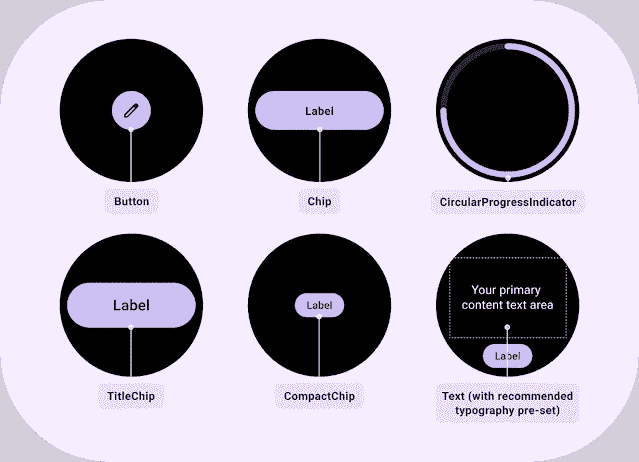

# 现在在 Android #67 中

> 原文：<https://medium.com/androiddevelopers/now-in-android-67-fdfc7ab8827c?source=collection_archive---------1----------------------->

Illustration by [Virginia Poltrack](https://twitter.com/VPoltrack)

## [Cross device SDK 开发者预览版](https://android-developers.googleblog.com/2022/07/announcing-cross-device-SDK-Developer-Preview-for-Android.html)、 [CameraX 1.2 Beta](https://android-developers.googleblog.com/2022/08/camerax-12-is-now-in-beta.html) 、 [WearOS Material Tiles 库](https://android-developers.googleblog.com/2022/08/wear-os-tiles-material-library-build-tiles-fast.html)、[Play Console 中的深度链接监视器](https://android-developers.googleblog.com/2022/08/monitor-your-deep-links-in-one-place.html)、[Android 上的 kot Lin 5 年](https://android-developers.googleblog.com/2022/08/celebrating-5-years-of-kotlin-on-android.html)等等。

欢迎来到 Android 中的 Now，这是您对 Android 开发世界中新的和值得注意的事物的持续指导。

# 第 67 集视频和播客

*现在安卓*也提供视频和播客。

# [跨设备 SDK 开发者预览](https://android-developers.googleblog.com/2022/07/announcing-cross-device-SDK-Developer-Preview-for-Android.html)📱↔️📱

我们推出了 Android 开发人员预览版的跨设备 SDK，它允许您构建丰富的多设备体验，抽象出与设备发现、身份验证和连接协议相关的复杂性。

初始版本包含的 API 允许您轻松找到附近的设备，在辅助设备上启动应用程序，通过加密、低延迟的双向数据共享授权点对点通信，以及跨设备传输或扩展应用程序的用户体验。目前的预览版支持安卓手机和平板电脑；Cross device SDK 将在稍后用于其他 Android surfaces 和非 Android 操作系统。

 [## 宣布跨设备 SDK 开发者预览版，用于在 Android 上构建丰富的多设备体验

### 由 Alex Rocha 发布-开发者关系工程师经理，Ryan Ausanka-Crues - Eng 经理，多设备…

android-developers.googleblog.com](https://android-developers.googleblog.com/2022/07/announcing-cross-device-SDK-Developer-Preview-for-Android.html) 

# [CameraX 1.2 Beta](https://android-developers.googleblog.com/2022/08/camerax-12-is-now-in-beta.html) 📸

CameraX 1.2 版本目前处于测试阶段。它引入了零[快门延迟捕捉模式](https://developer.android.com/reference/androidx/camera/core/ImageCapture?hl=zh-tw#CAPTURE_MODE_ZERO_SHUTTER_LAG)以及[mlki analyzer](https://developer.android.com/reference/androidx/camera/mlkit/vision/MlKitAnalyzer)，一种图像分析的实现。为您处理大部分 ML 试剂盒设置的分析仪。MlKitAnalyzer 与 cameraController 和 cameraProvider 工作流一起工作，甚至可以处理 ML 工具包输出和预览视图之间的坐标转换。零快门延迟通过使用环形捕捉缓冲区来获得最接近实际按下快门按钮的帧，从而大大减少了受支持设备上的图像捕捉延迟。

 [## CameraX 1.2 现在处于测试阶段

### 作为 Android Jetpack 的一部分，CameraX 库使复杂的相机功能在一个易于使用的 API 中可用…

android-developers.googleblog.com](https://android-developers.googleblog.com/2022/08/camerax-12-is-now-in-beta.html) 

# [使用 WearOS 材料瓷砖库快速构建瓷砖](https://android-developers.googleblog.com/2022/08/wear-os-tiles-material-library-build-tiles-fast.html) ⌚

磁贴是 Wear OS 上使用最多的表面之一，为用户提供了快速完成工作所需的信息和操作。我们推出了 Tiles Material library，允许您使用预构建的材质组件，如[按钮](https://developer.android.com/reference/androidx/wear/tiles/material/Button)、[芯片](https://developer.android.com/reference/androidx/wear/tiles/material/Chip)、[紧凑芯片](https://developer.android.com/reference/androidx/wear/tiles/material/CompactChip)、[标题芯片](https://developer.android.com/reference/androidx/wear/tiles/material/TitleChip)、[圆形进度指示器](https://developer.android.com/reference/androidx/wear/tiles/material/CircularProgressIndicator)和[文本](https://developer.android.com/reference/androidx/wear/tiles/material/Text)，以及布局，如[主布局](https://developer.android.com/reference/androidx/wear/tiles/material/layouts/PrimaryLayout)、[边缘内容布局](https://developer.android.com/reference/androidx/wear/tiles/material/layouts/EdgeContentLayout)、[多按钮布局](https://developer.android.com/reference/androidx/wear/tiles/material/layouts/MultiButtonLayout)和[多槽布局](https://developer.android.com/reference/androidx/wear/tiles/material/layouts/MultiSlotLayout)[与](https://developer.android.com/reference/androidx/wear/tiles/material/layouts/MultiSlotLayout)[瓷砖设计套件](https://developer.android.com/training/wearables/design/download#tiles-design-kit)一起，它们帮助您轻松遵循[瓷砖设计指南](https://developer.android.com/training/wearables/design/tiles)。

 [## 穿 OS 瓷砖素材库:建瓷砖，快。

### 由产品经理 Anna Bernbaum、开发人员关系工程师 Ataul Munim 发布，我们很高兴地宣布…

android-developers.googleblog.com](https://android-developers.googleblog.com/2022/08/wear-os-tiles-material-library-build-tiles-fast.html) 

# [游戏控制台中新的深层链接监视器](https://android-developers.googleblog.com/2022/08/monitor-your-deep-links-in-one-place.html)🔗

深层链接允许你通过接受来自外部来源(包括网络)的流量，让你的用户直接访问[应用内内容](https://developer.android.com/training/app-links/deep-linking)。因为回答像“这个 URL 是深度链接的吗？”或者“为什么这个深层链接不起作用？”可能很难回答，许多应用程序配置了部分、断开或没有深层链接。为了让您更容易保持深层链接的良好状态，我们推出了一个新的专用[游戏控制台页面](http://play.google.com/console/about/deeplinks)，它可以让您快速而全面地了解您当前的设置，并提供工具来帮助您快速识别和解决问题。

 [## 在这个新的游戏控制台页面的一个地方监控你所有的深层链接

### 深层链接是一种很好的方式，可以通过接受…

android-developers.googleblog.com](https://android-developers.googleblog.com/2022/08/monitor-your-deep-links-in-one-place.html) 

# [庆祝 Kotlin 在 Android 上运行 5 周年](https://android-developers.googleblog.com/2022/08/celebrating-5-years-of-kotlin-on-android.html)🎉

五年前，Android [宣布官方支持](https://www.youtube.com/watch?v=9C3-HcP5xBI)可互操作的、成熟的、生产就绪的开源 Kotlin 编程语言。从那以后，JetBrains 和 Google 一直围绕 Kotlin 的开发展开合作， [Kotlin 基金会](https://kotlinfoundation.org/)由两家公司共同创立；开发语言和工具的 JetBrains 为 Kotlin 提供了出色的 IDE 支持。我们收集了一些帖子和视频来庆祝这一旅程，并与许多帮助实现这一目标的人一起阐述了 Kotlin 在 Android 上的里程碑。

 [## 庆祝 Kotlin 在 Android 上运行 5 周年

### 五年前，在 2017 年谷歌 I/O 主题演讲上，我们做了一件从未做过的事情:我们宣布正式…

android-developers.googleblog.com](https://android-developers.googleblog.com/2022/08/celebrating-5-years-of-kotlin-on-android.html)  [## Kotlin 在 Android #短裤上的 5 年

### 我们正在庆祝 Kotlin 对 Android 的 5 年支持！加入我们，用标签分享你的科特林故事…

www.youtube.com](https://www.youtube.com/shorts/PhqMvUQURc4)  [## Kotlin 在 Android 上的 5 年——扩展访谈

### 我们在博客上发表了一篇庆祝文章，以纪念官方支持科特林五周年…

medium.com](/androiddevelopers/5-years-of-kotlin-on-android-the-extra-bits-a7dcd17480a9) 

# [狂技能:性能](https://goo.gle/performance)🏎️💨

关于性能的 [MAD 技能系列继续，](https://goo.gle/performance) [Ben](https://medium.com/u/65fe4f480b1c?source=post_page-----fdfc7ab8827c--------------------------------) 的[博客文章](/androiddevelopers/improving-performance-with-baseline-profiles-fdd0db0d8cc6)和 Tomá的[视频](/androiddevelopers/improving-performance-with-baseline-profiles-fdd0db0d8cc6)介绍了如何使用[宏基准库](https://developer.android.com/topic/performance/benchmarking/macrobenchmark-overview)和 UIAutomator 来帮助[为您生成基准概要文件](https://developer.android.com/reference/kotlin/androidx/benchmark/macro/junit4/BaselineProfileRule)。基线配置文件通过提前优化关键代码路径来帮助您的应用程序更快地启动和运行，从而实现更流畅的用户体验。

 [## 使用基线配置文件提高性能

### 基线概况的快速概述

medium.com](/androiddevelopers/improving-performance-with-baseline-profiles-fdd0db0d8cc6) 

对于正在进行的内容，一定要查看 YouTube 上的 [MAD 技能播放列表](https://www.youtube.com/playlist?list=PLWz5rJ2EKKc91i2QT8qfrfKgLNlJiG1z7)，Medium 上的[文章](https://medium.com/androiddevelopers/tagged/mad-skills)，或者指向所有内容的[这个方便的登陆页面](https://developer.android.com/series/mad-skills)。

# AndroidX 释放🚀

在 [AndroidX](https://developer.android.com/jetpack/androidx/versions) 中， [Wear Compose 版本 1.0.1](https://developer.android.com/jetpack/androidx/releases/wear-compose#1.0.1) 发布修复了 ScalingLazyColumn 中的一个逻辑 bug。如前所述，我们发布了[Wear Tiles 1.1 版](https://developer.android.com/jetpack/androidx/releases/wear-tiles#1.1.0)。 [Webkit 版本 1.5](https://developer.android.com/jetpack/androidx/releases/webkit#1.5.0) 增加了 setAlgorithmicDarkeningAllowed，并增加了为已配置的代理设置 URL 允许列表的支持。

在这个[链接](https://developer.android.com/jetpack/androidx/versions/all-channel)查看所有的 AndroidX 版本。

# 录像📹

在视频中，我们报道了抖音如何使用 Android 工具来改善应用启动并使用户体验更加无缝，以及它如何影响应用使用和 Play Store 评级。

我们还推出了围绕设计儿童应用的 Google Play Academy 课程，确保这些应用有趣、可用，并且适合他们的目标年龄组。该课程涵盖了全美教师使用的对 Google Play 上的儿童应用进行评级的框架，因此您可以了解他们在寻找什么来帮助您的应用脱颖而出。

# 文章📚

Avish，我们的夏季 Android DevRel 工程师实习生，讨论了利用转换通用 Android Media Player (UAMP)媒体播放示例应用程序来编写、更新它以使用 Media3 等现代库的经验来创建 Android 媒体应用程序的现代方法。

 [## 疯狂迷恋媒体

### 面向媒体应用的现代 Android 开发(MAD)|来见见我们的暑期 Android DevRel 工程师实习生 Avish Parmar！

medium.com](/androiddevelopers/mad-about-media-f536f7d601c) 

[Terence](https://medium.com/u/85891321ddec?source=post_page-----fdfc7ab8827c--------------------------------) 介绍了在面向 Android 13 之前，如何通过通知来改善应用程序的用户体验，以及如何在不将不同的操作系统版本更新到设备上的情况下，测试应用程序与权限的集成。

 [## 采用 Android 通知权限的顶级技巧

### 过多的通知是全球用户的数字福利问题。在 Android 13 中，我们正在帮助用户收回…

medium.com](/androiddevelopers/top-tips-for-adopting-androids-notification-permission-bf69afd677b8) 

[本](https://medium.com/u/84718b19bc40?source=post_page-----fdfc7ab8827c--------------------------------)在 Jetpack Compose 伴奏者上写了一个常见问题，这是一个为新的 Compose APIs 提供的类似实验室的环境。伴奏者用于帮助填补 Compose toolkit 中已知的空白，试验新的 API，并收集构建 Compose 库的开发经验。伴奏者的目标是最终将库引入官方工具包。(此时它们将被弃用并从伴奏中移除)伴奏中的当前库包括对流程布局、页面、导航过渡和滑动刷新的支持。

 [## 一个常见问题。

### 伴奏者是一组旨在补充 Jetpack Compose 功能的库，这些功能是…

medium.com](/androiddevelopers/jetpack-compose-accompanist-an-faq-b55117b02712) 

# 那么现在…👋

这一次就到此为止了，有 [Cross device SDK 开发者预览版](https://android-developers.googleblog.com/2022/07/announcing-cross-device-SDK-Developer-Preview-for-Android.html)、 [CameraX 1.2 Beta](https://android-developers.googleblog.com/2022/08/camerax-12-is-now-in-beta.html) 、 [WearOS Material Tiles 库](https://android-developers.googleblog.com/2022/08/wear-os-tiles-material-library-build-tiles-fast.html)的发布、Play Console 中新的[deep links monitor](https://android-developers.googleblog.com/2022/08/monitor-your-deep-links-in-one-place.html)、[Android 上 Kotlin 的 5 年](https://android-developers.googleblog.com/2022/08/celebrating-5-years-of-kotlin-on-android.html)、MAD Skills:具有微基准的基线配置文件上的性能、 [AndroidX](https://developer.android.com/jetpack/androidx/versions) 更新等等。请尽快回到这里，等待 Android 开发者世界的下一次更新。