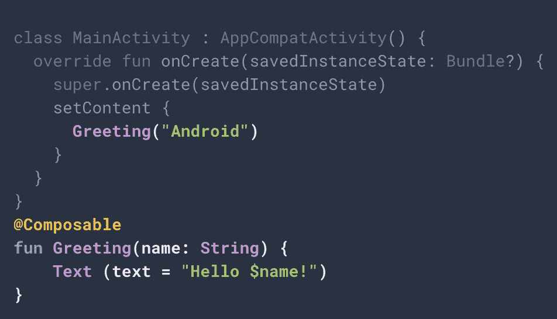
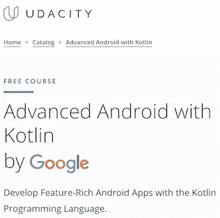
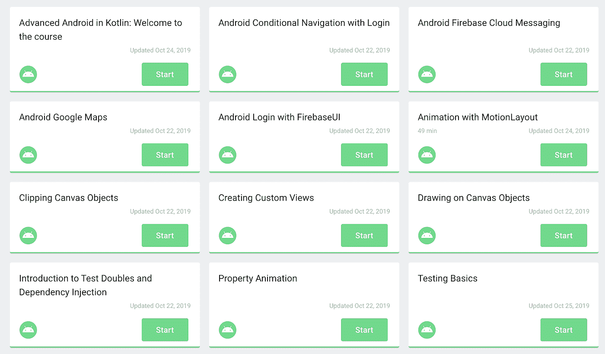
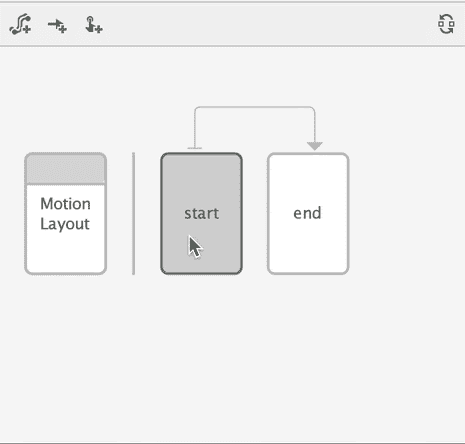
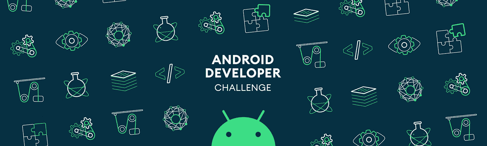

# 现在在 Android #7 中

> 原文：<https://medium.com/androiddevelopers/now-in-android-7-4b9ce75498a8?source=collection_archive---------5----------------------->

## 广告视频、AndroidX 库发布、Jetpack Compose 开发者预览、课程和代码实验室、Android Studio 4.0 canary 和新的 Android 开发者挑战

Illustration by [Virginia Poltrack](https://twitter.com/VPoltrack)

欢迎来到 Android 中的 Now，这是您对 Android 开发世界中新的和值得注意的事物的持续指导。在过去的几周里发生了很多事情，尤其是 Android Dev 峰会和几乎同时推出的各种活动。看一看…

# Android 开发峰会(ADS)视频

All of the ADS sessions are now available in a handy playlist

我知道，我知道——你已经厌倦了获取这次会议的最新消息——“赶紧结束吧！让它发生！”

嗯，我们做到了。它很可爱。更重要和相关的是，这次活动产生了大量值得一看的视频。

## [发展峰会视频](https://www.youtube.com/playlist?list=PLWz5rJ2EKKc_xXXubDti2eRnIKU0p7wHd)

许多会议都是现场直播的，而且都是录音的。抓起一些爆米花，加载[播放列表](https://www.youtube.com/playlist?list=PLWz5rJ2EKKc_xXXubDti2eRnIKU0p7wHd)，尽情观看所有的东西。

请注意，Android 版《Now》的[第一集](/androiddevelopers/whats-now-in-android-d78061ac8b92)(未编号的第 0 集)对来自 IO 的视频进行了分类，以使它们更容易观看。我不打算在这里这样做，因为…这是所有的 Android！你会想全部看完的！

## [直播第 1 天](https://youtu.be/s596l-aTDYI)、[直播第 2 天](https://youtu.be/JgpCrYkC1OM)

来自会议的直播流不仅包含上述播放列表中的几乎所有会议，还包括专门为直播流创建的内容，以便在休息时播放，包括:

*   #AskAndroid 访谈会议，来自平台团队的各种人员回答了您关于 Android 的问题(工具、UI、撰写等！)现场直播，休会期间
*   针对 Webkit 和 Android Studio 等各种主题为会议创建的简短技术演示
*   关于 Android 开发者和开发公司的故事

*(注意:我相信 livestream 中的奖励内容很快就会单独发布，但在此期间，您可以在这些 livestream 录制中查看这些内容)*。

# AndroidX 库发布

一些主要组成部分上周达到了重要的里程碑。

## [稳定](https://developer.android.com/jetpack/androidx/versions/stable-channel)

[2 . 2 . 1 室](https://developer.android.com/jetpack/androidx/releases/room#2.2.1)(基本上是在最近的 2.2.0 稳定版本之上的一个快速跟进的 bug 修复)。

## [发布候选(RC)](https://developer.android.com/jetpack/androidx/versions/rc-channel)

RC 版本基本上是“我们认为这些是稳定的/最终的，但让我们在宣布胜利之前先让它浸透一点。”

最近有许多库发布了 RC 版本，包括以下首次达到这一里程碑的项目:

*   [注解-实验](https://developer.android.com/jetpack/androidx/releases/annotation#experimental-1.0.0-rc01)
*   [自动填充](https://developer.android.com/jetpack/androidx/releases/autofill#1.0.0-rc01)
*   [基准](https://developer.android.com/jetpack/androidx/releases/benchmark#1.0.0-rc01)
*   [生命周期视图模型-保存状态](https://developer.android.com/jetpack/androidx/releases/lifecycle#viewmodel-savedstate-1.0.0-rc01)
*   [ViewPager2](https://developer.android.com/jetpack/androidx/releases/viewpager2#1.0.0-rc01) (我知道这个问题人们已经问了一段时间，包括在#AskAndroid 广告直播会议期间……)

另外，现有的库在它们的下一个版本中使用了 RC:

*   [协调器布局](https://developer.android.com/jetpack/androidx/releases/coordinatorlayout#1.1.0-rc01)
*   [片段](https://developer.android.com/jetpack/androidx/releases/fragment#1.2.0-rc01)
*   [生命周期](https://developer.android.com/jetpack/androidx/releases/lifecycle#2.2.0-rc01)
*   [导航](https://developer.android.com/jetpack/androidx/releases/navigation#2.2.0-rc01)
*   [RecyclerView](https://developer.android.com/jetpack/androidx/releases/recyclerview#1.1.0-rc01)
*   [过渡](https://developer.android.com/jetpack/androidx/releases/transition#1.3.0-rc01)

此外，[生物识别](https://developer.android.com/jetpack/androidx/releases/biometric#1.0.0-rc02)1.0 版本登陆 RC2。说到生物识别 API，你可能也想看看这篇新文章[一个生物识别 API 胜过所有 Android](https://android-developers.googleblog.com/2019/10/one-biometric-api-over-all-android.html) 。

# Jetpack 撰写

Sample code from the [Jetpack Compose tutorial](https://developer.android.com/jetpack/compose/tutorial)

Compose 是上周发布的另一款 AndroidX。然而，它不是典型的 alpha/beta/RC/稳定版本；这是一个“开发者预览版”这是非常早期的前阿尔法的东西，它将随着团队的继续工作而发展。但是如果你想看看事情在哪里，踢踢二元轮胎，去看看 [Jetpack 撰写教程](https://developer.android.com/jetpack/compose/tutorial)；它提供了一些链接，可以帮助你建立和使用它，还有一些解释和例子(你知道，就像教程一样)。

如果你想尝试一个更扩展的例子，也可以看看新的[Jetpack Compose Basics codelab](https://codelabs.developers.google.com/codelabs/jetpack-compose-basics/#0)。

# 课程！Codelabs！指导！

## Udacity 课程

[Advanced Android with Kotlin course](https://www.udacity.com/course/advanced-android-with-kotlin--ud940)

在 Udacity 上有一个新的免费课程，[带 Kotlin 的高级 Android】。这是所有新的内容，由开发者关系团队中的各种人呈现(包括我，讲授关于属性动画，就像我从 2012 年开始在 DevBytes 中所做的那样。生活是一次前进的旅程，有时会绕圈子。)](https://www.udacity.com/course/advanced-android-with-kotlin--ud940)

该课程涵盖了 Android 开发中的各种中级主题，包括通知、自定义视图、动画、地图、测试以及使用 Firebase UI 登录。

## Codelabs

[Advanced Android in Kotlin Codelabs](https://codelabs.developers.google.com/advanced-android-kotlin-training/)

还有一大堆新的 codelabs，Kotlin 中的 [Advanced Android，它们看起来与课程主题惊人地相似。从高级 Android 开始，我们改变了开发课程的方式。我们没有开发专门在讲师指导课程中提供的一堆内容，而是开发了自定进度的代码实验室，这些代码实验室独立存在，然后在上面放置讲师视频来创建课程。因此，无论您是喜欢自己处理文本和代码，还是希望有一个指导者帮助您完成代码，我们都可以满足您；选择你的道路，开始学习吧！](https://codelabs.developers.google.com/advanced-android-kotlin-training/)

使用 Dagger 的依赖注入也有一个新的 [codelab。](https://codelabs.developers.google.com/codelabs/android-dagger/#0)

## 依赖注入指导

说到依赖注入，Android 中也有新的[依赖注入指南。为了对如何编写 Android 应用程序提供更具体的指导和意见，我们选择 Dagger 作为推荐的 DI 编写方式。(请注意，当我们提供指导和意见时，它们只是旨在澄清选项的建议，并不意味着是每个人都必须遵守的规则；您知道什么最适合您的代码)。](https://developer.android.com/training/dependency-injection)

# Android Studio 4.0 金丝雀

通常，我不会宣布 Studio 的金丝雀版本，因为大多数开发人员都在等待更稳定和最终的版本。但是 4.0 中有太多期待已久的特性，我不得不这么做。另外，我们已经在 Android 开发峰会上讨论过了(比如这里的和这里的，所以为什么不多谈一些呢…

4.0 中的一些新功能包括:

*   Jetpack Compose :如果你想玩 Compose 的开发者预览版，你需要 4.0 才能开始。

Motion Editor helps you define start and end states and the animations that run when transitioning between them

*   Motion Editor : MotionLayout 已经以早期形式出现了一段时间，但当唯一的工具是 XML 编辑器时，它并不是最容易使用的功能。现在，您可以使用为其构建的设计工具来创建动画。
*   **Java 8 库解糖**，包括支持 java.util.stream 等 Java 8 APIs，通过 D8 的编译器魔力。

…还有更多更多！

查看[发行说明](https://developer.android.com/studio/preview/features/#4.0)了解各种特性的具体信息。如果您想尝试这些新功能，请在金丝雀频道下载。

# Android 开发者挑战

There’s a new [Android Developer Challenge](https://developer.android.com/dev-challenge) — submit your ideas for innovative ML applications

当 2007 年第一个 Android SDK 发布时，我们举办了一场名为 Android 开发者挑战赛的比赛，以激励开发者为这个新平台开发有趣的应用。比赛很受欢迎；我们收到了近 1800 份参赛作品。

快进 12 年:我们重新带来了 Android 开发者挑战，以激发新一代应用。特别是，我们要求人们在设备上的机器学习领域创建应用程序。挑战的第一步是提交你想要创建的应用的想法。这一阶段的获胜者将获得谷歌的援助，帮助他们创建应用程序。

在 [Android 开发者挑战赛](https://developer.android.com/dev-challenge)网站上查看详情，在 [Android 开发者博客](https://android-developers.googleblog.com/2019/10/android-developer-challenge.html)上阅读更多信息。

# 那么现在…

这次到此为止。去狂欢吧——看看[的广告视频](https://www.youtube.com/playlist?list=PLWz5rJ2EKKc_xXXubDti2eRnIKU0p7wHd)！获取最新的 [AndroidX 库](https://developer.android.com/jetpack/androidx/versions/)！去玩 [Jetpack Compose](https://developer.android.com/jetpack/compose/tutorial) 开发者预览版吧！查看高级 Android [Udacity 课程](https://www.udacity.com/course/advanced-android-with-kotlin--ud940)和 [codelabs](https://codelabs.developers.google.com/advanced-android-kotlin-training/) ！下载 [Android Studio 4.0 canary](https://developer.android.com/studio/preview) 查看新特性！想想你想为 [Android 开发者挑战赛](https://developer.android.com/dev-challenge)开发什么样的应用！