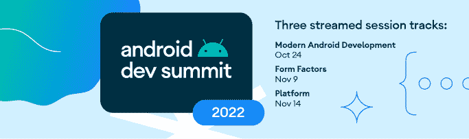

# 现在在 Android #70 中

> 原文：<https://medium.com/androiddevelopers/now-in-android-70-f0889aadde9e?source=collection_archive---------3----------------------->

## [Android Dev 峰会](https://android-developers.googleblog.com/2022/10/android-dev-summit.html)、 [Pixel Watch](https://android-developers.googleblog.com/2022/10/the-new-google-pixel-watch-is-here.html) 、T [ext to Speech 升级](https://android-developers.googleblog.com/2022/09/listen-to-our-major-text-to-speech-upgrades-for-64-bit-devices.html)、 [Compose Basics](https://www.youtube.com/playlist?list=PLWz5rJ2EKKc-CG9riunK996aI6cRhXFDC) 、[深度链接](https://www.youtube.com/playlist?list=PLWz5rJ2EKKc-hZMZIfAUMBDR7kPC1m7HU)等等。

欢迎来到 Android 中的 Now，这是您对 Android 开发世界中新的和值得注意的事物的持续指导。

## **第 70 集视频和播客**

*现在在 Android 中*也以视频和播客的形式提供。

# [Android Dev Summit’22:在线和全球向您走来！](https://android-developers.googleblog.com/2022/10/android-dev-summit.html) ⛰️

[Android Dev 峰会](http://d.android.com/dev-summit)回来了，所以请在世界各地参加我们的**在线**或亲自**——自 2019 年以来的第一次**——活动。我们将在三周内通过三首歌曲在 YouTube 上现场分享这些会议:****

*   **现代 Android 开发，10 月 24 日在旧金山湾区直播**
*   **外形，11 月 9 日在伦敦直播**
*   **平台，11 月 14 日上线**

**您现在可以亲自**申请**参加[旧金山湾区活动](https://rsvp.withgoogle.com/events/ads-2022-bayarea/forms/registration)或[伦敦活动](https://rsvp.withgoogle.com/events/ads-2022-london/forms/registration)。在我们每个环节的结尾，我们将通过 Twitter 或 YouTube 直播主持一场现场直播。查看 ADS [网站](https://developer.android.com/events/dev-summit)了解活动的最新更新，或者您也可以[通过 Android 开发人员简讯注册更新](https://developer.android.com/events/dev-summit)。**

** [## Android Dev Summit '22:在线和全球向您走来！

### 由 Yasmine Evjen 发布，社区负责人，Android 开发者关系 Android Dev 峰会回来了，今年，我们…

android-developers.googleblog.com](https://android-developers.googleblog.com/2022/10/android-dev-summit.html) 

# [新款谷歌 Pixel Watch 上市了——开始打造 Wear OS 吧！](https://android-developers.googleblog.com/2022/10/the-new-google-pixel-watch-is-here.html) ⌚

我们在谷歌制造活动上发布了搭载 Wear OS 3.5 的谷歌 Pixel Watch——这是展示使用 [Compose for Wear OS](https://developer.android.com/training/wearables/compose) 构建的应用的完美设备。有了 Compose for Wear OS、 [Tiles 素材库](https://android-developers.googleblog.com/2022/08/wear-os-tiles-material-library-build-tiles-fast.html)和 Android Studio Dolphin 中的工具，现在为 Wear OS 制作应用比以往任何时候都更简单、更高效。

[Todoist](https://android-developers.googleblog.com/2022/10/todoist-adopted-compose-for-wear-os-and.html) 和 [Outdooractive](https://android-developers.googleblog.com/2022/09/outdooractive-boosts-user-experience-on-wearable-devices-using-compose-for-wear-os.html) 用 Compose 重建了他们的应用，你可以阅读他们的经历。Outdooractive 发现，使用 Compose for Wear OS 为他们的团队减少了 30%的开发时间，而 Todoist 的应用程序重建后的安装增长率增加了 50%。博文有更多，包括如何开始使用 Wear OS 的 Compose。

 [## 新的谷歌 Pixel Watch 在这里-开始为 Wear OS 构建！

### 如果你赶上了昨天的谷歌制造活动，那么你就看到了 Pixel 产品组合中的最新设备。除了…

android-developers.googleblog.com](https://android-developers.googleblog.com/2022/10/the-new-google-pixel-watch-is-here.html) 

# [聆听我们针对 64 位设备的主要文本到语音升级](https://android-developers.googleblog.com/2022/09/listen-to-our-major-text-to-speech-upgrades-for-64-bit-devices.html)💬

未来几周，谷歌将通过 Google Play 向 64 位 Android 设备推出语音服务升级，提供更清晰、更自然的声音。67 种语言的所有 421 种声音都将升级为新的声音模型和合成器。[的帖子](https://android-developers.googleblog.com/2022/09/listen-to-our-major-text-to-speech-upgrades-for-64-bit-devices.html)包含了关于此次更新的更多内容，包括一些语音升级的演示，以及如何在您的项目中使用文本到语音转换的指导。

 [## 聆听我们针对 64 位设备的主要文本到语音升级。

### 由软件工程师 Rakesh Iyer 和集团产品经理 Leland Rechis 发布:“我们正在升级演讲……”

android-developers.googleblog.com](https://android-developers.googleblog.com/2022/09/listen-to-our-major-text-to-speech-upgrades-for-64-bit-devices.html) 

# 疯狂技能:作曲基础🎼

关于如何使用 Jetpack Compose 开发应用程序的新 [MAD Skills 系列](https://www.youtube.com/playlist?list=PLWz5rJ2EKKc-CG9riunK996aI6cRhXFDC)继续播出两集。

第三集深入到 Compose 附带的 UI 组件工具包，包括材质主题化、对常见材质屏幕模式、表面、布局和修改器的支架支持。

 [## 撰写工具包

### 在之前的 MAD 技巧组合基础文章中，您了解了组合中 UI 的构建块:可组合…

medium.com](/androiddevelopers/compose-toolkit-8d3651228764) 

该系列的第四集介绍了如何通过深入 Android Studio 工具支持来加速您的撰写开发过程，包括实时模板、可绘制和颜色的装订线图标、可组合预览功能、多预览、设备上的预览、文字的实时编辑和布局检查器。

 [## 组合工具

### Compose 允许您快速构建漂亮的 ui。借助 Android Studio 工具支持，您可以…

medium.com](/androiddevelopers/compose-tooling-42621bd8719b) 

对于正在进行的内容，请务必查看 YouTube 上的 [MAD 技能播放列表](https://www.youtube.com/playlist?list=PLWz5rJ2EKKc91i2QT8qfrfKgLNlJiG1z7)，Medium 上的[文章](https://medium.com/androiddevelopers/tagged/mad-skills)，或者指向所有内容的[这个方便的登录页面](https://developer.android.com/series/mad-skills)。

# Android 开发模式:深层链接💠

新的 Android 开发模式[深度链接速成班](https://www.youtube.com/playlist?list=PLWz5rJ2EKKc-hZMZIfAUMBDR7kPC1m7HU)继续播出两集。

第 3 部分介绍了[对深层链接进行故障诊断](https://www.youtube.com/watch?v=OAxJ2kWG4ZI)，它使用命令行工具和 Android 调试桥(ADB)来诊断和调试常见问题。

第 4 部分探讨了[对你的业务的深度链接](https://www.youtube.com/watch?v=UvMIswgsJF8)，涵盖了为你的应用、你的用户和你的业务实现深度链接的重要性和好处，包括成功案例以及应用链接如何为用户提供最佳体验。

想不出如何在应用程序中使用深层链接的方法？我们还有一个 YouTube 短片 [30 种在 30 秒内深度链接应用程序的方法。](https://www.youtube.com/watch?v=sSF_3CIXdbE)

# 文章📚

值得注意的文章包括 Ryan 关于为期六周的实习生项目的文章，[将 AOSP QuickSearchBox 应用程序迁移到 Kotlin](/androiddevelopers/migrating-the-aosp-quicksearchbox-app-to-kotlin-1264346619ec?source=collection_home---4------3-----------------------) 。本文包括迁移中使用的方法，它们如何处理所需的手动更改，以及对 APK 规模和构建速度的影响。

 [## 将 AOSP QuickSearchBox 应用程序迁移到科特林

### 在 6 周的时间里，QuickSearchBox 应用程序中的 11，000 多行 Java 代码被转换成了 Kotlin to…

medium.com](/androiddevelopers/migrating-the-aosp-quicksearchbox-app-to-kotlin-1264346619ec) 

[Wojtek](https://medium.com/u/b913acc64439?source=post_page-----f0889aadde9e--------------------------------) 、 [Boris](https://twitter.com/BorisFarber) 和 [Xav](https://twitter.com/droidxav) 讲述了如何[为 Android Gradle plugin 8.0 API 变更准备您的 Android 项目](https://android-developers.googleblog.com/2022/10/prepare-your-android-project-for-agp8-changes.html)；本文专门讨论了从[转换 API](https://developer.android.com/reference/tools/gradle-api/7.0/com/android/build/api/transform/Transform)——它会降低构建速度，并将在 8.0 中被移除——到[工件 API](https://developer.android.com/reference/tools/gradle-api/7.3/com/android/build/api/artifact/Artifacts) 和[检测 API](https://developer.android.com/reference/tools/gradle-api/7.2/com/android/build/api/variant/Instrumentation) 的迁移。

 [## 为 Android Gradle 插件 8.0 API 变化准备您的 Android 项目

### 由 Wojtek Kaliciński、Android 开发人员关系工程师 Boris Farber 和 Android 工作室 Xavier Ducrohet 发布…

android-developers.googleblog.com](https://android-developers.googleblog.com/2022/10/prepare-your-android-project-for-agp8-changes.html) 

[Niharika](https://twitter.com/theDroidLady) 发布了[优化 Android Go:谷歌应用的教训](https://android-developers.googleblog.com/2022/09/optimize-for-android-go-lessons-from-google-apps-part-2.html)博客系列的第二部分，涵盖了谷歌应用用来改善启动延迟和优化应用大小的策略——这些将改善任何应用的用户体验。

 [## 为 Android Go 优化:来自 Google apps 的教训第 2 部分

### 由 Niharika Arora 发布，Android Go 的开发者关系工程师建设涉及到特别注意…

android-developers.googleblog.com](https://android-developers.googleblog.com/2022/09/optimize-for-android-go-lessons-from-google-apps-part-2.html) 

最后，马库斯详细介绍了 Google Play 的变化如何帮助用户从他们的手机中发现所有设备的应用程序，包括非手机设备的主页，设备搜索过滤器，以及将应用程序远程安装到另一台设备的能力。

 [## 帮助用户从手机中发现适用于所有设备的应用

### 多年来，Android 已经发展到支持更多设备，如手表、平板电脑、电视，甚至汽车。应用程序和…

android-developers.googleblog.com](https://android-developers.googleblog.com/2022/09/helping-users-discover-apps-for-all-their-devices-from-their-phone.html) 

# AndroidX 释放🚀

AndroidX 本周有趣的亮点包括 [Compose 1.3](https://developer.android.com/jetpack/androidx/releases/compose) 的首个发布候选、 [Compose Material 1.3](https://developer.android.com/jetpack/androidx/releases/compose-material#1.3.0-rc01) 的 1.0 发布候选、[的首个 alpha，一个使用 Compose](https://developer.android.com/jetpack/androidx/releases/tv#1.0.0-alpha01) 构建的新电视库。 [ShareTarget 版本 1.2](https://developer.android.com/jetpack/androidx/releases/sharetarget#1.2.0) 包含一个针对 Android 12+设备的错误修复， [Activity 版本 1.7](https://developer.android.com/jetpack/androidx/releases/activity#1.7.0-alpha01) 添加了 FullyDrawnReporter APIs， [Exifinterface 版本 1.3](https://developer.android.com/jetpack/androidx/releases/exifinterface#1.3.4) 发布，同时发布的还有针对 [Activity](https://developer.android.com/jetpack/androidx/releases/activity#1.7.0-alpha01) 、 [AppCompat](https://developer.android.com/jetpack/androidx/releases/appcompat#1.7.0-alpha01) 、 [AsyncLayoutInflater](https://developer.android.com/jetpack/androidx/releases/asynclayoutinflater#1.1.0-alpha01) 和[跟踪](https://developer.android.com/jetpack/androidx/releases/tracing#1.2.0-alpha01)的新 alphas。

# 那么现在…👋

这就是本周的 [Android Dev 峰会](https://android-developers.googleblog.com/2022/10/android-dev-summit.html)、 [Pixel Watch](https://android-developers.googleblog.com/2022/10/the-new-google-pixel-watch-is-here.html) 、[文本到语音升级](https://android-developers.googleblog.com/2022/09/listen-to-our-major-text-to-speech-upgrades-for-64-bit-devices.html)、两集新的 [Compose 基础知识](https://www.youtube.com/playlist?list=PLWz5rJ2EKKc-CG9riunK996aI6cRhXFDC)、两集新的[深度链接速成班](https://www.youtube.com/playlist?list=PLWz5rJ2EKKc-hZMZIfAUMBDR7kPC1m7HU)、我们的 Android Go 系列的[第二部分](https://android-developers.googleblog.com/2022/09/optimize-for-android-go-lessons-from-google-apps-part-2.html)，以及包括新的 [Compose 电视库](https://developer.android.com/jetpack/androidx/releases/tv#1.0.0-alpha01)在内的 AndroidX 更新。请尽快回到这里，等待 Android 开发者世界的下一次更新。**