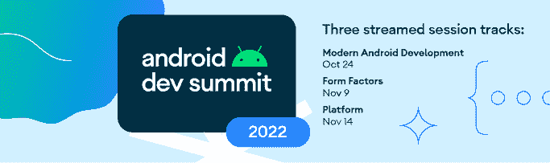

# 现在在 Android #71 中

> 原文：<https://medium.com/androiddevelopers/now-in-android-71-248cd926bf7c?source=collection_archive---------6----------------------->

## [Android Dev 峰会](https://android-developers.googleblog.com/2022/10/android-dev-summit.html)，[现代 Android 开发](https://www.youtube.com/playlist?list=PLWz5rJ2EKKc_L3n1j4ajHjJ6QccFUvW1u)， [Kotlin 多平台](https://android-developers.googleblog.com/2022/10/announcing-experimental-preview-of-jetpack-multiplatform-libraries.html)，[材质设计](https://m3.material.io/)，[现已在 Android app](http://goo.gle/nia) ，还有更多！

欢迎来到 Android 中的 Now，这是您对 Android 开发世界中新的和值得注意的事物的持续指导。

## 第 71 集视频和播客

*现在安卓*也提供视频和播客。

# 在 2012 年 Android 开发峰会上，Android 有什么新消息

Android Dev Summit 2022 第一天简直是爆棚！你已经可以观看[主题演讲](https://www.youtube.com/watch?v=Awi4J5-tbW4)并进入我们关于现代 Android 开发的[第一轨道](https://developer.android.com/events/dev-summit/technical-talks#modern-android-development)。

在最重要的公告中，可以找到最新的 Compose 发布:[10 月 22 日](https://android-developers.googleblog.com/2022/10/whats-new-in-jetpack-compose.html)(原名 Compose 1.3)稳定！Compose for Wear OS 在几周前发布了 1.0 稳定版，这是为 Wear 构建 UI 的推荐方式。

正如你今年早些时候所听到的:谷歌在平板电脑、可折叠手机和 ChromeOS 上全力以赴。你可以在 Android Studio 中找到 WearOS 的更新模板，以及 Wear OS 的稳定 Android R 模拟器系统镜像。我们已经在测试版的[Android Studio Electric Eel](https://developer.android.com/studio/preview)中比以往任何时候都更容易在大屏幕上测试您的应用程序，包括可调整大小和桌面模拟器以及可视林挺，以帮助您在任何大小的屏幕上坚持最佳实践。

我们还更容易利用 Android 13 中的平台功能，例如[每个应用程序的语言首选项](https://developer.android.com/guide/topics/resources/app-languages)和新的[照片选择器](https://developer.android.com/training/data-storage/shared/photopicker)，这是一种无需许可的方式，允许用户浏览和选择他们明确想要与你的应用程序共享的照片和视频。

 [## Android 的新特性，在 2012 年 Android 开发峰会上

### 由 Android 开发人员产品管理副总裁 Matthew McCullough 刚刚发布，我们启动了第一个…

android-developers.googleblog.com](https://android-developers.googleblog.com/2022/10/new-from-android-ads-22.html) 

# ADS’22 上的现代 Android 开发

Modern Android Development (MAD)是我们的一套库、工具和指南，可以更快、更容易地构建令人惊叹的 Android 应用程序。以下是会议前三项公告的摘要。

你可以在这个播放列表中找到所有的疯狂言论:

不要忘记查看 Jetpack 博客文章 中的 [**新内容，其中包含对 Jetpack 三个主要领域的已发布更新:**](https://android-developers.googleblog.com/2022/10/whats-new-in-jetpack-ads-22.html)**[架构库和指南](https://android-developers.googleblog.com/2022/10/whats-new-in-jetpack-ads-22.html#Architecture%20Libraries%20and%20Guidance)、[应用性能](https://android-developers.googleblog.com/2022/10/whats-new-in-jetpack-ads-22.html#Application%20Performance)以及[用户界面库和指南](https://android-developers.googleblog.com/2022/10/whats-new-in-jetpack-ads-22.html#User%20Interface%20Libraries%20and%20Guidance)。它包括对 WorkManager、Room、新架构指南、基线概要文件、重组跟踪等的更新！**

 [## Android Dev Summit’22:Jetpack 的新功能

### Android Jetpack 是现代 Android 开发的关键组件。这是一套超过 100 个库，工具和…

android-developers.googleblog.com](https://android-developers.googleblog.com/2022/10/whats-new-in-jetpack-ads-22.html) 

此外，请查看 Jetpack Compose 博客文章 中的 [**新内容，其中包含了开发人员关于社区如何采用 Jetpack Compose 的故事，以及关于 10 月 22 日发布的 Compose 的更多信息，该发布随材料清单(BOM)一起提供。新的合成功能包括交错网格、可变字体、滑动刷新修改器、新的前瞻布局等等！**](https://android-developers.googleblog.com/2022/10/whats-new-in-jetpack-compose.html)

 [## Jetpack Compose 的新功能

### 我们在一年前推出了 Jetpack Compose，从那以后一直忙于改进它。我们增加了新功能和…

android-developers.googleblog.com](https://android-developers.googleblog.com/2022/10/whats-new-in-jetpack-compose.html) 

# Jetpack 多平台库的实验预览

来自 JetBrains [的 Kotlin 多平台移动设备现在处于测试阶段](https://blog.jetbrains.com/kotlin/2022/10/kmm-beta/)，我们一直在试验这项技术，看看它如何能够实现跨平台的代码共享。作为这些实验的一部分，我们现在在 Jetpack 中分享一个 [Kotlin 多平台](https://kotlinlang.org/lp/mobile/)库的预览。作为这个实验预览的一部分，可用于多平台的库是[集合](https://developer.android.com/jetpack/androidx/releases/collection)和[数据存储](https://developer.android.com/topic/libraries/architecture/datastore)。

在这个预览版中，我们期待您对在针对 Android 和 iOS 应用程序的多平台项目中使用这些 Jetpack 库的反馈。请记住，这些开发构建是实验性的，不应用于生产。在[示例应用](https://github.com/android/kotlin-multiplatform-samples/tree/main/DiceRoller)、 [API 参考文档](https://androidx.github.io/kmp-eap-docs)和[博客文章](https://android-developers.googleblog.com/2022/10/announcing-experimental-preview-of-jetpack-multiplatform-libraries.html)中了解更多关于可用 API 的信息！

 [## 宣布 Jetpack 多平台库的实验预览

### 自从我们在 2017 年宣布 Kotlin 支持 Android 以来，开发人员一直对编写他们的 Android 应用程序感到兴奋…

android-developers.googleblog.com](https://android-developers.googleblog.com/2022/10/announcing-experimental-preview-of-jetpack-multiplatform-libraries.html) 

# 疯狂技能:作曲基础🎼

MAD Skills Compose basics 系列已经结束，常见的 [Live Q & A 插曲](https://www.youtube.com/watch?v=KEt2VA-11co&t=578s)和由 [Adam Bennet](https://twitter.com/iateyourmic) 为您带来的[社区提示](https://www.youtube.com/watch?v=QssnHu2NcCQ)分享了如何使用 Compose 加快学习。

如果你错过了之前的任何一集，可以看看总结博客，在那里你可以看到所有的内容，并找到更多关于它们的信息。

 [## 作曲基础:疯狂技巧总结

### 我们刚刚结束了关于作曲基础的疯狂技巧系列！如果你是作曲新手，这个视频和…

medium.com](/androiddevelopers/compose-basics-mad-skills-wrap-up-1a191fa842b9) 

# 材料设计发布🎨

[Android 1 . 7 . 0 的材料设计](https://m3.material.io/)组件现已稳定，并更新了材料的样式、可访问性和尺寸一致性以及新的最低版本要求。你可以找到一个新的`MaterialSwitch`组件，形状主题，等等！

 [## Android 1.7.0 的材料设计组件

### 材质设计组件(MDC) - 1.7.0 的最新版本更新了材质的样式、可访问性…

android-developers.googleblog.com](https://android-developers.googleblog.com/2022/10/material-design-components-for-android-1-7-0.html) 

另外，[合成材料 3](https://developer.android.com/reference/kotlin/androidx/compose/material3/package-summary) 也很稳定。这个库允许你用 Material Design 3 构建 Jetpack Compose UIs。它支持配色方案、动态颜色、材料组件、排版、形状、窗口大小类、窗口插入支持等等。

 [## 材料设计 3 为组成击中稳定

### 今天标志着第一个稳定发布的合成材料 3。该库允许您使用…构建 Jetpack 编写用户界面

android-developers.googleblog.com](https://android-developers.googleblog.com/2022/10/material-design-3-compose-stable.html) 

# 文章📚和视频📹

曼达·埃德林和帕丽斯·许写了关于安卓应用的设计。这篇博客文章描述了团队如何将 Material 3 概念应用到应用程序中，并探索了附带的刚刚发布的[设计 Figma 文件](https://goo.gle/nia-figma)。

 [## 现在在 Android 中:一个材料 3 案例研究

### 了解我们如何利用材料 3 设计 Now in Android 应用程序

medium.com](/androiddevelopers/now-in-android-a-material-3-case-study-21e44bdfd2bc) 

[阿莱杭德娜·斯塔马托](https://medium.com/u/92c44d274e60?source=post_page-----248cd926bf7c--------------------------------)在作文中写到了[对 TextField 的有效状态管理。查看您需要做什么来防止同步问题和意外行为，其中，确保使用 Compose APIs(如`mutableStateOf`)定义您的 TextField 状态变量。](/androiddevelopers/effective-state-management-for-textfield-in-compose-d6e5b070fbe5)

 [## Compose 中文本字段的有效状态管理

### TL；DR——撰写路线图反映了团队在多个方面所做的工作，在本例中是文本编辑…

medium.com](/androiddevelopers/effective-state-management-for-textfield-in-compose-d6e5b070fbe5) 

Serban 写了关于 [Pixel 7 的文章，这是第一款 64 位 Android 手机](https://android-developers.googleblog.com/2022/10/64-bit-only-devices.html)，以及这意味着什么，比如放弃操作系统对 32 位代码的支持，减少内存使用，提高性能，增强安全性。

 [## Pixel 7，首款 64 位安卓手机

### 由产品经理 Serban Constantinescu 发布，Pixel 7 和 Pixel 7 Pro 是首款仅支持…

android-developers.googleblog.com](https://android-developers.googleblog.com/2022/10/64-bit-only-devices.html) 

雷在安卓上录制了一集关于 HDR 的视频。在那里你可以找到你需要的需求和新的 Android Camera2 APIs。

谈到相机，Android 团队写道[与 CameraX](https://android-developers.googleblog.com/2022/10/better-device-compatibility-with-camerax.html) 的设备兼容性更好。在本帖中，您将看到 CameraX 在设备兼容性方面使开发人员的生活更加轻松的三种方式。首先是 CameraX 测试实验室，我们每天测试超过 150 部手机。第二，Quirks，CameraX 用来自动处理设备不一致的机制。第三，我们将讨论 CameraX 如何简化可折叠设备应用程序的开发。

 [## 与 CameraX 更好的设备兼容性

### 由 Android 团队发布的 CameraX 是一个 Android Jetpack 库，它可以很容易地集成相机功能…

android-developers.googleblog.com](https://android-developers.googleblog.com/2022/10/better-device-compatibility-with-camerax.html) 

[Niharika Arora](https://medium.com/u/e1fb03b9ea54?source=post_page-----248cd926bf7c--------------------------------) 写了[第三部优化 Android Go 版](https://android-developers.googleblog.com/2022/10/optimize-for-android-go-edition-lessons.html)。这一次，它是关于帮助谷歌优化其谷歌应用程序性能的工具。在分析内存占用时，他们使用了 [Perfetto](https://perfetto.dev/docs/case-studies/memory) 、[内存分析器](https://developer.android.com/studio/profile/memory-profiler)和 meminfo。为了监控启动，他们还使用了 [Perfetto](https://perfetto.dev/docs/case-studies/memory) 、[应用启动库](https://developer.android.com/topic/libraries/app-startup)、[基准配置文件](https://developer.android.com/topic/performance/baselineprofiles)、 [CPU 剖析器](https://developer.android.com/studio/profile/cpu-profiler)以及微观和宏观基准库。

 [## 为 Android 优化(Go 版):来自 Google apps 的教训第 3 部分

### 在我们的“优化 Android Go”博客系列的第 1 部分和第 2 部分中，我们讨论了为什么我们应该考虑构建…

android-developers.googleblog.com](https://android-developers.googleblog.com/2022/10/optimize-for-android-go-edition-lessons.html) 

Android ML 平台团队写了关于 Android 定制 ML 栈的[最新更新。Google Play 服务中的 TensorFlow Lite 现在是 Android 的官方 ML 推理引擎，TensorFlow Lite 委托现在通过 Google Play 服务分发，加速服务将帮助您挑选最佳的 TensorFlow Lite 委托，以实现运行时的最佳性能。](https://android-developers.googleblog.com/2022/10/latest-updates-on-androids-custom-ml.html)

 [## Android 定制 ML 堆栈的最新更新

### Android 设备上 ML 的使用增长比以往任何时候都快，这要归功于它相对于基于服务器的 ML 的独特优势，例如…

android-developers.googleblog.com](https://android-developers.googleblog.com/2022/10/latest-updates-on-androids-custom-ml.html) 

安卓游戏开发秀又有新一集了。在这一集， [Nate Trost](https://medium.com/u/ae381ba24416?source=post_page-----248cd926bf7c--------------------------------) 谈论 Android 游戏的新更新，包括[游戏模式](https://goo.gle/3h5moqo)、游戏状态、[自适应性能](https://goo.gle/3Fnno63)、 [Vulkan](https://goo.gle/3Df8qfz) 等等！

刘烨写了关于 [5 Play 控制台更新的文章，帮助你了解你的应用程序的交付性能](https://android-developers.googleblog.com/2022/10/5-play-console-updates-to-help-you-understand-app-delivery-performance.html)。交付洞察有助于您更好地了解和分析应用的交付性能及其影响因素，并采取措施优化用户体验。这篇文章包括五个最近的 Play Console 更新，您可以使用它们来更深入地了解您的交付性能。

 [## 5 播放控制台更新，帮助您了解应用的交付性能

### 由产品经理刘烨·盖蒙德发布，Google Play 由 Android 应用捆绑包提供支持，Google Play 为所有开发人员提供…

android-developers.googleblog.com](https://android-developers.googleblog.com/2022/10/5-play-console-updates-to-help-you-understand-app-delivery-performance.html) 

最后，该团队写道[将密钥引入 Android & Chrome](https://android-developers.googleblog.com/2022/10/bringing-passkeys-to-android-and-chrome.html) 。谷歌正在为 Android 和 Chrome 带来密钥支持。对于密码和其他易受攻击的身份验证因素而言，密钥是一种安全得多的替代品。它们不能重复使用，不会泄露服务器漏洞，并保护用户免受网络钓鱼攻击。这个版本实现了两个关键功能:用户可以在 Android 设备上创建和使用密钥，开发人员可以在他们的网站上为使用 Chrome 的最终用户建立密钥支持。

 [## 将密钥引入 Android 和 Chrome

### 由 Diego Zavala 发布，产品经理(Android)，Christiaan Brand，产品经理(帐户安全)，Ali Naddaf…

android-developers.googleblog.com](https://android-developers.googleblog.com/2022/10/bringing-passkeys-to-android-and-chrome.html) 

# 那么现在…👋

这就是本周的 [Android Dev 峰会](https://android-developers.googleblog.com/2022/10/android-dev-summit.html)及其[现代 Android 开发](https://www.youtube.com/playlist?list=PLWz5rJ2EKKc_L3n1j4ajHjJ6QccFUvW1u)专题讲座、 [Kotlin 多平台](https://android-developers.googleblog.com/2022/10/announcing-experimental-preview-of-jetpack-multiplatform-libraries.html)更新、[材料设计](https://m3.material.io/)发布、 [Compose Basics MAD 技能系列](/androiddevelopers/compose-basics-mad-skills-wrap-up-1a191fa842b9)、Android 应用中关于[的文章和视频](http://goo.gle/nia)、 [TextField 状态管理](/androiddevelopers/effective-state-management-for-textfield-in-compose-d6e5b070fbe5)、 [Pixel 7](https://android-developers.googleblog.com/2022/10/64-bit-only-devices.html) 、[Android 上的 HDR](https://www.youtube.com/watch?v=QYECzR0w9Ys)、  [关于定制机学习的更新](https://android-developers.googleblog.com/2022/10/latest-updates-on-androids-custom-ml.html)，[安卓游戏开发秀](https://www.youtube.com/watch?v=zBTl5F8lCFQ)，[游戏交付](https://android-developers.googleblog.com/2022/10/5-play-console-updates-to-help-you-understand-app-delivery-performance.html)和[万能钥匙](https://android-developers.googleblog.com/2022/10/bringing-passkeys-to-android-and-chrome.html)。

请尽快回到这里，等待 Android 开发者世界的下一次更新。