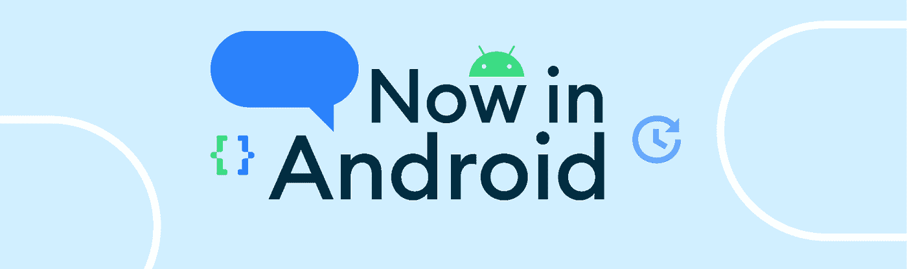

# 现在在 Android #72 中

> 原文：<https://medium.com/androiddevelopers/now-in-android-72-1dba1cd404a?source=collection_archive---------9----------------------->

## [Android 开发峰会:外形](https://www.youtube.com/playlist?list=PLWz5rJ2EKKc9jBnpl83LH6oZc7nFIVSRq)、[健康服务](https://android-developers.googleblog.com/2022/11/power-your-wear-os-fitness-app-with-health-services-latest-version.html)、 [Google Play 更新](https://android-developers.googleblog.com/2022/11/play-it-forward.html)、[性能](https://adbackstage.libsyn.com/episode-190-performance-review)等等！

欢迎来到 Android 中的 Now，这是您对 Android 开发世界中新的和值得注意的事物的持续指导。

# 第 72 集视频和播客

*现在安卓*也提供视频和播客。

# [2012 年 Android 开发峰会继续关注外形规格](https://android-developers.googleblog.com/2022/10/form-factors-at-ads-22.html) ⌚📺🚗

Android Dev Summit 2022 的第二天在伦敦现场拉开帷幕，包括大屏幕、可穿戴设备、电视和汽车在内的 Android 外形的更新。查看[完整的 YouTube 播放列表](https://www.youtube.com/playlist?list=PLWz5rJ2EKKc9jBnpl83LH6oZc7nFIVSRq)以了解更多有关您的应用如何利用平板电脑、台式机和可折叠设备等不断增长的大屏幕设备组合的信息，我们如何使[开发 Wear OS 变得比以往任何时候都更简单](https://www.youtube.com/watch?v=w3KvfvgUIds)，[电视开发的最佳实践](https://www.youtube.com/watch?v=MwHh8S7v_5E)，以及[汽车开发的新功能](https://www.youtube.com/watch?v=watUEk6_i-4)。

 [## 2012 年 Android 开发者峰会上的外形规格

### 由开发者关系工程师 Alex Vanyo 发布的 Android 开发者峰会是我们的第二站…

android-developers.googleblog.com](https://android-developers.googleblog.com/2022/10/form-factors-at-ads-22.html) 

另外，请务必在太平洋标准时间 11 月 14 日上午 9 点收看 [**决赛**Android Dev Summit live stream](https://developer.android.com/events/dev-summit/technical-talks#platform)关注如何最好地利用我们在 Android 平台上所做的创新。

 [## 安卓开发者峰会|安卓开发者

### 2022 年 Android 开发峰会

developer.android.com](https://developer.android.com/events/dev-summit/technical-talks#platform) 

# [为你的 Wear OS 健身应用配备最新版本的健康服务](https://android-developers.googleblog.com/2022/11/power-your-wear-os-fitness-app-with-health-services-latest-version.html)🏥

我们报道了[健康服务 API](https://developer.android.com/training/wearables/health-services) 的测试版更新，该 API 使 Wear OS 3 应用程序能够利用设备上的传感器数据和与活动、锻炼和健康相关的算法，而不必在节省电池寿命和获取高频数据之间做出选择。

Health Services Jetpack Beta 引入了新的数据和锻炼类型、监听跌倒检测等健康事件的能力、一种新的健康服务数据组织模型(使 Health Services API 更加类型安全)、新的锻炼属性(使您能够更好地控制应用程序如何响应结束的锻炼)、新的被动监听器 API 等。

 [## 使用最新版本的健康服务为您的 Wear OS 健身应用提供动力

### 开发者关系工程师 Breana Tate 发布的健康服务 API 使开发者能够使用设备上的传感器…

android-developers.googleblog.com](https://android-developers.googleblog.com/2022/11/power-your-wear-os-fitness-app-with-health-services-latest-version.html) 

# [向前发展:为下一个十年的开发者成功发展我们的平台](https://android-developers.googleblog.com/2022/11/play-it-forward.html) ▶️

Google Play 涵盖了许多重大的平台更新，包括扩展 [LiveOps](https://play.google.com/console/about/programs/liveopsbeta/) 并将其重命名为“促销内容】、[用户定制商店列表](https://android-developers.googleblog.com/2022/11/supporting-and-rewarding-great-apps-and-games-on-google-play.html)、针对用户感知崩溃率和 ANRs 的新[技术质量阈值](https://android-developers.googleblog.com/2022/10/raising-bar-on-technical-quality-on-google-play.html)、改进的购买体验、对您的订阅的更多[灵活性和控制](https://android-developers.googleblog.com/2022/11/optimization-flexibility-and-growth-with-play-commerce.html)、新的货币化洞察、新的[安全计划和政策](https://android-developers.googleblog.com/2022/11/keeping-google-play-safe.html)、Google Play 游戏测试版在 PC 上的[全球扩展](https://android-developers.googleblog.com/2022/10/google-play-games-beta-on-pc-continues-global-expansion.html)以及

 [## 向前发展:为下一个十年的开发者成功发展我们的平台

### 这是 Google Play 具有里程碑意义的一年。刚刚…

android-developers.googleblog.com](https://android-developers.googleblog.com/2022/11/play-it-forward.html)  [## 支持和奖励 Google Play 上的优秀应用和游戏

### 由 Google Play 集团产品经理 Tom Grinsted 在 Google Play 发布，我们的使命是促进关系…

android-developers.googleblog.com](https://android-developers.googleblog.com/2022/11/supporting-and-rewarding-great-apps-and-games-on-google-play.html)  [## 提高 Google Play 的技术质量

### 由集团产品经理 Lauren Mytton 发布的 Google Play 应用程序质量是我们在 Google 所做一切的基础…

android-developers.googleblog.com](https://android-developers.googleblog.com/2022/10/raising-bar-on-technical-quality-on-google-play.html)  [## 通过 Play Commerce 实现购买优化、灵活订阅和收入增长

### 由工程总监周健发布，Google Play 商务 Google Play 商务提供超过…

android-developers.googleblog.com](https://android-developers.googleblog.com/2022/11/optimization-flexibility-and-growth-with-play-commerce.html)  [## 通过新功能和程序确保 Google Play 的安全

### Google Play 已经成为数百万开发者企业与世界各地消费者联系的发射台…

android-developers.googleblog.com](https://android-developers.googleblog.com/2022/11/keeping-google-play-safe.html)  [## 谷歌个人电脑游戏测试版继续全球扩张

### 今年早些时候，我们宣布 Google Play 游戏将作为测试版体验在有限数量的个人电脑上推出…

android-developers.googleblog.com](https://android-developers.googleblog.com/2022/10/google-play-games-beta-on-pc-continues-global-expansion.html) 

# 文章📚

在[“在大屏幕上接触”你的用户](https://android-developers.googleblog.com/2022/11/reach-your-users-on-large-screens.html)中，Diana 讲述了当决定在哪里放置应用的 UI 元素时，如何考虑可达性——用户可以舒适地接触到屏幕的哪些部分，而无需伸展或调整他们的握持。本文考虑了手的大小、设备的方向以及如何最好地利用屏幕的边缘和顶部。

 [## 在大屏幕上“接触”您的用户

### 由产品经理 Diana Wong 发布，Android 大屏幕设备，如可折叠设备和平板电脑，意味着您的用户拥有…

android-developers.googleblog.com](https://android-developers.googleblog.com/2022/11/reach-your-users-on-large-screens.html) 

在[用可评测版本](https://android-developers.googleblog.com/2022/10/accurately-measure-android-app-performance-with-profileable-builds.html)精确测量 Android 应用性能中，易介绍了如何在运行 Android 10 或更高版本的设备上使用`profileable`标签来启用评测工具，在没有调试版本性能开销的情况下测量计时信息。该博客解释了何时使用发布版本、可分析的发布版本和调试版本。

 [## 通过可评测的版本精确测量 Android 应用性能

### 由杨熠(软件工程师)发布，掌握应用程序的性能以确保用户能够……

android-developers.googleblog.com](https://android-developers.googleblog.com/2022/10/accurately-measure-android-app-performance-with-profileable-builds.html) 

# 录像📚

“外形因素直播”中有许多精彩的内容。简单总结一下， [Alex](https://medium.com/u/e4ae3ec302ba?source=post_page-----1dba1cd404a--------------------------------) 在 ADS '22 上展示了他的[前三名，而](https://www.youtube.com/watch?v=RNprUxOGUUw)现场[外形#AskAndroid](https://www.youtube.com/watch?v=_iwowlEg_A4) 小组回答了你关于大屏幕、可折叠、可穿戴设备和电视的问题。

我们有很多关于如何处理大屏幕 UI 的会议，例如[规范布局和视觉层次:为大屏幕设计，](https://www.youtube.com/watch?v=FrkIa9vZjCI) [注意事项:为大屏幕优化应用的心态，](https://www.youtube.com/watch?v=m7OL-mVh1E8) [撰写:为大屏幕实现响应式 UI](https://www.youtube.com/watch?v=fQjDtCtri4s)，[在 Google Play 上实现三层大屏幕质量](https://www.youtube.com/watch?v=FCi6Nld4kz4)，如何[使用 Android Studio 跨外形构建更好的 UI，](https://www.youtube.com/watch?v=Z4h9cvlE66E) 如何利用多窗口和活动嵌入、 [Insets: Compose edition](https://www.youtube.com/watch?v=mlL6H-s0nF0) 、[Navigation Compose on ever screen size](https://www.youtube.com/watch?v=LTLQhC6VadI)。

但是大屏幕也意味着为笔记本电脑做好准备，所以[为什么以及如何为 ChromeOS 优化你的应用](https://www.youtube.com/watch?v=C0IuT0O2wlM)，以及[跨平板电脑和 ChromeOS 的键盘和鼠标支持的关键](https://www.youtube.com/watch?v=ucaSqyfpPas)涵盖了这一点。

大屏幕支持新功能，如无缝多任务处理的[拖动&下降](https://www.youtube.com/watch?v=WOm76wSfkbU)和[手写笔支持](https://www.youtube.com/watch?v=F8boaQsioH8)，但也增加了新的挑战，如在不同外形规格上运行[您的相机应用程序](https://www.youtube.com/watch?v=XcJIrTedfus)。

我们还深入研究了可穿戴设备，深入研究了 Wear OS 应用程序架构、[在 Wear OS 上构建媒体应用程序、](https://www.youtube.com/watch?v=Gc_q_SKjRIE)、[围绕手表:在 Wear OS 中处理旋转输入、](https://www.youtube.com/watch?v=2CzWz5Ad4iM)、[毫不费力地测试 Wear OS 健身应用程序。](https://www.youtube.com/watch?v=p6-SW1ivukM)

我们讨论了[改善电视用户体验](https://www.youtube.com/watch?v=MwHh8S7v_5E)，以及[汽车应用程序库的新功能](https://www.youtube.com/watch?v=watUEk6_i-4)。

由于 Android 的所有外形都很好地配合工作，因此[通过健康服务和健康连接创造有益的健身体验](https://www.youtube.com/watch?v=OuCY5Kpu5xA) , [让您的应用程序在 Google Play 的所有设备上闪耀](https://www.youtube.com/watch?v=xLecR6zYiFY)，以及[开发跨设备的助手](https://www.youtube.com/watch?v=PhYFCv74sJg)提供了如何实现这一点的见解。

# AndroidX 释放🚀

与 Form Factors ADS livestream 同时发布的还有第一个候选发布版本[Wear Compose 1.1 版](https://developer.android.com/jetpack/androidx/releases/wear-compose#1.1.0-rc01)，以及[汽车 App 1.2 版](https://developer.android.com/jetpack/androidx/releases/car-app#1.2.0)和[电视版 1.0 alpha 2](https://developer.android.com/jetpack/androidx/releases/tv#1.0.0-alpha02) 。 [Mediarouter 版本 1.4 alpha 1](https://developer.android.com/jetpack/androidx/releases/mediarouter#1.4.0-alpha01) 增加了 systemoutputswitcherdialogcontroller . showdialog()来显示系统的输出切换器对话框，或者 Wear 设备上的蓝牙设置片段。

[Privacy Sandbox Tools 1.0 alpha 1](https://developer.android.com/jetpack/androidx/releases/privacysandbox-tools#1.0.0-alpha01)是一个新的 Jetpack 库，其中包含利用隐私沙盒功能的 API。

[相机版本 1.3 alpha 1](https://developer.android.com/jetpack/androidx/releases/camera#1.3.0-alpha01) 现在正式包含相机取景器，提供了一个基本取景器小部件，可以显示相机 2 的相机馈送。[数据存储版本 1.1 alpha 1](https://developer.android.com/jetpack/androidx/releases/datastore#1.1.0-alpha01) 现在可以支持多进程使用情形中的数据一致性，并且具有新的存储接口，该接口抽象了数据存储的底层存储机制。提供了 java.io 和 okio 的实现。

# 亚行播客 Episodes🎙

在[第 190 集](https://adbackstage.libsyn.com/episode-190-performance-review)的[中，Android 开发者后台](https://adbackstage.libsyn.com/) [Tor](https://medium.com/u/8251a5f98c9d?source=post_page-----1dba1cd404a--------------------------------) 和 [Chet](https://medium.com/u/cb2c4874d3e9?source=post_page-----1dba1cd404a--------------------------------) 向 Carmen 了解更多关于性能的信息，Carmen 是 Android 平台性能团队中与性能相关的所有方面的专家。如果您想了解更多关于 R8、perfetto、基线配置文件、自定义性能跟踪、功耗指标等的信息，这是您的最佳选择。

# 那么现在…👋

这就是本周的 [Android 开发峰会](https://android-developers.googleblog.com/2022/10/android-dev-summit.html)及其[外形规格跟踪](https://www.youtube.com/playlist?list=PLWz5rJ2EKKc9jBnpl83LH6oZc7nFIVSRq)、[健康服务](https://android-developers.googleblog.com/2022/11/power-your-wear-os-fitness-app-with-health-services-latest-version.html)、 [Google Play 更新](https://android-developers.googleblog.com/2022/11/play-it-forward.html)、[性能](https://adbackstage.libsyn.com/episode-190-performance-review)等等。请务必在太平洋标准时间 11 月 14 日上午 9 点收看 [Android 开发峰会平台直播](https://developer.android.com/events/dev-summit/technical-talks#platform)！请尽快回到这里，等待 Android 开发者世界的下一次更新。