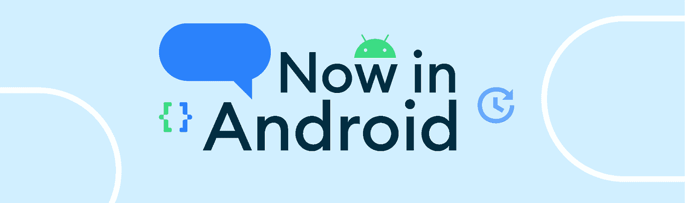
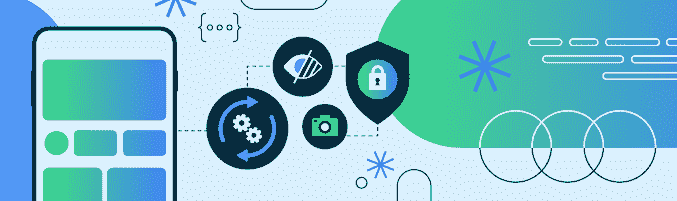

# 现在在 Android #73 中

> 原文：<https://medium.com/androiddevelopers/now-in-android-73-f0effa197dfb?source=collection_archive---------8----------------------->

## [Android Dev 峰会:平台赛道](https://www.youtube.com/playlist?list=PLWz5rJ2EKKc8PO99T1QQLrPAJILqxJXW6)、[健康连接](https://android-developers.googleblog.com/2022/11/leading-health-and-fitness-apps-roll-out-health-connect-integrations.html)、[现已在 Android 上 Google Play](https://play.google.com/store/apps/details?id=com.google.samples.apps.nowinandroid) 、[用户选择计费](https://android-developers.googleblog.com/2022/11/continuing-our-commitment-to-user-choice-billing.html)、[懒人布局](https://adbackstage.libsyn.com/episode-191-compose-lazy-layouts)

欢迎来到 Android 中的 Now，这是您对 Android 开发世界中新的和值得注意的事物的持续指导。

# 第 73 集视频和播客

*现在安卓*也提供视频和播客。

# [Android Dev Summit’22 以平台结束](https://android-developers.googleblog.com/2022/11/platform-track-at-android-developer-summit-22.html)🚉

第三天的 [Android 开发者峰会](http://d.android.com/dev-summit)进行了直播，重点关注 Android 13 的开发者特性和指导。查看完整的 YouTube 播放列表[,了解您的应用如何帮助 Android 变得更加隐私、安全和个性化，以及它们如何通过利用新功能和最佳实践脱颖而出。](https://www.youtube.com/playlist?list=PLWz5rJ2EKKc8PO99T1QQLrPAJILqxJXW6)

 [## 2012 年 Android 开发者峰会上的平台跟踪

### 由开发者关系工程师 Dan Galpin (@dagalpin)发布的今天标志着 Android 开发者的最终轨迹…

android-developers.googleblog.com](https://android-developers.googleblog.com/2022/11/platform-track-at-android-developer-summit-22.html) 

# [领先的健康和健身应用推出健康连接集成](https://android-developers.googleblog.com/2022/11/leading-health-and-fitness-apps-roll-out-health-connect-integrations.html)🏃🚴🏊

[超过 10 个健康、健身和健康应用](https://play.google.com/store/apps/collection/promotion_all__health_connect)推出了与[健康连接](https://android-developers.googleblog.com/2022/05/introducing-health-connect.html)平台的集成，包括健康连接的早期采用者，如 [MyFitnessPal](https://play.google.com/store/apps/details?id=com.myfitnesspal.android) 、 [Oura](https://play.google.com/store/apps/details?id=com.ouraring.oura) 和 [Peloton](https://play.google.com/store/apps/details?id=com.onepeloton.callisto) 。 [Health Connect](https://android-developers.googleblog.com/2022/05/introducing-health-connect.html) 是我们与三星合作开发的一个平台，让用户能够让应用程序安全地相互共享健康和健身数据。 [Health Connect (Beta)应用](https://play.google.com/store/apps/details?id=com.google.android.apps.healthdata)为用户提供了一个集中的地方来管理他们的隐私设置，通过精细控制来查看哪些应用可以在任何给定的时间访问数据。

让健康和健身应用程序相互交流，可以让应用程序为用户提供更好、更全面的健康见解。有了 Health Connect，构建与新应用程序的集成就像读入新数据一样简单，而不必利用不同的 API 与每个应用程序对话。例如，Android 用户现在可以在 Oura、MyFitnessPal、WeightWatchers 和 Lifesum 等应用程序中同步并获得 Peloton 锻炼积分。

Health Connect 提供了一个标准化的数据架构，支持 6 个类别的 40 多种数据类型，涵盖锻炼、睡眠跟踪和生命体征，而[帖子](https://android-developers.googleblog.com/2022/11/leading-health-and-fitness-apps-roll-out-health-connect-integrations.html)提供了信息链接，帮助您的应用程序使用 Health Connect 为您的用户提供更丰富的见解。

我们还发布了一个围绕使用 [Health Connect 平台](https://www.youtube.com/playlist?list=PLWz5rJ2EKKc_m5mZzWneZ6MbLDBhKcyMS)进行开发的视频播放列表，包括[对 Health Connect 的介绍、](https://www.youtube.com/watch?v=k4kX3wQ0U6Q&t=4s) [在 Health Connect 中管理权限](https://www.youtube.com/watch?v=C2I4OymO3S4)，以及[在 Health Connect 中的读写。](https://www.youtube.com/watch?v=NAx7Gv_Hk7E)

 [## 领先的健康和健身应用推出健康连接集成

### 由开发者关系 Sara Hamilton 在今年早些时候发布，我们介绍了健康连接作为应用程序的一种方式…

android-developers.googleblog.com](https://android-developers.googleblog.com/2022/11/leading-health-and-fitness-apps-roll-out-health-connect-integrations.html) 

# [现在在 Android 上正在 Google Play 上直播](https://play.google.com/store/apps/details?id=com.google.samples.apps.nowinandroid)⏰

Now in Android 应用程序在 [Google Play](https://play.google.com/store/apps/details?id=com.google.samples.apps.nowinandroid) 上直播。这是一款功能齐全的[开源](https://github.com/android/nowinandroid) Android 应用程序，完全由 Kotlin 和 Jetpack Compose 构建，展示最佳实践、固执己见的设计以及复杂现实问题的解决方案。就像这个博客一样，它通过提供定期的新闻更新来帮助你跟上 Android 的发展。你可以在[github.com/android/nowinandroid](https://github.com/android/nowinandroid)找到相应的源代码。

# [继续我们对用户选择计费的承诺](https://android-developers.googleblog.com/2022/11/continuing-our-commitment-to-user-choice-billing.html)💵💳

我们宣布，基于开发人员和用户的积极响应和初步反馈，我们正在将用户选择计费试点扩展到美国、巴西和南非的用户，并加入澳大利亚、印度、印度尼西亚、日本和欧洲经济区。

9 月，我们向所有非游戏应用的开发者开放了参与试点，提供了更多关于资格要求的细节——包括[临时 UX 指南](https://developer.android.com/google/play/billing/user-choice)。这篇文章有更多的细节，包括 T2 Spotify T3 在特定国家首次测试用户选择付费 T5 的信息。

 [## 继续我们对用户选择计费的承诺

### 由副总裁 Paul Feng 发布，产品管理建立在 Android 不断发展的悠久历史之上…

android-developers.googleblog.com](https://android-developers.googleblog.com/2022/11/continuing-our-commitment-to-user-choice-billing.html) 

# 录像📹

来自 [Android 平台赛道](https://www.youtube.com/playlist?list=PLWz5rJ2EKKc8PO99T1QQLrPAJILqxJXW6)的视频已经下降，从我在 ADS22 平台赛道的[前 3 名开始。如何](https://www.youtube.com/watch?v=iOc6-AzF5-I&list=PLWz5rJ2EKKc8PO99T1QQLrPAJILqxJXW6&index=1)[将您的应用迁移到 Android 13](https://developer.android.com/events/dev-summit/technical-talks#migrate-your-apps-to-android-13) 概述了如何让您的应用在 Android 13 上工作，目标是 SDK 版本 33，以及如何利用 Android 13 提供的一些新功能。它还调用了许多其他会话，使其成为开始您的 Android 13 之旅的好地方。

 [## 安卓开发者峰会|安卓开发者

### 2022 年 Android 开发峰会

developer.android.com](https://developer.android.com/events/dev-summit/technical-talks#migrate-your-apps-to-android-13) 

## **平台:隐私和安全**

在 Android 13 中的隐私和安全下，我们还将讨论隐私沙箱的下一步[关于 Android 上存储的一切](https://www.youtube.com/watch?v=jcO6p5TlcGs&list=PLWz5rJ2EKKc8PO99T1QQLrPAJILqxJXW6&index=7)[解密证明](https://www.youtube.com/watch?v=Bc4ZLmTp4m0&list=PLWz5rJ2EKKc8PO99T1QQLrPAJILqxJXW6&index=20)，以及如何[通过采用尊重隐私的权限工作流](https://www.youtube.com/watch?v=rtdRQ1QT1pU&list=PLWz5rJ2EKKc8PO99T1QQLrPAJILqxJXW6&index=12)来培养用户信任。

## **平台:个性化**

在个性化下，我们教[构建多语言世界](https://www.youtube.com/watch?v=Tq7TSUzAGm8&list=PLWz5rJ2EKKc8PO99T1QQLrPAJILqxJXW6&index=4)，[构建现代 Android 应用小部件](https://www.youtube.com/watch?v=b-P5dFyGiKs&list=PLWz5rJ2EKKc8PO99T1QQLrPAJILqxJXW6&index=5)，[设计具有最新 Android 特性的高质量应用](https://www.youtube.com/watch?v=922ADxreYDY&list=PLWz5rJ2EKKc8PO99T1QQLrPAJILqxJXW6&index=18)，以及[构建对 Compose 的可访问性支持](https://www.youtube.com/watch?v=Sf1z_gRplDc&list=PLWz5rJ2EKKc8PO99T1QQLrPAJILqxJXW6&index=15)。

## **平台:功能和更多功能**

向您介绍该平台最新功能的会议，包括对最新媒体和通信标准的支持等等，包括[为所有用户呈现高质量的媒体体验](https://www.youtube.com/watch?v=CLslyXs0i4s&list=PLWz5rJ2EKKc8PO99T1QQLrPAJILqxJXW6&index=16)、[使用 Android 摄像头提高您的社交体验质量](https://www.youtube.com/watch?v=4n4sJDGjiz0&list=PLWz5rJ2EKKc8PO99T1QQLrPAJILqxJXW6&index=6)，如何处理[捕获、回放和共享 10 位视频](https://www.youtube.com/watch?v=r03U2cCy5_E&list=PLWz5rJ2EKKc8PO99T1QQLrPAJILqxJXW6&index=11) (HDR 视频)[在您的语音通信应用中支持 BLE 音频](https://www.youtube.com/watch?v=cXl9fUyW6FM&list=PLWz5rJ2EKKc8PO99T1QQLrPAJILqxJXW6&index=19)，Android 上的超宽带介绍， [安卓显卡](https://www.youtube.com/watch?v=qlBxrvhk3tg&list=PLWz5rJ2EKKc8PO99T1QQLrPAJILqxJXW6&index=2)最新，如何启动[与 Health Connect](https://www.youtube.com/watch?v=Dgo3eXpWN1Y&list=PLWz5rJ2EKKc8PO99T1QQLrPAJILqxJXW6&index=10) 同步数据，实现[设备上机器学习的硬件加速](https://www.youtube.com/watch?v=iSt3fT1YsKE&list=PLWz5rJ2EKKc8PO99T1QQLrPAJILqxJXW6&index=17)。 我们甚至分享了[迁移到计费库 5](https://www.youtube.com/watch?v=QcgAw1EJfrE&list=PLWz5rJ2EKKc8PO99T1QQLrPAJILqxJXW6&index=14) 以及如何让 Google Play 上的订阅更加灵活。

Pixel 7 是第一款仅 64 位的 Android 设备，而[让你的应用在仅 64 位的世界中不会失败](https://www.youtube.com/watch?v=mqRrkUO7wxY&list=PLWz5rJ2EKKc8PO99T1QQLrPAJILqxJXW6&index=13)涵盖了如何确保你的应用在它和即将到来的仅 64 位设备上正常工作。

我们通过 [Platform #AskAndroid](https://www.youtube.com/watch?v=6zDwoUF29Dg&list=PLWz5rJ2EKKc8PO99T1QQLrPAJILqxJXW6&index=8) 会议结束了平台跟踪，在该会议上，我们与构建和支持 Android 平台的专家一起讨论了您的问题。

# [亚行播客剧集](https://adbackstage.libsyn.com/) 🎙

[Android 开发者后台](https://adbackstage.libsyn.com/episode-191-compose-lazy-layouts)第 191 集是在我们伦敦办公室的工作室录制的。 [Rebecca](https://medium.com/u/3f9b9c30bec7?source=post_page-----f0effa197dfb--------------------------------) 作为嘉宾主持人加入 [Chet](https://medium.com/u/cb2c4874d3e9?source=post_page-----f0effa197dfb--------------------------------) ，与 Jetpack Compose 工程团队的 Andrei、Matvei 和 Andrey 谈论布局，尤其是懒惰的布局，它们相当于 RecyclerView 的 Compose。

# 那么现在…👋

这就是本周的 [Android 开发峰会](https://android-developers.googleblog.com/2022/10/android-dev-summit.html)及其[平台跟踪](https://www.youtube.com/playlist?list=PLWz5rJ2EKKc8PO99T1QQLrPAJILqxJXW6)、[健康连接](https://android-developers.googleblog.com/2022/11/leading-health-and-fitness-apps-roll-out-health-connect-integrations.html)、[Now in Android on Google Play](https://play.google.com/store/apps/details?id=com.google.samples.apps.nowinandroid)、[用户选择计费](https://android-developers.googleblog.com/2022/11/continuing-our-commitment-to-user-choice-billing.html)、[懒人布局](https://adbackstage.libsyn.com/episode-191-compose-lazy-layouts)等等！请尽快回到这里，等待 Android 开发者世界的下一次更新。