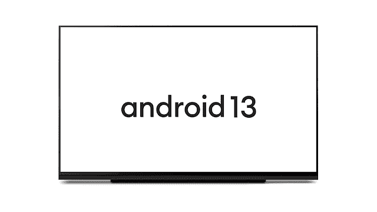
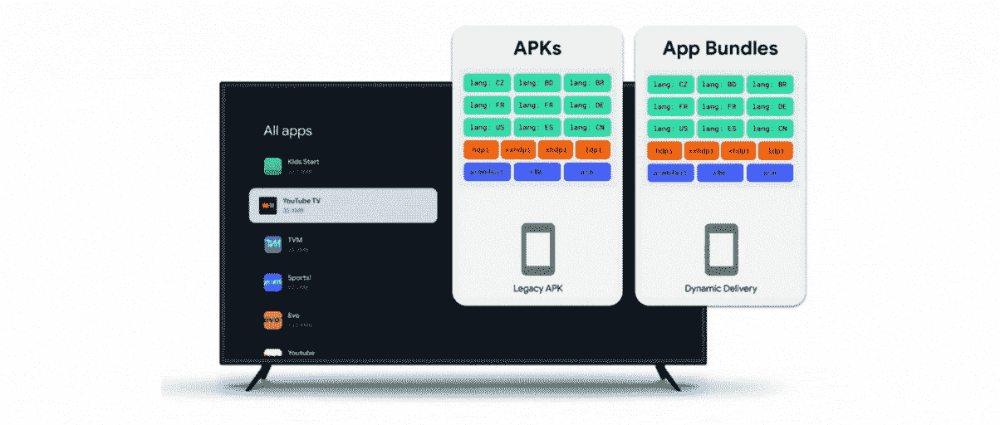

# 现在在 Android #74 中

> 原文：<https://medium.com/androiddevelopers/now-in-android-74-886a95404e8b?source=collection_archive---------3----------------------->

## [Android 13 for TV](http://android-developers.googleblog.com/2022/12/android-13-for-android-tv-is-now-available.html) ， [Compose for Wear OS 1.1](http://android-developers.googleblog.com/2022/12/compose-for-wear-os-11-stable.html) ，[Android Privacy Sandbox Beta](http://android-developers.googleblog.com/2022/11/preparing-for-android-privacy-sandbox-beta.html)，[相机取景器](http://android-developers.googleblog.com/2022/11/introducing-camera-viewfinder.html)，[架构模板](/androiddevelopers/introducing-the-architecture-templates-3151323e4e34?source=collection_home---4------0-----------------------)，[着色器](/androiddevelopers/making-jellyfish-move-in-compose-animating-imagevectors-and-applying-agsl-rendereffects-3666596a8888?source=collection_home---4------3-----------------------)和[图形](/@chethaase/blurring-the-lines-4fd33821b83c)， [Google Play](https://android-developers.googleblog.com/2022/12/notes-from-google-play-growing-for-next-decade.html) ， [Jetpack Compose](/androiddevelopers/just-your-type-variable-fonts-in-compose-5bf63b357994?source=collection_home---4------6-----------------------) 等等。

欢迎来到 Android 中的 Now，这是您对 Android 开发世界中新的和值得注意的事物的持续指导。

# 第 74 集视频和播客

*现在在 Android 中*也以视频和播客的形式提供。

# [安卓 13 电视版现已上市](http://android-developers.googleblog.com/2022/12/android-13-for-android-tv-is-now-available.html)📺

我们发布了面向电视的 Android 13，为大屏幕带来了新的 API，包括对`[AudioManager](https://developer.android.com/reference/android/media/AudioManager)` API 的改进，用户可以在支持的 HDMI 源设备上更改默认分辨率和刷新率，在`[MediaSession](https://developer.android.com/reference/android/media/session/MediaSession)`生命周期中显示 HDMI 状态变化，`[InputDevice](https://developer.android.com/reference/android/view/InputDevice)` API 中支持不同的键盘布局，`[AccessibilityManager](https://developer.android.com/reference/android/view/accessibility/AccessibilityManager)`中的音频描述 API 用于查询用户偏好，以及 [Android 13](https://developer.android.com/about/versions/13) 带来的所有其他改进。

 [## Android 13 电视版现已上市

### Android TV OS 产品经理 Wolfram Klein 发布今天，我们将发布最新版本的 Android TV OS…

android-developers.googleblog.com](http://android-developers.googleblog.com/2022/12/android-13-for-android-tv-is-now-available.html) 

# [适用于谷歌电视和安卓电视的应用捆绑包](http://android-developers.googleblog.com/2022/11/app-bundles-for-google-tv-and-android-tv.html)🎒📺

从 2023 年 5 月开始，谷歌电视和安卓电视将要求[可归档](https://android-developers.googleblog.com/2022/03/freeing-up-60-of-storage-for-apps.html)安卓应用捆绑包，以帮助用户节省他们通常有限的电视设备存储空间。[归档](https://android-developers.googleblog.com/2022/03/freeing-up-60-of-storage-for-apps.html)可回收约 60%的应用存储，允许用户使用内置的快速归档/取消归档用户界面在电视上保留更多应用。未及时过渡的应用程序可能会对电视设备隐藏。

 [## 适用于谷歌电视和安卓电视的应用捆绑包

### TLDR:从 2023 年 5 月开始，谷歌电视和安卓电视将要求安卓应用捆绑包可以存档，以节省…

android-developers.googleblog.com](http://android-developers.googleblog.com/2022/11/app-bundles-for-google-tv-and-android-tv.html) 

# [Android 开发者博客:Compose for Wear OS 1.1 现已稳定:查看新功能！](http://android-developers.googleblog.com/2022/12/compose-for-wear-os-11-stable.html)🎵⌚

我们发布了 [Compose for Wear OS 1.1](https://developer.android.com/jetpack/androidx/releases/wear-compose) ，这是我们的现代声明式 UI 工具包，可以帮助您为 Wear OS 构建美观、响应迅速的应用。该版本包括新的功能，如芯片和按钮的轮廓样式，使用新的函数重载修改[芯片](https://developer.android.com/reference/kotlin/androidx/wear/compose/material/package-summary#Chip(kotlin.Function0,androidx.wear.compose.material.ChipColors,androidx.wear.compose.material.ChipBorder,androidx.compose.ui.Modifier,kotlin.Boolean,androidx.compose.foundation.layout.PaddingValues,androidx.compose.ui.graphics.Shape,androidx.compose.foundation.interaction.MutableInteractionSource,androidx.compose.ui.semantics.Role,kotlin.Function1)) / [切换芯片](https://developer.android.com/reference/kotlin/androidx/wear/compose/material/package-summary#ToggleChip(kotlin.Boolean,kotlin.Function1,kotlin.Function1,kotlin.Function0,androidx.compose.ui.Modifier,kotlin.Function1,kotlin.Function1,androidx.wear.compose.material.ToggleChipColors,kotlin.Boolean,androidx.compose.foundation.interaction.MutableInteractionSource,androidx.compose.foundation.layout.PaddingValues,androidx.compose.ui.graphics.Shape))和[按钮](https://developer.android.com/reference/kotlin/androidx/wear/compose/material/package-summary#Button(kotlin.Function0,androidx.compose.ui.Modifier,kotlin.Boolean,androidx.wear.compose.material.ButtonColors,androidx.compose.foundation.interaction.MutableInteractionSource,androidx.compose.ui.graphics.Shape,androidx.wear.compose.material.ButtonBorder,kotlin.Function1)) / [切换按钮](https://developer.android.com/reference/kotlin/androidx/wear/compose/material/package-summary#ToggleButton(kotlin.Boolean,kotlin.Function1,androidx.compose.ui.Modifier,kotlin.Boolean,androidx.wear.compose.material.ToggleButtonColors,androidx.compose.foundation.interaction.MutableInteractionSource,androidx.compose.ui.graphics.Shape,kotlin.Function1))组件的形状的能力，一个实验性的占位符 API， [scrollAway 修改器](https://developer.android.com/reference/kotlin/androidx/wear/compose/material/package-summary#(androidx.compose.ui.Modifier).scrollAway(androidx.compose.foundation.ScrollState,androidx.compose.ui.unit.Dp))，在 [CurvedTextStyle](https://developer.android.com/reference/kotlin/androidx/wear/compose/foundation/CurvedTextStyle#CurvedTextStyle(androidx.compose.ui.graphics.Color,androidx.compose.ui.graphics.Color,androidx.compose.ui.unit.TextUnit,androidx.compose.ui.text.font.FontFamily,androidx.compose.ui.text.font.FontWeight,androidx.compose.ui.text.font.FontStyle,androidx.compose.ui.text.font.FontSynthesis)) 中的附加参数，用户体验改进，[对讲](https://support.google.com/wearos/answer/7313945?hl=en-GB)支持改进，以及更好的整体[可访问性](https://m2.material.io/design/usability/accessibility.html#understanding-accessibility)

 [## Compose for Wear OS 1.1 现已稳定:查看新功能！

### 今天，我们发布了 1.1 版的 Compose for Wear OS，这是我们现代的声明式 UI 工具包，可以帮助开发人员构建…

android-developers.googleblog.com](http://android-developers.googleblog.com/2022/12/compose-for-wear-os-11-stable.html) 

# [准备 Android 隐私沙盒测试版](http://android-developers.googleblog.com/2022/11/preparing-for-android-privacy-sandbox-beta.html) 🕶️

我们分享了细节，这样你就可以为明年初的初始[隐私沙盒](https://www.privacysandbox.com/)测试版的逐步推出做准备，这个项目的目标是为 Android 带来新的、更私人的广告解决方案。[的帖子](http://android-developers.googleblog.com/2022/11/preparing-for-android-privacy-sandbox-beta.html)有更多关于[如何注册访问隐私保护 API](https://developer.android.com/design-for-safety/privacy-sandbox/enroll)，如何[参与测试程序](https://forms.gle/CYYfzZZ7gFDKjvVF7)，以及如何[在封闭的 SDK 运行时测试版中注册您的兴趣](https://forms.gle/CYYfzZZ7gFDKjvVF7)。

 [## 准备 Android 隐私沙盒测试版

### 由产品经理 Ryan Fitzgibbon 在二月份发布，我们宣布了 Android 上的隐私沙盒，目标是…

android-developers.googleblog.com](http://android-developers.googleblog.com/2022/11/preparing-for-android-privacy-sandbox-beta.html) 

# [Android 开发者博客:介绍相机取景器](http://android-developers.googleblog.com/2022/11/introducing-camera-viewfinder.html)📷

我们介绍了 [CameraViewfinder](https://developer.android.com/reference/kotlin/androidx/camera/viewfinder/CameraViewfinder) ，这是一个新的 Jetpack 库工件，旨在与您现有的 Camera2 代码库配合使用，允许您以最小的努力快速实现相机预览。它使用 TextureView 或 SurfaceView 来显示相机馈送，校正纵横比、比例和旋转以准确显示取景器。[帖子](http://android-developers.googleblog.com/2022/11/introducing-camera-viewfinder.html)涵盖了如何使用 CameraViewfinder，包括如何将其与 [Jetpack WindowManager](https://developer.android.com/jetpack/androidx/releases/window) 库相结合，以在可折叠设备上提供独特的体验。

 [## 相机取景器介绍

### 由 Android 开发者关系工程师弗朗西斯科·罗马诺发布这些年来，Android 设备已经发展到…

android-developers.googleblog.com](http://android-developers.googleblog.com/2022/11/introducing-camera-viewfinder.html) 

# [介绍架构模板](/androiddevelopers/introducing-the-architecture-templates-3151323e4e34?source=collection_home---4------0-----------------------)🏗️

我们发布了 [Android 架构启动模板](https://github.com/android/architecture-templates)，这是 GitHub 上的一个新项目，它可以让你按照我们最近发布的[架构建议](https://developer.android.com/topic/architecture/recommendations)快速启动一个项目——无论你是在构建一个新的应用程序还是只是一个快速实验。我们将它们从 Android Studio 中单独交付，因此它们将始终反映最新的依赖关系，让您尽快入门。

 [## 介绍架构模板

### 我们在 Github 上发布了一个新项目，名为 Android 架构启动模板。

medium.com](/androiddevelopers/introducing-the-architecture-templates-3151323e4e34) 

# 文章📚

我们有四篇专注于图形的文章，涵盖了 [RenderEffect](https://developer.android.com/reference/android/graphics/RenderEffect) 、 [RenderNode](https://developer.android.com/reference/android/graphics/RenderNode) 和 [AGSL](https://developer.android.com/develop/ui/views/graphics/agsl) ，Android 图形着色语言。

[Chet](https://medium.com/u/cb2c4874d3e9?source=post_page-----886a95404e8b--------------------------------) 以[开始，讲述如何使用 Android 12 引入的 BlurEffect](/@chethaase/blurring-the-lines-4fd33821b83c) ，随后是[介绍 Android 13 的 AGSL 以及如何编写在 Android 的画布绘制系统中工作的像素着色器](/androiddevelopers/agsl-made-in-the-shade-r-7d06d14fe02a?source=collection_home---4------5-----------------------)。下一篇文章关注如何利用 RenderNode 的力量。丽贝卡接着讲述了如何[制作图像矢量动画，以及如何在构图中应用 AGSL 效果](/androiddevelopers/making-jellyfish-move-in-compose-animating-imagevectors-and-applying-agsl-rendereffects-3666596a8888?source=collection_home---4------3-----------------------)。

 [## 模糊界限

### Android 渲染效果#1:模糊效果

medium.com](/androiddevelopers/blurring-the-lines-4fd33821b83c)  [## AGSL:在阴影中制造

### 渲染效果# 2:Android 13 中的像素着色器

medium.com](/androiddevelopers/agsl-made-in-the-shade-r-7d06d14fe02a)  [## 渲染节点获得更大、更好的模糊效果

### RenderEffects #3:使用 RenderNode 实现更快、更好的模糊效果

medium.com](/androiddevelopers/rendernode-for-bigger-better-blurs-ced9f108c7e2)  [## 让水母在构图中移动:动画图像矢量和应用 AGSL 渲染效果🐠

### 了解如何在合成中使用 ImageVectors

medium.com](/androiddevelopers/making-jellyfish-move-in-compose-animating-imagevectors-and-applying-agsl-rendereffects-3666596a8888) 

说到 Compose，[阿莱杭德娜](https://medium.com/u/92c44d274e60?source=post_page-----886a95404e8b--------------------------------)讲述了在 Compose 1.3 中使用[可变字体，而](/androiddevelopers/just-your-type-variable-fonts-in-compose-5bf63b357994?source=collection_home---4------6-----------------------)[阿道尔](https://medium.com/u/c09b24c8e7b2?source=post_page-----886a95404e8b--------------------------------)则讲述了他和萨拉在[用 Wear OS 上的 Compose Canvas 制作游戏](/androiddevelopers/pew-pew-making-a-game-with-compose-canvas-on-wear-os-9a37fa498d3?source=rss----95b274b437c2---4)的冒险经历。 [Ben](https://medium.com/u/84718b19bc40?source=post_page-----886a95404e8b--------------------------------) 随后讲述了[何时何地使用 derivedStateOf API](/androiddevelopers/jetpack-compose-when-should-i-use-derivedstateof-63ce7954c11b?source=collection_home---4------1-----------------------) ，而 [Sagar](https://medium.com/u/6cbce6a607f7?source=post_page-----886a95404e8b--------------------------------) [解释了](/androiddevelopers/faster-jetpack-compose-view-interop-with-app-startup-and-baseline-profile-8a615e061d14?source=collection_home---4------4-----------------------)如何使用应用启动库和定制基线配置文件更快地构建集成了 Jetpack 的基于视图的应用。

 [## 适合您的类型:撰写中的可变字体

### 可变字体可以从 Compose UI 1.3.0 开始使用，适用于 Android O 及以上版本。

medium.com](/androiddevelopers/just-your-type-variable-fonts-in-compose-5bf63b357994)  [## 皮尤皮尤！在 Wear OS 上用 Compose Canvas 制作游戏👾

### 几周前，我和莎拉·汉密尔顿做了一个穿戴操作系统游戏，稍微偏离了我们通常感兴趣的领域…

medium.com](/androiddevelopers/pew-pew-making-a-game-with-compose-canvas-on-wear-os-9a37fa498d3)  [## Jetpack Compose —何时应该使用 derivedStateOf？

### derivedStateOf —我们看到的一个非常常见的问题是，何时何地使用这个 API 才是正确的？

medium.com](/androiddevelopers/jetpack-compose-when-should-i-use-derivedstateof-63ce7954c11b)  [## 更快的 Jetpack 撰写查看与应用程序启动和基线配置文件的互操作

### Jetpack Compose 旨在与现有的基于视图的应用程序互操作。这使你能够采取…

medium.com](/androiddevelopers/faster-jetpack-compose-view-interop-with-app-startup-and-baseline-profile-8a615e061d14) 

[neela ns](https://medium.com/u/fee2e29d112b?source=post_page-----886a95404e8b--------------------------------)做了一个两部分的系列，涵盖了每个应用程序的语言偏好，其中[第 1 部分](http://android-developers.googleblog.com/2022/11/per-app-language-preferences-part-1.html)解释了如何使用 AndroidX AppCompat 库将 API 集成到您的应用程序中，而[第 2 部分](http://android-developers.googleblog.com/2022/12/per-app-language-preferences-part-2.html)涵盖了使用 API 的流行应用程序以及它如何为他们带来好处。

 [## 每个应用程序的语言首选项-第 1 部分

### 由 Neelansh Sahai Android 开发者关系工程师发布(在 Twitter 和 LinkedIn 上)如果你有一组用户…

android-developers.googleblog.com](http://android-developers.googleblog.com/2022/11/per-app-language-preferences-part-1.html)  [## 每个应用程序的语言首选项-第 2 部分

### 在每个应用程序的语言偏好博客的第 1 部分，我们讨论了这个特性是什么，开发者如何从中受益…

android-developers.googleblog.com](https://android-developers.googleblog.com/2022/12/per-app-language-preferences-part-2.html) 

然后，Patrick 写了一些小技巧来帮助 T8 将为移动设备设计的应用程序扩展到 ChromeOS 上，其中很多技巧都适用于让你的应用程序适应任何大屏幕的 Android 设备。

 [## 来自 2022 年 Android 开发峰会的提示:如何将移动应用扩展到 ChromeOS

### 由开发者关系工程师 Patrick Fuentes 发布的谷歌 ChromeOS 用户对大屏幕应用的需求…

android-developers.googleblog.com](http://android-developers.googleblog.com/2022/12/tips-from-android-dev-summit-2022-how-to-scale-made-for-moble-apps-chromeos.html) 

在来自 Google Play 的最新[笔记中，Purnima 介绍了 Play 功能，如帮助您发展业务的](https://android-developers.googleblog.com/2022/12/notes-from-google-play-growing-for-next-decade.html)[定制商店列表](https://play.google.com/console/about/customstorelistings/)和[促销内容卡](https://play.google.com/console/about/programs/promotionalcontent/)，帮助您进入新市场的新[工具](https://android-developers.googleblog.com/2022/11/optimization-flexibility-and-growth-with-play-commerce.html)、[指南](https://android-developers.googleblog.com/2022/02/grow-your-games-revenue-with-google.html)和[课程](https://playacademy.exceedlms.com/student/collection/566778-go-global)，Play 支持将您的应用带到更多设备的方式，以及帮助您在 Google Play 上导航信任和安全的[新功能和程序](https://android-developers.googleblog.com/2022/11/keeping-google-play-safe.html)，包括扩展的

 [## Google Play 笔记:未来十年的增长

### 大家好，今年，Google Play 庆祝了我们与贵公司合作的第一个十年。所以无论你…

android-developers.googleblog.com](https://android-developers.googleblog.com/2022/12/notes-from-google-play-growing-for-next-decade.html) 

Aditya 与韩国 [Creatrip](https://www.creatrip.com/en) 的创始人兼首席执行官 Haemin Yim 坐下来喝“虚拟咖啡”,讨论如何从网络开始，如何建立面向全球的公司，以及对寻求发展的初创公司的建议。我们还有两集 [#WeArePlay](https://play.google.com/console/about/weareplay/) ，第一集讲述了来自世界各地的 [4 位游戏创作者的开发之旅](http://android-developers.googleblog.com/2022/11/weareplay-discover-what-inspired-4-game-creators-around-the-world.html)，第二集介绍了 [Stamurai 言语疗法](https://play.google.com/store/apps/developer?id=Stamurai+Speech+Therapy&hl=en_GB&gl=US)的开发者，以及他们帮助言语障碍患者的应用。

 [## Google Play 与 Creatrip 一起喝咖啡|让您的业务走向全球

### 我坐下来和创始人海明·延(Haemin Yim)喝了一杯“虚拟咖啡”。

android-developers.googleblog.com](https://android-developers.googleblog.com/2022/11/google-play-coffee-break-with-creatrip-setting-up-your-business-for-global-reach.html)  [## # WeArePlay |探索世界各地 4 位游戏创作者的灵感来源

### 菲利普在巴西的萨尔瓦多出生和长大，这座城市的文化遗产让他深受启发，于是他学习了历史…

android-developers.googleblog.com](http://android-developers.googleblog.com/2022/11/weareplay-discover-what-inspired-4-game-creators-around-the-world.html)  [## #WeArePlay |这款应用的联合创始人正在帮助患有语言障碍的人

### 开发者营销 Anshul，Meet 和 Harsh 在一起生活和工作时成为了朋友…

android-developers.googleblog.com](https://android-developers.googleblog.com/2022/12/weareplay-app-co-founders-helping-people-with-speech-disorders.html) 

# 录像📹

我在 YouTube 上发布的关于如何[将你的应用迁移到 Android 13](https://www.youtube.com/watch?v=wBx3-ZObxY8) 的视频，几乎涵盖了让你的应用兼容、定位和利用 Android 13 所需知道的一切。

Google Play 发布了关于[改善用户加入 Google Play 的视频](https://www.youtube.com/watch?v=fK5OLEP0DdE)、[拥抱混合货币化](https://www.youtube.com/watch?v=BgQLwjWTpi8)以及[促进用户激活和承诺](https://www.youtube.com/watch?v=Xvjxr0lkcjE)促进应用增长，思考可访问性和[什么可以创造或破坏某人的用户体验？](https://www.youtube.com/watch?v=XFgRy3kNXsM)，以及最新的 [Google Play 政策更新](https://www.youtube.com/watch?v=PGU1xTUXcGE)。

接下来，[游戏展介绍了用于 PC 的 Google Play 游戏](https://www.youtube.com/watch?v=UIGpF36EnZQ)，以及如何使用它将 Android 游戏带到 Windows 游戏玩家的 PC 上。

最后，我们分享了[关于健康连接整合的提示和技巧](https://www.youtube.com/watch?v=yGAlBTTX9R4)，以帮助您读写健康和健身数据以及新用户。

# AndroidX 释放🚀

在 AndroidX 的世界中，它相对平静，但在 [Hilt 1.1 Alpha 1](https://developer.android.com/jetpack/androidx/releases/hilt#1.1.0-alpha01) 中，hiltViewModel() API 采用了一个可选的键参数，允许您使用不同的键获得同一视图模型类型的多个实例，而**[Wear Compose 1.2 Alpha 1](https://developer.android.com/jetpack/androidx/releases/wear-compose#1.2.0-alpha01)有一系列错误修复、API 更改和对实验性占位符功能的更新。**

# **[亚行播客剧集](https://adbackstage.libsyn.com/) 🎙**

****

**在[第 192 集](https://adbackstage.libsyn.com/episode-192-the-path-forward)中，Android 开发人员在后台 [Romain](https://medium.com/u/c967b7e51f8b?source=post_page-----886a95404e8b--------------------------------) 和 [Chet](https://medium.com/u/cb2c4874d3e9?source=post_page-----886a95404e8b--------------------------------) 讨论图形，谈论路径、贝塞尔曲线、变形等等。**

# **那么现在…👋**

**这就是本周和 2022 年的 [Android 13 for TV](http://android-developers.googleblog.com/2022/12/android-13-for-android-tv-is-now-available.html) 和 [Archivable App Bundle 需求](http://android-developers.googleblog.com/2022/11/app-bundles-for-google-tv-and-android-tv.html)、 [Compose for Wear OS 1.1](http://android-developers.googleblog.com/2022/12/compose-for-wear-os-11-stable.html) 、[Android Privacy Sandbox Beta](http://android-developers.googleblog.com/2022/11/preparing-for-android-privacy-sandbox-beta.html)、[相机取景器](http://android-developers.googleblog.com/2022/11/introducing-camera-viewfinder.html)、[架构模板](/androiddevelopers/introducing-the-architecture-templates-3151323e4e34?source=collection_home---4------0-----------------------)、[着色器](/androiddevelopers/making-jellyfish-move-in-compose-animating-imagevectors-and-applying-agsl-rendereffects-3666596a8888?source=collection_home---4------3-----------------------)和[图形](/@chethaase/blurring-the-lines-4fd33821b83c)、 [Google Play](https://android-developers.googleblog.com/2022/12/notes-from-google-play-growing-for-next-decade.html) 、 [Jetpack Compose 明年再来这里，从 Android 开发者世界获得另一个更新。](/androiddevelopers/just-your-type-variable-fonts-in-compose-5bf63b357994?source=collection_home---4------6-----------------------)**