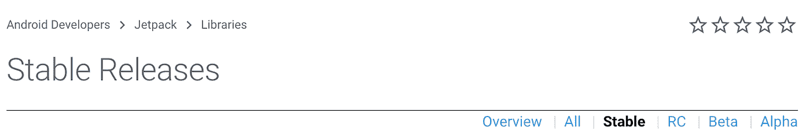
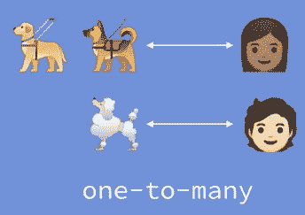
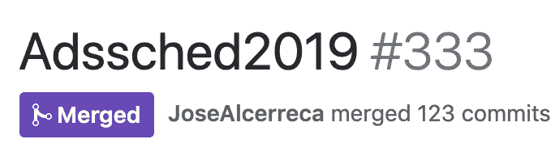

# 现在在 Android #8 中

> 原文：<https://medium.com/androiddevelopers/now-in-android-8-6282b0a95d9f?source=collection_archive---------6----------------------->

## 工作管理器迁移、AndroidX 库发布、房间关系、广告调度应用源代码、Android 开发者挑战和最近的 ADB 播客专题

Illustration by [Virginia Poltrack](https://twitter.com/VPoltrack)

欢迎来到 Android 中的 Now，这是您对 Android 开发世界中新的和值得注意的事物的持续指导。

# 立即迁移到工作管理器！

[Caren Chang](https://twitter.com/calren24) 在 Android 开发者博客上发表了一篇[的文章，内容是关于 GcmNetworkManager 即将被弃用，以及转向 workManager 的必要性。2020 年 11 月，GcmNetworkManager 将被弃用，针对 Android 10 之后版本的应用程序将不再能够访问这个旧的 API，所以如果你正在使用 GcmNetworkManager，现在是一个研究 workManager 的绝佳时机。您很有可能已经在使用 WorkManager 了——如果是这样，那么恭喜您！你完了！你甚至没有说完这句话就赢得了进入下一个项目的机会。](https://android-developers.googleblog.com/2019/11/unifying-background-task-scheduling-on.html)

但是，如果您仍然在使用 GcmNetworkManager(或 Firebase JobDispatcher)的 API，那么您将希望很快迁移到 workManager，因为这两种 API 都将消失。

当 WorkManager 开始工作时，它将所有延迟工作的选项打包到一个 API 中。在底层，当平台 JobScheduler API 可用时，它使用平台 JobScheduler API 当 JobScheduler 不可用时，它使用 GcmNetworkManager 功能；作为后备，它使用更加手动的 AlarmManager 方法。它本质上是在做大多数应用程序必须在内部做的事情，以覆盖广泛的设备和版本生态系统。

既然 WorkManager 功能齐全，我们认为提供 WorkManager 的单一解决方案比继续提供 GCM NetworkManager API 的潜在混乱方法更有意义。

在 2020 年，Firebase JobDispatcher *和* GcmNetworkManager 都将被弃用，因此您需要迁移代码来使用 workManager。同样强大的功能，但只有一个更简单的 API。

阅读[卡伦的文章](https://android-developers.googleblog.com/2019/11/unifying-background-task-scheduling-on.html)了解更多详情和链接。

# AndroidX 发射

最近有几个库变得稳定了，所以如果你一直坚持使用它们直到它们真正完成，现在是时候了。

[基准测试 1.0.0](https://developer.android.com/jetpack/androidx/releases/benchmark#1.0.0) 这个库可以帮助你编写代码，创建可重复的性能测试。AndroidX 使用 Benchmark 向其持续集成系统添加回归测试，您也可以这样做。请务必查看 Android 开发峰会上的[基准测试会议、最近的](https://youtu.be/ynBPcFs6OOk)[博客文章](/androiddevelopers/fighting-regressions-with-benchmarks-in-ci-6ea9a14b5c71)和 [ADB 播客插曲](http://androidbackstage.blogspot.com/2019/09/episode-121-benchmarking.html)，其中团队讨论了该库以及如何将其用于 CI 的技巧。

[Exifinterface 1.1.0](https://developer.android.com/jetpack/androidx/releases/exifinterface#1.1.0) 该 API 支持从/向 JPEG 和 RAW 等图像文件读取和写入 Exif 数据。这个最新版本也支持 HEIF。

这个版本已经酝酿了很长时间。它提供了旧 ViewPager API 的所有功能，还提供了 RTL 支持和垂直方向等附加功能，以及基于 RecyclerView 的更高灵活性。查看 [Tiem Song](/@tiembo) 在 Android 开发者峰会上的 [lightning talk、](https://www.youtube.com/watch?v=lAP6cz1HSzA) [ViewPager2 示例](https://github.com/android/views-widgets-samples/tree/master/ViewPager2)和[迁移指南](https://developer.android.com/training/animation/vp2-migration)以获得关于该 API 的更多信息。

[生物识别 1.0.0](https://developer.android.com/jetpack/androidx/releases/biometric#1.0.0) 生物识别认证在过去几年里迅速发展，从指纹开始，然后扩展到人脸检测。这为 Jetpack 中的 API 提供了一个很好的机会，这样开发人员就可以为他们的应用程序中内置的库使用一个 API，而不是为每个平台版本使用不同的 API。谁知道在未来的岁月里还会涉及到哪些其他的感官——我几乎可以尝到未来的味道。

[RecyclerView 1.1.0](https://developer.android.com/jetpack/androidx/releases/recyclerview#1.1.0) 、 [Room 2.2.2](https://developer.android.com/jetpack/androidx/releases/room#2.2.2) 、 [Webkit 1.1.0](https://developer.android.com/jetpack/androidx/releases/webkit#1.1.0) 自之前版本以来的各种 bug 修复和 API 改进。

RSS feed added for AndroidX libraries

顺便说一下，我们为 AndroidX 版本添加了一个 [RSS 提要](https://developer.android.com/feeds/androidx-release-notes.xml)。现在你可以找到所有的 AndroidX 库版本。查看 [Android X 版本页面](https://developer.android.com/jetpack/androidx/versions/all-channel)上的简介(针对“所有”频道)，或者直接向您的读者添加[提要](https://developer.android.com/feeds/androidx-release-notes.xml)。

# 充足的空间

Database relations in Room. And dogs.

[弗洛里纳·蒙特内斯库](https://medium.com/u/d5885adb1ddf?source=post_page-----6282b0a95d9f--------------------------------)继续她的房间功能系列，发表了一篇关于[与房间](/androiddevelopers/database-relations-with-room-544ab95e4542)的数据库关系的文章，以及在房间 2.3 中添加的不同实体关系功能。还有狗。

# 广告时间表应用程序开源

[Jose Alcérreca](https://medium.com/u/e0a4c9469bb5?source=post_page-----6282b0a95d9f--------------------------------) [宣布](https://twitter.com/ppvi/status/1193915938443341830?s=19)我们已经[开源了我们在 Android Dev 峰会上使用的日程安排应用](https://github.com/google/iosched/pull/333)。这个应用程序(我们继续为每个 I/O 和 Dev 峰会事件迭代)是一个寻找如何使用 Android 中一些最新功能和 API 的好地方。这个版本中启用的一些功能包括手势导航支持、深色主题和协程。

# Android 开发者挑战

Submit your ideas at [https://developer.android.com/dev-challenge](https://developer.android.com/dev-challenge) by December 2.

你已经提交了你对 [Android 开发者挑战赛](https://developer.android.com/dev-challenge)的想法了吗？我们正在寻找关于机器学习有益创新主题的想法。我们将挑选出前 10 个想法，并邀请开发人员到 Google 了解更多技术，以帮助您编写出色的应用程序，然后我们将在 Google I/O 和 Play Store 上展示这些应用程序。

Android 中的 Now 的忠实追随者此时会想“你已经谈论过开发者挑战了！这不是新的！你只是保留旧的东西来增加你文章的阅读时间吗？给我带来新鲜内容！”你将是完全正确的(除了阅读时间。可悲的是，一段越长，到最后的人越少。互联网偏爱简洁；长度没有奖励积分)。]

但是**12 月 2 日**的最后期限比一个月一次的安全 OTA 还要快，所以似乎值得再来一次。查看 Android 开发者博客和 [Android 开发者挑战网站](https://developer.android.com/dev-challenge)上的[文章，并提交这些想法。我们需要你的想法——什么，你认为我们有人工智能机器人想出他们自己的人工智能想法？无限递归的堆栈溢出！](https://android-developers.googleblog.com/2019/11/android-developer-challenge-heres-what.html)

# ADB 播客片段

ADB Live: Episode 125 was recorded as a live session at the Android Dev Summit

自从 Android 上一个 Now 发布以来，已经有几集 Android 开发人员在后台发布了。点击下面的链接，或者在你最喜欢的播客客户端查看它们:

[ADB 125: ADB 在 Android Dev 峰会上直播](http://androidbackstage.blogspot.com/2019/10/episode-125-adb-live-at-android-dev.html)这一集是 ADB 的第一集，因为我们在不寻常的情况下做了我们通常做的事情，记录了 Chet、Tor 和 Romain 与 Android 开发者 Zarah Dominguez 和 Cyril Mottier 在 ADS 活动上的对话。你可以像往常一样听播客，或者如果你想看的话，可以看看视频。

[ADB 126:手势导航](http://androidbackstage.blogspot.com/2019/11/episode-126-gesture-nav.html)Chet 和 Tor 与 Chris Banes、Adam Cohen、Dan Sandler 和 Allen Huang 讨论手势导航，包括 Android 10 的变化和整体 UI 体验。

[ADB 127:grad le to Crave](http://androidbackstage.blogspot.com/2019/11/episode-127-gradle-to-crave.html)Tor 与 Android Studio 构建系统团队的 Jerome Dochez、Chris Warrington 和 Xavier Ducrohet 进行了交谈。

# 那么现在…

这次到此为止。将您的作业调度代码迁移到 WorkManager！查看最新的 [AndroidX 稳定版](https://developer.android.com/jetpack/androidx/versions/stable-channel)！在房间阅读关于[的关系！查看广告调度应用的](/androiddevelopers/database-relations-with-room-544ab95e4542)[源代码](https://github.com/google/iosched/pull/333)！趁还有时间，提交您的创新 ML 想法参加 [Android 开发者挑战赛](https://android-developers.googleblog.com/2019/11/android-developer-challenge-heres-what.html)！听最新的 [ADB 播客](http://androidbackstage.blogspot.com/)集！请稍后回来查看 Android 开发领域的更多更新。