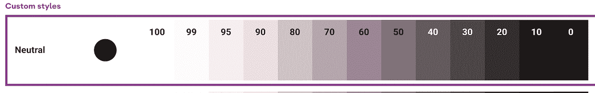
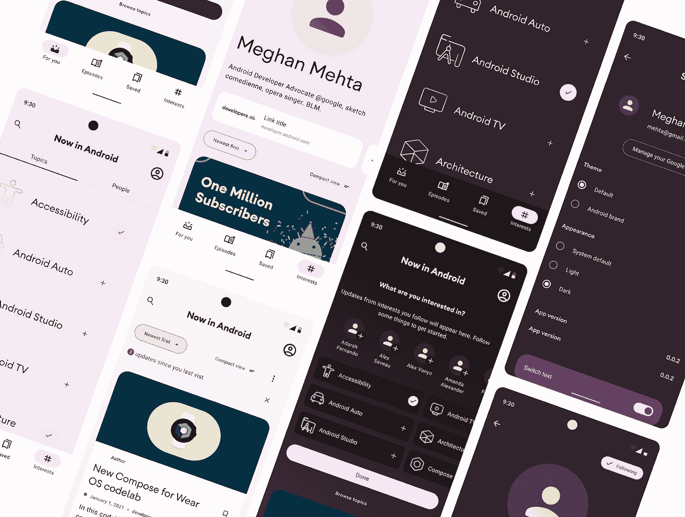

# 现在在 Android 中:一个材料 3 案例研究

> 原文：<https://medium.com/androiddevelopers/now-in-android-a-material-3-case-study-21e44bdfd2bc?source=collection_archive---------2----------------------->

## 了解我们如何利用材料 3 设计 Now in Android 应用程序

*安卓开发者体验团队的曼达·埃德林(UX 设计师)和帕丽斯·许(产品经理)写了以下帖子*

Material 3 Case Study: Now in Android App with Material 3

[现在在安卓](https://github.com/android/nowinandroid)是一个全功能的安卓 app，完全用 [Kotlin](https://developer.android.com/kotlin) 、 [Jetpack Compose](https://developer.android.com/jetpack/compose) 构建，用 [Material 3](https://m3.material.io/) 设计。它的源代码和支持材料旨在为开发人员提供有用的参考。

对于最终用户，它提供来自同名博客系列[的定期新闻更新，帮助您了解 Android 开发的最新动态。](https://developer.android.com/series/now-in-android)

本文描述了我们如何将 Material 3 概念应用于应用程序，并探索了刚刚发布的附带设计文件的[。](https://goo.gle/nia-figma)

## 设计文件发布

我们已经发布了 Now in Android 设计文件，因此您可以深入了解大规模应用程序设计。你可以从素材库复制 [Figma 文件](https://goo.gle/nia-figma)或者从我们的 [Github 库](https://github.com/android/nowinandroid/blob/main/docs/Now-In-Android-Design-File.pdf)获取 pdf 版本。设计文件包含为 Android 应用程序中的 Now 创建的样式和组件；它可以作为设计师创建 Material 3 组件和 Android 应用程序设计的指南。

# 旅程

## 设计挑战

在 I/O’21 上，谷歌推出了 [Material 3](https://m3.material.io/) ，这是[材料设计](https://material.io/)的最新发展，包含了情感、表现力和个性化。

Material 3: Dynamic Theming

这种个性化的体验向我们提出了一个有趣的设计挑战:

> **“我们如何使用新的个性化 Material 3 设计系统设计 Now in Android 应用程序，使其也能反映 Android 开发者品牌？”**

带着这个问题，我们的设计团队和来自俄勒冈州波特兰的设计机构 Instrument 一起花了两个月的时间研究规范的细节。

## 颜色实验

**实验#1** :我们首先尝试了最明显的想法:将 Android 品牌的原色、二色和三色植入[材质主题生成器](https://www.figma.com/community/plugin/1034969338659738588/Material-Theme-Builder):

First experiment: directly seeding Android colors

**结果#1** :这种颜色组合创造了一个时尚严肃的调色板，产生了一种很酷的技术氛围，但蓝色文本对于展示文章和新闻的应用程序来说并不理想。

First experiment: sample screens

**实验#2:** 我们意识到相关但简化的调色板可能会更好，所以我们尝试将调色板限制为主要品牌的颜色:

Second experiment: limiting the palette to just the primary green

**结果#2** :这更好地提高了可读性，并创造了一个更温暖、更轻松的外观和感觉，但我们发现自己问了一个问题“我们可以更直接地应用 android 主题吗？”。

Second experiment: sample screens

**实验#3:** 在这个实验中，我们从 Android 调色板中挑选颜色到颜色槽中，而不是使用主题生成器的直接输出。

Third experiment: handpicking individual colors

**结果#3** :安卓的原色绿色处于明暗亮度的尖端，

所以它不能用于没有可访问性对比问题的白色文本。试图以这种方式手工挑选颜色既费时又产生了可访问性问题。它没有让我们利用 Material 3 的内置功能来自动生成可访问的调色板。

Third experiment: palate with accessibility issues

## 支点

在这些实验之后，我们有各种各样的调色板可供选择，这些调色板是从原始品牌的颜色中构建的，这有助于我们理解如何将材料 3 的主题与现有品牌结合使用，但我们也希望完全接受材料 3 的个性化方面。设计团队想，“与其使用 Android 绿色和蓝色的细微变化，为什么我们不尝试用一种完全不同的方式来表达 Android？”

那就是:

> **将设计方向更多地集中在我们现在想要在 Android 中展示的能量上:有趣、大胆和活泼**

这就是 Now in Android 品牌的诞生。设计团队利用明亮的颜色和大胆的形状来表达应用程序的身份。

当与动态色彩结合使用时，这些设计决策尤其重要。这是 Android 12 的一个功能，它根据用户的壁纸为应用程序选择调色板，允许应用程序提供个性化的体验。

即使使用个性化的调色板，该应用程序大胆的形状和排版也保持了 Android 品牌的定义特征:有趣、大胆和活泼。

Now in Android brand first iteration: splash screen

Now in Android brand first iteration: dynamic theming

## 最后一次调整…

我们的利益相关者对调色板的一个方面有异议。他们不喜欢我们中性的语调。对于我们最终的调色板，生成的中性色调比他们喜欢的更红更暖。我们有几个选择:试着用暖色调销售它们，继续探索调色板，或者只冷却中性色调。我们认为这是一个现实世界的挑战，是许多设计师和开发人员每天都要面对的挑战。我们决定探索自定义自动生成的材质 3 样式意味着什么。

除非您准备好手动检查对比度并保证自定义的颜色仍然可用，否则不建议进行这种自定义。材料 3 自动生成可访问的调色板，当正确组合使用时，例如原色与原色上、表面与表面上，将保持可访问的颜色对比。这种额外的定制提供了一个机会，向开发人员和设计人员展示进一步定制调色板的途径。在大多数情况下，我们建议使用自动生成的调色板。

Tonal palette

Final palette

## 学习

使用材料 3 创建 Now in Android 品牌让我们以新的和不同的方式思考颜色和品牌身份。最终，我们的品牌不是基于十六进制代码，而是基于一种由颜色、形状、类型和整体品牌情感产生的情绪。这些类型的探索是通过使用 figma [材质主题构建器插件](https://www.figma.com/community/plugin/1034969338659738588/Material-Theme-Builder)和[材质设计工具包](https://www.figma.com/community/file/1035203688168086460)实现的。

# 创建设计文件

## 文件结构

一旦我们找到了我们的视觉设计系统，我们就开始构建实体模型并尝试布局。为此，我们构建了一个 [Figma 设计文件](https://goo.gle/nia-figma)，包含颜色样式、字体样式、组件和屏幕布局。该文件的结构类似于 [Material 3 Figma 库](https://www.figma.com/@materialdesign)中 Material 3 codelabs 和 kit 的文件结构。

页数:

**封面
简介
样式
组件
布局示例
打印**

**样式**和**组件**部分使您更容易查看、检查和应用应用程序颜色、字体和组件。**布局示例**展示了如何将这些组件一起应用于不同尺寸的屏幕。如果需要，**打印**部分可以让您轻松地将样式、字体和组件保存为 PDF。

## 成分

该应用中使用的组件是使用[材料 3 设计套件](https://www.figma.com/community/file/1035203688168086460)创建的。基于这个工具包构建组件减轻了设计者遇到的许多困难，因为它让你先构建一个组件，然后根据材料 3 对其进行调整。很容易对这些组件应用主题，然后根据需要调整它们以满足设计需求。

在 [Figma 设计文件](https://goo.gle/nia-figma)中，一些定制的组件超出了[材料 3 套件](https://www.figma.com/community/file/1035203688168086460)和[主题构建器插件](https://www.figma.com/community/plugin/1034969338659738588/Material-Theme-Builder)的范围，这些组件都有可视标签，因此设计者可以看到哪里做了更改。对组件的这些更改是在与用户一起测试并与利益相关者一起审查后做出的。

Now in Android buttons components

## 下一步是什么？

随着 Now in Android 应用程序工作的继续和设计的发展，请在 Android 博客中寻找设计文件和未来 Now 的更新。我们不仅希望设计者和开发者能从 Android 应用中学习，我们也在不断地学习，我们希望把这些知识带给你。

如果您想对 Android [设计文件](https://goo.gle/nia-figma)发表评论或提出问题，您可以在我们的 [GitHub repo](https://github.com/android/nowinandroid/issues) 中发表评论或创建问题。

 [## 菲格玛

### Figma 社区文件-通过 Now in Android 应用程序深入研究材料 3，我们很乐意分享设计案例研究…

咕咕](https://goo.gle/nia-figma)  [## GitHub - android/nowinandroid:一个全功能的 android 应用程序，完全由 Kotlin 和…

### 在设计案例研究、架构学习之旅和模块化中了解这款应用的设计和构建

github.com](https://github.com/android/nowinandroid)