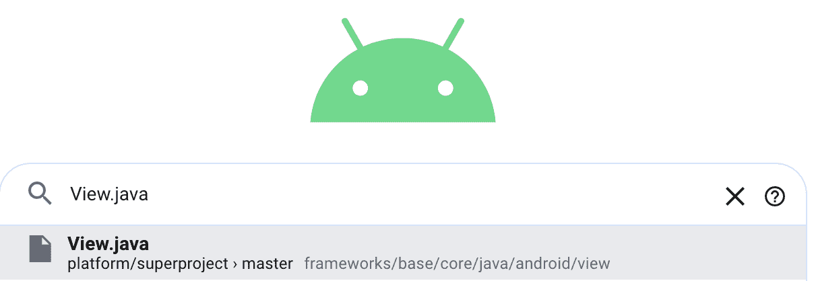
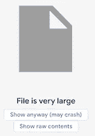
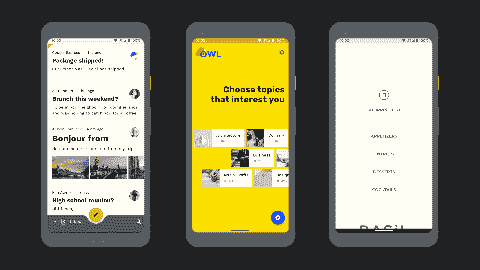
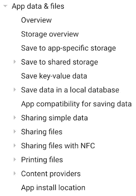
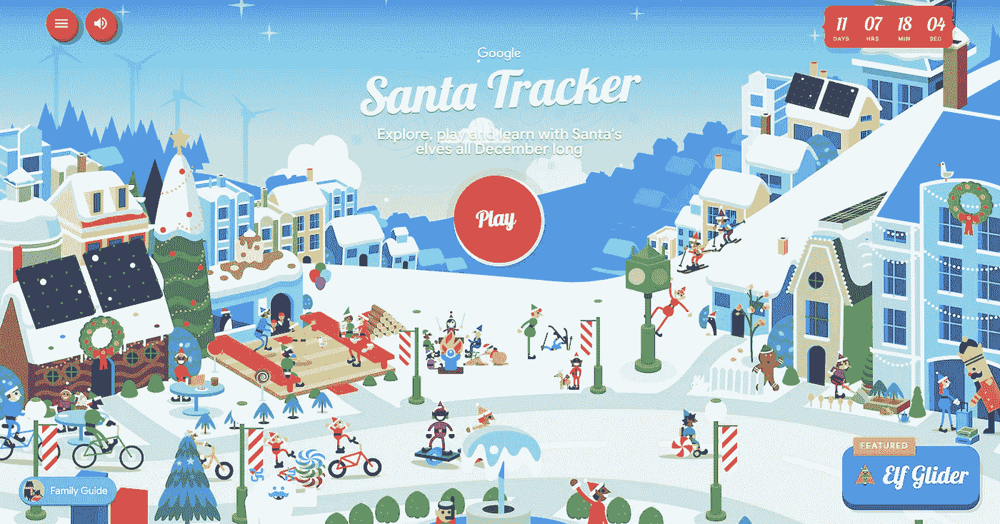

# 现在在安卓:2019 年 12 月 12 日

> 原文：<https://medium.com/androiddevelopers/now-in-android-december-12-2019-979cabf1f433?source=collection_archive---------3----------------------->

Illustration by [Virginia Poltrack](https://twitter.com/VPoltrack)

## #9:文章、可搜索的 AOSP、材料成分样本、改进的存储指南和最新的 ADB 播客

欢迎来到 Android 中的*，这是您对 Android 开发世界中新的和值得注意的事物的持续指导。*

# 文章

我们最近发表了几篇文章，值得一看。

 [## 在视图上暂停

### 协程如何简化 UI 编程

medium.com](/androiddevelopers/suspending-over-views-19de9ebd7020)  [## 在视图上暂停—示例

### Tivi 应用程序的一个工作示例

medium.com](/androiddevelopers/suspending-over-views-example-260ce3dc9100) 

[Chris Banes](https://medium.com/u/9303277cb6db?source=post_page-----979cabf1f433--------------------------------) 发布了这两篇关于使用 Kotlin 协程包装 UI 回调的文章，让您可以轻松地编排它们。第一篇解释了它是如何工作的，而第二篇详细介绍了一个具体的例子。

 [## 使用协程流程的经验教训

### 在 Android Dev Summit 2019 应用中

medium.com](/androiddevelopers/lessons-learnt-using-coroutines-flow-4a6b285c0d06) 

同样在异步编程方面， [Manuel Vivo](https://medium.com/u/3b5622dd813c?source=post_page-----979cabf1f433--------------------------------) 发表了这篇文章，谈论 ADS 调度应用程序(我们最近[开源的用于会议的应用程序](https://github.com/google/iosched/pull/333))如何将 [Kotlin 流](https://kotlinlang.org/docs/reference/coroutines/flow.html)用于异步数据流。特别是，Flow 如何模拟来自 web 或本地缓存的会话数据。

 [## 从 FingerprintManager 迁移到 BiometricPrompt

### Android 框架和安全团队最近发布了 AndroidX 生物特征库，这是一个支持库…

medium.com](/androiddevelopers/migrating-from-fingerprintmanager-to-biometricprompt-4bc5f570dccd) 

[Isai Damier](https://medium.com/u/a2d70bdb57?source=post_page-----979cabf1f433--------------------------------) 解释了开发人员如何将他们的代码从生物识别 API 的平台版本(如 [FingerprintManager](https://developer.android.com/reference/kotlin/android/hardware/fingerprint/FingerprintManager) )迁移到新的 [Jetpack 生物识别](https://developer.android.com/jetpack/androidx/releases/biometric)库(使用合适的平台 API)。通过迁移到 Jetpack 生物特征库，您可以使用这个 API 来针对多个版本的 Android，回到 API 级别 23。

# 导航 Android 的源代码

Android 一直都是开源的，从 1.0 就开始了。但是开放并不一定意味着易于导航。

因此，谷歌的一个团队采用了一些内部工具，并让它们在 AOSP 知识库上工作，所以现在你可以轻松地搜索和导航所有的 Android 源代码。例如，您可以单击项目来查找它们的声明和引用。

View.java is big. Really big.

为了刺激，我装了 View.java。过了一会儿，系统抱怨文件太大，浏览器可能会崩溃。(*没人*喜欢 View.java 的行数——甚至连搜索网站都不喜欢)。但是成功了。

更多信息，请查看 Android 开发者博客上的[文章。或者更好的是，去 cs.android.com](https://android-developers.googleblog.com/2019/12/code-search-with-cross-references-for-aosp.html)[试试看。](https://cs.android.com/)

# 材料成分样本

 [## 材料-组件/材料-组件-Android-示例

### 这个库中的应用程序是虚构材料研究的 Android 实现。每一个都是使用…

github.com](https://github.com/material-components/material-components-android-examples) 

[材质设计组件](https://github.com/material-components/material-components-android)团队与来自设计关系和开发者关系的人们合作，提出了一些[新样本](https://github.com/material-components/material-components-android-examples)，展示了如何实现[材质主题化。](https://material.io/design/material-theming)

The new samples are based on design studies on the Material Design site

样本从虚构的[材料研究](https://material.io/design/material-studies/)开始，它提供了每个项目的设计目标和细节的详细视图。然后，他们将展示如何使用材料设计组件来实现这些目标，以及这些组件支持的定制功能。

# 存储大战

Casters. A solution looking for a problem. And a storage location.

我的车库里有个问题，不知道东西该放在哪里。我组装或拆卸一些家具，最后得到一些随机的硬件，比如一套脚轮。它们仍然功能完善，也许我会在未来的项目中用到它们(乐观地说，不太可能，但理论上是可能的)。但是我把它们放在哪里呢？我没有存放脚轮的柜子。所以当我不知道该怎么做的时候，它们就在一切结束的地方结束了；在我的工作台上(这进一步阻止了我使用我的工作台，或者进入像构建一个可能需要脚轮的项目)。

问题不在于没有地方存储这些随机的项目，而是有太多的*可能的位置，并且很难决定正确的位置，或者一个标准的位置，所以我最终使用随机位置，或者无所不包的工作台来代替。这使得我很难在将来需要的时候找到这些东西。*

类似地，Android 有许多不同的地方来存储应用程序数据。同样，弄清楚该把什么放在哪里也是令人困惑的。或者使用哪些 API 来存储数据。你在储存文件吗？媒体？偏好？app-私有数据，还是应该共享的数据？您想要使用内部存储还是外部存储？数据库信息呢？

There are now many storage guides to help you understand where to put your data

幸运的是，有一套新的[指南](https://developer.android.com/training/data-storage)，由文档和工程团队创建来帮助理解所有选项以及如何使用它们。了解如何存储和访问仅供您的应用程序使用的[文件，以及如何与设备上的其他应用程序共享](https://developer.android.com/training/data-storage/app-specific)[媒体和](https://developer.android.com/training/data-storage/shared/media) [其他类型的文件](https://developer.android.com/training/data-storage/shared/documents-files)。此外，查看[应用兼容性](https://developer.android.com/training/data-storage/compatibility)页面，了解更多信息，帮助您支持最新版本的 Android。

不要像我在车库里储存东西一样储存你的数据。

# ADB 播客片段

自从 Android 上一个 Now 发布以来，已经有几集 Android 开发人员在后台发布了。点击下面的链接，或者在你最喜欢的播客客户端查看它们:

Tor, Jerome, Chris, and Xav

[ADB 127: Gradle 渴望](http://androidbackstage.blogspot.com/2019/11/episode-127-gradle-to-crave.html)

其中 Tor 与 Android Studio 构建系统团队的 Jerome Dochez、Chris Warrington 和 Xavier Ducrohet 进行了交谈。

We forgot to take a photo for this episode. Please use your imagination.

[ADB 128:玩 App 捆绑包](http://androidbackstage.blogspot.com/2019/12/episode-128-play-with-app-bundles.html)

其中切特和弗洛里纳·芒特内斯库(来自 Android 开发者关系团队)与来自 Google Play 团队的多姆·埃利奥特谈论了 Android 应用捆绑包和其他 Google Play 开发者的最新功能。

# 这是[追踪]的季节

santatracker.google.com

圣诞老人追踪者在这个假期回来了，精灵们一直在努力开发这一季的[安卓应用](https://play.google.com/store/apps/details?id=com.google.android.apps.santatracker)，它与[网站](https://santatracker.google.com/)进行了新的整合，新的游戏等等。像往常一样，我们将在明年年初开源该应用:[关注 GitHub repo](https://github.com/google/santa-tracker-android) 更新。

如果你庆祝节日，节日快乐！否则，周五快乐！

# 那么现在…

这一次就到此为止，这是 Android 版 Now 的 2019 年最后一集。去读一些关于[协程](/androiddevelopers/suspending-over-views-19de9ebd7020)和[流](/androiddevelopers/lessons-learnt-using-coroutines-flow-4a6b285c0d06)和新的[生物特征库](/androiddevelopers/migrating-from-fingerprintmanager-to-biometricprompt-4bc5f570dccd)的文章吧！[搜索 AOSP](https://cs.android.com/) ！了解[如何使用我们的许多存储 API](https://developer.android.com/training/data-storage)和[构建材料 ui](https://github.com/material-components/material-components-android-examples)！去听听[亚行播客](http://androidbackstage.blogspot.com/)！[追踪圣诞老人](https://play.google.com/store/apps/details?id=com.google.android.apps.santatracker)！请尽快回到这里，收听 Android 开发者世界的下一次更新。