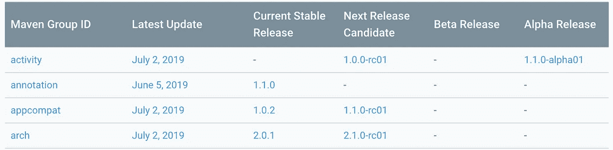

# 现在在安卓:第一集

> 原文：<https://medium.com/androiddevelopers/now-in-android-episode-1-5e8082173595?source=collection_archive---------3----------------------->

## 珍藏版！科特林，安卓克斯，蓝图和广告

Catch the wave

# 欢迎光临！

我最喜欢 Android 团队的一点是，我们都对我们工作的技术和帮助开发者使用它充满热情，以至于我们推送各种信息(库、文章、样本、代码实验室、视频、推文、博客等)。)不断独立。哪个… *牛逼*；我更喜欢这种模式，而不是一切都通过某种公司渠道，导致正式的，公司批准的工件缓慢滴-滴-滴。

但从外面看，这肯定有点令人困惑，不知道该听什么和谁来捕捉最新的重要新闻和比特。(不要告诉任何人，但这并不会减少内部的混乱；有一个 *lot* 正在并行进行)。

我认为这可能有助于在持续的基础上收集一些我看到的最近的亮点，以帮助你找到你可能会错过的东西。这篇“现在在 Android 中”的文章就是一个尝试。理想情况下，这将是一个常规系列中的第一个(参见标题中使用的“#1”中隐含的微妙暗示)。实际上，我最近的[Android:Google I/O](/androiddevelopers/whats-now-in-android-d78061ac8b92)可以被认为是第 0 集，因为程序员通常是零基础的，所以可能已经是一个系列了。

所以，欢迎来到现在的安卓:第一集(珍藏版！).

在过去的几周里，Android 团队出现了一些有新闻价值的东西，我想引起你们的注意。

# 科特林@OSCON

首先，我希望你[听说](https://android-developers.googleblog.com/2019/07/kotlin-named-breakout-project-of-year.html)科特林在 2019 年 OSCON 被评为“年度突破项目”。对于 Jetbrains 和 Kotlin 团队来说，这是一个非常好的消息，这是对他们所做的所有出色工作以及迄今为止您使用该语言所做的所有令人惊叹的事情的认可。所以…耶！

# AndroidX 版本

几周前，一个简单而又重要的文件出现在 developer.android.com。通常，开发人员站点上的另一个单独页面不会保证单独的标注。我的意思是，在那个网站上有一些非常棒的网页，但是任何一个特别的网页都只是众多网页中的一个。但在这种情况下，它绝对值得一提。

You’re not the only one.

你们中的许多人提出的问题是，很难弄清楚任何特定的 AndroidX 库的当前版本。关于 Jetpack 库的一个伟大的事情是，它们现在比原来的支持库更加独立。但这样做的代价是，它们都在向自己的发布鼓手前进，当你盯着你最喜欢的 IDE 的构建文件时，你需要什么库的哪个版本并不明显。

All of the version information you need for all of the AndroidX libraries. No more scouring the docs and the web to figure out what’s where at which version.

因此，docs 团队将 AndroidX 版本页面整合在一起，使信息清晰易懂。这个页面将会更新 AndroidX 中的所有库，以及这些库的当前版本，包括稳定版本以及早期的 alpha 和 beta 版本。所以，只要你需要获取最新最棒的内容，就把这个页面加入书签，经常查看。

# Android 架构和测试蓝图，v2

在一个成功的软件项目中，唯一真实的事情就是总会有一个未来的版本。 [Android 架构蓝图](https://github.com/googlesamples/android-architecture)的未来已经到来。

Android Architecture Blueprints 始于 2016 年，是一组固执己见的样本，旨在向开发者展示构建 Android 应用的不同方式。当这些项目被创建时，我们没有应用架构的[指南](https://developer.android.com/jetpack/docs/guide)，Kotlin 语言支持，或者 Jetpack 的架构组件。没有 Android 团队推荐的方法来编写应用程序，开发人员的工具也很有限。

现在我们有了所有这些东西，所以 blueprints 项目的 v2 专注于第一方工具和库，并为 Android 开发人员提供现代架构指导。一些现代架构元素包括使用 Kotlin 协同程序、ViewModel、LiveData、导航组件和数据绑定。

# Android 开发者峰会注册

最后，还有时间(直到 8 月 15 日)注册我们自己的 Android 开发者峰会，该峰会将于 10 月 23 日至 24 日在加利福尼亚州森尼维尔举行。这是一个很好的机会来吸收深刻的技术内容，以及与来自 Android 平台团队的工程师交谈。

# 下次见！

我期待着未来令人兴奋的剧集，指出更多我们正在做的和为 Android 发布的东西。让我知道这是否有帮助，或者当我开始工作时，你是否想在这种文摘中看到更多的东西。

*感谢* [*弗洛里纳*](https://medium.com/u/d5885adb1ddf?source=post_page-----5e8082173595--------------------------------) *的观点和评论。*