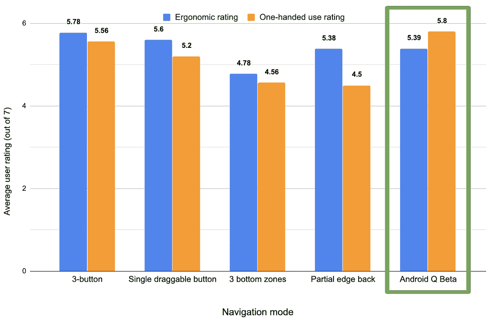
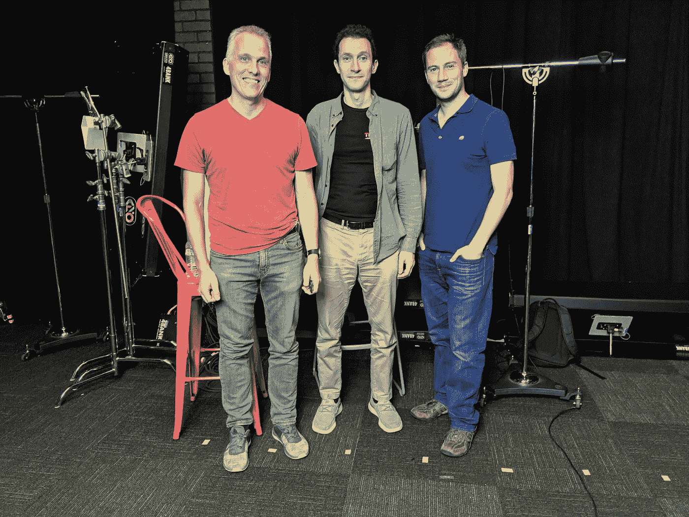

# 现在在安卓:第二集

> 原文：<https://medium.com/androiddevelopers/now-in-android-episode-2-b17fc5630fea?source=collection_archive---------0----------------------->

## 以最终 Q 预览版、手势、可重置用户 id、Reddit AMA 和 ADB 第 119 集为特色

Catch the wave

过去的一周见证了最新的(也是最后的！)Android Q 的预览版。但是，在典型的 Android 时尚中，还有许多你可能也关心的其他事情正在发生。以下是最近安卓事件的综述。

# Android Q 预览版，Beta 6

Android Q 的最终[预览版](https://developer.android.com/preview)已经发布。戴夫·伯克在开发者博客上给[发了一篇文章](https://android-developers.googleblog.com/2019/08/final-beta-update-official-android-q.html)，谈论最新的特性和发布的状态。开发者应该[下载版本](https://developer.android.com/preview/download.html)并在上面测试你的应用；如果你有一个非像素设备，你可以[下载一个通用系统镜像(GSI)](https://developer.android.com/preview/gsi-release-notes) 用于高音兼容设备。如果你有 Pixel，你可以在你的手机上注册获得 Beta 6。或者，如果你已经在运行 Beta 5，你将很快自动获得 Beta 6 的更新。

# 友好的姿态

说到 Android Q， [Chris Banes](/@chrisbanes) 在这个版本中发布了几篇关于新手势行为的精彩文章。这个新特性(对 P 版本中开始的行为的扩展)是该版本中发生的一个主要 UI 交互变化，可能会对应用程序产生影响。例如，水平滚动视图和一些库可能与新的 UI 行为冲突。至少，开发人员应该在新版本上测试他们的应用程序，以确保它们运行良好，然后如果有任何问题，就调整他们的用户界面和交互。

[#1:边对边](/androiddevelopers/gesture-navigation-handling-visual-overlaps-4aed565c134c)

第一篇文章主要关注开发者如何利用新的手势功能来使用整个屏幕。现在建议你在导航和状态栏的后面绘制，为应用程序内容提供更多的屏幕空间。Chris 介绍了用于实现正确全屏行为的 API 和方法。

[#2:处理视觉重叠](/androiddevelopers/gesture-navigation-handling-visual-overlaps-4aed565c134c)

本系列的第二篇文章介绍了窗口插入。它解释了如何处理全屏应用程序视图和导航/状态栏之间的潜在冲突。

与此同时，Allen Huang 和 Rohan Shah(系统 UI 团队的产品经理，负责实现所有这些东西)在 Android 开发者博客上发表了一篇文章，[手势导航:背景故事](https://android-developers.googleblog.com/2019/08/gesture-navigation-backstory.html)，讲述了这一新功能的历史和背景。

# 用于可重置用户 id 的新 AndroidX 库

Android 最近发布的中保护用户隐私的[变化之一是限制应用程序可以使用的用户 id 信息。特别是，不再可能获得不可重置的用户 id，开发人员需要从以前的实践迁移到使用可重置标识符的方法。](https://developer.android.com/preview/privacy/data-identifiers)

用户 id 的一个常见用途是广告或分析。对于这个用例，使用广告 id 是[的最佳实践](https://developer.android.com/training/permissions/usage-notes#d_create_a_unique_identifier_for_advertising_or_user_analytics)。AndroidX 刚刚发布了一个新库的 alpha 版本，使这种方法更容易跨版本使用。你可以在这里查看新的 [Ads 库](https://developer.android.com/jetpack/androidx/releases/ads#1.0.0-alpha01)，而[这篇文章](https://developer.android.com/training/articles/ad-id)描述了更多关于如何使用这个库的内容。

# Reddit 上的安卓 AMA

如果你上周没能在 Reddit 上看到[安卓 AMA，看看评论、问题和答案。工程团队的一大群人在那里回答关于 Android Studio、Jetpack、Kotlin、Q 手势等各种问题。这已经成了队里一年一度的传统(三次就成了传统，对吧？)是我们每个夏天都期待的。许多人去海滩度假；我们在 Reddit 上回答你的问题。](https://www.reddit.com/r/androiddev/comments/ci4tdq/were_on_the_engineering_team_for_android_q_ask_us/)

如果你不能得到你的问题的答案，把它带到 10 月 23-24 日在加州桑尼维尔举行的 [Android 开发者峰会](https://developer.android.com/dev-summit)。报名截止到 8 月 15 日。

# ADB 119:科特林与安德烈·布雷斯拉夫

Tor, Andrey, Romain, and me (not pictured)

我们播客的第 119 集非常特别。好吧，澄清一下，每一集都很特别，因为每一集都可以让我们和有趣的工程师交谈，学到各种我们以前不知道的东西。

但在最新一集里，我们得以花些时间了解 Jetbrain 在科特林语方面的领先优势。Tor 和 Romain 问了各种各样的问题，关于事物如何工作，语言如何发展，以及 Andrey 未来想把 Kotlin 带到哪里。

在您最喜爱的播客客户端上查看该集，或者从下面的 blogger 链接下载。

 [## 第 119 集:科特林和安德烈·布雷斯拉夫

### Tor 和 Romain 采访了 Jetbrains 的首席语言设计师 Andrey Breslav。他们谈到了…

androidbackstage.blogspot.com](http://androidbackstage.blogspot.com/2019/08/episode-119-kotlin-with-andrey-breslav.html) 

# 那么现在…

这次到此为止。去看看 Q Beta 6 吧！测试和更新您的应用程序，以便与手势配合使用！查看新的广告 ID 库，获取用户可重置的标识符！拿些爆米花，去阅读 Reddit AMA 上的一长串问题和答案吧！请尽快回到这里，收听 Android 开发者世界的下一次更新。