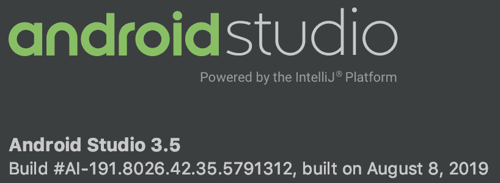
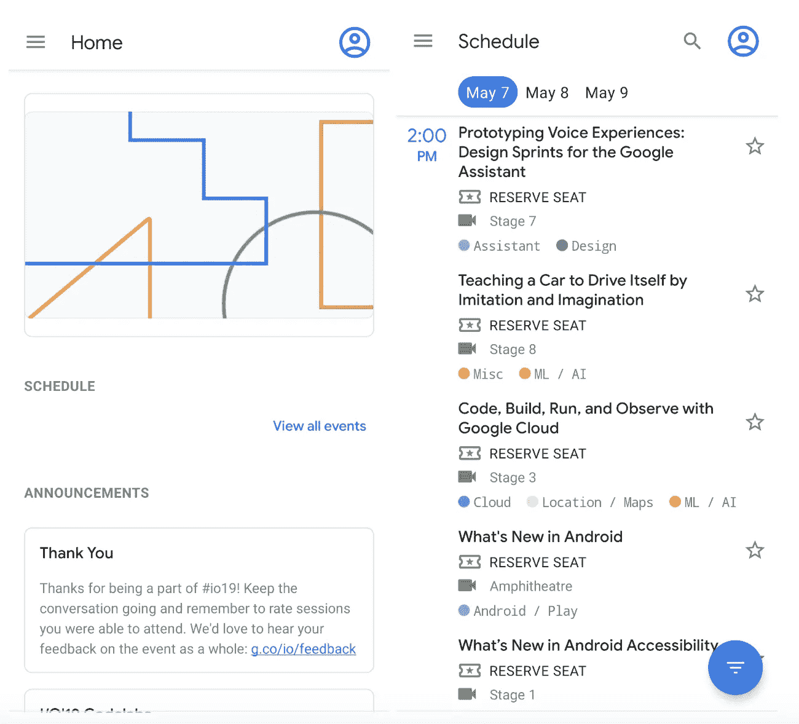
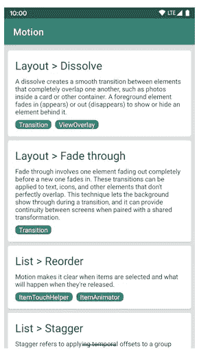
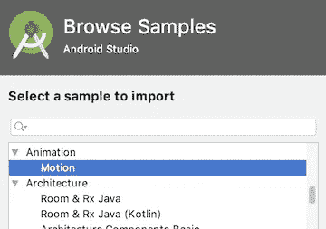
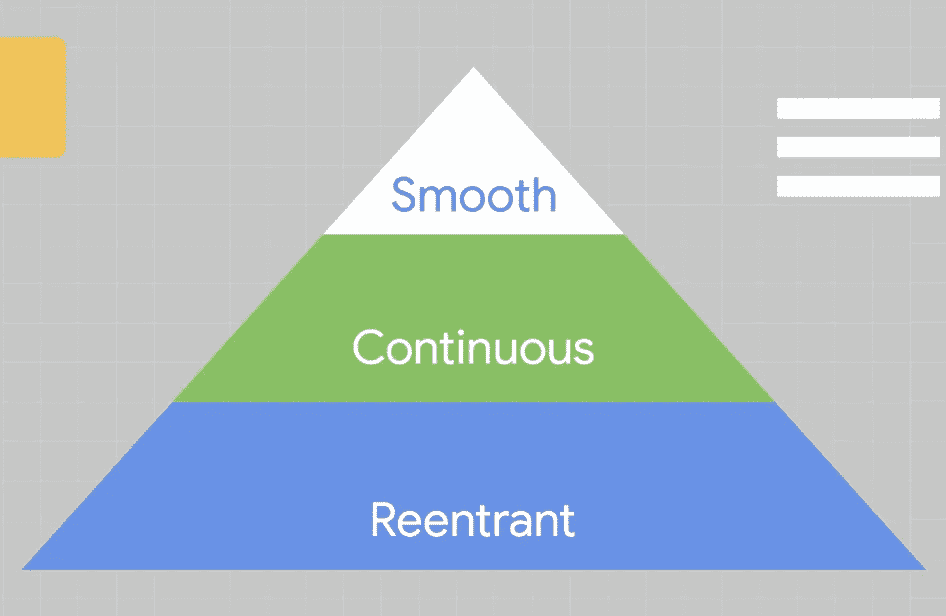

# 现在在安卓:第三集

> 原文：<https://medium.com/androiddevelopers/now-in-android-episode-3-7965985c39c9?source=collection_archive---------1----------------------->

## Android Studio 3.5、I/O 应用源代码和动画

*Catch the wave*

过去几周最大的发布是备受期待的 Android Studio 3.5，自谷歌 I/O 以来一直处于测试阶段。但最近 Android 领域发生的其他事情也值得一试。

# Android Studio 3.5:“大理石项目”

一个好的 IDE 就像一个好朋友；一个你喜欢和他共度所有时光的人，他会让你的每一天都更加快乐。但是当你的 IDE 对你来说不够好的时候，就好像你不得不每天和隔壁的坏孩子呆在一起，因为你的父母是朋友，他们说你必须这样做。

这就是为什么我们很高兴发布了 Android Studio 3.5。

在之前的版本中，我们讨论了所有你现在可以在 Android Studio 中使用的新奇功能。但是这次发布的 Android Studio 有所不同。团队听到了你的反馈，说一些基本功能对你来说不够好，所以他们把他们正在开发的很酷的新功能放在一边，卷起袖子(这很难，因为团队的大多数人都穿 t 恤)，进入了错误修复模式。

在此过程中有大量重要的修复，包括:

*   超过 50 个内存泄漏修复
*   21 个 IDE 挂起修复*
*   3 倍的 CPU 使用模拟器改进(这是我最关心的事情，因为我经常看到我的 CPU 被一个在后台运行的非活动模拟器所限制)
*   Windows I/O 改进(注意:“Windows I/O”不是微软的“Google I/O”)
*   600 多个错误修复*

*(当我向团队询问该版本的一些最终统计数据时，他们告诉我有超过 21 个 IDE 挂起和超过 600 个 bug。经过一番挖掘，我能够确定他们指的是挂起/bug *修复。咻。)

该版本还包括对[这个 bug](https://issuetracker.google.com/133864394) 的修复，该 bug 在 XML 编辑的自动完成过程中导致挂起。这个补丁是最新添加的，导致发布推迟了几周，当时很明显这是社区中的一个[主要问题](https://twitter.com/RunChristinaRun/status/1159147491738054656)。(有重大问题时，请务必让我们知道。我们真的会倾听、关心并努力做正确的事情，即使这会导致我们在最后一刻错过发布！)

尽管大部分版本纯粹关注于关键的 bug 修复，但也有一些对现有功能的急需改进，包括即时运行(重写并重命名为“应用更改”)、数据绑定和注释处理。

如果您想进一步了解该工具的一些具体改进，团队成员已经发布了一些关于这些改进的文章:

[应用修改](/androiddevelopers/android-studio-project-marble-apply-changes-e3048662e8cd)
[提升构建速度](/androiddevelopers/improving-build-speed-in-android-studio-3e1425274837)
[Android 仿真器](/androiddevelopers/android-emulator-project-marble-improvements-1175a934941e)
[Lint 性能](/androiddevelopers/android-studio-project-marble-lint-performance-8baedbff2521)
[布局编辑器](/androiddevelopers/android-studio-project-marble-layout-editor-608b6704957a)

该团队还在 Google I/O 上讨论了工具改进(以及如何更有效地使用工具的技巧)。查看这些演示文稿(以及各种其他 Android 会话)[此处](/androiddevelopers/whats-now-in-android-d78061ac8b92)。你也可以在贾马尔最近的文章中读到更多关于这个版本的信息。

最后，我应该指出，我们还没有完成整个“质量”的事情。虽然我们在 3.5 中明显改进了 Android Studio(更快、更流畅、更可靠)，但我们也知道它远非完美。因此，虽然团队将回到一些急需的功能工作，他们也将继续质量方面的工作。当未来版本中有更多关于质量改进的报道时，您可能会在这里读到。

# I/O 会话应用程序源代码

The I/O app scheduling app. What session will I attend this year? Oh, wait, it’s over? Already?

我们最近发布了[谷歌 I/O 2019 安卓应用](https://play.google.com/store/apps/details?id=com.google.samples.apps.iosched)的[源代码](https://github.com/google/iosched)。你知道其中一个:就是那个应用程序，你用来查看什么时候发生了什么会议，标记你想去的会议，意识到许多会议是在同一时间进行的，所以你需要稍后在 YouTube 上捕捉其中一些会议(或者在参加另一个会议时直播他们)，然后最终与沙盒中的某人进行了关于可行的应用程序架构和最佳 IDE 配置的长时间对话，完全打乱了你的计划，错过了一切？那个应用程序。

I/O 应用程序(我们内部亲切地称之为“IO Sched”)最终成为开发人员关系团队的主要年度项目，因为我们融入了许多最新的最佳实践和技术。例如，今年的应用程序包括手势导航，黑暗主题，以及导航和房间建筑组件的使用。

其目的是让开发人员能够使用生成的代码进行学习，并开发他们自己的应用程序(希望从 I/O 调度类型稍微扩展一下)。所以我们发布代码不是很方便吗？

你可以从 Takeshi Hagikura 在 Android 开发者博客上的文章中了解更多关于该应用的信息。

# Android 动作示例

Animation Motion sample app

动画对于帮助用户理解应用程序中发生的事情非常重要。但是实现正确的动画效果可能是…棘手的。

荒木雄一为[编写了一个新的 Android 动作样本](https://github.com/android/animation/blob/master/Motion/README.md)来展示如何实现不同的动画效果。示例中有各种演示来说明过渡、共享元素过渡、物理动画等等。这些方法和演示代码应该更容易实现[材料运动](https://material.io/design/motion/understanding-motion.html#principles)指南。

Pro tip: Load the Android Motion sample directly inside of Android Studio.

像大多数 Android 示例一样，Android Motion 可以直接在 IDE 中获得。只需点击文件->新建->导入样本…然后在动画类别中找到它。

# 说到动画…

Nick Butcher 刚刚出版了[Motional Intelligence:Build smarter animations](/androiddevelopers/motional-intelligence-build-smarter-animations-821af4d5f8c0)，它以文章的形式解释了他今年在 Google I/O 上的一次演讲。开发者应该如何在一个反应式编程的世界中创建动画？我们应该如何正确地处理事情，以创造平稳，连续和再入运动？

# 那么现在…

这次到此为止。去下载 Android Studio 3.5！去玩 I/O 2019 app 吧！去写点素材和反应动画吧！请尽快回到这里，收听 Android 开发者世界的下一次更新。