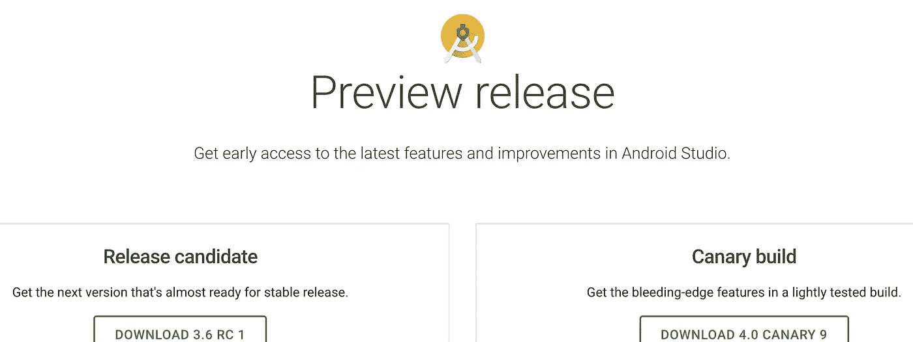

# 现在在安卓:2020 年 1 月 23 日

> 原文：<https://medium.com/androiddevelopers/now-in-android-january-23-2020-587378171ae3?source=collection_archive---------4----------------------->

## AndroidX 发布，Android Studio 3.6 和 4.0 预览，Kotlin typealias，构建 Kotlin 扩展库，以及两个 Android 播客集

Illustration by [Virginia Poltrack](https://twitter.com/VPoltrack)

欢迎来到 Android 中的 Now，这是您对 Android 开发世界中新的和值得注意的事物的持续指导。

# 现在在安卓系统中:视频版本

Now in Android: Same content, but in video form

这篇文章中的内容也包含在这个方便的视频中。随意看，或者忽略 in，继续下面的阅读。

# AndroidX 释放

当我在本周早些时候第一次起草这个 AndroidX 部分时，没有太多的库更新。我认为这是有道理的:人们刚刚从长假中回来，可能又在学习如何打字，自去年 12 月以来没有太多变化。

伙计，我错了。

1 月 22 日，一个*吨*的图书馆被释放。查看 AndroidX 发布网站上的详细信息，但这里有一些亮点。

首先，许多库变得[稳定](https://developer.android.com/jetpack/androidx/versions/stable-channel)，包括:

*   [Fragment 1.2.0](https://developer.android.com/jetpack/androidx/releases/fragment#1.2.0) 引入了 [FragmentContainerView](https://developer.android.com/reference/androidx/fragment/app/FragmentContainerView.html) 作为片段的推荐容器，集成在生命周期 [ViewModel SavedState](https://developer.android.com/jetpack/androidx/releases/lifecycle#viewmodel-savedstate-1.0.0) 中，并修复了使用动画/转场时与`onDestroyView()`的计时问题。
*   [Lifecycle 2.2.0](https://developer.android.com/jetpack/androidx/releases/lifecycle#2.2.0) 拥有集成了 Kotlin 协程的新`lifecycle-runtime-ktx`工件，并与现有的协程`lifecycle-livedata-ktx`工件进行了更好的集成。
*   [life cycle-Viewmodel-saved state 1 . 0 . 0](https://developer.android.com/jetpack/androidx/releases/lifecycle#viewmodel-savedstate-1.0.0)是这个库的第一个版本。视图模型现在可以通过新的 [SavedStateHandle](https://developer.android.com/reference/androidx/lifecycle/SavedStateHandle) 类参与到`onSaveInstanceState()`中，而不需要在活动/片段中手动覆盖和处理保存的状态。有关这个新库的更多信息，请参见[文档](https://developer.android.com/topic/libraries/architecture/viewmodel-savedstate)。
*   [Navigation 2.2.0](https://developer.android.com/jetpack/androidx/releases/navigation#2.2.0) 提供导航图范围的生命周期和 SavedState，具有新的`[NavBackStackEntry](https://developer.android.com/reference/androidx/navigation/NavBackStackEntry)`，对深度链接的查询参数支持，以及改进的动画支持。
*   [WorkManager 2.3.0](https://developer.android.com/jetpack/androidx/releases/work#2.3.0) 拥有新的`[setProgress](https://developer.android.com/reference/kotlin/androidx/work/CoroutineWorker#setProgress(androidx.work.Data))()`和`[setForeground](https://developer.android.com/reference/kotlin/androidx/work/CoroutineWorker#setForeground(androidx.work.ForegroundInfo))()` API，允许您在工作器运行时交流进度，并允许工作器在必要时在前台服务中运行。

最近变得稳定的还有[活动 1.1.0](https://developer.android.com/jetpack/androidx/releases/activity#1.1.0) 、 [SQLite 2.1.0](https://developer.android.com/jetpack/androidx/releases/sqlite#2.1.0) 和[过渡 1.3.0](https://developer.android.com/jetpack/androidx/releases/transition#1.3.0) 。

各种 AndroidX 库也达到了 [alpha](https://developer.android.com/jetpack/androidx/versions/alpha-channel) ，包括这两个刚刚达到第一个 alpha 里程碑的库:

*   [浏览器 1.3.0-alpha01](https://developer.android.com/jetpack/androidx/releases/browser#1.3.0-alpha01) :特性包括通过[trustedbeactivityserviceconnection # extra command](https://developer.android.com/reference/kotlin/androidx/browser/trusted/TrustedWebActivityServiceConnection#extraCommand(kotlin.String,%20android.os.Bundle))将自由格式的命令传递给可信的 web 活动，以及[CustomTabsSession # mayLaunchUrl](https://developer.android.com/reference/kotlin/androidx/browser/customtabs/CustomTabsSession#mayLaunchUrl(android.net.Uri,%20android.os.Bundle,%20kotlin.collections.MutableList))的可空性。
*   这个库提供了从一个或多个输入图像编写[高效图像格式(HEIF)](https://en.wikipedia.org/wiki/High_Efficiency_Image_File_Format) 文件的能力。1.1 版本提供了一些小的改进和修复。

# Android Studio 3.6 和 4.0

Head over to the [preview site](https://developer.android.com/studio/preview) and take your pick of 3.6 RC or 4.0 Canary

如果你想玩 Android Studio 的开发中功能，请前往[预览网站](https://developer.android.com/studio/preview)下载一个预稳定版本。

Android Studio 3.6 在 12 月发布了第一个 RC 版本，因为它准备在不久的将来稳定下来。请务必查看此版本的新[拆分视图编辑器](https://developer.android.com/studio/preview/features/#3.6-split-view)以查看您的 UI 的设计和代码视图，使用内存分析器更容易的[泄漏检测](https://developer.android.com/studio/preview/features/#3.6-profiler-memory-leak-detection)，以及新的[视图绑定](https://developer.android.com/topic/libraries/view-binding)功能，该功能消除了对`findViewById()`的需求。

与此同时，Android Studio 4.0 最近推出了第九个金丝雀版本。也许你需要一个更稳定的构建来满足你的日常使用，但如果你想尝试它提供的任何新功能，请查看 4.0，包括 [MotionLayout 可视化编辑器](https://developer.android.com/studio/preview/features/#motion-editor)、[对 Jetpack Compose 的支持](https://developer.android.com/studio/preview/features/#jetpack-compose)，增强的[布局检查器](https://developer.android.com/studio/preview/features/#4.0-live-layout-inspector)，新的[CPU profiler UI](https://developer.android.com/studio/preview/features/#4.0-profiler-ui-upgrades)，新的[构建速度可视化器](https://developer.android.com/studio/preview/features/#build-attribution)，新的[片段模板](https://developer.android.com/studio/preview/features/#3.6-fragment-wizard)，以及新的 [Kotlin DSL 脚本](https://developer.android.com/studio/preview/features/#kts-compat)

# 新文章系列:科特林词汇

 [## 用 typealias 改变类型

### 科特林词汇:类型别名

medium.com](/androiddevelopers/alter-type-with-typealias-4c03302fbe43) 

弗洛里纳·蒙特内斯库已经开始撰写一系列关于科特林语的文章。这个[系列的第一篇文章](/androiddevelopers/alter-type-with-typealias-4c03302fbe43)介绍了`typealias`语言特性，它可以用来简化或缩短长类型名称。对于这里的 C/C++程序员来说，`typealias`类似于(你可能会说…) `typedef`，允许你在代码中定义引用某种类型的另一种方式。

本文还讨论了导入别名，以及为什么在某些情况下`typealias`可能不是正确的解决方案。

这个系列才刚刚开始，弗洛里纳正在寻找其他有趣的功能。如果你有任何喜欢的东西想看她钻研，去看看她的推特帖子并添加一个建议。

# Codelab:构建 Kotlin 扩展库

 [## 构建 Kotlin 扩展库

### Android KTX 是一组常用 Android 框架 API、Android Jetpack 库等的扩展。我们…

codelabs.developers.google.com](https://codelabs.developers.google.com/codelabs/building-kotlin-extensions-library/#0) 

Wojtek Kaliciński 发布了一个新的 [codelab](https://codelabs.developers.google.com/codelabs/building-kotlin-extensions-library/#0) ，展示了如何使用与 Android 团队创建 [Android KTX](https://developer.android.com/kotlin/ktx) 相同的方法，在 Kotlin 中构建自己的便捷扩展库。例如，您将学习如何使用 suspend 函数或 Flow 将现有的异步回调 API 转换成使用协程的 API。

# 播客剧集

自从上一期《现在》在 Android 中播出以来，又有一期新的 Android 开发人员在后台。请点击下面的链接，或在您最喜欢的播客客户端查看:

## ADB 131: Jetpack 编写和声明用户界面

 [## 第 131 集:Jetpack 编写和声明用户界面

### 在这一集中，Tor、Romain 和 Chet 与 UI 工具包团队的 Adam Powell 讨论了 Jetpack Compose。的…

androidbackstage.blogspot.com](https://androidbackstage.blogspot.com/2020/01/episode-131-jetpack-compose-and.html) 

在这一集的 Android 开发人员后台中，Tor、Romain 和 Chet 与 UI 工具包团队的 Adam Powell 讨论了 Jetpack Compose。对话曲折地进入声明式编程，“动态声明式”，对状态变化的反应，通过应用程序的数据流，以及 Kotlin 领域特定语言。

## 碎片 187:协程

 [## 187 年:曼努埃尔·维沃和肖恩·麦克奎蓝的协程

### 终于发生了！KG 和 Donn 与 Google 的两位专家 Manuel & Sean 讨论协程。我们已经等了很久…

fragmentedpodcast.com](https://fragmentedpodcast.com/episodes/187/) 

同样在 Android 播客的世界里，[片段播客](https://fragmentedpodcast.com/)最近为[第 187 集:协同程序](https://fragmentedpodcast.com/episodes/187/)主持了[曼努埃尔·维沃](https://medium.com/u/3b5622dd813c?source=post_page-----587378171ae3--------------------------------)和[肖恩·麦克奎蓝](https://medium.com/u/83518fe480be?source=post_page-----587378171ae3--------------------------------)，在其中他们谈论了(等等……)协同程序！

# 那么现在…

这次到此为止。去玩最新的 [AndroidX 库发布](https://developer.android.com/jetpack/androidx/versions/)！查看 [Android Studio 3.6 和 4.0](https://developer.android.com/studio/preview) 的特性！去读读关于[科特林型别名](/androiddevelopers/alter-type-with-typealias-4c03302fbe43?source=collection_detail----95b274b437c2-----0-----------------------)！构建一个 [Kotlin 扩展库](https://codelabs.developers.google.com/codelabs/building-kotlin-extensions-library/#0)！听最新的 [ADB](https://androidbackstage.blogspot.com/2020/01/episode-131-jetpack-compose-and.html) 和[碎片化](https://fragmentedpodcast.com/)播客剧集！请尽快回到这里，收听 Android 开发者世界的下一次更新。