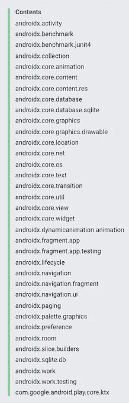

# 现在在安卓:2020 年 1 月 8 日

> 原文：<https://medium.com/androiddevelopers/now-in-android-january-8-2020-23ae439e70f1?source=collection_archive---------3----------------------->

## 新房间和 KTX 文档、AndroidX 发布、新房间文章、新代码实验室、最近会议的视频和 ADB 播客

Illustration by [Virginia Poltrack](https://twitter.com/VPoltrack)

欢迎来到 Android 中的 Now，这是您对 Android 开发世界中新的和值得注意的事物的持续指导。

嗨，大家好，欢迎从假期回来！自从上一次 Android Now 以来，这是一段安静的时间，因为我们中的许多人更多地消费于假日咬文嚼字而不是软件字节。但是，最近发生的一些事情值得我们在新的一年里集体思考，我们都试图回答同一个问题:当我们最后一次合上笔记本电脑时，我们在做什么？

## 现在在安卓系统中:视频

Now in Android is now available in video (and podcast) form. Same content, but less reading required.

既然 Android 系列中的新功能已经很常见了，我想让它以其他格式出现。你可以在这里(或者在 [YouTube 播放列表](https://www.youtube.com/playlist?list=PLWz5rJ2EKKc9AtgKMBBdphI-mrx8XzW56)上)随意观看视频版本，或者完全忽略它，继续阅读文章。

## 满屋子的文件

关系是生活中最难处理的事情之一。如果有一些清晰的文档来让它们工作，那不是很好吗？

科技作家 Alex Cook 通过提供新的关于房间实体关系的[指南改善了这种情况。@弗洛里纳在](https://developer.android.com/training/data-storage/room/relationships)[最近的一篇文章](/androiddevelopers/database-relations-with-room-544ab95e4542)中提到了这些材料，但是现在所有的关系信息都在我们的核心文档网站上。

关系:我们不能修复它们，但是我们可以让它们更容易理解…为了空间。

Alex 最近提供的另一个房间指南是[预填充你的房间数据库](https://developer.android.com/training/data-storage/room/prepopulate)。在去年 10 月发布的版本 2.2 中，Room 提供了在启动时从本地设备上的文件预初始化应用程序数据库的功能。这本新指南告诉你如何使用该功能。

## KTX 扩展

[Android KTX](https://developer.android.com/kotlin/ktx) 为现有类提供 Kotlin 扩展函数，以简化 Android APIs 的使用。把它们看作是在我们向后兼容的世界中改进 API 的一种方式，在这个世界中，我们不能改变核心 API 本身，因为那样会破坏应用程序。除了更优雅、更简单的 API 之外，它们还利用了关键的 Kotlin 特性，如 lambdas、命名和默认参数、协同程序和(是的)扩展函数，使 API 变得更好，并可以轻松集成到您的 Kotlin 开发流程中。

但问题是:你如何发现存在哪些扩展函数？

以前，为了找到特定扩展功能的参考文档，您必须知道您在寻找什么，以便调出包含扩展文档的适当的包参考。这就像你有车钥匙，却不知道你把车停在了哪个区域，或者哪个城市。一旦你到了那里就没事了，但是找到它可能会…很棘手。

All packages with KTX extensions in one easy table of contents

[docs 团队的 Joshua Baxter](https://twitter.com/jbax_google) 提供了一个解决方案:KTX 扩展页面的[列表。在这里，您可以找到 KTX 提供的所有扩展，文档右侧的内容部分可以方便地引用这些扩展。文档包含了扩展函数的实际声明的链接(可能有更多的信息，比如](https://developer.android.com/kotlin/ktx/extensions-list)[样本代码](https://developer.android.com/reference/kotlin/androidx/benchmark/junit4/package-summary#(androidx.benchmark.junit4.BenchmarkRule).measureRepeated(kotlin.Function1)))，以及被扩展的类的链接。

现在，您可以更容易地浏览或查找特定的扩展，或者特定类的扩展集。注意，这个文档还包括了除了 AndroidX 之外的其他 KTX 库的信息。 [Firebase](https://developer.android.com/kotlin/ktx#firebase) 和 [Play Core](https://developer.android.com/kotlin/ktx#play-core) 都有 KTX 扩展功能，值得一试。

# AndroidX 文库

12 月中旬发布了一些新的 AndroidX 库版本。首先，一些现有的库变得稳定了:

*   [Biometric 1.0.1](https://developer.android.com/jetpack/androidx/releases/biometric#1.0.1) :这个库帮助您使用生物认证，而不用担心在过去几个版本中底层认证平台 API 的变化。这个最新版本大部分是错误修复。
*   [浏览器 1.2.0](https://developer.android.com/jetpack/androidx/releases/browser#1.2.0) : 1.2.0 引入黑暗主题和可信网络活动。
*   [企业 1.0.0](https://developer.android.com/jetpack/androidx/releases/enterprise#1.0.0) :企业反馈 API 的第一个版本已经稳定了。
*   [分页 2.1.1](https://developer.android.com/jetpack/androidx/releases/paging#2.1.1) :分页库通过 RecyclerView 简化了数据的逐步加载。与上一版本相比，此版本在功能上有一些小的改进。
*   房间 2.2.3 :房间库在 SQLite 上创建了一个强大的抽象和 API。版本 2.2.3 是一个较小的错误修复版本。

也有一些库发布了 [alpha 版本](https://developer.android.com/jetpack/androidx/versions/alpha-channel)。特别是，注意一个新的库，它有第一个 alpha 版本(所以可能还没有准备好，但是如果你一直想要这个功能的话，尝试一下是很有趣的):

*   [Concurrent-Futures 1 . 1 . 0-alpha 01](https://developer.android.com/jetpack/androidx/releases/concurrent#1.1.0-alpha01):如果您想要像 [Guava](https://github.com/google/guava) offers 这样的期货功能，而不需要拉进所有的库，那么这个库是有用的。

# 文章:用 Flow 观察房间数据库

在[版本 2.2.0](https://developer.android.com/jetpack/androidx/releases/room#2.2.0) 中，Room 增加了使用 Kotlin 的 Flow API 来观察数据库变化的功能。[弗洛里纳·蒙特内斯库](https://medium.com/u/d5885adb1ddf?source=post_page-----23ae439e70f1--------------------------------)发帖[房间🔗流](/androiddevelopers/room-flow-273acffe5b57)，展示如何让它发生。

# Codelab:具有 Kotlin 流和 LiveData 的高级协同程序

[铁姆·宋](https://medium.com/u/52873e9e8e?source=post_page-----23ae439e70f1--------------------------------)和[肖恩·麦克奎蓝](https://medium.com/u/83518fe480be?source=post_page-----23ae439e70f1--------------------------------)在 [KotlinConf](https://kotlinconf.com/) 为 *Kotlin in Android* 研讨会创建了[这个 codelab](https://goo.gle/advanced-coroutines-codelab) ，以展示如何通过协同程序使用 LiveData，以及 Kotlin 的新流程 API。通过 [codelab](https://goo.gle/advanced-coroutines-codelab) 获得完整的体验，或者如果您愿意，可以直接进入[代码](https://github.com/googlecodelabs/kotlin-coroutines/tree/master/advanced-coroutines-codelab)。

# 会议视频

与几年前相比，如今会议活动的一个重要特点是，会议通常会被录制下来并发布给公众观看。

我仍然觉得亲自去参加会议是值得的，因为那种沉浸在会议内容中一天或更长时间的感觉，还因为我可以和在场的每个人交谈。但实际上，我不可能参加所有我想参加的会议，也不可能在我参加的多轨道活动上观看所有的现场内容。在这些活动之后，很快就可以在网上看到这些会议，这太棒了，这样我就可以补上我错过的所有东西(速度是 1.5 倍！).

最近有两个事件发布了它们的视频:

## [机器人 SF](https://www.droidcon.com/videos?path=San%20Francisco)

[Droidcon 旧金山](https://www.sf.droidcon.com/)在 11 月的最后一周举行，深入的 [Android 内容](https://www.droidcon.com/videos?path=San%20Francisco)从 UI 到依赖注入到工具到 Kotlin 到…许多其他主题。

## 科特林康夫视频

12 月初，在气候宜人的哥本哈根。有很多关于 Android 和 Kotlin 的会议(包括语言特性和多平台)。

# 亚行播客

自从上一期《现在》发布以来，已经有几集 Android 开发人员在后台发布了。点击下面的链接，或者在你最喜欢的播客客户端查看它们:

[ADB 129:显示、输入和触觉](http://androidbackstage.blogspot.com/2019/12/episode-129-display-input-and-haptics.html)

Michael, Chet, and Romain (not in a pub)

在这一集里，切特和罗曼千里迢迢来到伦敦，与迈克尔·赖特聊天。这不是迈克尔第一次上播客，讨论再次是关于显示器，输入设备和触觉。

[亚行 130:运动第一定律……布局](http://androidbackstage.blogspot.com/2020/01/episode-130-first-law-of-motionlayout.html)

在这一集中，Tor、Romain 和 Chet chit 与 Android Studio 团队的 Nicolas Roard 和 John Hoford 讨论了运动布局，以及 IDE 中的 ConstraintLayout 和可视化编辑。

# 那么现在…

这次到此为止。去看看新的[房间关系](/androiddevelopers/database-relations-with-room-544ab95e4542)、[房间预填充](https://developer.android.com/training/data-storage/room/prepopulate)和 [KTX 文档](https://developer.android.com/kotlin/ktx/extensions-list)！玩[新 AndroidX 发布](https://developer.android.com/jetpack/androidx/versions/)！阅读[观察房间和流量的数据库变化](/androiddevelopers/room-flow-273acffe5b57)！启动 IDE，进入一个[LiveData/coroutines codelab](https://goo.gle/advanced-coroutines-codelab)！爆很多玉米，看很多很多来自 [Droidcon SF](https://www.droidcon.com/videos?path=San%20Francisco) 和 [KotlinConf](https://www.youtube.com/playlist?list=PLQ176FUIyIUY6SKGl3Cj9yeYibBuRr3Hl) 的会议视频！去听亚洲开发银行的播客！请尽快回到这里，收听 Android 开发者世界的下一次更新。