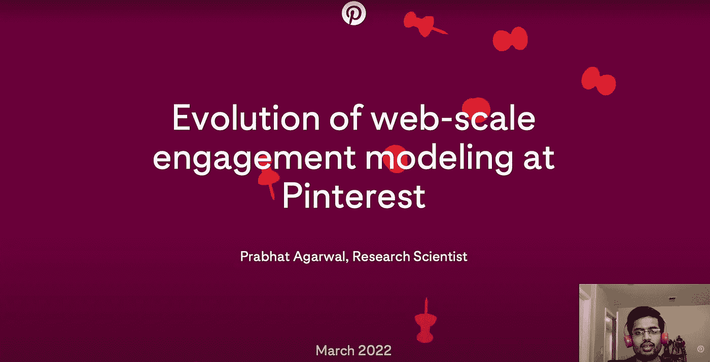

# 英伟达 2022 演讲:Pinterest 网络规模参与建模的演变

> 原文：<https://medium.com/pinterest-engineering/nvidia-2022-talk-evolution-of-web-scale-engagement-modeling-at-pinterest-94a967bdcd27?source=collection_archive---------2----------------------->

研究科学家

观看 Prabhat Agarwal 在 2022 年 3 月 23 日 NVIDIA GTC 会议上的讲话。

*要在 Pinterest 了解更多工程知识，请查看我们的* [*工程博客*](https://medium.com/pinterest-engineering) *，并访问我们的*[*Pinterest Labs*](https://www.pinterestlabs.com/?utm_source=medium&utm_medium=blog-article-link&utm_campaign=agarwal-april-15-2022)*网站。要查看和申请公开的机会，请访问我们的* [*职业*](https://www.pinterestcareers.com/?utm_source=medium&utm_medium=blog-article-link&utm_campaign=agarwal-april-15-2022) *页面。*

