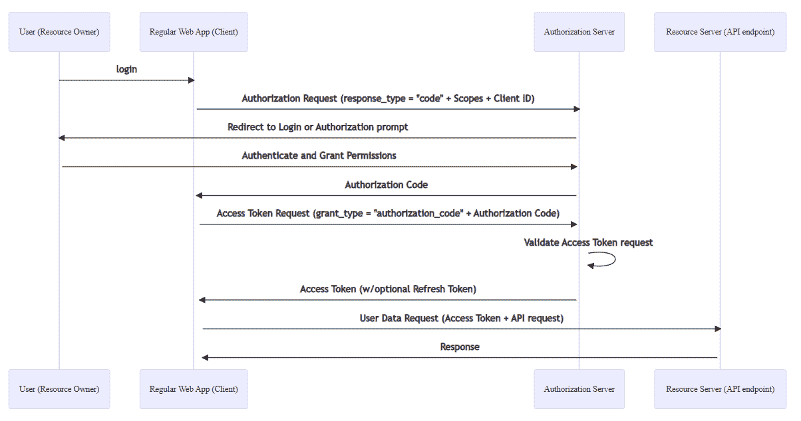
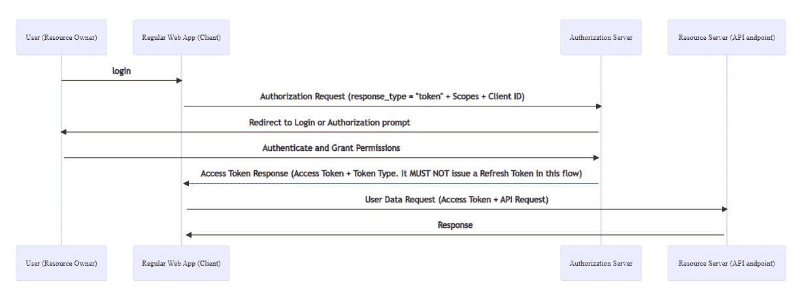
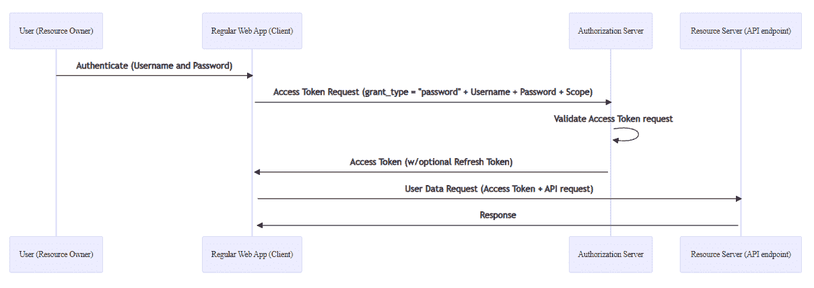
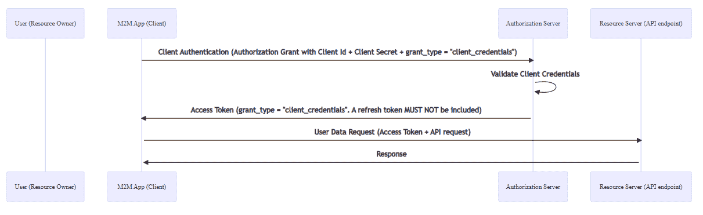

# OAUTH 2.0:基础知识

> 原文：<https://medium.com/globant/oauth-2-0-the-basics-340b5bcc7c7e?source=collection_archive---------0----------------------->

网上有很多关于 OAuth2.0 和 Open ID 的资源。很多这些资源很难理解，可能是因为它们呈现的方式，或者是因为有时我们在试图形象化抽象概念时会遇到困难。在这篇文章中，我想用一些真实世界的类比来解释我认为对完全理解 OAuth2.0 最重要的想法，这样你就可以深入了解更多的技术资源。我们将涉及的基本概念是:

*   授权和身份验证的区别
*   什么是 OAuth2.0
*   OAuth2.0 角色
*   OAuth2.0 授权类型和流程

# TL；速度三角形定位法(dead reckoning)

*   身份验证是一个过程，其重点是识别您是谁。
*   授权是一个专注于确定你能做什么的过程。
*   OpenID 定义了一种处理 OAuth 认证的标准化方法。
*   OAuth 是一个授权框架，其目标是代表用户向第三方应用程序提供对受限资源的访问
*   OAuth 中有 4 个主要角色。资源所有者、客户端、授权服务器和资源服务器。
*   有两种类型的客户端:机密客户端和公共客户端。
*   OAuth 定义了 4 个授权流和 1 个扩展机制。
*   授权代码流用授权代码交换访问和刷新令牌。它用于机密客户。
*   公共客户端使用隐式授权。没有授权码，授权服务器不能返回刷新令牌，只能返回访问令牌。
*   授予资源所有者密码凭据意味着资源所有者与客户端共享其凭据。客户端将使用这些凭证来获取访问令牌。它应该只为资源所有者和客户端之间的高度信任关系实现。
*   客户端凭证授权用于机器 2 机器通信(M2M)。在这个流中，客户端将其 clientID 和秘密发送给授权服务器。一旦授权服务器对客户端进行了身份验证，它就会返回一个访问令牌。它不应该返回刷新令牌。
*   授权码和隐式授权流是基于重定向的流。

# 授权和身份验证的区别

区分认证和授权很重要，因为这将帮助我们理解 OAuth2.0 和 OpenID 之间的责任。简而言之，认证是指定如何识别您身份的过程。授权是一个过程，其重点是如何确定一旦通过身份验证，您可以做什么。

让我们用一个例子来验证一下。

假设你从亚马逊收到一个订单，但是这个订单到达了一个包裹寄存系统。一旦承运人离开您的包裹，系统会向您发送一个代码。你去更衣室，输入你的密码，然后你被要求在屏幕上签名。完成后，系统会打开其中一个储物柜，这样您就可以取回您的包裹。在本例中，您使用代码和签名进行身份验证，并被识别为客户端。当系统验证您的信息，认为您是客户，并授予您访问特定储物柜的权限时，就会发生授权。例如，系统管理员可能有一个特殊的代码，当验证通过时，允许他打开任何储物柜。

# 什么是 OAuth 2.0

OAuth 是一个授权框架，其目标是代表用户向第三方应用程序提供对受限资源的访问，或者允许代表自己访问第三方。传统上，用户使用他们的凭据登录系统，但是如果第三方需要访问特定资源(如您公司的照片或电子邮件)，那么您必须向他们提供您的凭据。这是一个问题，因为你共享你的凭证，因此给你的帐户上的所有信息的完全访问权。这就像把你银行账户的密码交给财务顾问，因为他需要看你每年的银行对账单。通常，问题不在于恶意使用您的凭证，而在于将它们放在第三方的风险。在上面的例子中，如果财务顾问方面存在安全漏洞，您的信息就有可能被泄露。

想象一下，他没有给你凭证，而是直接去银行要你的对账单。银行会给你回电，询问你是否同意顾问获取这些信息。如果你同意，银行会打印一份有效期为一周的表格，规定顾问只能检查你的对账单，然后交给他。这是 OAuth 通常做的事情。OAuth 增加了一个授权层(在我们的例子中是银行),并在客户(财务顾问)和资源所有者(您)之间做出了明确的区分。它不使用资源所有者凭据来访问受保护的资源，而是在资源所有者批准后，为第三方生成一个可用于访问受保护资源的访问令牌(表单)。

如果您检查 OAuth 定义，您可以看到它是一个授权框架，专注于保护资源访问，但是它没有讨论身份验证部分，因为这超出了它的范围。允许第三方检索与最终用户相关的简档信息以识别他们是由 OpenID 协议处理的过程。为了给出一点与 OpenID 相关的背景，我们需要记住 OAuth 是一个游戏改变者，并且很快被采用。这导致开发团队自己解决了身份验证部分，但是随着更多实现的建立，使用 OAuth 作为身份验证机制的误解发生了。为了缩小这个差距，OpenID 被定义为认证协议，并被认为是 OAuth 的扩展。

如果我们讨论的是 ATM 交互，OpenID 角色将由要求 PIN 的 ATM 来表示。当银行找到你的账户时，系统会为你返回一个个性化的屏幕，可能会显示你的名字和你最后一次进入系统的日期。

# OAuth 2.0 角色

现在，我们更好地理解了身份验证与授权之间的区别以及 OAuth 和 OpenID 的角色，为了帮助我们更好地理解授权流程，我们可以看一下四个 OAuth 角色，如下所示:

*   资源所有者
*   资源服务器
*   客户
*   授权服务器

## 资源所有者

该角色通常与最终用户相关联，但也可以是能够授予受保护资源访问权限的任何实体。例如，如果资源是您的银行帐户，您将是资源所有者。

## 资源服务器

资源服务器是托管受保护资源的服务器。在 OAuth 中，这个角色还处理访问请求。在我们的银行帐户示例中，银行将是资源服务器，因为它是拥有与您的帐户相关的所有信息的实体，并且可以处理对它的访问请求。

## 客户

客户端是一个第三方应用程序，它代表资源所有者尝试访问受保护的资源，但总是经过其授权。继续前面的例子，假设你向抵押贷款人申请贷款买房。他们需要访问你的一些账户信息，比如余额。作为帐户的所有者，您需要授权他们这样做，否则他们无法获取您的银行帐户信息。

重要的是要知道 OAuth 定义了两种类型的客户端:机密客户端和公共客户端。

机密客户端是可以通过授权服务器进行安全身份验证的应用程序。这意味着这些应用程序可以以安全的方式保存凭据，而不会将它们暴露给未授权方。他们需要一个后端服务器来存储机密。

相比之下，公共客户端是不能安全保存凭证的应用程序。这些应用程序不能保持凭证的机密性，因此它们不能使用注册的客户端。

## 授权服务器

在资源所有者成功通过身份验证后，该服务器会为客户端生成具有所需授权的正确访问令牌。回到上面的抵押贷款情况，一旦你通过了银行的认证，并授权贷款人查看你的账户详情，银行将负责给予他们适当的访问权限。需要注意的是，您没有向贷方提供任何凭证，只授予了查看您的银行帐户的特定详细信息的权限。在 OAuth 中，授权以访问令牌(通常是 JWT)的形式到达客户端。

JWT 或 JSON Web 令牌是一个紧凑的 JSON 对象，可以安全地传输，并且包含用 JSON 结构表示的声明。令牌内的信息是可信的，因为声明可以用消息认证码(MAC)进行数字签名、加密或保护。jwt 的一个关键优势是它们可以在不联系任何第三方的情况下被验证。有关 jwt 的更多信息，请访问 https://datatracker.ietf.org/doc/html/rfc7519

*授权服务器和资源服务器是同一个实体是很常见的，在我们的例子中，银行同时扮演这两个角色。*

# *OAuth 2.0 授权类型和流程*

*客户端、授权服务器、资源所有者和资源服务器之间的交互称为授权流。在 OAuth 中，授权流根据客户端指定的授权机制的类型而变化。*

*以下是 OAuth 定义的四种授权类型:*

*   *代码授权*
*   *隐性资助*
*   *授予资源所有者口令身份证明*
*   *客户端凭据授予*

*OAuth 还为授权许可提供了一种扩展机制。*

*让我们想象一下下面的情况。*

*假设你写完了一本书。在雇佣编辑之前，你需要先获得一些反馈。然后，你决定将你的书发布到 XYZ 网站上，让其他人阅读。当您访问 WebApp 时，系统会要求您从本地计算机或在线服务(如 Google 或 Dropbox)添加图书。你选择使用谷歌，因为你的文档在硬盘里。登录后，会弹出一个窗口，告诉您该应用程序可以读取您的文档。你点击接受按钮，然后进入应用程序的用户界面，你可以从你的文档中选择你想要分享的文档。*

*上面的例子描述了 OAuth 中的整个交互。为了更好地理解它，让我们从映射角色开始:*

*资源所有者:我们，书的所有者*

**客户端:*XYZ app*

**授权服务器:*谷歌*

**资源服务器:*谷歌(驱动)*

*在以下部分中，我们将详细介绍每个流程的交互:*

## *代码授权*

*代码授予授权流程是当今 web 应用程序中最常用的流程。在这个流中，客户端用授权令牌交换访问令牌。它通常用于具有服务器端组件的 web 应用程序，因为在流程的一部分中，客户端将与授权服务器交换其客户端秘密。这也是一个基于重定向的流程，因此客户端必须能够接收来自授权服务器的请求。*

**

*以下步骤描述了授权流程中的交换:*

1.  *我们打开 XYZ 网络应用程序，开始从谷歌共享文档。*
2.  *XYZ 应用程序请求谷歌授权。*
3.  *Google 将 Web 浏览器重定向到身份验证表单，这样我们就可以向 Google 服务器进行身份验证。*
4.  *我们在表单中输入凭据，登录后，系统会询问我们即将授予 XYZ WebApp 的不同权限。认证请求被发送到 Google。*
5.  *一旦通过认证，谷歌使用重定向 URI 向 XYZ WebApp 返回一个授权码。*
6.  *XYZ 应用程序创建一个访问令牌请求，并将授权码作为请求的一部分发送出去。*
7.  *Google 验证访问令牌请求。在这一步中，Google 必须确保授权码是发给经过身份验证的客户端的，并且该代码是有效的。*
8.  *将访问令牌返回给 XYZ WebApp。*
9.  *通过访问令牌，XYZ WebApp 从 Google drive 的 API 请求数据，并在请求头中发送令牌。*
10.  *Google drive API 验证令牌并将信息返回给 XYZ WebApp。*

*这个流程中有一些细节值得一提。*

*在步骤 2 中，授权请求包括 XYZ 客户端 ID、请求的范围和重定向 URI，如果所有者允许访问，Google 应该将浏览器重定向到该位置。对于步骤 6 中的请求，需要特别注意的是，客户端(XYZ WebApp)向授权服务器进行身份验证，因此请求包含 clientID 以及授权类型和授权代码。最后，在步骤 7 中，Google 可以返回一个可选的刷新令牌，客户端可以用它来更新访问令牌。*

## *隐性资助*

*隐式授权流是为公共客户端创建的，比如单页面应用程序(SPA ),它缺少处理与其他系统交互的后端组件。这意味着当客户端发送授权请求时，访问令牌作为 URL 的一部分返回。客户端永远得不到授权码。建议不要再使用此流程，因为存在安全问题，如将访问令牌暴露在浏览器历史记录中。*

**

1.  *我们打开 XYZ 网络应用程序，开始从谷歌共享文档。*
2.  *XYZ 应用程序请求谷歌授权。*
3.  *Google 将 Web 浏览器重定向到身份验证表单，这样我们就可以向 Google 服务器进行身份验证。*
4.  *我们在表单中输入凭据，并向 Google 授权服务器提交登录请求。然后，我们被问及即将授予 XYZ WebApp 的不同权限。*
5.  *由于我们授予了访问权，Google 授权服务器重定向回客户端。需要注意的是，重定向 URI 包含访问令牌。*
6.  *XYZ WebApp 从 Google drive 的 API 请求数据，发送收到的访问令牌。*
7.  *Google drive API 验证令牌并将信息返回给 XYZ WebApp。*

*这个流程与代码授予授权流程有几个不同之处:*

*   *此流程中没有授权码交换。*
*   *一旦授权服务器验证并确定所有者是否授权访问，就会返回访问令牌。*
*   *由于访问令牌是在重定向 URI 中返回的，因此不会颁发任何中间凭证。*
*   *授权服务器从不发送刷新令牌。*

*尽管如此，就本书的例子而言，对于最终用户来说，流程实际上是相同的。*

## *授予资源所有者口令身份证明*

*当客户端和资源所有者(如操作系统)之间存在高度信任关系时，会使用此流程，因为客户端会要求资源所有者提供其凭证，通常是通过交互形式。它通常在迁移具有基本身份验证的旧客户端时使用，并且应该仅在基于重定向的流不可用时使用。*

**

1.  *我们打开 XYZ WebApp，系统会要求我们使用凭据进行身份验证。*
2.  *XYZ 应用程序向 Google 授权服务器发送一个访问令牌请求，传递资源所有者的凭证。*
3.  *Google 授权服务器验证该请求。*
4.  *Google 授权服务器对 XYZ WebApp 客户端进行身份验证，并发布一个访问令牌。*
5.  *XYZ WebApp 从 Google drive 的 API 请求数据，发送收到的访问令牌。*
6.  *Google drive API 验证令牌并将信息返回给 XYZ WebApp。*

*在我们示例的上下文中，最大的区别是 XYZ WebApp 将预先要求我们提供凭据，然后将凭据连同授权请求一起传递给授权服务器，以换取令牌，而不是将我们重定向到授权服务器进行身份验证。这类似于几年前许多 WebApps 使用的旧的基本身份验证流程，但由于我们正在尝试授权第三方，基本身份验证应该作为最后手段使用。由于我们的凭证将与第三方共享，这是一种非常危险的做法，并且有很多安全隐患。这就是为什么不推荐这个流程，它只用于客户端和资源所有者之间的高度信任关系。*

## *客户端凭据授予*

*在这个流中，客户端用自己的凭证请求授权。这意味着它将尝试使用自己的身份访问资源，而不是代表任何用户。这种类型的授权通常用于机器对机器的通信，如 CLI、守护程序或服务，其中客户端 ID 和客户端密码被交换为访问令牌。*

**

*一个很好的例子是一个趋势服务，它每天连接到 Twitter 并查询十大趋势话题。在这个例子中，客户机向 Twitter 授权服务器注册，并获得客户机 ID 和客户机秘密。一旦服务运行，流程将如下所示:*

1.  *客户端发送一个身份验证请求，其中包括客户端 Id 和客户端密码以及正确的授权类型*
2.  *授权服务器验证凭证并对用户进行身份验证。身份验证也作为授权许可。*
3.  *授权服务器返回访问令牌。不应发回任何刷新令牌。*
4.  *客户端调用受保护的 Twitter API，发送收到的访问令牌。*
5.  *Twitter API 验证令牌并将信息返回给客户端。*

*您可以看到，这类似于资源所有者密码凭据授权，但最大的区别是没有资源所有者凭据传递给第三方，而且通信发生在隐式授权的后端，因此很难篡改令牌。*

*我希望这篇文章易于理解，并为您提供了从事更详细的技术文档的必要信息。欲了解更多信息和详情，请访问:*

*   *[https://datatracker.ietf.org/doc/html/rfc6749](https://datatracker.ietf.org/doc/html/rfc6749)查看完整的 OAuth2.0 定义*
*   *OpenID 规范的【https://openid.net/connect/】T2*
*   *【https://datatracker.ietf.org/doc/html/rfc7519】为 JWT 标准。*