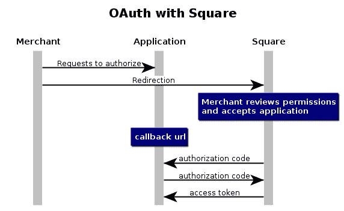
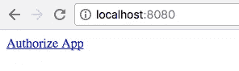
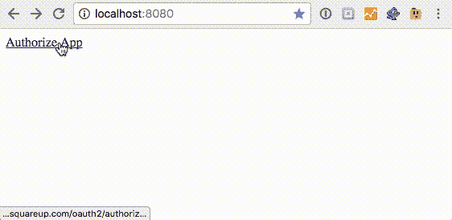

# 用 PHP 实现 OAuth，第一部分:获取访问令牌。

> 原文：<https://medium.com/square-corner-blog/oauth-with-php-part-one-getting-access-tokens-5a18b0b70099?source=collection_archive---------1----------------------->

## 实现 OAuth 可能是集成中最难的部分，但如果你要向其他商家开放你的应用，这是必须的。如果你正在使用 PHP，这里有一些帮助。

> 注意，我们已经行动了！如果您想继续了解 Square 的最新技术内容，请访问我们的新家[https://developer.squareup.com/blog](https://developer.squareup.com/blog)

OAuth 是安全控制开发者应用程序和 Square 商家账户之间访问的重要部分。如果您正在构建供多个 Square 帐户使用的应用程序，您将需要实现它。

除了这篇文章，你应该在构建你的集成时看看 [Square 的 OAuth 文档](https://docs.connect.squareup.com/api/oauth)——它将永远是真理的源泉，并且会随着任何事情的变化而不断更新。还有第 2 部分关于[如何刷新和撤销 OAuth 令牌](/square-corner-blog/oauth-with-php-part-two-refreshing-revoking-tokens-9ae065537c41)。

## **基础知识**



其核心是，OAuth 要求你将用户重定向到 Square 网站上包含你的`application id`的特殊 URL。然后，商家决定是否允许您的应用程序访问，以及您的应用程序将拥有哪些权限。然后，您的应用程序获得一个授权码，它将使用这个授权码与一个经过身份验证的请求交换一个访问令牌。

让我们看看这在代码中是什么样子的:

## **步骤 0:设置**

因为这是一个例子，我们将使用 [PHP 内置的 web 服务器](http://php.net/manual/en/features.commandline.webserver.php)来托管文件，并使用 PHP 内置的 URL 请求功能`file_get_contents`向 Square 的服务器发出请求。您还需要在 [Square 开发门户](https://connect.squareup.com/apps)中创建一个应用程序，如果您还没有这样做的话，以获得下一步需要的`application_id`。您还需要在应用程序的 OAuth 部分下添加以下内容作为您的回调 URL:`http://localhost:8080/callback.php`。

您可以从在您的文件系统上创建一个新文件夹和一个我们将把代码放入其中的`index.php`开始，并启动开发 web 服务器。

```
mkdir oauth-test
cd oauth-test
touch index.php
php -S localhost:8080 
```

## 第一步:请求许可

流程中的第一步涉及到一个终端，该终端希望将您的应用程序连接到他们的 Square 帐户，通常是通过单击一个按钮。你可以添加一个到`index.php`的链接，在末尾加上你的`application_id`。

```
<a href="[https://connect.squareup.com/oauth2/authorize?client_id=A](https://connect.squareup.com/oauth2/authorize?client_id=sq0idp-gbQhcOCpmb2X4W1588Ky7A)PPLICATION ID">Authorize App</a>
```

现在，如果您转到 [localhost:8080](http://localhost:8080/) ，您应该会看到类似这样的内容:



如果您点击该链接，系统会提示您接受该应用程序(如果您已经接受了该应用程序，或者您自己创建了该应用程序，那么您将看不到该屏幕，直到您在 Square dashboard 中删除了该应用程序的权限)，然后您会被重定向到您在开发人员门户中为该应用程序设置的回调 URL(`localhost:8080/callback.php`)。现在让我们填写那个`callback.php`:

```
touch callback.php
open callback.php
```

## 步骤 2:将您的授权码换成访问令牌

如果商家接受了您的应用程序的许可，那么您将获得一个授权码，作为 get 参数发送到您的回调 URL。在您的生产代码中，您应该检查最终用户是否拒绝了您的应用程序(在这种情况下，您将得到一个没有授权代码的不同响应)，如 [OAuth 文档](https://docs.connect.squareup.com/api/oauth#oauthflowrequestpermission)中所述，但是您可以在本演示中跳过这一步。

首先，`callback.php`需要您在应用程序门户中设置的一些值，然后它会将这些值捆绑到一个 json 主体中用于 POST 请求，并将它们发送到 Square 的令牌端点，在屏幕上打印结果。

```
$client_id = '';
$client_secret = '';
$redirect_uri= "http://localhost:8080/callback.php";
$authorization_code = $_GET['code'];
$url = '[https://connect.squareup.com/oauth2/token'](https://connect.squareup.com/oauth2/token');$data = array(
    'client_id' => $client_id,
    'client_secret' => $client_secret,
    'redirect_uri' => $redirect_uri,
     'code' => $authorization_code
 );$options = array(
    'http' => array(
        'header'  => "Content-type: application/json\r\n",
        'method'  => 'POST',
        'content' => json_encode($data)
    )
);
$context  = stream_context_create($options);
$result = file_get_contents($url, false, $context);var_dump($result);
```

如果一切顺利，那么您应该从 API 获得 json 主体，并将您的访问令牌打印到屏幕上。



mapsNote that the OAuth screen was skipped since this was an app I had previously authorized.

最后，完整的示例如下所示:

`index.php`

`callback.php`

请记住，您需要为您的`client_id`、`client_secret`填写选项，当然还需要在应用程序的开发者门户中设置`redirect_url` ( `localhost:8080/callback.php`)。

我希望这对那些正在与 OAuth 作斗争的人有所帮助！在第二部分中，我们将了解如何刷新和撤销访问令牌。如果你有任何问题或评论，请告诉我，当你在这里的时候:[注册](https://www.workwithsquare.com/developer-newsletter.html?channel=Online%20Social&sqmethod=Blog)我们的每月开发者通讯，来 Square dev [Slack 频道](https://squ.re/slack)打招呼，当然，在 Twitter 上关注我们，在 [@SquareDev](https://twitter.com/squaredev) 。