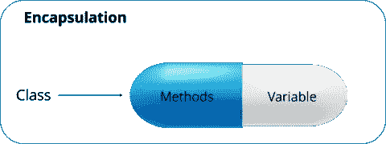

# Java 面向对象编程— Java OOPs 概念

> 原文：<https://medium.com/edureka/object-oriented-programming-b29cfd50eca0?source=collection_archive---------0----------------------->


Object-Oriented Programming - Edureka

面向对象编程是一种编程风格，与类、对象、继承、封装、抽象、多态等概念相关联。大多数流行的编程语言，如 Java、C++、C#、Ruby 等。遵循面向对象的编程范式。在这篇博客中，我将谈论 Java 中面向对象的编程概念。Java 中基于对象的应用程序是基于声明类、从类创建对象以及这些对象之间的交互。在这篇博客中，我们将按以下顺序理解面向对象编程的核心概念:

1.  遗产
2.  包装
3.  抽象
4.  多态性

让我们从第一个面向对象编程概念开始，即**继承**。

# 遗产

在面向对象的程序设计中，计算机程序是以这样一种方式设计的，在这种方式中，一切都是一个相互作用的对象。继承就是这样一个概念，其中一个类的属性可以被另一个类继承。它有助于重用代码和建立不同类之间的关系。


正如我们在图中看到的，一个孩子继承了他父亲的财产。类似地，在 Java 中，有两个类:

***1。*父类(超类或基类)**

***2。*子类(子类或派生类)**

继承属性的类称为子类，而属性被继承的类称为父类。

***继承又分为 4 种:***


Inheritance Types — Object-Oriented Programming

所以让我们从第一种类型的继承开始，即**单一继承**:

## **单一继承:**


在单一继承中，一个类继承另一个类的属性。它使派生类能够继承单个父类的属性和行为。反过来，这将实现代码的可重用性，并为现有的代码添加新的特性。

这里，A 类是你的父类，B 类是你的子类，继承了父类的属性和行为。

让我们看看单一继承的语法:

```
Class A
{
---
}
Class B extends A {
---
}
```

## **多级继承:**


当一个类从另一个类派生的类派生时，即一个类具有一个以上的父类但在不同的级别，这种类型的继承称为多级继承。

如果我们讨论流程图，B 类继承 A 类的属性和行为，C 类继承 B 类的属性。这里 A 是 B 的父类，B 类是 C 的父类。所以在这种情况下，C 类隐式继承 A 类和 B 类的属性和方法。这就是多级继承。

让我们看看 Java 中多级继承的语法:

```
Class A{
---
}
Class B extends A{
---
}
Class C extends B{
---
}
```

## **等级继承:**


当一个类有不止一个子类(子类)时，或者换句话说，不止一个子类有相同的父类，那么这种继承称为**层次**。

如果我们讨论流程图，B 类和 C 类是继承自父类即 a 类的子类。

让我们看看 Java 中层次继承的语法:

```
Class A{
---
}
Class B extends A{
---
}
Class C extends A{
---
}
```

## **杂交遗传:**

混合继承是*多重*继承和*多级*继承的结合。由于 Java 不支持多重继承，这会导致歧义，所以这种类型的继承只能通过使用接口来实现。

如果我们讨论流程图，A 类是 B 类和 C 类的父类，而 B 类和 C 类是 D 的父类，D 是 B 类和 C 的唯一子类。

现在我们已经了解了继承和它们的不同类型。让我们切换到另一个面向对象的编程概念，即**封装**。

# 包装

封装是一种将数据和代码作为一个单元绑定在一起的机制。这也意味着隐藏您的数据，以使其免受任何修改。这是什么意思？理解胶囊化的最好方法是看一个医用胶囊的例子，药物在胶囊里总是安全的。同样，通过封装，一个类的方法和变量被很好地隐藏和安全。



Encapsulation in Java - Object Oriented Programming

***我们可以通过*** 来实现 Java 中的封装

*   将类的变量声明为私有。
*   提供公共 setter 和 getter 方法来修改和查看变量值。

让我们看看下面的代码，以便更好地理解封装:

```
public class Employee {
 private String name;
 public String getName() {
 return name;
 }
 public void setName(String name) {
 this.name = name;
 }
 public static void main(String[] args) {
 }
}
```

让我们试着理解上面的代码。我创建了一个 Employee 类，它有一个私有变量**名。**然后我们创建了一个 **getter** 和 **setter 方法**，通过它们我们可以获取并设置一个雇员的名字。通过这些方法，任何希望访问 name 变量的类都必须使用这些 getter 和 setter 方法。

让我们前进到第三个面向对象的编程概念，即**抽象**。

# 抽象


抽象是指处理思想而不是事件的品质。它基本上处理的是隐藏细节，向用户展示本质的东西。如果你看这里的图像，每当我们接到一个电话，我们可以选择接听或拒绝。但实际上，有很多代码在后台运行。所以你不知道一个调用是如何产生的内部处理，这就是抽象的美妙之处。因此，抽象有助于降低复杂性。 ***你可以通过两种方式实现抽象*** :

a)抽象类

b)接口

让我们更详细地理解这些概念。

## **抽象类:**

Java 中的抽象类包含了' ***抽象*** '关键字。那么，abstract 关键字是什么意思？如果一个类被声明为抽象的，它就不能被实例化，这意味着你不能创建一个抽象类的对象。此外，抽象类可以包含抽象和具体的方法。

注意:你可以使用一个抽象类实现 0-100%的抽象。

要使用一个抽象类，你必须从另一个类继承它，在那里你必须提供抽象方法的实现，否则它也将成为一个抽象类。

让我们看看抽象类的语法:

```
Abstract class Mobile {   // abstract class mobile
Abstract void run();      // abstract method
```

## **接口:**

Java 中的接口是一个类的蓝图，或者你可以说它是抽象方法和静态常量的集合。在接口中，每个方法都是公共的和抽象的，但是它不包含任何构造函数。除了抽象，接口还有助于在 Java 中实现多重继承。

***注意*:使用接口可以实现 100%的抽象。**

所以一个接口基本上是一组相关的空方法。让我们通过一个“ParentCar”接口及其相关方法的例子来更好地理解接口。

```
public interface ParentCar {
public void changeGear( int newValue);
public void speedUp(int increment);
public void applyBrakes(int decrement);
}
```

每辆车都需要这些方法，对吗？但是他们的工作会有所不同。

比方说，你驾驶的是一辆手动挡汽车，你必须一个接一个地增加档位，但是如果你驾驶的是一辆自动挡汽车，那时候你的系统会决定如何根据速度改变档位。所以，不是我所有的子类都为*变速杆*写了同样的逻辑。同样的情况也适用于*加速*，现在我们假设当你按下一个加速器时，它以 10 公里或 15 公里的速度加速。但假设，有人驾驶一辆超级跑车，它增加了 30 公里或 50 公里。逻辑又变了。类似的还有*应用刹车*，一个人可能有强大的刹车，另一个人可能没有。

因为所有的功能对我所有的子类都是通用的，所以我创建了一个接口‘parent car ’,所有的功能都在这里。之后，我将创建一个实现这个接口的子类，其中所有这些方法的定义都不同。

接下来，让我们看看如何实现这个接口的功能。所以要实现这个接口，你的类的名字可以改成任何特定品牌的汽车，比如说我开一辆“奥迪”。为了实现类接口，我将使用“implement”关键字，如下所示:

```
public class Audi implements ParentCar {
int speed=0;
int gear=1;
public void changeGear( int value){
gear=value;
}
public void speedUp( int increment)
{
speed=speed+increment;
}
public void applyBrakes(int decrement)
{
speed=speed-decrement;
}
void printStates(){
System.out.println("speed:"+speed+"gear:"+gear);
}
public static void main(String[] args) {
// TODO Auto-generated method stub
Audi A6= new Audi();
A6.speedUp(50);
A6.printStates();
A6.changeGear(4);
A6.SpeedUp(100);
A6.printStates();
}
}
```

如你所见，我已经为我在接口类中声明的不同方法提供了功能。实现一个接口允许一个类对它承诺提供的行为变得更加正式。你也可以创建另一个类，比如说 BMW 类，它可以继承相同的接口“car ”,但具有不同的功能。

所以我希望你们清楚这个接口，以及如何使用它实现抽象。

最后，最后一个面向对象的编程概念是**多态**。

# 多态性

多态性意味着采取多种形式，其中' **poly** '意味着许多，而' morph '意味着多种形式。它是变量、函数或对象呈现多种形式的能力。换句话说，多态性允许您定义一个接口或方法，并拥有多个实现。

让我们通过一个真实的例子来理解这一点，以及这个概念如何适合面向对象编程。


Example of Polymorphism - Object Oriented Programming

让我们考虑一下板球中的真实场景，我们知道有不同类型的投球手，即快速投球手、中速投球手和旋转球手。如上图所示，有一个父类-**bowl rclass**，它有三个子类: **FastPacer** 、 **MediumPacer、**和 **Spinner** 。Bowler 类有 **bowlingMethod()** ，其中所有的子类都继承了这个方法。众所周知，在保龄球速度、长距离助跑和保龄球方式等方面，快速投球手与中速投球手和旋转投球手有所不同。类似地，一个中等步行者对 **bowlingMethod()** 的实现也将与其他投球手不同。spinner 类也是如此。
上面讨论的观点简单来说就是同一个名字倾向于多种形式。以上三个类都继承了 **bowlingMethod()** 但是它们的实现完全不同。

***Java 中的多态性有两种:***

1.  运行时多态性
2.  编译时多态性

## **运行时多态性:**

在 Java 中，运行时多态性指的是在运行时而不是编译时解决对被覆盖方法的调用的过程。在这种情况下，引用变量用于在运行时调用超类的覆盖方法。方法重写是运行时多态性的一个例子。让我们看看下面的代码来理解方法重写是如何工作的:

```
public Class BowlerClass{
void bowlingMethod()
{
System.out.println(" bowler ");
}
public Class FastPacer{
void bowlingMethod()
{
System.out.println(" fast bowler ");
}
Public static void main(String[] args)
{
FastPacer obj= new FastPacer();
obj.bowlingMethod();
}
}
```

## **编译时多态性:**

在 Java 中，编译时多态性指的是在编译时而不是运行时解决对重载方法的调用的过程。方法重载是编译时多态性的一个例子。方法重载是一个特性，它允许一个类拥有两个或更多同名的方法，但是传递给这些方法的参数是不同的。

***与方法凌驾不同，论据可以不同于:***

1.  传递给方法的参数数量
2.  参数的数据类型
3.  传递给方法时的数据类型序列。

让我们看看下面的代码来理解方法重载是如何工作的:

```
class Adder {
Static int add(int a, int b)
{
return a+b;
}
static double add( double a, double b)
{
return a+b;
}

public static void main(String args[])
{
System.out.println(Adder.add(11,11));
System.out.println(Adder.add(12.3,12.6));
}
}
```

我希望你们清楚我们上面讨论的所有面向对象的编程概念，即继承、封装、抽象和多态。现在，您可以使用 Java OOPs 概念使您的 Java 应用程序更加安全、简单和可重用。

到此，我们结束了这个博客。如果你想查看更多关于人工智能、DevOps、道德黑客等市场最热门技术的文章，你可以参考 Edureka 的官方网站。

请留意本系列中的其他文章，它们将解释 Java 的各个方面。

> 1. [Java 教程](/edureka/java-tutorial-bbdd28a2acd7)
> 
> 2.[Java 中的继承](/edureka/inheritance-in-java-f638d3ed559e)
> 
> 3.[Java 中的多态性](/edureka/polymorphism-in-java-9559e3641b9b)
> 
> 4.[Java 中的抽象](/edureka/java-abstraction-d2d790c09037)
> 
> 5. [Java 字符串](/edureka/java-string-68e5d0ca331f)
> 
> 6. [Java 数组](/edureka/java-array-tutorial-50299ef85e5)
> 
> 7. [Java 集合](/edureka/java-collections-6d50b013aef8)
> 
> 8. [Java 线程](/edureka/java-thread-bfb08e4eb691)
> 
> 9.[Java servlet 简介](/edureka/java-servlets-62f583d69c7e)
> 
> 10. [Servlet 和 JSP 教程](/edureka/servlet-and-jsp-tutorial-ef2e2ab9ee2a)
> 
> 11.[Java 中的异常处理](/edureka/java-exception-handling-7bd07435508c)
> 
> 12.[高级 Java 教程](/edureka/advanced-java-tutorial-f6ebac5175ec)
> 
> 13. [Java 面试问题](/edureka/java-interview-questions-1d59b9c53973)
> 
> 14. [Java 程序](/edureka/java-programs-1e3220df2e76)
> 
> 15.[科特林 vs Java](/edureka/kotlin-vs-java-4f8653f38c04)
> 
> 16.[依赖注入使用 Spring Boot](/edureka/what-is-dependency-injection-5006b53af782)
> 
> 17.[Java 中的可比](/edureka/comparable-in-java-e9cfa7be7ff7)
> 
> 18.[十大 Java 框架](/edureka/java-frameworks-5d52f3211f39)
> 
> 19. [Java 反射 API](/edureka/java-reflection-api-d38f3f5513fc)
> 
> 20.[Java 中的 30 大模式](/edureka/pattern-programs-in-java-f33186c711c8)
> 
> 21.[核心 Java 备忘单](/edureka/java-cheat-sheet-3ad4d174012c)
> 
> 22.[Java 中的套接字编程](/edureka/socket-programming-in-java-f09b82facd0)
> 
> 23. [Java OOP 备忘单](/edureka/java-oop-cheat-sheet-9c6ebb5e1175)
> 
> 24.[Java 中的注释](/edureka/annotations-in-java-9847d531d2bb)
> 
> 25.[Java 中的图书管理系统项目](/edureka/library-management-system-project-in-java-b003acba7f17)
> 
> 26.[Java 中的树](/edureka/java-binary-tree-caede8dfada5)
> 
> 27.[Java 中的机器学习](/edureka/machine-learning-in-java-db872998f368)
> 
> 28.[Java 中的顶级数据结构&算法](/edureka/data-structures-algorithms-in-java-d27e915db1c5)
> 
> 29. [Java 开发人员技能](/edureka/java-developer-skills-83983e3d3b92)
> 
> 30.[前 55 个 Servlet 面试问题](/edureka/servlet-interview-questions-266b8fbb4b2d)
> 
> 31. [](/edureka/java-exception-handling-7bd07435508c) [顶级 Java 项目](/edureka/java-projects-db51097281e3)
> 
> 32. [Java 字符串备忘单](/edureka/java-string-cheat-sheet-9a91a6b46540)
> 
> 33.[Java 中的嵌套类](/edureka/nested-classes-java-f1987805e7e3)
> 
> 34. [Java 集合面试问答](/edureka/java-collections-interview-questions-162c5d7ef078)
> 
> 35.[Java 中如何处理死锁？](/edureka/deadlock-in-java-5d1e4f0338d5)
> 
> 36.[你需要知道的 50 大 Java 集合面试问题](/edureka/java-collections-interview-questions-6d20f552773e)
> 
> 37.[Java 中的字符串池是什么概念？](/edureka/java-string-pool-5b5b3b327bdf)
> 
> 38.[C、C++和 Java 有什么区别？](/edureka/difference-between-c-cpp-and-java-625c4e91fb95)
> 
> 39.[Java 中的回文——如何检查一个数字或字符串？](/edureka/palindrome-in-java-5d116eb8755a)
> 
> 40.[你需要知道的顶级 MVC 面试问答](/edureka/mvc-interview-questions-cd568f6d7c2e)
> 
> 41.[Java 编程语言十大应用](/edureka/applications-of-java-11e64f9588b0)
> 
> 42.[Java 中的死锁](/edureka/deadlock-in-java-5d1e4f0338d5)
> 
> 43.[Java 中的平方和平方根](/edureka/java-sqrt-method-59354a700571)
> 
> 44.[Java 中的类型转换](/edureka/type-casting-in-java-ac4cd7e0bbe1)
> 
> 45.[Java 中的运算符及其类型](/edureka/operators-in-java-fd05a7445c0a)
> 
> 46.[Java 中的析构函数](/edureka/destructor-in-java-21cc46ed48fc)
> 
> 47.[Java 中的二分搜索法](/edureka/binary-search-in-java-cf40e927a8d3)
> 
> 48.[Java 中的 MVC 架构](/edureka/mvc-architecture-in-java-a85952ae2684)
> 
> 49. [Hibernate 面试问答](/edureka/hibernate-interview-questions-78b45ec5cce8)

*原载于 2017 年 5 月 3 日 www.edureka.co**的* [*。*](https://www.edureka.co/blog/object-oriented-programming)