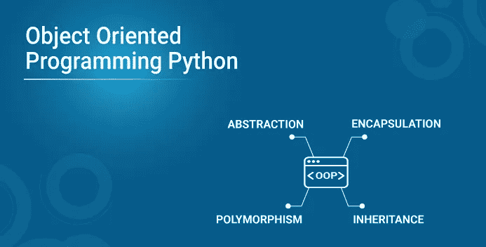
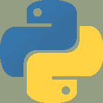
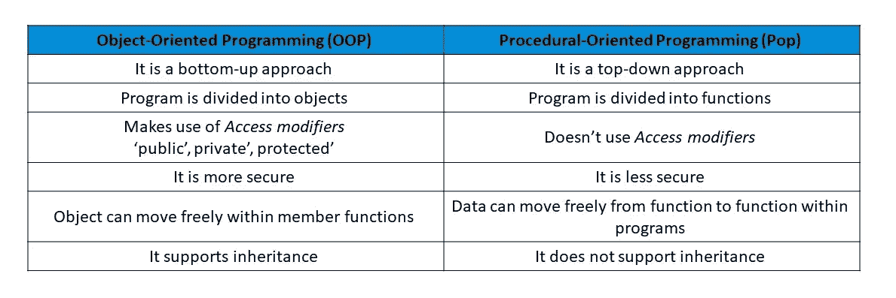
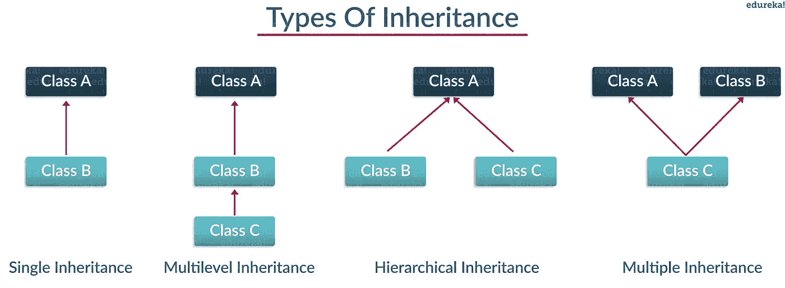
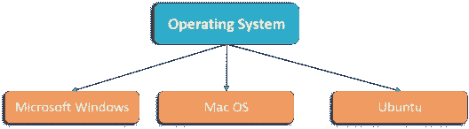

# Python 中的面向对象编程

> 原文：<https://medium.com/edureka/object-oriented-programming-python-f8d00ddcb7d6?source=collection_archive---------1----------------------->



Object-Oriented Programming in Python — Edureka

面向对象编程作为一门学科已经在开发人员中获得了普遍的支持。Python 遵循面向对象的编程范式。它处理声明 Python 类和对象，这奠定了 OOPs 概念的基础。本文将带您了解如何声明编程语言 python 类，从它们实例化对象，以及 OOPs 的四种方法。

在本文中，将详细介绍以下几个方面:

1.  Python 中面向对象编程的介绍
2.  面向对象和面向过程编程的区别
3.  什么是类和对象？
4.  面向对象的编程方法:

*   遗产
*   多态性
*   包装
*   抽象

让我们开始吧。

## Python 中的面向对象编程

面向对象编程是计算机编程的一种方式，使用“对象”的概念来表示数据和方法。它也是一种用于创建整洁的可重用代码而不是冗余代码的方法。程序被分成独立的对象或几个小程序。



每个单独的对象代表应用程序的一个不同部分，有自己的逻辑和数据在它们之间进行通信。

现在，为了更清楚地了解我们为什么用 oops 代替 pop，我列出了下面的区别。

# 面向对象和面向过程编程的区别



这就是所有关于差异的内容，接下来让我们了解一下类和对象。

# **什么是类和对象？**

类是对象的集合，或者你可以说它是定义公共属性和行为的对象的蓝图。现在问题来了，你如何做到这一点？

嗯，它以一种使代码重用变得容易的方式对数据进行逻辑分组。我可以给你一个真实的例子——把一个 office going 'employee '想象成一个类，所有与之相关的属性，比如' emp_name '、' emp_age '、' emp_salary '、' emp_id '都是 Python 中的对象。让我们从编码的角度来看，如何实例化一个类和一个对象。

类是在“Class”关键字下定义的。
**例如:**

```
class class1(): // class 1 is the name of the class
```

**注意:** Python 不区分大小写。

## 对象:

对象是一个类的实例。它是一个有状态和行为的实体。简而言之，它是一个可以访问数据的类的实例。

语法: obj = class1()

这里 obj 是 class1 的“对象”。

## 在 python 中创建对象和类:

**举例:**

```
class employee():
def __init__(self,name,age,id,salary): //creating a function 
      self.name = name // self is an instance of a class 
      self.age = age self.salary = salary 
      self.id = id 
emp1 = employee("harshit",22,1000,1234)//creating objects 
emp2 = employee("arjun",23,2000,2234) 
print(emp1.__dict__)//Prints dictionary
```

**说明:**‘EMP 1’和‘EMP 2’是针对类‘employee’实例化的对象。在这里，单词(__dict__)是一个“字典”，它根据给定的参数(姓名、年龄、薪金)打印对象“emp1”的所有值。(__init__)就像一个构造函数，每当创建一个对象时都会调用它。

我希望现在的你们在将来处理“类”和“对象”时不会遇到任何问题。

现在，让我带您浏览一下面向对象的编程方法:

# 面向对象的编程方法:

面向对象的编程方法处理以下概念。

*   遗产
*   多态性
*   包装
*   抽象

让我们详细了解一下继承的第一个概念。

# 继承:

有没有听过亲戚的这种对话“你长得跟你爸爸/妈妈一模一样”这背后的原因叫做‘遗传’。从编程方面来说，一般是指“从父类继承或转移特征到子类，不做任何修改”。这个新类被称为**衍生/子类**，衍生它的那个被称为**父/基类**。



让我们详细了解每个副主题。

## **单继承:**

单级继承使派生类能够从单个父类继承特征。

**举例:**

```
class employee1()://This is a parent class 
def __init__(self, name, age, salary): 
self.name = name
self.age = age
self.salary = salary 
class childemployee(employee1)://This is a child class
def __init__(self, name, age, salary,id):
self.name = name 
self.age = age 
self.salary = salary 
self.id = id 
emp1 = employee1('harshit',22,1000)
print(emp1.age)
```

**输出** : 22

**说明:**

*   我采用父类并创建了一个构造函数(__init__)，该类本身正在用参数初始化属性(' name '，' age '和' salary ')。
*   创建了从父类继承属性的子类“childemployee ”,最后根据参数实例化了对象“emp1”和“emp2”。
*   最后，我已经打印了 emp1 的时代。嗯，你可以做很多事情，比如打印整本字典，名字或者薪水。

## **多级继承:**

多级继承使派生类能够从直接父类继承属性，直接父类又从其父类继承属性。

**示例:**

```
class employee()://Super class
def __init__(self,name,age,salary):
self.name = name
self.age = age
self.salary = salary
class childemployee1(employee)://First child class
def __init__(self,name,age,salary):
self.name = name
self.age = age
self.salary = salary class childemployee2(childemployee1)://Second child class
def __init__(self, name, age, salary):
self.name = name
self.age = age
self.salary = salary
emp1 = employee('harshit',22,1000)
emp2 = childemployee1('arjun',23,2000)print(emp1.age)
print(emp2.age)
```

**输出:** 22，23

**说明:**

*   这在上面写的代码中解释得很清楚，这里我将超类定义为 employee，将子类定义为 childemployee1。现在，childemployee1 充当 childemployee2 的父代。
*   我已经实例化了两个对象“emp1”和“emp2 ”,其中我从超类“employee”为 emp1 传递参数“name”、“age”、“salary ”,从父类“childemployee1”传递参数“name”、“age”、“salary”和“id”

## **等级继承:**

分层继承允许多个派生类从父类继承属性。

**例如:**

```
class employee():
def __init__(self, name, age, salary): //Hierarchical Inheritance self.name = name
self.age = age
self.salary = salaryclass childemployee1(employee):
def __init__(self,name,age,salary):
self.name = name
self.age = age
self.salary = salaryclass childemployee2(employee):
def __init__(self, name, age, salary):
self.name = name
self.age = age
self.salary = salary
emp1 = employee('harshit',22,1000)
emp2 = employee('arjun',23,2000)print(emp1.age)
print(emp2.age)
```

**输出:** 22，23

**解释:**

*   在上面的例子中，你可以清楚地看到有两个子类“childemployee1”和“childemployee2”。它们从一个公共的父类“employee”继承功能。
*   对象“emp1”和“emp2”根据参数“姓名”、“年龄”、“薪金”进行实例化。

## **多重继承:**

多级继承使一个派生类能够从多个基类继承属性。

**举例:**

```
class employee1()://Parent class
def __init__(self, name, age, salary):
self.name = name
self.age = age
self.salary = salaryclass employee2()://Parent class
def __init__(self,name,age,salary,id):
self.name = name
self.age = age
self.salary = salary
self.id = id class childemployee(employee1,employee2):
def __init__(self, name, age, salary,id):
self.name = name
self.age = age
self.salary = salary
self.id = id
emp1 = employee1('harshit',22,1000)
emp2 = employee2('arjun',23,2000,1234)print(emp1.age)
print(emp2.id)
```

**产量:**221234

**解释:**在上面的例子中，我取了一个双亲类“employee1”和“employee2”。以及子类“childemployee ”,它通过对照父类的参数实例化对象“emp1”和“emp2”来继承两个父类。

这都是关于继承的，在面向对象编程 Python 中前进，让我们在‘多态性’中深入探究。

# **多态性**

你们一定都使用过 GPS 来导航路线，根据交通状况，你会遇到多少不同的路线来到达同一个目的地，这难道不令人惊讶吗？从编程的角度来看，这被称为“多态性”。它是一种这样的 OOP 方法，其中一个任务可以用几种不同的方式来执行。简单来说，*它是一个对象的属性，允许它采取多种形式*。



**多态性有两种类型:**

*   *编译时多态性*
*   *运行时多态性*

# **编译时多态性:**

编译时多态性也称为静态多态性，在程序编译时得到解决。一个常见的例子是“方法重载”。让我给你看一个简单的例子。

**例子:**

```
class employee1():
def name(self):
print("Harshit is his name")def salary(self):
print("3000 is his salary")def age(self):
print("22 is his age")class employee2():
def name(self):
print("Rahul is his name")def salary(self):
print("4000 is his salary")def age(self):
print("23 is his age")def func(obj)://Method Overloading
obj.name()
obj.salary()
obj.age()obj_emp1 = employee1()
obj_emp2 = employee2()func(obj_emp1)
func(obj_emp2)
```

**输出:**

他的名字是哈什特 3000 是他的薪水 22 是他的年龄拉胡尔是他的名字 4000 是他的薪水 23 是他的年龄

**解释:**

*   在上面的程序中，我创建了两个类“employee1”和“employee2 ”,并为“name”、“salary”和“age”创建了函数，并打印了相同的值，而没有从用户那里获取。
*   现在，欢迎来到主要部分，我已经创建了一个以“obj”为参数的函数，并调用所有三个函数，即“姓名”、“年龄”和“薪金”。
*   后来，针对这两个类实例化了对象 emp_1 和 emp_2，并简单地调用了函数。这种类型被称为方法重载，它允许一个类拥有多个同名的方法。

## **运行时多态性:**

运行时多态也被称为动态多态，它在运行时被解析。运行时多态性的一个常见例子是“方法重写”。为了更好的理解，让我通过一个例子给你演示一下。

**例如:**

```
class employee():
 def __init__(self,name,age,id,salary):
    self.name = name
    self.age = age
    self.salary = salary
    self.id = id
def earn(self):
    passclass childemployee1(employee):def earn(self)://Run-time polymorphism
  print("no money")class childemployee2(employee):def earn(self):
 print("has money")c = childemployee1
c.earn(employee)
d = childemployee2
d.earn(employee)
```

**输出:**没钱，有钱

**解释:**在上面的例子中，我创建了两个类‘child employee 1’和‘child employee 2’，它们都是从同一个基类‘employee’派生出来的。这里有个问题，一个人没有收到钱，而另一个人收到了。现在真正的问题是这是怎么发生的？嗯，如果你仔细看，我在这里创建了一个空函数，并使用了 *Pass* (当你不想执行任何命令或代码时使用的语句)。现在，在两个派生类下，我使用了相同的空函数，并使用了 print 语句作为' no money '和' has money '。最后，我创建了两个对象并调用了函数。

转到下一个面向对象编程 Python 方法，我将讨论封装。

# 封装:

在原始形式中，封装基本上意味着将数据绑定在一个类中。Python 没有任何私有关键字，不像 Java。一个类不应该被直接访问，而应该以下划线为前缀。

为了更好的理解，让我给你看一个例子。

**举例:**

```
class employee(object):
def __init__(self):
self.name = 1234
self._age = 1234
self.__salary = 1234object1 = employee()
print(object1.name)
print(object1._age)
print(object1.__salary)
```

**输出:**

1234
Traceback(最近一次调用 last):
1234
文件“C:/Users/Harshit _ Kant/PycharmProjects/test1/venv/encapsu . py”，第 10 行，在
print(object1。_ _ 薪金)
**属性错误:**“雇员”对象没有属性“_ _ 薪金”

**解释:**你会得到这个问题下划线和错误是什么？嗯，python 类把私有变量当作(__salary)，不能直接访问。

因此，在下一个例子中，我使用了 setter 方法来提供对它们的间接访问。

**例如:**

```
class employee():
def __init__(self):
self.__maxearn = 1000000
def earn(self):
print("earning is:{}".format(self.__maxearn))def setmaxearn(self,earn)://setter method used for accesing private class 
self.__maxearn = earnemp1 = employee()
emp1.earn()emp1.__maxearn = 10000
emp1.earn()emp1.setmaxearn(10000)
emp1.earn()
```

**输出:**

收入是:1000000，收入是:1000000，收入是:10000

**解释:**利用 **setter 方法**提供了*对私有类方法*的间接访问。这里我定义了一个类 employee，并使用了一个(__maxearn)和一个 setter 函数 setmaxearn()，前者是这里用来存储雇员的最大收入的 setter 方法，后者将 price 作为参数。

这是一个封装的明显例子，我们限制对私有类方法的访问，然后使用 setter 方法授予访问权限。

接下来，在面向对象编程中，python 方法论讨论了一个叫做抽象的关键概念。

# **摘要:**

假设您使用网上银行或任何其他流程从 BookMyShow 预订了一张电影票。你不知道 pin 码是如何生成的，也不知道验证是如何完成的。从编程的角度来看，这被称为“抽象”,它基本上意味着你只显示特定过程的实现细节，而对用户隐藏细节。它通过建模适合问题的类来简化复杂的问题。抽象类不能被实例化，这意味着你不能为这种类型的类创建对象。它只能用于继承功能。

**举例:**

```
from abc import ABC,abstractmethod
class employee(ABC):
def emp_id(self,id,name,age,salary): //Abstraction
passclass childemployee1(employee):
def emp_id(self,id):
print("emp_id is 12345")emp1 = childemployee1()
emp1.emp_id(id)
```

**输出** : emp_id 为 12345

**解释:**正如你在上面的例子中看到的，我们已经导入了一个抽象方法，程序的其余部分有一个父类和一个派生类。为“childemployee”基类实例化了一个对象，并使用了 abstract 的功能。

这就把我们带到了“面向对象编程 Python”这篇文章的结尾。我希望您已经了解了 python 中与 Python 类、对象和面向对象概念相关的所有概念。确保你尽可能多的练习，恢复你的经验。

如果你想查看更多关于人工智能、DevOps、道德黑客等市场最热门技术的文章，你可以参考 Edureka 的官方网站。

请留意本系列中的其他文章，它们将解释 Python 的各个方面。

> *1。* [*Python 教程*](/edureka/python-tutorial-be1b3d015745)
> 
> *2。* [*Python 函数*](/edureka/python-functions-f0cabca8c4a)
> 
> *3。*[*Python 中的文件处理*](/edureka/file-handling-in-python-e0a6ff96ede9)
> 
> *4。* [*Python Numpy 教程*](/edureka/python-numpy-tutorial-89fb8b642c7d)
> 
> *5。* [*Scikit 学习机*](/edureka/scikit-learn-machine-learning-7a2d92e4dd07)
> 
> *6。* [*蟒蛇熊猫教程*](/edureka/python-pandas-tutorial-c5055c61d12e)
> 
> *7。* [*Matplotlib 教程*](/edureka/python-matplotlib-tutorial-15d148a7bfee)
> 
> *8。* [*Tkinter 教程*](/edureka/tkinter-tutorial-f655d3f4c818)
> 
> *9。* [*请求教程*](/edureka/python-requests-tutorial-30edabfa6a1c)
> 
> 10。 [*PyGame 教程*](/edureka/pygame-tutorial-9874f7e5c0b4)
> 
> 11。 [*OpenCV 教程*](/edureka/python-opencv-tutorial-5549bd4940e3)
> 
> *12。* [*用 Python 进行网页抓取*](/edureka/web-scraping-with-python-d9e6506007bf)
> 
> *13。* [*PyCharm 教程*](/edureka/pycharm-tutorial-d0ec9ce6fb60)
> 
> 14。 [*机器学习教程*](/edureka/machine-learning-tutorial-f2883412fba1)
> 
> 15。[*Python 中从头开始的线性回归算法*](/edureka/linear-regression-in-python-e66f869cb6ce)
> 
> 16 岁。 [*用于数据科学的 Python*](/edureka/learn-python-for-data-science-1f9f407943d3)
> 
> *17。* [*Python 正则表达式*](/edureka/python-regex-regular-expression-tutorial-f2d17ffcf17e)
> 
> *18。*[*Python 中的循环*](/edureka/loops-in-python-fc5b42e2f313)
> 
> *19。* [*Python 项目*](/edureka/python-projects-1f401a555ca0)
> 
> *20。* [*机器学习项目*](/edureka/machine-learning-projects-cb0130d0606f)
> 
> *21。*[*Python 中的*](/edureka/arrays-in-python-14aecabec16e) 数组
> 
> *22。* [*在 Python 中设置*](/edureka/sets-in-python-a16b410becf4)
> 
> *23。*[*Python 中的多线程*](/edureka/what-is-mutithreading-19b6349dde0f)
> 
> *24。* [*Python 面试问题*](/edureka/python-interview-questions-a22257bc309f)
> 
> *25。*[*Java vs Python*](/edureka/java-vs-python-31d7433ed9d)
> 
> *26。* [*如何成为一名 Python 开发者？*](/edureka/how-to-become-a-python-developer-462a0093f246)
> 
> *27。* [*Python Lambda 函数*](/edureka/python-lambda-b84d68d449a0)
> 
> *28。* [*网飞如何使用 Python？*](/edureka/how-netflix-uses-python-1e4deb2f8ca5)
> 
> *29。*[*Python 中的套接字编程是什么*](/edureka/socket-programming-python-bbac2d423bf9)
> 
> 三十岁。 [*Python 数据库连接*](/edureka/python-database-connection-b4f9b301947c)
> 
> *31。*[*Golang vs Python*](/edureka/golang-vs-python-5ac32e1ef2)
> 
> *32。* [*Python Seaborn 教程*](/edureka/python-seaborn-tutorial-646fdddff322)
> 
> 33。 [*Python 职业机会*](/edureka/python-career-opportunities-a2500ce158de)

*原载于 2019 年 6 月 25 日*[*https://www.edureka.co*](https://www.edureka.co/blog/object-oriented-programming-python/)*。*