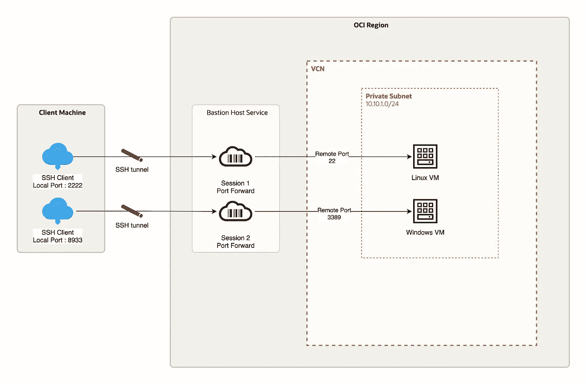

# OCI 堡垒服务:使用 OCI 命令行界面连接到您的私有资源的另一种方式

> 原文：<https://medium.com/oracledevs/oci-bastion-service-an-alternate-way-of-connecting-to-your-private-resources-using-oci-cli-d9c829685c77?source=collection_archive---------0----------------------->

OCI 堡垒服务是基于 Oracle 云基础设施(OCI)的完全托管的无服务器产品，可连接到您的 Oracle 虚拟云网络(VCN)的私有子网中的资源。尽管 Bastion 服务的功能令人惊叹，但为了确保您有一个会话，您必须在 OCI 控制台中点击许多菜单选项来创建一个会话，然后才能开始使用您的私有资源。



OCI Bastion Service

有一种替代方法可以做到这一点，即使用 OCI 命令行实用程序来做同样的事情，而不需要在 GUI 中跳过这么多选项。

在我们继续之前，请确保您已经安装了[OCI-CLI](https://docs.oracle.com/en-us/iaas/Content/API/SDKDocs/cliinstall.htm)，并且[已经创建了 API 密匙](https://docs.oracle.com/en-us/iaas/Content/API/Concepts/apisigningkey.htm#two)来以编程方式访问您的 OCI 帐户。一旦安装了 oci-cli 并创建了密钥。[为您的资源所在的目标子网创建一个堡垒主机服务](https://docs.public.oneportal.content.oci.oraclecloud.com/en-us/iaas/Content/Bastion/Tasks/managingbastions.htm#To_create_a_bastion)。我们现在将使用 OCI 命令行实用程序在堡垒主机上创建一个会话

1.  **编辑$HOME/。oci/config 文件，添加 API 键并创建您的堡垒主机服务**

```
$ cat $HOME/.oci/config [DEMO]
user=ocid1.user.oc1..aaaaaaaacvk*******7q
fingerprint=de:50*******:d6
tenancy=ocid1.tenancy.oc1..aaa******l3fq
region=ap-sydney-1
key_file=/Users/shadab/.oci/oci_api_key.pem-- Create the Bastion Host -- oci bastion bastion create --bastion-type Standard --compartment-id ocid1.compartment.oc1..aaaaaaaa5o****6cq --target-subnet-id ocid1.subnet.oc1.ap-sydney-1.aaaaaaaao4*****q --client-cidr-list '["0.0.0.0/0"]' --profile DEMO-- List the Bastion Service --oci bastion bastion list --compartment-id ocid1.compartment.oc1..aaaaaa*******q --profile DEMO  --all
```

**2。创建一个样本 JSON 响应文件来创建一个堡垒会话**

```
oci bastion session create-port-forwarding --generate-full-command-json-input
```

**3。定制在步骤 2 中生成的 JSON 文件。用你输入的参数并保存到一个文件 bastion_input.json**

```
{
"bastionId": "ocid1.bastion.oc1.ap-sydney-1.amaaaaaaeetb******4q",
"definedTags": {
"tagNamespace1": {
"tagKey1": "tagValue1",
"tagKey2": "tagValue2"
},
"tagNamespace2": {
"tagKey1": "tagValue1",
"tagKey2": "tagValue2"
}
},
"displayName": "Shadab-SSH-Session-Bastion",
"freeformTags": {
"tagKey1": "tagValue1",
"tagKey2": "tagValue2"
},
"keyType": "PUB",
"maxWaitSeconds": 0,
"sessionTtl": "10800",
"sshPublicKeyFile": "/Users/shadab/Downloads/Keys/publickey.pub",
"targetPort": "22",
"targetPrivateIp": "10.43.0.34",
"targetResourceId": "ocid1.instance.oc1.ap-sydney-1.anzxsl******tlq",
"waitForState": [
"SUCCEEDED"
],
"waitIntervalSeconds": 20
}
```

**4。从 oci-cli 创建端口转发会话**

```
oci bastion session create-port-forwarding --from-json file://bastion_input.json --profile DEMO
```

这现在提供了一个会话来连接到远程主机上的端口 22。

另一个常用的例子是为 OCI 上的私有 Windows 主机创建端口转发会话。

```
{
"bastionId": "ocid1.bastion.oc1.ap-sydney-1.amaaaaaaeetb5t****p4q",
"definedTags": {
"tagNamespace1": {
"tagKey1": "tagValue1",
"tagKey2": "tagValue2"
},
"tagNamespace2": {
"tagKey1": "tagValue1",
"tagKey2": "tagValue2"
}
},
"displayName": "Shadab-Windows-Session-Bastion",
"freeformTags": {
"tagKey1": "tagValue1",
"tagKey2": "tagValue2"
},
"keyType": "PUB",
"maxWaitSeconds": 0,
"sessionTtl": "10800",
"sshPublicKeyFile": "/Users/shadab/Downloads/Keys/publickey.pub",
"targetPort": "3389",
"targetPrivateIp": "10.43.0.39",
"targetResourceId": "ocid1.instance.oc1.ap-sydney-1.anzxsljreetb5*****yz2q",
"waitForState": [
"SUCCEEDED"
],
"waitIntervalSeconds": 20
}
```

现在启动端口 3389 (Windows RDP 端口)的第二个会话

```
oci bastion session create-port-forwarding --from-json file://bastion_windows.json --profile DEMO
```

**5。现在会话已经创建，让我们获取会话 ID 等会话详细信息，并查看我们需要在本地机器上运行的会话 SSH 命令，以创建端口转发**

要列出以编程方式创建的最新会话的会话 ID，请运行

```
oci bastion session list --bastion-id ocid1.bastion.oc1.ap-sydney-1.amaaaaaaee*******p4q --session-lifecycle-state ACTIVE --sort-order asc --profile DEMO --all
```

在 JSON 输出中，特定会话的会话 id 将是“ID”标记

```
“id”: “ocid1.bastionsession.oc1.ap-sydney-1.amaaaaaaee***********2gda”
```

**6。使用通过运行之前的命令获得的会话 id，输入会话 ID 并输出会话详细信息**

```
oci bastion session get --session-id ocid1.bastionsession.oc1.ap-sydney-1.amaaaaaaeetb*********pa --profile DEMO
```

上述命令的输出将列出 SSH 命令，您将使用该命令创建端口转发

```
“ssh-metadata”: {
 “command”: “ssh -i <privateKey> -N -L <localPort>:10.43.0.39:3389 -p 22 ocid1.bastionsession.oc1.ap-sydney-1.amaaaaaa***********gda@host.bastion.ap-sydney-1.oci.oraclecloud.com”
 }
```

**7。最后，在您的客户机上运行本地端口转发来连接您的私有实例**

```
-- Linux SSH port forwarding --
ssh -i privatekeyfile.key -N -L 2222:10.43.0.34:22 -p 22 ocid1.bastionsession.oc1.ap-sydney-1.amaaaaaa***********gda@host.bastion.ap-sydney-1.oci.oraclecloud.com-- Windows RDP Port Forwarding --
ssh -i privatekeyfile.key -N -L 8933:10.43.0.39:3389 -p 22 ocid1.bastionsession.oc1.ap-sydney-1.amaaaaaa***********gda@host.bastion.ap-sydney-1.oci.oraclecloud.com
```

## 最后，所有命令都可以放在几个简单的 shell 脚本中，以生成可重用的代码来为您的私有资源生成端口转发会话

**A .创建堡垒主机:***ocibastioncreatebastion . sh*

```
#!/bin/bash
export bastion_type=Standard
export compartment_id=ocid1.compartment.oc1..aaaaaaaa******bpi6cq
export target_subnet_id=ocid1.subnet.oc1.ap-sydney-1.aaaaaaaao*******nbnnq
export profile=DEMO
export cidr_allow='["0.0.0.0/0"]'
oci bastion bastion create --bastion-type $bastion_type --compartment-id $compartment_id --target-subnet-id $target_subnet_id --client-cidr-list $cidr_allow --profile $profile
```

**输出**

。/OciBastionCreateBastion.sh

```
{
  "data": {
    "bastion-type": "STANDARD",
    "client-cidr-block-allow-list": [
      "0.0.0.0/0"
    ],
    "compartment-id": "ocid1.compartment.oc1..aaaaaaaa*****q",
    "defined-tags": {
      "Oracle-Tags": {
        "CreatedBy": "email[@acme.com](mailto:shadab.mohammad@oracle.com)",
        "CreatedOn": "2021-10-10T08:17:13.489Z"
      }
    },
    "freeform-tags": {},
    "id": "ocid1.bastion.oc1.ap-sydney-1.amaaaaaa*******42q",
    "lifecycle-details": null,
    "lifecycle-state": "CREATING",
    "max-session-ttl-in-seconds": 10800,
    "max-sessions-allowed": 20,
    "name": "bastion20211010081715",
    "phone-book-entry": null,
    "private-endpoint-ip-address": null,
    "static-jump-host-ip-addresses": null,
    "system-tags": {},
    "target-subnet-id": "ocid1.subnet.oc1.ap-sydney-1.aaaaaaaao*********bnnq",
    "target-vcn-id": "ocid1.vcn.oc1.ap-sydney-1.amaaaa*********vq",
    "time-created": "2021-10-10T08:17:16.177000+00:00",
    "time-updated": "2021-10-10T08:17:16.177000+00:00"
  },
  "opc-work-request-id": "ocid1.bastionworkrequest.oc1.ap-sydney-1.amaaaaaa******a"
}
```

**B .创建会话:***ocibastioncreatesession . sh*

```
#!/bin/bash
export bastion_id=ocid1.bastion.oc1.ap-sydney-1.amaaaaaa*****4q
export profile=DEMO
export path=file://bastion_input.json
export path2=file://bastion_windows.json
oci bastion session create-port-forwarding --from-json $path --profile $profile
oci bastion session create-port-forwarding --from-json $path2 --profile $profile
```

**C .列表会话:***ocibastionlistsession . sh*

```
#!/bin/bash
export bastion_id=ocid1.bastion.oc1.ap-sydney-1.amaaaaaa*********qp4q
export profile=DEMO
oci bastion session list --bastion-id $bastion_id --session-lifecycle-state ACTIVE --sort-order asc --profile $profile --all
```

**D .获取会话详细信息:***ocibastiongetsession . sh*

```
#!/bin/zsh
export session_id=$1
export profile=demooci bastion session get --session-id $session_id --profile $profile | grep -i command | grep -o 'ssh -i.*' | sed -e 's|<privateKey>|/Users/shadab/.oci/ZDM5/mydemo_vcn.priv|g;s|\\||g;s/\"$//' > output
chmod +x output
zsh output
```

**进一步阅读**
OCI 堡垒服务[https://docs . public . oneportal . Content . OCI . Oracle cloud . com/en-us/iaas/Content/Bastion/Concepts/Bastion overview . htm](https://docs.public.oneportal.content.oci.oraclecloud.com/en-us/iaas/Content/Bastion/Concepts/bastionoverview.htm)