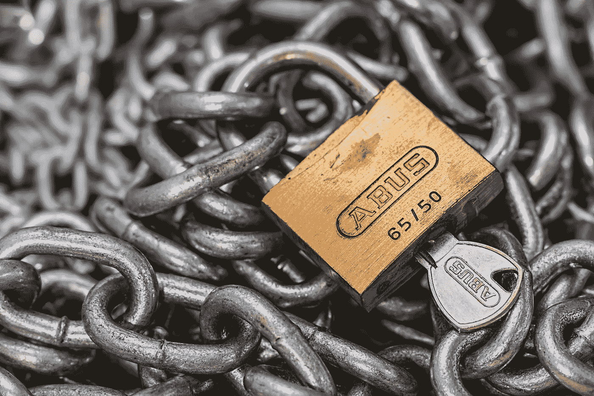
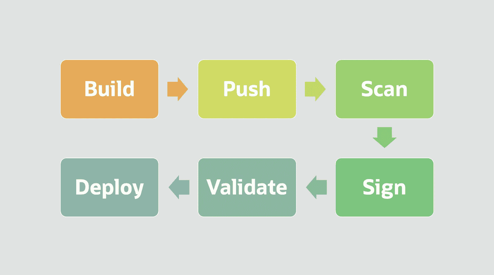

# Oracle 容器映像扫描、签名和验证

> 原文：<https://medium.com/oracledevs/oci-container-image-scanning-signing-and-verification-ff5bfe98838e?source=collection_archive---------0----------------------->

Secure your container image deployments

# 介绍

[甲骨文云基础设施(OCI)支持集装箱图像扫描、扫描和验证](https://docs.oracle.com/en-us/iaas/releasenotes/changes/5ca9f543-9f4e-490e-8449-10edea050a74/)。这套功能将帮助您确保云原生软件部署的安全性。

想象一下，一个软件开发团队正在交付一个传递敏感数据的业务关键型应用程序。开发人员将代码提交给持续集成和持续交付(CI/CD)工具，开始构建过程。然后，CI/CD 工具将新构建的容器映像推送到 Oracle 云基础架构注册(OCIR)存储库，准备就绪后，新映像将部署到用于 Kubernetes (OKE)集群的生产 OCI 容器引擎。

虽然这听起来像是一个合理的 CI/CD 流程，但它缺少一些关键步骤。对于运输合规且安全的集装箱而言，系统管理员需要能够确保集装箱图像:

*   没有可能导致意外系统故障或恶意活动的已知关键漏洞。
*   自从它们被出版以来没有被修改过，例如以会损害它们的完整性的方式。
*   只有在确信它们来自可信来源时，才能部署到 Kubernetes 集群。

OCI 容器映像扫描、签名和验证解决了所有这三种安全容器部署需求。

# **扫描图像**

OCI 注册中心使用户或系统能够将容器映像推送到存储库。现在，您可以对存储在 OCI 注册表中的容器图像进行扫描，以查找公开发布的通用漏洞和暴露(CVE)数据库中发布的安全漏洞。启用资料库扫描后，OCI 漏洞扫描服务将扫描您推入资料库的任何图像和已经存在的图像。当新的漏洞添加到威胁列表中时，启用扫描的存储库将自动重新扫描。对于每个扫描的图像，您可以查看扫描结果、每次扫描的风险级别、每个漏洞的描述以及到 CVE 数据库的链接。

# **签名并验证图像**

为了确保图像在推送后不被修改，您现在可以使用存储在 OCI 保险库中的主加密密钥在 OCI 注册中心对图像进行签名。您可以查看签名并验证图像签名未被更改，从而确保图像的完整性未被破坏。

最后，您可以用一个特定于集群的策略来配置 Kubernetes 的 OCI 容器引擎，以便只允许 OCI 注册表中由特定主加密密钥签名的容器映像被部署到集群。没有正确签名的图像将被拒绝。

# **将所有这些整合在一起**

通过所有这些工具的协同工作，用户或系统可以确信，只有来自可信来源的弹性映像才被部署到他们的关键任务 Kubernetes 集群。想象一下前面提到的软件开发团队采用 OCI 容器图像扫描、签名和验证。一旦开发人员提交代码，构建过程就开始了，他们的 CI/CD 工具将新构建的容器映像推送到启用了扫描的 OCIR 存储库中:

*   OCI 漏洞扫描服务在接收时扫描图像。
*   安全管理员检查漏洞分数。
*   在确定漏洞分数可接受后，他们用存储在 OCI 保险库服务中的非对称密钥对图像进行签名。
*   Kubernetes 管理员配置了一个策略，要求部署到生产集群的所有映像都要用安全管理员的密钥进行签名。
*   开发人员将一个清单部署到引用容器映像的 Kubernetes 集群，因为映像上的签名与策略中的签名匹配，所以映像被成功部署到集群。

# **想了解更多？**

要了解更多信息或亲自动手，请使用以下资源:

*   了解 [OCI 注册表图像扫描](https://docs.oracle.com/en-us/iaas/Content/Registry/Tasks/registryscanningimagesforvulnerabilities.htm)
*   了解 [OCI 注册中心映像签名](https://docs.oracle.com/en-us/iaas/Content/Registry/Tasks/registrysigningimages_topic.htm)
*   了解[完全私有的 Kubernetes 集群](https://docs.oracle.com/en-us/iaas/Content/ContEng/Concepts/contengclustersnodes.htm)和[强制使用签名图像](https://docs.oracle.com/iaas/Content/ContEng/Tasks/contengenforcingsignedimagesfromocir.html)。
*   了解 [Oracle 云基础设施注册中心](https://docs.oracle.com/en-us/iaas/Content/Registry/Concepts/registryoverview.htm)
*   了解 [Oracle 云基础设施保险库](https://docs.oracle.com/en-us/iaas/Content/KeyManagement/Concepts/keyoverview.htm)。
*   访问 [OKE 资源中心](http://www.oracle.com/cloud-native/container-engine-kubernetes/)了解产品详情和评价。
*   从我们的 [Oracle 云免费层](https://www.oracle.com/cloud/free/)开始使用 Oracle 云基础架构。

最初发表于[blogs.oracle.com](https://blogs.oracle.com/cloud-infrastructure/post/oracle-cloud-infrastructure-container-image-scanning-signing-and-verification)