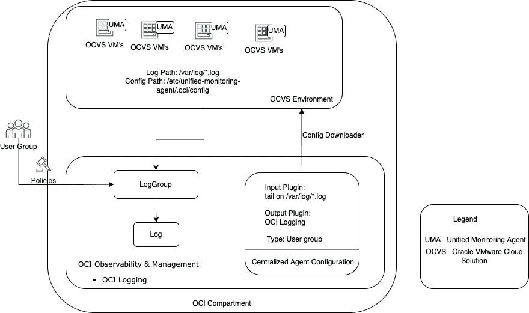
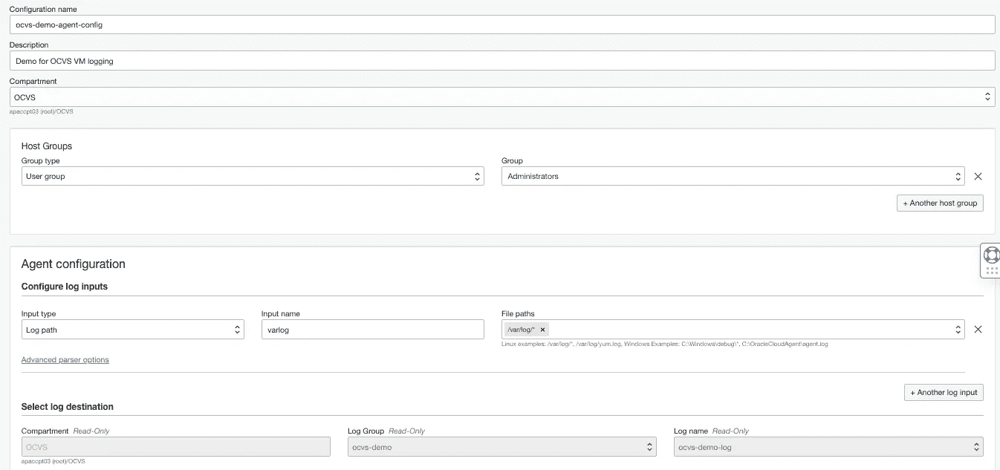
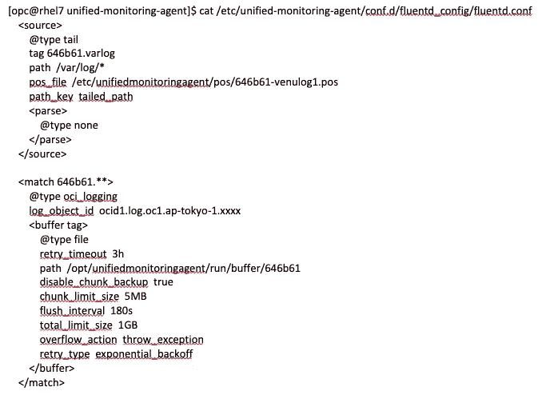

# OCI 登录 Oracle 云 VMware 解决方案(OCVS)虚拟机

> 原文：<https://medium.com/oracledevs/oci-logging-on-oracle-cloud-vmware-solution-ocvs-virtual-machines-81df68d5c642?source=collection_archive---------5----------------------->


在本文档中，我们将定义为 Oracle 云 VMware 解决方案(OCVS)虚拟机启用 Oracle 云基础架构(OCI)日志记录所需的步骤。

对这些 OCI 服务的一点介绍:

> **OCI 日志记录:**OCI 日志记录服务为您租赁的所有日志提供了一个高度可扩展和完全可管理的单一界面。
> 
> **OCVS:** Oracle Cloud VMware 解决方案允许您在 Oracle Cloud Infrastructure 中创建和管理 VMware 支持的软件定义的数据中心(SDDCs)。

对于这个用例，我们将使用 OCI 日志记录的自定义日志功能。其工作方式如下所述:

1.  配置 OCI 身份和管理(IAM)用户、用户组和必需的策略。
2.  配置从 OCVS SDDC 资源到甲骨文服务网络(OSN)的连接
3.  从 OCI 控制台定义代理配置，这为您提供了一种集中体验，让您可以轻松配置要在您的虚拟机群中接收的自定义日志。
4.  在所有 OCVS 虚拟机上安装统一监控代理。代理从您的应用或系统发出日志的本地目录中提取日志。

尽管有一些文档可以实现这一点，但根据我的经验，还是有一些细微的变化。



Use Case Details

# 配置 OCI 身份和管理(IAM)用户、用户组和必需的策略。

统一监控代理使用/etc/unified-monitoring-agent/。oci/config 对日志进行身份验证并将其接收到 oci 日志记录中。

我不会详细介绍[如何创建用户和用户组](https://docs.oracle.com/en/cloud/paas/integration-cloud/oracle-integration-gov/create-oci-group-and-users-gov.html)，但是需要的必要策略有:

> 允许组<user_group_name>在租用中使用日志内容
> 允许组< user_group_name >在隔离专区<隔离专区名称>中使用日志内容</user_group_name>

# 配置从 OCVS SDDC 资源到甲骨文服务网络(OSN)的连接

此步骤帮助您使用服务网关配置从 SDDC 资源到 Oracle 服务网络(OSN)的连接。服务网关允许您的 SDDC 资源私下访问特定的 Oracle 服务，而不会将数据暴露给公共互联网。

导航至 *OCI 控制台- >混合- >软件定义的数据中心- >配置与 Oracle 服务网络的连接*

下面是该工作流页面的注释，供您参考:

> *该工作流程自动进入 SDDC 工作量 CIDR。*
> 
> *该工作流确定了从 NSX Edge 上行链路 1 VLAN 到 Oracle 服务网络的路由要求。如果没有连接到 VCN 的服务网关，工作流会帮助您创建一个。*
> 
> *最后，创建或更新任何缺失的路由表、规则或网络安全组(NSG)。*

**注:**

我不是 VMware 专家。根据我对 SDDC 工作负载的理解，CIDR 是 OCVS 虚拟机的逻辑网络。虚拟机从这里获得它们的 IP。NSX 边缘上行链路 1 用于 VMware SDDC 和 Oracle 云基础架构之间的通信。启用服务网络工作流负责配置路由等。如上所述。

# 从 OCI 控制台定义代理配置

此步骤支持集中管理代理配置。

> *导航至可观察性&管理- >记录- >日志组:创建一个日志组名称(示例“ocvs-demo”)*
> 
> *导航到可观察性&管理- >日志- >创建定制日志:创建一个日志名(例如“ocvs-demo-log”)并将其添加到上一步创建的日志组*
> 
> *导航到可观察性&管理- >记录- >代理配置:创建一个代理配置(示例 ocvs-demo-agent-config)*

> *见下图并配置数值。*



OCI Centralized Agent configuration

# 在所有 OCVS 虚拟机上安装统一监控代理

为了测试这一点，我使用 vSphere client 创建了一个 RHEL 7 虚拟机，然后按照以下步骤操作:

1.  下载适合您的平台的 RPM，并使用此处[提到的说明](https://docs.oracle.com/en-us/iaas/Content/Logging/Concepts/agent_management.htm#installing_the_agent__existing_instances_install)在 OCVS 虚拟机上安装。

对于 RHEL 7，我遵循以下步骤:

> wget[https://object storage . us-phoenix-1 . Oracle cloud . com/n/axmjwnk 4 dzjv/b/unified-monitoring-agent-ol-bucket/o/unified-monitoring-agent-ol-7-0 . 1 . 1 . rpm](https://objectstorage.us-phoenix-1.oraclecloud.com/n/axmjwnk4dzjv/b/unified-monitoring-agent-ol-bucket/o/unified-monitoring-agent-ol-7-0.1.1.rpm)
> 
> sudo yum install-y unified-monitoring-agent-ol-7–0 . 1 . 1 . rpm

确保这些服务正在运行:

> systemctl 状态统一监控代理服务
> 
> systemctl 状态统一监控代理配置下载器服务
> 
> systemctl 状态统一监控代理配置下载器定时器
> 
> systemctl 状态统一-监控-代理 _ 重启程序.路径

查看每个服务的状态:Loaded 和 Active 是合适的状态。更多细节请参考此[文件](https://docs.oracle.com/en-us/iaas/Content/Logging/Reference/agent_troubleshooting.htm#agent_troubleshooting_linux__systemdunits)。

2.为正在运行的实例配置用户 API 密钥。要生成用户 API 密钥，请遵循[如何生成 API 签名密钥](https://docs.oracle.com/en-us/iaas/Content/API/Concepts/apisigningkey.htm#two)中描述的说明。

*   **(Linux)步骤 2a** 。放置了”。oci”目录及其在/etc/unified-monitoring-agent 下的内容。
*   **(Windows)步骤 2a** 。对于 Windows，有一些不同的步骤，因此请确保遵循适当的步骤。创造了”。oci "文件夹及其目录 C:\oracle_unified_agent 中的内容。

3.按照[在 Oracle 云基础设施 CLI 配置文件](https://docs.oracle.com/en-us/iaas/Content/Functions/Tasks/functionsconfigureocicli.htm#Create_a_Profile_in_the_Oracle_Cloud_Infrastructure_CLI_Configuration_File)中创建概要文件中描述的说明，在下一步中创建带有修改的配置文件。

4.按照[中的步骤在 Oracle 云基础架构 CLI 配置文件](https://docs.oracle.com/en-us/iaas/Content/Functions/Tasks/functionsconfigureocicli.htm#Create_a_Profile_in_the_Oracle_Cloud_Infrastructure_CLI_Configuration_File)中创建配置文件后，确保将该部分的配置文件( *<配置文件名称>* )命名为“UNIFIED_MONITORING_AGENT”。
以下是统一监控代理用于服务身份验证的配置示例:

> [默认]
> 
> [统一 _ 监控 _ 代理]
> user=ocid1.user.region..AAA…
> fingerprint =*<cert fingerprint>*
> key _ file =/path/to/OCI folder/。OCI/private . PEM
> tenancy = ocid 1 . tenancy . region..AAA…
> region =*<instances region>*
> pass _ phrase = " pashphrase 1234 "

**注意:**缺省配置文件也是需要的，否则你会遇到**DefaultProfileDoesNotExistError**

我建议在放置。oci 配置文件夹在其位置/etc/unified-monitoring-agent/

> systemctl 重新启动统一监控代理服务

5.确保您可以到达记录摄取端点，请将所有端点[都转到此处](https://docs.oracle.com/en-us/iaas/api/#/en/logging-dataplane/20200831/)。我正在测试下面的东京地区端点。

```
$ nc -zv ingestion.logging.ap-tokyo-1.oci.oraclecloud.com 443
```

稍等片刻，您应该会看到下面的 fluentd 配置从我们在前面的步骤中创建的中央代理配置中下载。



# 核实

登录 *OCI 控制台- >可观察性&管理- >日志记录-><your _ log _ name>*，应该会看到日志传过来。

如果您还没有注册，现在就可以[注册 Oracle 云免费层帐户](https://signup.cloud.oracle.com/?language=en)。如果你对如何开始学习 OCI 感兴趣，注册是第一步，没有必要跟着这篇文章走。

如果你对甲骨文开发人员的行为感到好奇，或者想问一个问题，[加入我们的公共 Slack 频道](https://bit.ly/odevrel_slack)！