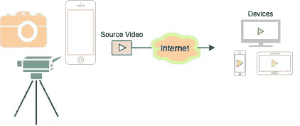
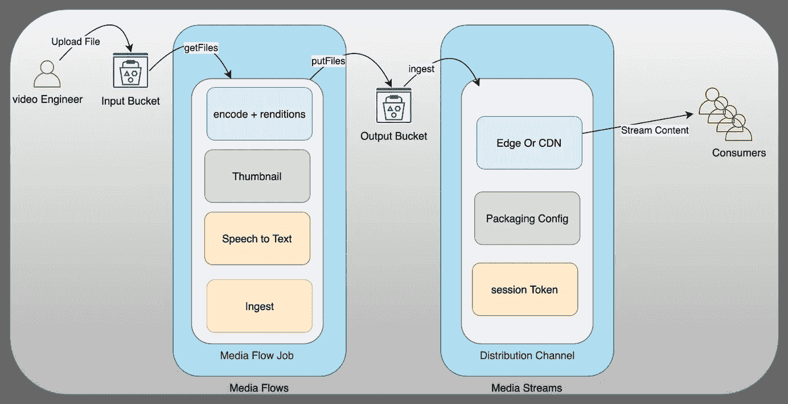
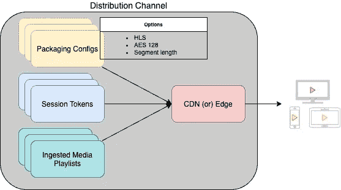

# OCI 媒体服务-简介

> 原文：<https://medium.com/oracledevs/oci-media-services-introduction-970308af5bc8?source=collection_archive---------0----------------------->

甲骨文云基础设施(OCI)提供了两款新产品，一款通过“OCI 媒体流”将视频编码和转码为不同的格式副本、容器和格式一旦视频被处理，你可以通过其他新产品，OCI 边缘位置或 CDN 使用“OCI 媒体流”OCI 媒体服务是低成本、可扩展、人工智能集成、丰富的 API 驱动的服务。

基于视频的分析应用服务已经成为商业和个人生活不可或缺的一部分。5G 和光纤互联网连接在家里变得越来越普遍，但相机设备为一个短视频长度产生了大量数据，无法直接传输给更广泛的观众。除了数据流，视频内容分析对于验证内容是否适合观众、检测视频中的对象、视频中显示的文本以及音频转录也变得至关重要。



**OCI 媒体流:**基于工作流的视频处理服务，将视频文件编码或转码为不同的编解码器和容器，生成缩略图，并集成 OCI 人工智能语音、人工智能语言和人工智能视觉服务。工作流由最小的工作“任务”组成。

视频被放入 OCI 对象存储桶，媒体工作流任务将提取文件进行代码转换，并使用核心任务处理文件。所有结果文件被转移到 OCI 对象存储桶。


Architecture

任务是离散的；然而，每一个都有需要满足的先决条件。例如，如果不从对象存储中获取文件，代码转换任务就无法进行。用配置定义的一组组合任务称为“**媒体工作流**“**媒体工作流作业**”是媒体工作流的实例，其利用作为媒体工作流作业参数提供的输入文件来运行定义的任务。

媒体工作流程可以包含以下任务:

**获取文件** —将文件从 OCI 对象存储桶获取到 OCI 媒体流服务。

**转码** —文件被转码为请求的编解码器&容器。有三种不同类型的转码选项:

1.  *标准代码转换* —标准参数用于平衡质量和速度。
2.  *速度优化* —代码转换经过优化，输出内容经过优化，可快速传送内容。
3.  *质量优化* —转码参数专注于带来最佳质量的输出。

**转录** —提取音频，发送给 OCI AI 语音服务，取回带有语音转文本内容的 JSON。

**visionDetection** —从视频中提取帧，传输给 OCI AI 视觉服务，通过物体检测取回 JSON。

**缩略图** —从配置了尺寸的视频中生成的缩略图。

**摄取** —如果转码任务创建 OCI 媒体流支持的文件，则有效。例如，代码转换创建 HLS 打包对于接收到 OCI 媒体流中的分发渠道是有效的。

**putFiles** —转码和缩略图任务生成的所有输出文件都存储回 OCI 对象存储器。



Components of OCI Media Services

媒体工作流程使用 JSON 进行管理，并且可以在此处找到的[指令的帮助下进行访问。](https://docs.oracle.com/en-us/iaas/Content/dms-mediaflow/media-flow-json-modal.htm)

下面是构建带有任务定义的媒体工作流和运行媒体工作流作业的示例代码。

Media Flow Python Sample Code

Java 示例代码[https://www.oracle.com/cloud/media-flow/](https://www.oracle.com/cloud/media-flow/)

在视频方面，OCI 媒体服务的关键元素是每个视频，其输出可以注册到 OCI 媒体服务以获得唯一的资产 ID。用户可以将资产映射到父子关系以简化操作。

在 putFiles 任务中，有一个通过“register metadata”:true 来传达是否需要资产注册的选项

**OCI 媒体流:**通过 CDN 或 OCI 边缘位置，使用 HTTP 技术(HLS/Dash)传送由 OCI 媒体流会话令牌授权的媒体内容。内容主要通过 OCI 媒体流进行处理，并作为输入提供给 OCI 媒体流。OCI 媒体流在服务中有 Akamai CDN 集成选项；然而，其他 cdn 也适用于 OCI 媒体流。

1.  分发渠道—它是一个具有 CDN 或 Edge 配置定义的 HTTP 流端点。
2.  打包—定义内容需要如何打包以便交付，例如该段需要在 HLS 流中存在多少秒，使用 AES128 加密。
    对于 AES 128 对称加密，密钥可以是 Oracle 管理的或客户管理的密钥。
3.  摄取—获取提供的主播放列表以验证其子内容，并使其为即时打包做好准备。这仅将主播放列表作为输入，否则将出错。后处理，它产生一个资产 id。
4.  会话令牌—一个字母数字值，提供对通过 OCI 媒体流传输的特定视频的访问。会话令牌的有效期最长可达 24 小时，超过该期限后需要生成新的会话令牌。

一个分发渠道可以有多个打包配置(例如，一个采用 AES128 加密，另一个不采用 AES128 加密)，以及多个摄取的视频。要回放视频，需要使用资产 id 和打包配置 ID 作为参数来生成会话令牌。



Media Streams Components

下面是一个示例代码，用于创建媒体流组件，接收由媒体流产生的资源，并生成用于回放的 URL。*注意:生成的 URL 可以在 HLS 播放器上工作，如 video.js 和 Safari web 浏览器。*

Java 示例代码:【https://www.oracle.com/cloud/media-streams/ 

**IAM 政策**

OCI 媒体服务是一个平台即服务，客户需要授权访问媒体服务，以代表他们与其他相关服务(如 OCI 保险库或 OCI 对象存储)一起工作，以使媒体服务正常工作。

确保 [OCI IAM 政策概念](https://docs.oracle.com/en-us/iaas/Content/Identity/Concepts/policies.htm)与以下内容一起应用。

要授予隔离专区读取对象存储的权限，请在您的租用中创建此策略:

```
Allow service mediaservices to read object-family in compartment <compartment_name>
```

要允许媒体流读取媒体元数据，请在您的租用中创建此策略:

```
Allow service mediaservices to read media-family in compartment <compartment_name>
```

**结论**

媒体和娱乐是一个不断发展、不断创新、竞争激烈的行业。许多初创公司正在通过预算有限的基础开发产生巨大的创新浪潮。

OCI 媒体服务的价格极具竞争力，同时以一种简单的方式为媒体应用程序开发者提供 OCI 人工智能集成的广泛优势。

**参考文献**

 [## MediaServicesClient - oci 2.81.0 文档

### 使用媒体服务 API 来配置媒体工作流程和运行媒体流作业，创建分发渠道，摄取…

docs.oracle.com](https://docs.oracle.com/en-us/iaas/tools/python/2.81.0/api/media_services/client/oci.media_services.MediaServicesClient.html)  [## com.oracle.bmc.mediaservices

### 编辑描述

docs.oracle.com](https://docs.oracle.com/en-us/iaas/tools/java/2.42.0/com/oracle/bmc/mediaservices/package-frame.html) [](https://hls-js.netlify.app/demo/) [## hls.js 演示

### 在所有支持的浏览器中测试你的 HLS 流(Chrome/Firefox/IE11/Edge/Safari)。高级控件可从以下网址获得…

hls-js.netlify.app](https://hls-js.netlify.app/demo/)