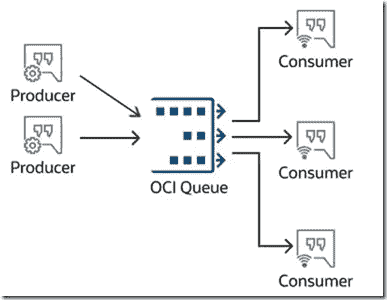

# OCI 队列——简单、强大、重载、可靠的解耦

> 原文：<https://medium.com/oracledevs/oci-queue-simple-powerful-heavy-duty-reliable-decoupling-ee0f8dbc51ad?source=collection_archive---------0----------------------->

新的 OCI 队列服务提供了一个简单的产品:将消息发布到持久存储中，并允许消费者从该存储中检索这些消息——最老的消息优先(FIFO)。

OCI Queue — multiple independent producers and multiple mutually exclusive fully decoupled consumers.

与 OCI 队列的交互可以通过 REST API 调用或通过 STOMP 协议(简单的(或流)面向文本的消息传递协议)来完成。跺脚…