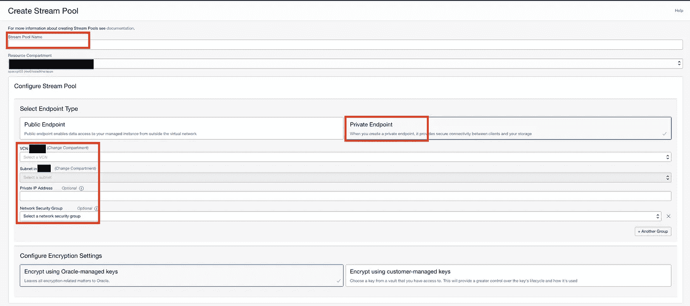
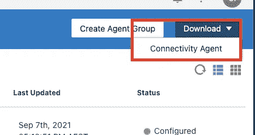

# OCI 流媒体—使用 ATP、OIC 和 Kafka connect 创建生产者/消费者使用案例

> 原文：<https://medium.com/oracledevs/oci-streaming-create-producer-consumer-use-case-using-atp-oic-and-kafka-connect-e5be254edea3?source=collection_archive---------0----------------------->

# 介绍

在本文中，我将解释如何使用 Oracle 云基础设施(OCI)流服务来创建系统之间的集成。我将在 OCI 流中创建一个流，以接收来自自治事务处理(ATP)表的数据(当新记录插入表中时)，Oracle Integration Cloud (OIC)汇集该流并使用该消息。我还使用 Oracle Kubernetes Engine (OKE)和 Oracle Container Registry (OCIR)来部署 Kafka connect。这是一个非常简单的用例，您可以将这个解决方案扩展到几个真实的用例。

# 体系结构

在这个架构中，我已经在私有网络中部署了所有服务(您可以在公共访问中使用 ATP 和流实例，但这是一个更安全的架构。这完全取决于您的用例)。


当您在数据库表(在我们的例子中是 ATP 数据库)中插入新记录时，Kafka source connector 将挑选记录并将其放入 OCI 流中。然后，OIC 池集成将使用 OCI 流中的消息(使用 OIC 连接代理。OIC 流适配器池功能仅支持使用 OIC 连接代理)。

# 履行

要实现此架构，我们应该在 OCI 租赁中创建以下服务和部署:

*   创建隔间
*   配置网络(数据库、流、连接代理和 Oracle Kubernetes 集群的子网以及它们之间的所有防火墙规则)。
*   创建 IAM 策略和组。
*   提供仅具有私人访问权限的自治事务处理数据库。
*   仅通过私有访问设置 OCI 流池。
*   创建 Kafka 连接配置
*   供应 Oracle Kubernetes 集群。
*   提供 OIC 实例。
*   供应计算实例并执行 OIC 连接代理。
*   构建 docker 容器映像以将记录接收到 OCI 流(ATP 表中的池)并在 OCI 容器注册表中推送容器。
*   使用上一步中创建的容器在 OKE 中创建部署。
*   在伊斯兰会议组织中建立一体化以汇集 OCI 流。
*   测试端到端解决方案。

我不打算在本文中详细解释所有上述步骤，我将只讨论我在本文中实现的重要注意事项和特定配置(与 OKE 中的部署、流配置和 OIC 集成相同)。你可以在 OCI 文档中找到其他信息。

让我们开始构建这个用例。

## ***创建网络***

我假设您已经有了一个 OCI 租约，并创建了自己的区间和网络基础设施(根据架构)。这是我在这个用例中使用的简单网络架构。


*   **db-private-subnet** 托管 ATP 数据库。
*   **app-private-subnet** 托管 OIC 连接代理和 OCI 流。
*   **节点私有子网**托管 OKE 工作节点。
*   **lb-public-subnet** 托管公共负载平衡器(你不需要它来实现这个架构)。
*   **mgmt-subnet** 托管与堡垒主机相同的公共实例，以访问私有网络中的服务(您可以使用 OCI 堡垒服务代替)。

请记住，您需要有安全列表或网络安全组(NSG)规则，以允许 OKE 工作节点访问 ATP 数据库和 OCI 流，以及 OIC 连接代理访问 OCI 流。

例如，您需要在 ATP NSG 中遵循以下规则，以允许应用子网在端口 1522 上访问数据库。


并且，遵循流 NSG 中的规则，以允许 OKE 工作节点和 OIC 连接代理访问端口 9020 上的流。


## 供应 ATP 数据库

在 db-private-subnet(仅可在 VCN 境内访问)内为 ATP 实例预配专用端点。


使用 SQL Developer 连接到数据库(您可以在 Bastion 主机上使用端口转发来访问私有子网中的数据库)，然后执行以下 SQL 命令来创建 DB 和表。

```
CREATE USER StreamingDemo IDENTIFIED BY "xxxxxxx";GRANT CONNECT, RESOURCE TO StreamingDemo;GRANT UNLIMITED TABLESPACE TO StreamingDemo;CREATE TABLE Users(ID NUMBER(10,0) GENERATED BY DEFAULT ON NULL AS IDENTITY,USERNAME VARCHAR2(50) NOT NULL,FIRST_NAME VARCHAR2(50) NOT NULL,MIDDLE_NAME VARCHAR2(50),LAST_NAME VARCHAR2(50) NOT NULL,AGE NUMBER(5,0) DEFAULT 0 NOT NULL,CREATED_ON TIMESTAMP(9) NOT NULL,CONSTRAINT TEST_PK PRIMARY KEY(ID)ENABLE);
```

您可以使用您喜欢的任何用户名和任何表结构(但是您需要在以后相应地更改其他配置)。

## 设置 OCI 流池

导航到分析和人工智能，并在 OCI 控制台的消息选项卡下选择流。您首先需要创建一个具有私有连接的流池。



输入名称并为流池选择 VCN、子网和 NSG 后，选择“显示高级选项”并为此池选中“自动创建主题”选项。使用此选项，在创建 Kafka 源连接后，流实例将自动在池中创建。您也可以更新分区数量和保留期。


在配置流池后，您需要捕获该池的 Kafka 连接设置。在流池详细信息页面中，选择“资源”选项卡中的“Kafka 连接设置”选项，并捕获引导服务器、SASL 连接设置中的用户名、安全协议和安全机制。


此外，您需要为您的用户生成认证令牌，并将其用作 Kafka 连接密码。为此，在 OCI 控制台中导航到“用户设置”,选择“身份验证令牌”、“生成新令牌”和“捕获令牌”。


## 创建 Kafka 连接配置

OCI 流媒体与大多数 Kafka APIs 兼容，允许您使用为 Kafka 编写的应用程序向流媒体服务发送消息和从流媒体服务接收消息，而无需重写代码。

流还可以利用 Kafka Connect 生态系统直接与外部源(如数据库、对象存储或 Oracle 云上的任何微服务)进行交互。Kafka connectors 可以轻松地自动创建、发布和交付主题，同时利用流媒体服务的高吞吐量和耐用性。

Kafka connect 允许您构建连接器，将 Apache Kafka 兼容的流服务与其他应用程序和数据系统(在我们的例子中是 ATP 数据库)集成在一起。我们有两种类型的卡夫卡连接:源和汇。

要将 Kafka 连接器与 OCI 流配合使用，您需要创建 Kafka Connect 配置。为此，在 OCI 控制台中导航到“流”,然后在菜单栏中选择“Kafka Connect 配置”。然后选择“创建 Kafka 连接配置”。这三个压缩主题旨在由 Kafka Connect 和 Streaming 用来存储配置和状态管理数据，而不应用于存储您的数据。


## 调配 OKE 集群

在这一部分中，您需要在 OCI 提供一个 Kubernetes 集群。您可以使用 Oracle managed Kubernetes engine(OKE)来配置集群。我假设您已经供应和配置了您的 OKE 集群。


## 构建 docker 容器

在构建 docker 映像之前，您需要首先下载依赖项。

*   下载 JDBC 驱动程序并解压到 libs 文件夹([https://www . Oracle . com/database/technologies/app dev/JDBC-downloads . html](https://www.oracle.com/database/technologies/appdev/jdbc-downloads.html))
*   下载 Kafka connect JDBC 连接器，解压到 kafka-connect-jdbc 文件夹([https://www . confluent . io/hub/confluent Inc/Kafka-connect-JDBC](https://www.confluent.io/hub/confluentinc/kafka-connect-jdbc))
*   下载 ATP Wallet 文件并提取到 Wallet 文件夹中


创建 Kafka 源连接属性文件(connect-distributed . properties)。使用您在设置 OCI 流池和 Kafka connect 配置期间捕获的信息来更新此属性文件。

```
group.id=*atp-kafta-source-connect-group*
bootstrap.servers=**<OCI Streaming Pool FQDN>**:9092
sasl.mechanism=PLAIN
security.protocol=SASL_SSLsasl.jaas.config=org.apache.kafka.common.security.plain.PlainLoginModule required username="**<SASL Connection Username>**" password="**<User Auth Token>**";producer.sasl.mechanism=PLAIN
producer.security.protocol=SASL_SSLproducer.sasl.jaas.config= org.apache.kafka.common.security.plain.PlainLoginModule required username="**<SASL Connection Username>**" password="**<User Auth Token>**";consumer.sasl.mechanism=PLAIN
consumer.security.protocol=SASL_SSLconsumer.sasl.jaas.config= org.apache.kafka.common.security.plain.PlainLoginModule required username="**<SASL Connection Username>**" password="**<User Auth Token>**";config.storage.replication.factor=1
config.storage.partitions=1
config.storage.topic=**<Kafka Connect Configuration Config>**status.storage.replication.factor=1
status.storage.partitions=1
status.storage.topic=**<Kafka Connect Configuration Status>**offset.storage.replication.factor=1
offset.storage.partitions=1
offset.storage.topic=**<Kafka Connect Configuration Offset>**offset.flush.interval.ms=10000
offset.flush.timeout.ms=5000key.converter=org.apache.kafka.connect.storage.StringConverter
value.converter=org.apache.kafka.connect.json.JsonConverter
key.converter.schemas.enable=false
value.converter.schemas.enable=trueinternal.key.converter=org.apache.kafka.connect.json.JsonConverterinternal.value.converter=org.apache.kafka.connect.json.JsonConvertertask.shutdown.graceful.timeout.ms=10000
```

创建 Dockerfile 文件

我正在使用 debezium 基础映像来构建 docker 文件(有几个选项来构建您的映像，如果您喜欢，您可以选择不同的方法)。

```
FROM debezium/connect:0.10
USER root
RUN mkdir /wallet
USER kafka
COPY libs/* /kafka/libs/
COPY kafka-connect-jdbc/lib/* /kafka/libs/
COPY wallet/* /wallet/
COPY connect-distributed.propertes /kafka/config/connect-distributed.properties
```

然后，使用以下命令构建 docker 映像(使用 docker build)

```
*docker build -t atp-kafka-source-connect:v1* *.*
```

您可以通过在本地机器上使用以下命令创建一个容器来本地测试您的 docker 映像(请记住，要进行此测试，您需要从本地机器连接到端口 9020 上的流池，您可以通过使用端口转发来实现这一点)。

(*注意:在执行此命令之前，请更新 Kafka 流池端点和 Kafka connect 配置 OCID)。

```
*CONNECT_CONFIG_ID=****<OCID of Kafka connect configuration>****CONFIG_STORAGE_TOPIC=$CONNECT_CONFIG_ID-config
OFFSET_STORAGE_TOPIC=$CONNECT_CONFIG_ID-offset
STATUS_STORAGE_TOPIC=$CONNECT_CONFIG_ID-status**docker run -it --rm --name atp-kafta-source-connect -p 8083:8083 \
-e GROUP_ID=atp-kafta-source-connect-group \
-e BOOTSTRAP_SERVERS=****<Kafka Streaming pool FQDN>****:9092 \
-e CONFIG_STORAGE_TOPIC=$CONFIG_STORAGE_TOPIC \
-e OFFSET_STORAGE_TOPIC=$OFFSET_STORAGE_TOPIC \
-e STATUS_STORAGE_TOPIC=$STATUS_STORAGE_TOPIC \
-v `pwd -P`/atp-kafka-source-connect.properties:/kafka/config/connect-distributed.properties \
atp-kafka-source-connect:v1*
```

我不打算在本地机器上测试这个映像，稍后我将在 Kubernetes 集群中部署和测试这个映像。

将 docker 映像推送到 OCIR 存储库(首先在 OCIR 创建 oss-kafka 连接器私有存储库)


在下一部分中，我将把图像推送到 OCI 容器存储服务(OCIR)。您可以使用以下命令登录 OCIR，标记映像并将映像推送到 OCIR(在运行脚本之前相应地更新 OCIR 用户名、密码、区域和租赁)。

```
*docker login mel.ocir.io
Username:* ***<OCIR User - OCI username>*** *Password:* ***<Auth token>****docker tag atp-kafka-source-connect:v1* ***<Region>****.ocir.io/****<Tenancy>****/oss-kafka-connect:v1*docker push ***<Region>****.ocir.io/****<Tenancy>****/oss-kafka-connect:v1*
```

在这一步中，我将配置 Kubernetes 集群。首先，您需要配置您的本地环境来访问 Kubernetes 集群(通过在您的本地环境中创建 Kubeconfig)。

使用以下命令为 Kafka connect 部署和从 Kubernetes 集群到 OCIR 的 Kubernetes secret 创建 Kubernetes 命名空间:

```
*kubectl create namespace oss-kafka-connect**kubectl create secret docker-registry ocir-secret --docker-server=****<Region>****.ocir.io --docker-username='****<Tenancy>****/****<OCIR Username>****' --docker-password='****<Auth Token>****' --docker-email='<Email Address' -n oss-kafka-connect*
```

在 Kubernetes 中创建以下配置映射(此配置映射包含 Kafka connect 属性)。在进入下一步之前，相应地使用 Kafka connect 配置和 OCI 流数据更新配置图。

执行以下命令创建配置映射:

```
*kubectl apply -f atp-kafka-source-connect-configmap.yaml -n oss-kafka-connect*
```

创建 Kubernetes 部署和服务(该服务创建公共负载平衡器，它侦听端口 80 并将请求转发到端口 8083 上 Kubernetes 部署)。在进入下一步之前，相应地使用 Kafka connect 配置和 OCI 流数据更新部署。

执行以下命令在 Kubernetes 集群中创建部署:

```
*kubectl apply -f atp-kafka-source-connect-deployment.yaml -n oss-kafka-connect*
```

在 Kubernetes 集群中部署 Kafka connect 之后，应该为数据库创建连接器配置。您可以使用 Kafka connect REST APIs 在 Kafka connect 实例中创建配置。您需要创建以下 json 文件(更新 ATP 连接名称、数据库密码、主题前缀和您想要加入白名单的表列表),并使用以下 REST API 将配置应用到 Kafka 连接器。

```
*curl -iX POST -H "Accept:application/json" -H "Content-Type:application/json" -d @connector-config.json  http://<Kubernetes deployment load balancer public IP>/connectors*
```

## 提供 OIC 实例

在这一步中，您需要在您的租用中提供一个 OIC 实例。为此，导航到 OCI 控制台中的开发人员服务，并选择应用程序集成选项卡下的集成菜单。然后，您可以在选定的隔离专区中创建新的集成实例。


## 部署 OIC 连接代理

在配置 OIC 实例之后，您需要在一个私有子网(例如 app-private-subnet)中配置一个计算实例。然后，您应该连接到 OIC 实例服务控制台(从 OIC 实例详细信息页面选择“服务控制台”)，导航到集成菜单项下的代理页面。


创建代理组:


下载连接代理 zip 文件，并将该文件传输到计算机。



连接到计算实例并解压缩连接代理文件。更新 InstaleProfile.cfg 文件并更新以下信息:

```
# Required Parameters
# oic_URL format should be [https://hostname:sslPort](https://hostname:sslPort)
oic_URL=[**https://<OIC Instance URL>:<**](https://app-instance-apaccpt03-me.integration.ocp.oraclecloud.com:443)**OIC Instance Port>**
agent_GROUP_IDENTIFIER=**<Agent Group ID>**oic_USER=**<Username>**
oic_PASSWORD=**<Password>**
```

最后，使用以下命令运行连接代理:

```
java -jar connectivityagent.jar &
```

要创建到 OCI 流服务的连接，您需要使用以下命令创建包含 OCI 流证书的密钥库。

```
echo -n | openssl s_client -connect **<OCI Streaming pool endpoint>**:9092 | sed -ne '/-BEGIN CERTIFICATE-/,/-END CERTIFICATE-/p' > app-streaming.certkeytool -keystore app_streaming_truststore.jks -alias OSSStream -import -file app-streaming.cert
```

## 创建 OIC 集成以汇集来自 OCI 流的消息

首先，您需要使用 OCI 流适配器创建一个连接。为此，导航到 OIC 控制台中集成菜单下的连接，并使用 OCI 流适配器创建新连接。


创建连接后，使用 Kafka 连接设置更新以下连接属性


引导服务器: **< OCI 流池端点> :9020**

SASL 用户名: **SASL 连接用户名**

SASL 密码: **<认证令牌>**

信任库: **<上传在前面步骤>** 中创建的密钥库

信任库密码: **<密钥库密码如果存在>**

代理组:**选择在前面步骤**中创建的代理组

最后，测试并保存连接。


最后一步，您需要在 OIC 中创建应用程序驱动的集成，以使用上一步创建的连接来汇集来自 OCI 流的消息。


向集成起点添加连接


选择流、分区和使用者组。


最后选择消息 JSON 结构:


保存并激活集成。

## 测试实现

您可以通过在 ATP 数据库的表中插入新记录来测试这个用例。


如果所有配置都正确，您可以在 OIC 中触发集成


## 结论

这是一个简单的使用案例，说明如何使用 OCI 流来接收和使用消息。您可以将此用例扩展到多个场景，如将 IOT 传感器数据接收到 OCI 流，并使用 OIC 中的集成实例来汇集流和丰富传感器数据。

## 参考

*   [https://docs . Oracle . com/en-us/iaas/Content/GSG/Concepts/baremetalintro . htm](https://docs.oracle.com/en-us/iaas/Content/GSG/Concepts/baremetalintro.htm)
*   [https://blogs . Oracle . com/developer/post/using-Kafka-connect-with-Oracle-streaming-service-and-autonomous-db](https://blogs.oracle.com/developers/post/using-kafka-connect-with-oracle-streaming-service-and-autonomous-db)
*   [https://docs . Oracle . com/en-us/iaas/Content/Streaming/Concepts/Streaming overview . htm](https://docs.oracle.com/en-us/iaas/Content/Streaming/Concepts/streamingoverview.htm)
*   [https://www.confluent.io/product/confluent-connectors](https://www.confluent.io/product/confluent-connectors/?utm_medium=sem&utm_source=google&utm_campaign=ch.sem_br.nonbrand_tp.prs_tgt.kafka-connectors_mt.xct_rgn.apac_lng.eng_dv.all_con.kafka-connectors&utm_term=kafka%20connect%20jdbc&creative=&device=c&placement=&gclid=CjwKCAjw4qCKBhAVEiwAkTYsPJdw7FnEavLvhMW-jIKIxwle6iDPGKUYuVM6P75dLHssW7e5PuPkxRoCQvQQAvD_BwE)
*   [https://docs.oracle.com/en-us/iaas/Content/ContEng/home.htm](https://docs.oracle.com/en-us/iaas/Content/ContEng/home.htm)
*   [https://docs.oracle.com/en-us/iaas/integration/index.html](https://docs.oracle.com/en-us/iaas/integration/index.html)
*   [https://docs . Oracle . com/en/cloud/PAAs/integration-cloud/integrations-user/managing-agent-groups-and-connectivity-agent . html](https://docs.oracle.com/en/cloud/paas/integration-cloud/integrations-user/managing-agent-groups-and-connectivity-agent.html)