# Mendix 中的 OData APIs

> 原文：<https://medium.com/mendix/odata-apis-in-mendix-982c1671fd4a?source=collection_archive---------0----------------------->

OData APIs in Mendix (Banner Image)

## 在过去的几周里，我一直在写关于 REST APIs 以及它们如何在 Mendix 中工作的文章。今天我将讨论一个稍微不同但非常重要的 REST API 类型；奥达塔。

# 是什么让 OData 如此特别？

OData 是 REST API 的一种形式，只是它标准化了 REST API 没有的某些特性。首先，OData 支持查询和过滤请求本身。一旦实现，OData 还会为应用程序数据的更改创建一个功能性审计跟踪。当试图用一句话概括 OData 时:OData 是构建 REST APIs 的最佳实践，因此您可以更好地利用 REST 的功能。

以下是 OData.org 官方网页的摘录，他们用自己的话解释了 OData 是什么:

> *“OData(开放数据协议)是一个由 ISO/IEC 批准的***[*OASIS 标准*](https://www.oasis-open.org/committees/tc_home.php?wg_abbrev=odata) *，它定义了一套构建和使用 RESTful APIs 的最佳实践。OData 帮助您在构建 RESTful APIs 时关注业务逻辑，而不必担心定义请求和响应头、状态代码、HTTP 方法、URL 约定、媒体类型、有效负载格式、查询选项等的各种方法。OData 还提供了跟踪变更、为可重用过程定义函数/动作以及发送异步/批处理请求的指导。”——*[*OData.org*](https://www.odata.org/)**

**OData 数据集可用于其他工具，如 Microsoft Excel 和 Power BI。Mendix 支持以 Atom XML 格式返回数据的 [OData 版本 3](http://www.odata.org/documentation/odata-version-3-0) 和以 JSON & XML 格式返回数据的 [OData 版本 4](http://www.odata.org/documentation) ，这取决于客户端请求的格式。**

# **我们如何在 Mendix 中使用 OData？**

**在 Mendix Studio Pro 中，创建一个 OData API 相对容易。类似于常规的 REST 服务，Studio Pro 也为我们提供了直接从我们的领域模型生成 API 的选项。**

**一旦我们创建了 OData 服务，我们只需将您的应用程序部署到云环境中，就可以将其发布到 Datahub。Datahub 是一个开放的元数据目录，这基本上意味着一旦你在 Datahub 上注册了 OData 服务，你就可以在你的 Mendix 应用程序之间共享数据。它还有助于发现和理解 API 本身。**

**然而，您不必为了在 Mendix 中使用 OData 而使用 Datahub，您仍然可以通过下载 API 本身的$metadata 契约来手动完成。**

**一旦在 Datahub 中注册，将数据集成到另一个 Mendix 应用程序中就像将远程实体(Datahub 注册的 OData 服务)拖放到您的域模型中一样简单。**

**在我写这篇文章的时候，Mendix 刚刚发布了 Studio Pro 9.17.0，它对在 Mendix 中使用 OData 有了一些惊人的新改进，下面是 9.17.0 发行说明的摘录:**

> ***我们在 Studio Pro 中扩展了 OData 功能，允许您使用 OData* *包装服务、API 和数据库，并使构建访问外部数据的连接器* [*变得更加容易。然后可以在*](https://docs.mendix.com/appstore/creating-content/connector-guide-build/) [*数据中心目录*](https://docs.mendix.com/data-hub/data-hub-catalog/) *中轻松发现和使用 OData 服务。新特性包括能够[将非持久实体发布为 OData 资源](](*[*https://docs . mendix . com/ref guide/wrap-services-OData/# npe-published-OData*](https://docs.mendix.com/refguide/wrap-services-odata/#npe-published-odata)*)，以及能够* [*使用微流来定义应该如何检索和存储资源*](https://docs.mendix.com/refguide/wrap-services-odata/#odata-data-sources) *。我们还提供了一个*[*open API*](https://docs.mendix.com/refguide/published-odata-services/#openapi)*契约来方便地* [*测试发布 OData 资源*](https://docs.mendix.com/refguide/wrap-services-odata/#testing) *。***

# **访问 API 文档**

**Mendix 中 OData 的一个非常强大的功能是，一旦您的应用程序部署或运行在本地，您就可以在**您的应用程序的基础 URL**+**'/OData-doc/'**访问您发布的 OData 服务的 API 文档。**

**例如，在端口 8080 上运行的本地应用程序上的 doc 的位置将是:**

**`[http://localhost:8080/odata-doc/](http://localhost:8080/odata-doc/)`**

**对于 OData，OData $元数据契约和 OpenAPI 契约都可以在这里获得。您甚至可以使用 OpenAPI 页面来测试对 API 的 OData 调用。**

# **实践中的 OData**

**下一节将是一个实用指南，介绍如何在您的 Mendix 应用程序中发布 OData API，在 Datahub 上注册该服务，然后在另一个 Mendix 应用程序中作为远程实体使用数据。**

# **场景:**

**假设你创建了一个电子商务 Mendix 应用程序。在您的应用程序中，您有一个包含订单的实体，订单被传递给仓库员工以完成订单并将其发送给客户。当工人在仓库进货时，他们会在 excel 表中对每件产品的存放位置进行分类。目前，仓库从 excel 表中打印出订单，并在自己的 Excel 文档中查找物品的存储位置，这种方式效率很低，而且会降低整个流程的速度。**

**您现有的应用程序包含敏感的客户信息，因此您不想将这些信息暴露给外部仓库员工。您决定创建一个单独的应用程序，允许工人查看订单和完成订单所需的物品，并决定使用 OData 和 Mendix Datahub 共享信息。**

# **从您的领域模型生成 OData API**

**在我们的电子商务应用程序中，我们在域模型中有以下实体:$Order 和$Orderline，它们有一对多的关联。**

**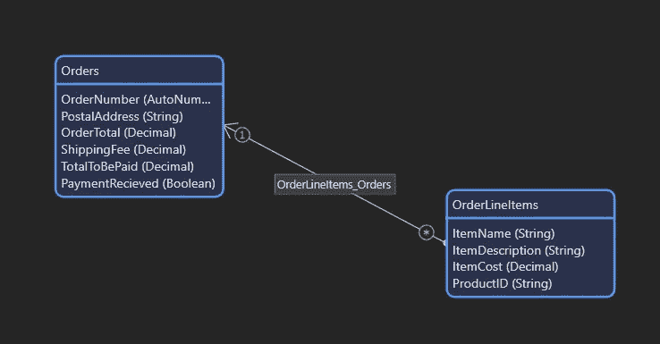**

**当我们右键单击一个实体(在我们的例子中是$Orders)时，它会给我们一个选项“Expose as OData Resource”**

**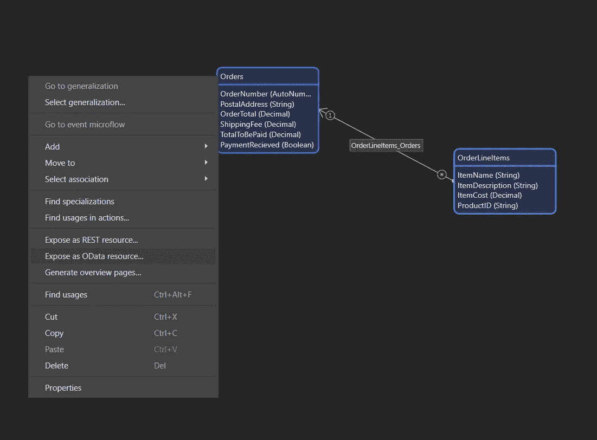**

**当我们单击它时，它会询问我们希望在项目中的什么地方创建新的 API，以及我们希望为资源命名什么。**

**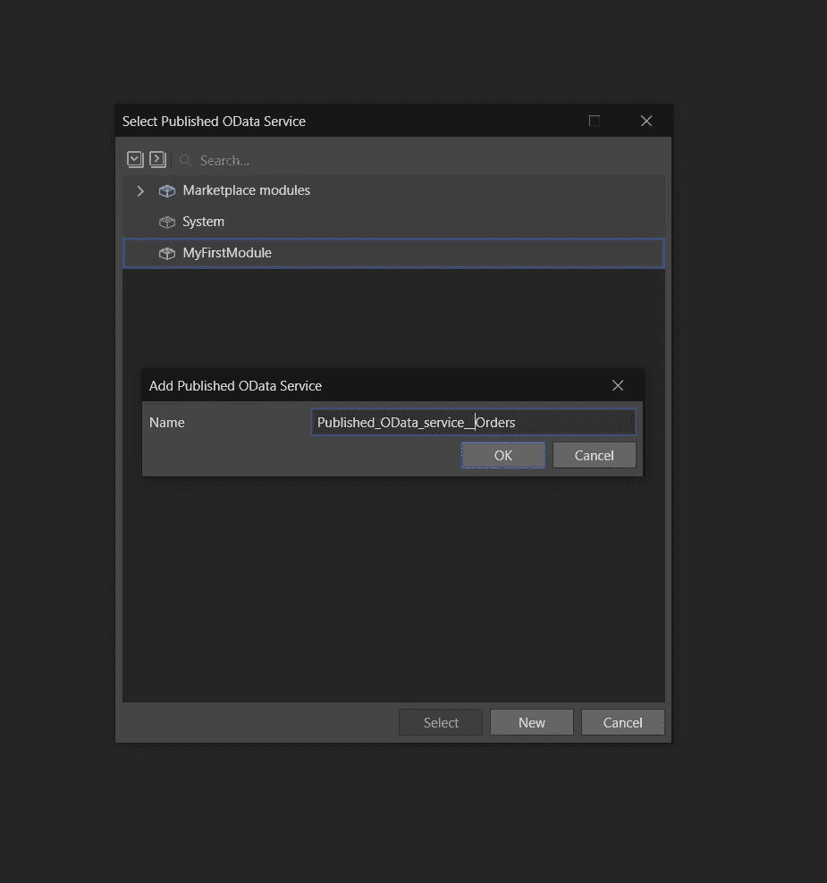**

**然后，我们将自动查看生成的资源并编辑其属性。我们可以让这些保持原样，因为我们只需要仓库员工查看订单信息，他们不应该被允许编辑订单细节。**

**虽然我们没有利用这些特性，但我想我应该指出，Datahub 不再是只读的，除了读取数据之外，您现在还可以插入新记录、更新和删除。**

**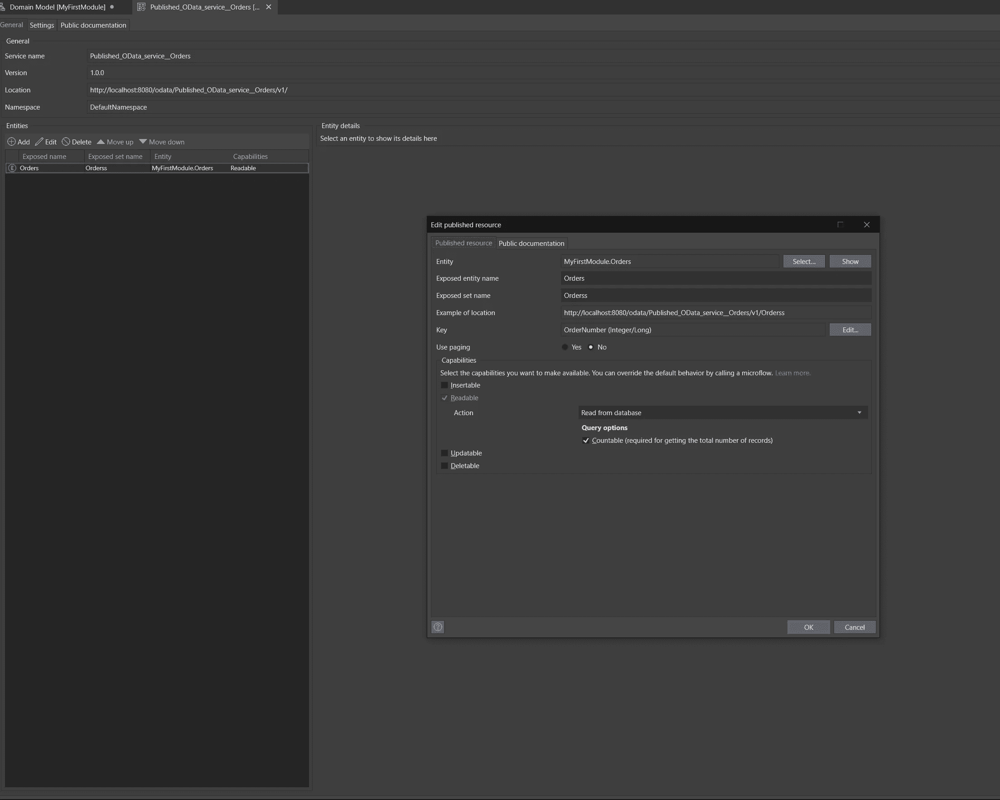**

**然后，我们可以将＄order line 实体添加到资源中，为此，我们可以单击 entities 下的 add 按钮，浏览＄order line 并单击 OK**

**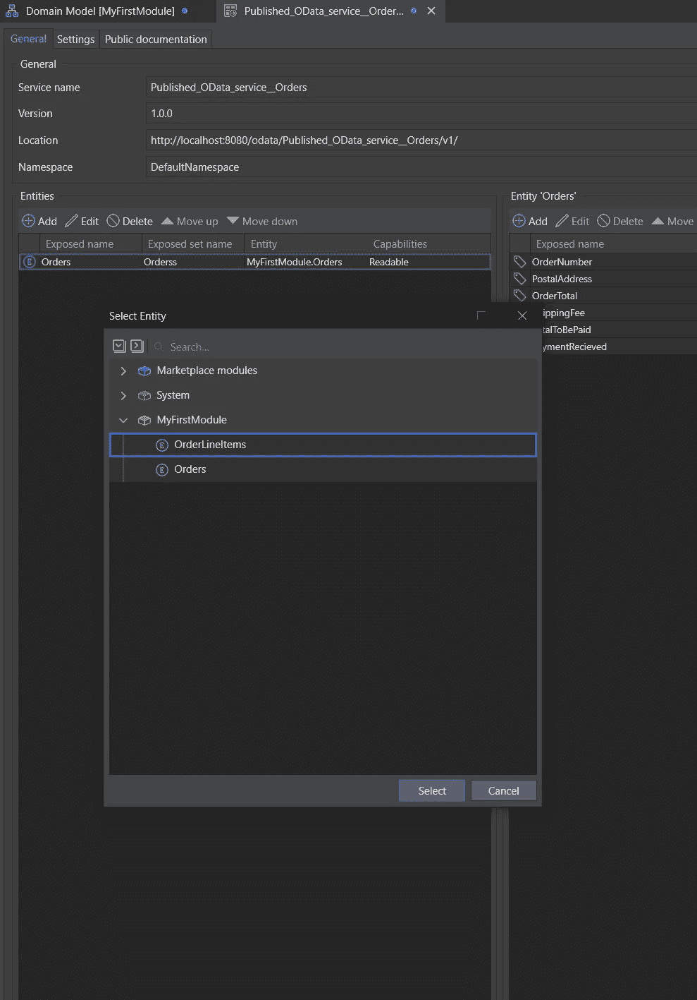**

**一旦我们做了 S **tudio Pro 识别出这些实体是相关的，并询问您是否要发布它们之间的关联**，单击是。**

**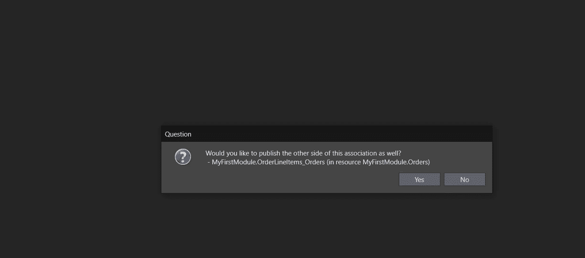**

**一旦我们这样做了，您将会注意到控制台中的一些错误，如下所示:**

**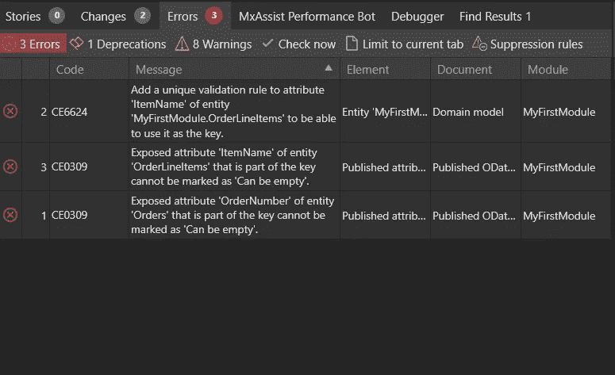**

**我们需要确保$Itemname 和$ OrderNumber 不允许为空，因为它们被用作 API 的键。**

**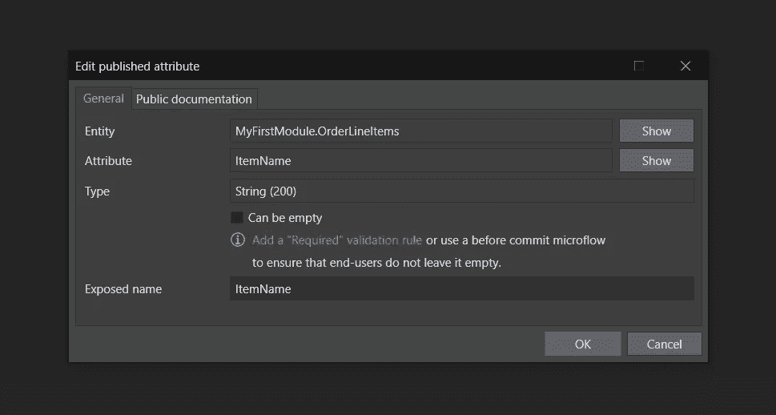**

**我们需要向$ItemName 添加一个惟一性验证规则，这可以在域模型中完成**

**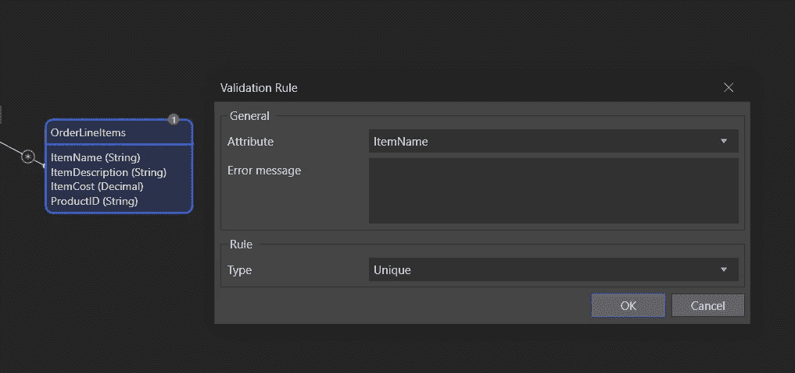**

# **将 OData 资源发布到数据中心**

**这部分真的很简单，只要把你的 app 部署到云环境就可以了！任何人都可以工作，从免费的云到 Mendix 提供的任何其他托管解决方案。**

**您在 Mendix cloud 中部署的每个 OData API 都将自动注册，这意味着您的 API 也将自动更新。这确保了文档总是最新的，并且总是与您想要连接的环境相关。该目录将向您展示在测试、验收和生产中运行的版本，因为我们提供了在 API 上使用语义版本化的能力。**

**如果您没有在 Mendix 云中运行您的应用程序，您可以使用目录 API 在您自己的 CICD 流程中自动注册您的部署。也可以在数据中心目录中手动完成。**

**对于这个例子，我将只部署到 Mendix 免费云。部署应用程序后，您将收到一封来自 Mendix Datahub 的电子邮件，告知您新的 OData 资源已自动注册到目录中。**

**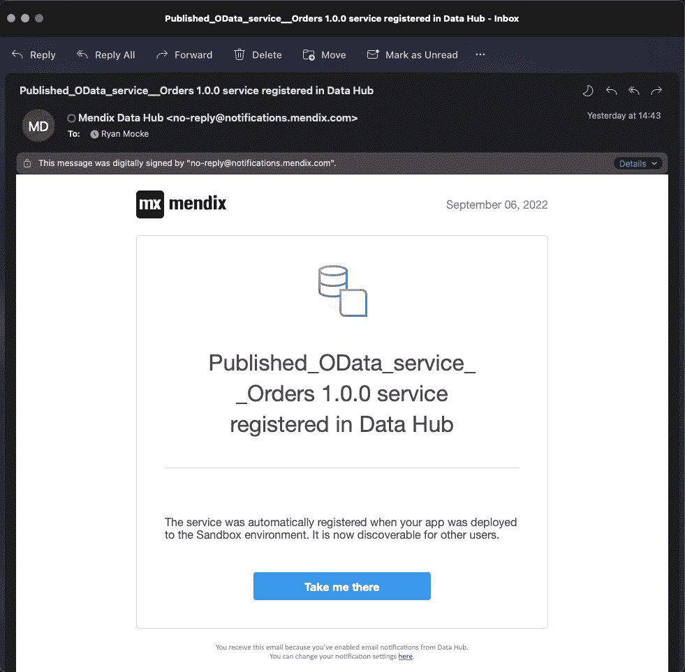**

# **从数据中心消费外部实体**

**在我们的新应用程序(仓库工人的应用程序)中，我们有一个名为 Product 的表**

**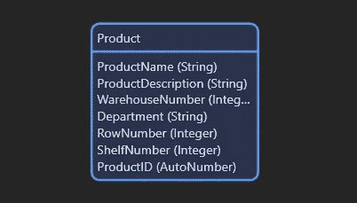**

**我们希望在这个模块中包含我们发布到 Datahub 的$Order 和$Orderline 实体。**

**在域模型中，转到右侧的 Datahub 窗格，搜索您注册的服务的名称(如果您部署到免费云，您将需要在过滤器上启用开发环境)**

**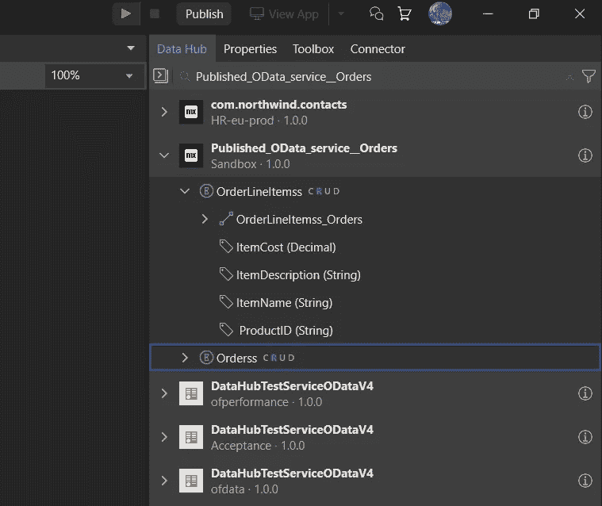**

**找到服务后，只需将两个实体拖到新应用的域模型中，Studio Pro 就会完成剩下的工作。**

**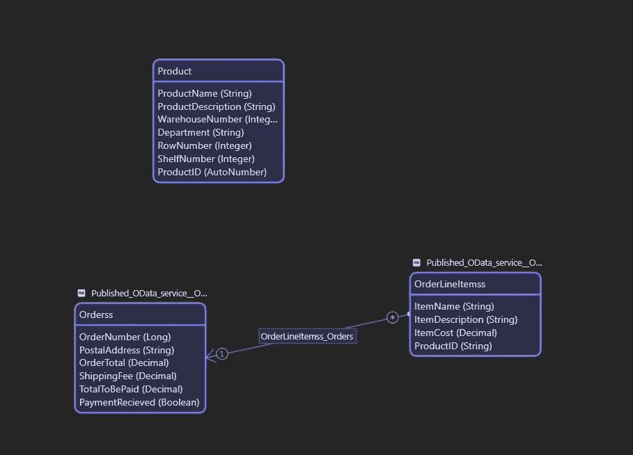**

**您现在可以在您的应用程序中随意使用$order 和$orderline 数据了！干得好！**

# **一些需要考虑的事情**

**重要的是要记住谁应该能够访问你的应用程序中的信息。在任何应用程序中使用远程实体时，请确保检查应用程序的安全性。**

 **[## 已发布的 OData 服务

### 1 简介在 Studio Pro 中，通过将实体添加到已发布的 OData 服务中，可以将实体公开为 OData 资源…

docs.mendix.com](https://docs.mendix.com/refguide/published-odata-services/#security)** 

## **阅读更多**

 **[## 已发布的 OData 服务

### 1 简介在 Studio Pro 中，通过将实体添加到已发布的 OData 服务中，可以将实体公开为 OData 资源…

docs.mendix.com](https://docs.mendix.com/refguide/published-odata-services/)**  **[## OData 查询选项

### 1 简介这是 OData 的查询选项列表。我们目前只支持这里描述的选项。2…

docs.mendix.com](https://docs.mendix.com/refguide/odata-query-options/)** ** [## 证明文件

### OData 是开放数据协议的缩写，是一个开放的协议，允许创建和消费可查询的和…

www.odata.org](https://www.odata.org/documentation/)  [## 入门指南

### OData 的规范几乎涵盖了 RESTful API 的每个方面。但是开始使用 OData 是相当…

www.odata.org](https://www.odata.org/getting-started/) 

*来自发布者-*

如果你喜欢这篇文章，你可以在我们的 [*中页*](https://medium.com/mendix) *找到更多喜欢的。对于精彩的视频和直播会话，您可以前往*[*MxLive*](https://www.mendix.com/live/)*或我们的社区*[*Youtube PAG*](https://www.youtube.com/c/MendixCommunity/community)*e .*

*希望入门的创客，可以注册一个* [*免费账号*](https://signup.mendix.com/link/signup/?source=direct) *，通过我们的* [*学苑*](https://academy.mendix.com/link/home) *即时获取学习。*

有兴趣更多地参与我们的社区吗？加入我们的 [*Slack 社区频道*](https://join.slack.com/t/mendixcommunity/shared_invite/zt-hwhwkcxu-~59ywyjqHlUHXmrw5heqpQ) *。***