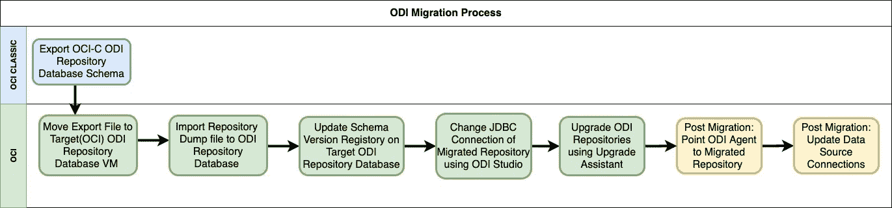
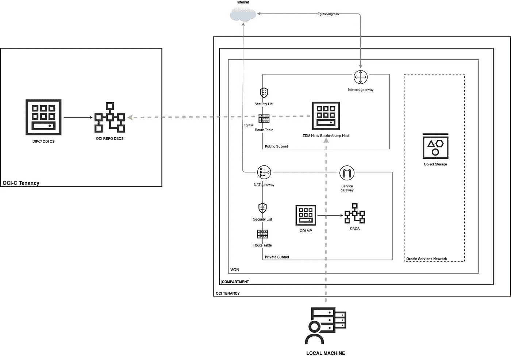
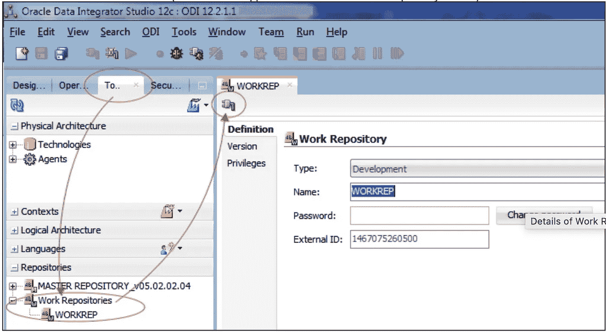
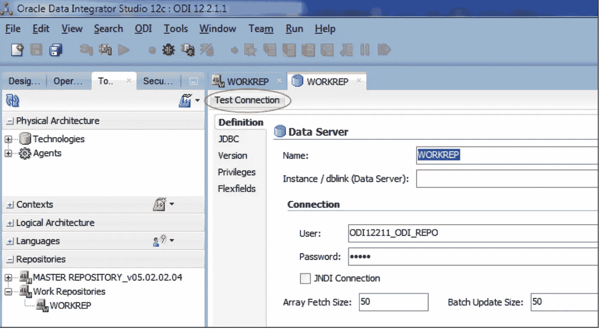

# ODI 迁移到 OCI —基于 Python 的自动化流程

> 原文：<https://medium.com/oracledevs/odi-migration-to-oci-python-based-automated-process-97d282b13e4f?source=collection_archive---------1----------------------->

ODI 代表 Oracle Data Integrator，这是一个全面的数据集成平台，涵盖了所有的数据集成需求:从大容量、高性能的批量加载，到事件驱动的涓流集成流程，再到支持 SOA 的数据服务。

ODI 迁移通常意味着将“主存储库”和“工作存储库”从源环境迁移到目标环境。尽管 ODI Studio 提供了用于导出和导入 ODI 主存储库和工作存储库的工具，但是只有当源和目标实例在相同的 ODI 存储库版本上时，它才起作用。这种方法适用于全新的 ODI 实施，可以将 ODI 工件从较低的环境迁移到较高的环境，但对于 ODI 从内部/OCI 经典/其他云迁移到 OCI 的迁移场景，由于 ODI 版本的差异，我们需要采用数据库存储库迁移方法(如下图所示)。

在这篇博客中，我采用了 OCI-Classic 上的源 ODI 实例，但是如果源是在本地或其他云上，也可以使用这种方法。

ODI “Database Repository Migration” Approach

*注意:-黄色方框是迁移后步骤，将根据客户要求手动执行。*

目前，上述流程中提到的所有步骤都需要手动执行，ODI 没有任何可用的自动化迁移工具。然而，我已经使用 Python 为这种 ODI 迁移方法设计了一个自动化过程。

***为什么要使用这种基于 Python 的自动化流程？***

1.  您只需要提供源和目标环境的详细信息，所有迁移步骤都会自动执行，您可以在很短的时间内迁移许多环境。
2.  您不需要依赖 DBA 来迁移存储库数据库模式，只需拥有 ODI 专业知识就可以完成端到端迁移。

***这个基于 Python 的自动化流程会做什么？***

1.  它将连接到源 ODI 实例，并使用 Oracle 数据泵导出 ODI 资料档案库。
2.  它会将导出转储文件移动到 OCI 上的目标 ODI 实例。
3.  它将创建所需的表空间，并使用 OCI 的数据泵将转储文件导入 ODI 存储库数据库。
4.  它将从源 ODI 资料档案库数据库中获取 SCHEMA_VERSION_REGISTRY 条目，并插入到 OCI 上的目标 ODI 资料档案库数据库中(这是 ODI Upgrade Assistant 所必需的)。
5.  它将运行“ODI 升级助手”,并将迁移的 ODI 资料档案库升级到 OCI 上 ODI 实例的当前版本。

M移植架构

ODI Migration Architecture

如迁移架构中所示，这个基于 Python 的工具可以从本地机器或任何 OCI 计算机上执行，但是它需要 OCI 上的 ZDM/堡垒/跳转主机，该主机可以连接到源和目标 ODI 实例。以下是 ZDM/堡垒/跳跃主机的连接要求。

1.  ZDM/堡垒/跳转主机应该能够在 OCI 和 OCI 的“Oracle”用户上使用 SSH 密钥连接源 ODI 存储库数据库和目标 ODI 存储库数据库
2.  ZDM/堡垒/跳转主机应该能够在源 ODI 库(OCI-C)和目标 ODI 库数据库(OCI)的端口 1521 上建立 SQL 连接。
3.  应该在源 ODI 资料档案库数据库和目标 ODI 资料档案库数据库上配置 Tnsnames.ora。

P基于 ython 的自动化方法

***蟒蛇神器***

*主脚本*

odirepmigration.py :-此主脚本将使用 SSH 连接到源 ODI 资料档案库数据库，创建所需的 Oracle 目录，导出资料档案库模式，将导出文件移动到目标 ODI 资料档案库数据库，创建表空间，将转储文件导入目标 ODI 资料档案库数据库，并将记录插入 SCHEMA_VERSION_REGISTRY。

odiupgrdasst.py :-此主脚本将执行 ODI Upgrade Assistant，并将迁移的 ODI 资料档案库升级到 OCI 上 ODI 实例的当前版本。

*子脚本*

1.  odiconfig.py :-提供源和目标环境所有细节的配置脚本。
2.  odrepopreexport . py:-这是一个必备的导出脚本，将创建 Oracle 目录以进行导出。
3.  odirepoexport.py :-该脚本将运行数据泵导出并生成源 ODI 存储库的 dmp 文件。
4.  odiexpdmpmove.py :-该脚本将导出转储文件移动到目标 ODI 存储库数据库 VM。
5.  odrepopreimport . py:-这是一个必备的导入脚本，将为导入创建 Oracle 目录、用户和临时表空间。
6.  odrepoimport . py:-该脚本将运行数据泵，并将 dmp 文件导入目标 ODI 存储库数据库。
7.  odiregupdate.py :-此脚本将从源 ODI 资料档案库数据库中获取 SCHEMA_VERSION_REGISTRY 条目，并插入到 OCI 上的目标 ODI 资料档案库数据库中。
8.  odiupgrdasst . py:-此脚本将运行“ODI 升级助手”，并将迁移的 ODI 资料档案库升级到 OCI 上 ODI 实例的当前版本。

H ***如何使用这个自动化流程***

***先决条件***

1.  应提供 OCI 的 ODI Marketplace/ODI CS，并应用所有推荐的补丁程序。
2.  Python3 应该安装在您计划执行这个过程的机器上。
3.  应该能够访问源和目标 ODI 资料档案库数据库实例上的目录，这些数据库实例可用于数据泵的导出和导入。
4.  为 ZDM/堡垒/跳转主机、源 ODI 实例和目标 ODI 实例设置 odiconfig.py 中的所有参数值。(odiconfig.py 本身提供了参数描述)。
5.  在 ODI Upgrade Assistant 响应文件中设置以下参数，并将该文件放在 ODI server 上 odiconfig.py 中“oci_odi_response_file”参数提供的位置。这些参数是:- ODI.databaseConnectionString、ODI.schemaConnectionString、ODI.schemaUserName、ODI.cleartextSchemaPassword、ODI.cleartextDbaPassword、ODI_SUPER_NAME.string、ODI _ SUPER _ password . cleartext password(示例文件在迁移过程脚本部分提到的 GitHub 路径中提供)

***执行***

1.  创建一个目录并复制所有 Python 工件。
2.  执行 odirepmigration.py(例如 python3 odirepmigration.py)。(将在 odiconfig.py 中指定的位置创建数据泵导出和导入的日志，在出现故障时可以参考这些日志)。
3.  使用与源 ODI 实例版本相同的 ODI Studio 打开迁移的“主”存储库，并将存储库连接(JDBC、模式凭据)更改为目标 ODI 存储库模式，如屏幕截图所示。

4.执行 odiupgrdasst.py(例如 python3 odiupgrdasst.py)

***输出***

1.  将在 OCI 的目标 ODI 资料档案库数据库中创建 ODI 资料档案库方案
2.  将通过 OCI 上的 ODI Studio 访问目标 ODI 库，所有 ODI 对象都将可见。

P **ython ODI 迁移脚本**

您可以从这个 GitHub 资源库下载 Python ODI 迁移脚本。

[https://github.com/amittyagi27/MYBLOGS/tree/ODI-Migration](https://github.com/amittyagi27/MYBLOGS/tree/ODI-Migration)

S **这种基于 Python 的方法的改进范围**

在这个版本中，有一个手动更新存储库连接的步骤(步骤 3)，为了自动化这个步骤，我们需要使用 python 编程来更新 ODI 存储库，我将在下一个版本中探索这个选项。