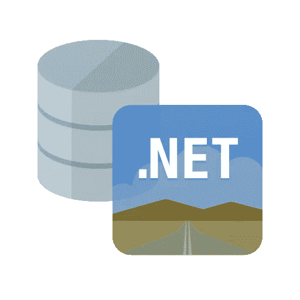

# ODP.NET 19.7 版—新功能

> 原文：<https://medium.com/oracledevs/odp-net-19-7-whats-new-2bb96174571f?source=collection_archive---------6----------------------->



上个月，我的团队发布了 ODP.NET 19.7。您可以从 NuGet Gallery 免费下载和部署[托管 ODP.NET](https://www.nuget.org/packages/Oracle.ManagedDataAccess)和[ODP.NET 核心](https://www.nuget.org/packages/Oracle.ManagedDataAccess.Core)。当然，这些新版本修复了错误。它们还包括 19.6 版本以来的一些新特性，包括 WebSocket 支持、新的连接字符串属性和 SYSASM 连接权限。让我描述一下现在有什么可用的以及如何使用它们。

# WebSocket 和带 SSL/TLS 的 WebSocket

WebSocket 是一种通过 TCP 连接提供双向通信通道的协议。具有 SSL/TLS(安全套接字层/传输层安全性)的 WebSocket 提供了安全的 WebSocket 连接。它是 HTTP 的扩展，能够与 HTTP 代理和中介一起工作。

在 HTTP 的请求-响应模型中，客户端总是发起资源请求，而服务器仍然是请求响应者的唯一角色。这是传统的网络交流模式。当数据和交互性适合静态场景时，它工作得很好。当数据不断变化并且体验更具交互性时，它就不那么有效了。WebSocket 的全双工通信通道解决了这一限制。

在 19.7 版本中，托管 ODP.NET 和 ODP.NET 核心支持 WebSocket 和带 SSL/TLS 的 WebSocket。非托管 ODP.NET 在早期 19c 版本中支持 WebSocket。在数据库服务器端，从版本 19 开始提供 WebSocket 支持。

ODP。NET WebSocket 可以通过 Oracle 连接描述符来启用。首先，在`tnsnames.ora`中将 WebSocket 的`PROTOCOL`属性设置为“WS”，或者将安全 WebSocket 的属性设置为“WSS”。NET 配置文件，或`OracleDataSourceCollection`类。接下来，设置客户端应该连接的 WebSocket 统一资源标识符(URI)。这些 URIs 可以设置在`tnsnames.ora`、`sqlnet.ora`、。NET 配置文件，或`OracleConfiguration`类。下面是一个在. NET 配置文件中设置 WebSocket URI 的示例:

```
<oracle.manageddataaccess.client>
    <version number="*">     
        <settings>              
            <setting name="SQLNET.URI" value="<WebSocket URI>"/> 
        </settings> 
    </version>
</oracle.manageddataaccess.client>
```

下面是设置 WebSocket URI 的. NET OracleConfiguration 代码示例:

```
OracleConfiguration.SqlnetURI = <WebSocket URI>;
```

对于托管 ODP.NET，URI 开头的正斜杠是可选的。在非托管 ODP.NET 中设置 URI 时，它不能以正斜杠字符开头。

# 连接字符串属性:TNS 管理和 Wallet 目录位置

随着硬件变得更强大，同时更便宜，整合是计算行业自诞生以来的一个主要趋势。越来越多的应用程序可以在同一台机器上共存，同时保持服务级别。因此，开发人员在整合不同的应用程序时，正在寻找更多选项和更精细的方法来设置 ODP.NET 配置值，如 Oracle Net Services(也称为 SQL*Net)配置文件和钱包目录。

SQL*Net 配置文件目录在其变量名后通常称为 TNS_Admin 或 TNS Admin。Oracle 数据库客户机在这里找到它们的`sqlnet.ora`和`tnsnames.ora`配置文件。

在 ODP.NET 19.7 中，TNS 管理和钱包目录现在可以在连接字符串和`OracleConnectionStringBuilder`类中设置。在连接字符串中，属性被命名为:

*   `Tns_Admin`
*   `Wallet_Location`

在`OracleConnectionStringBuilder`中，属性被命名为:

*   `TnsAdmin`
*   `WalletLocation`

这些属性为使用 ODP.NET 部署设置提供了附加选项。

# 使用 SYSASM 权限管理存储

Oracle 自动存储管理(ASM)是 Oracle 数据库文件的卷管理器和文件系统。SYSASM 是一种数据库系统特权，使管理员能够管理这些 ASM 实例。受管 ODP.NET 和 ODP.NET 核心现在可以使用 SYSASM 管理权限进行连接，以执行 Oracle 数据库的存储管理。非托管 ODP.NET 在 ODAC 19c 版本 1 中获得了此功能。

ODP。NET 现在可以在使用 SYSASM 特权连接进行连接时执行数据库 ASM 管理。通过将连接字符串`DBA Privilege`设置为“SYSASM ”,可以获得这个新的特权。

# 结论

如果你想使用这些功能，或者只是想要最新的错误修复，请务必升级到 ODP.NET 19.7。

```
OracleConfiguration.SqlnetURI = <WebSocket URI>;
```

在非托管 ODP.NET 中设置 URI 时，它不能以正斜杠字符开头。对于托管 ODP.NET，URI 开头的正斜杠是可选的。